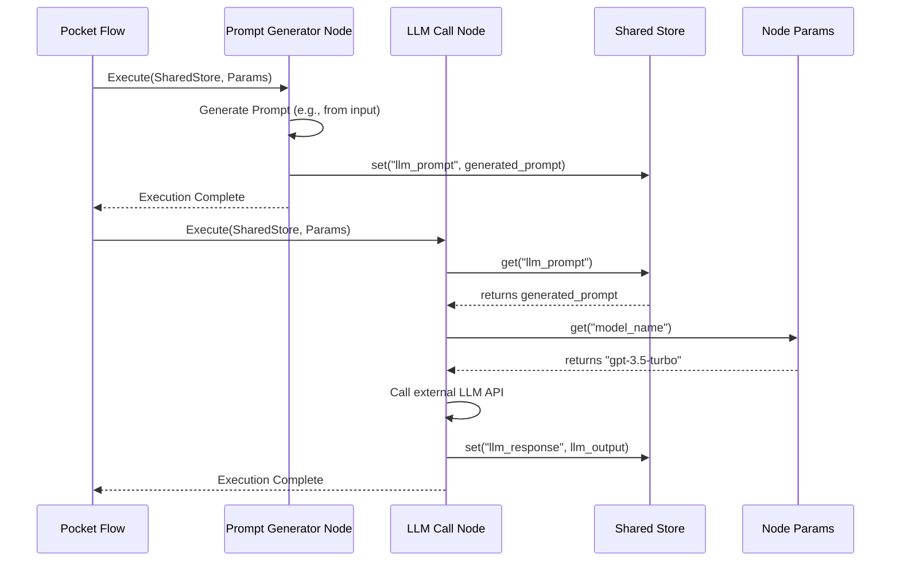

# Chapter 1: Communication: Sharing Data Between Nodes

Welcome to the documentation for Pocket Flow, a minimalist LLM framework designed to simplify the construction of AI applications. As this is our first chapter, we'll start with a foundational concept crucial to any complex system: how its different parts talk to each other.

---

### The Challenge of Inter-Component Communication

Building sophisticated AI applications often involves breaking down complex tasks into smaller, manageable pieces. In Pocket Flow, these pieces are called 'Nodes', and their operational sequences are defined by 'Flows'. A fundamental challenge arises when these individual components need to share information or configuration to work together seamlessly. Without a clear, efficient, and flexible communication mechanism, data can become siloed, leading to convoluted dependencies, difficult debugging, and an inability to adapt to changing requirements. Imagine a production line where each worker needs information from the previous station but has no standard way to receive it—chaos would ensue.

This problem is particularly critical in LLM applications where various steps, such as prompt generation, model inference, and response parsing, must exchange dynamic data. Pocket Flow addresses this by providing a unified and robust communication strategy through two core abstractions: the `Shared Store` and `Params`. This approach ensures that every part of your workflow can access the necessary data without tight coupling, fostering modularity and reusability. For instance, consider a flow where a node generates a specific LLM prompt, and a subsequent node needs that exact prompt string to send to the LLM. How do they efficiently share this crucial piece of data?

---

### Core Communication Concepts: Shared Store and Params

Pocket Flow's communication strategy revolves around two distinct but complementary mechanisms: the `Shared Store` and `Params`. These are not just technical components; they represent a philosophy for how data and configuration should flow through your AI applications.

The **`Shared Store`** is a central, mutable data structure that serves as the primary conduit for dynamic data exchange between Nodes and Flows. Think of it as a global whiteboard accessible to all components within a running flow. Any node can write information to it, and any other node can read from it, enabling a flexible and asynchronous exchange of intermediate results, states, and contextual information. This dynamic nature makes the Shared Store ideal for handling data that evolves throughout the execution of a workflow, such as LLM outputs, user queries, or runtime flags.

Conversely, **`Params`** provide immutable, per-node or per-flow configuration. While the Shared Store is a whiteboard, Params are more like a set of pre-printed instructions or a sealed envelope of parameters given to a worker before they start their task. They are typically set at the beginning of a flow or a node's execution and remain constant throughout that specific execution context. Params are perfect for static configurations like API keys, model names, temperature settings for an LLM, or the specific prompt template a node should use. This immutability ensures predictable behavior and simplifies debugging by separating dynamic state from fixed configuration.

---

### Practical Usage Examples

Let's illustrate how the `Shared Store` and `Params` work in a simple Pocket Flow scenario. We'll use our motivating use case: one node generates an LLM prompt, and a subsequent node processes the LLM's response using configuration parameters.

First, let's conceptualize the `SharedStore` and `Params` objects. In a real Pocket Flow application, these would be managed by the framework and passed to your nodes.

```python
# shared_store.py (Conceptual Representation)
class SharedStore:
    def __init__(self):
        self._data = {}

    def set(self, key: str, value):
        self._data[key] = value
        print(f"Store: Set '{key}' = '{value}'")

    def get(self, key: str, default=None):
        value = self._data.get(key, default)
        print(f"Store: Get '{key}' = '{value}'")
        return value

# params.py (Conceptual Representation)
class Params:
    def __init__(self, config: dict):
        self._config = config

    def get(self, key: str, default=None):
        value = self._config.get(key, default)
        print(f"Params: Get '{key}' = '{value}'")
        return value

# Simulate framework initialization
shared_store = SharedStore()
node_params = Params({"model_name": "gpt-3.5-turbo", "temperature": 0.7})
```
*Here, we're defining simple Python classes to represent the `SharedStore` and `Params`. In Pocket Flow, these would be sophisticated framework components, but this simple representation helps us understand their core `set`/`get` functionality.*

#### Example 1: A Node Writing to the Shared Store

Imagine a `PromptGeneratorNode` that crafts a prompt based on some input and stores it for the next node.

```python
# Inside PromptGeneratorNode's execution logic
def generate_prompt(store: SharedStore, user_query: str):
    generated_prompt = f"Summarize the following text: '{user_query}'"
    store.set("llm_prompt", generated_prompt)
    print("PromptGeneratorNode: Prompt generated and stored.")

# Simulating node execution
generate_prompt(shared_store, "The quick brown fox jumps over the lazy dog.")
```
*This code snippet shows how a conceptual node would use the `SharedStore` to save a generated prompt string. The `set` method places the prompt under the key `"llm_prompt"`, making it accessible to other parts of the flow.*

#### Example 2: A Node Reading from the Shared Store and Using Params

Now, a `LLMCallNode` needs the prompt generated by the previous node and also requires configuration like the LLM model name.

```python
# Inside LLMCallNode's execution logic
def call_llm(store: SharedStore, params: Params):
    prompt = store.get("llm_prompt")
    model = params.get("model_name")
    temp = params.get("temperature")

    print(f"LLMCallNode: Using model '{model}' with temperature {temp}.")
    print(f"LLMCallNode: Sending prompt to LLM: '{prompt}'")
    # Simulate LLM call and response storage
    llm_response = f"LLM responded to '{prompt}'"
    store.set("llm_response", llm_response)

# Simulating node execution
call_llm(shared_store, node_params)
```
*Here, the `LLMCallNode` retrieves the `llm_prompt` from the `SharedStore` (which was set by the previous node). It also fetches `model_name` and `temperature` from `Params`. This demonstrates how dynamic data and static configuration are combined for a task.*

#### Example 3: A Final Node Processing the Response

A `ResponseParserNode` might take the LLM's response from the `SharedStore` and perform some final processing.

```python
# Inside ResponseParserNode's execution logic
def parse_response(store: SharedStore):
    llm_response = store.get("llm_response")
    parsed_data = f"Parsed LLM response: {llm_response.upper()}"
    store.set("final_output", parsed_data)
    print(f"ResponseParserNode: Final output stored: '{parsed_data}'")

# Simulating node execution
parse_response(shared_store)

# Verify final output
final_result = shared_store.get("final_output")
print(f"\n--- Flow Completed ---")
print(f"Final result in Shared Store: {final_result}")
```
*This last example shows how a subsequent node can pick up the results left by an earlier node in the `SharedStore`, process it, and potentially store a new result. This chained interaction is the essence of communication in Pocket Flow.*

---

### Internal Implementation Walkthrough

At its core, Pocket Flow's `Shared Store` and `Params` are designed for efficiency and ease of use.

The `Shared Store` is typically implemented as a dictionary-like object that holds key-value pairs. It's often passed explicitly to nodes during their execution, or accessed via a context object managed by the `Flow`. When a node executes, it receives a reference to the current flow's `Shared Store` instance. Operations like `set()` and `get()` simply interact with this internal dictionary. The `async` nature of `Async.Mdc` in the project name hints at potential asynchronous access patterns, where the `Shared Store` might be thread-safe or coroutine-safe to handle concurrent operations in advanced scenarios.

`Params`, on the other hand, are generally simpler. They are also dictionary-like but are instantiated with a fixed set of configuration values. Once created, their values are immutable for a given node or flow execution. This immutability is crucial for predictable behavior, as a node can rely on its parameters not changing during its lifecycle. Parameters can be global to a flow or specific to an individual node.

Here's a conceptual sequence of how a `Flow` orchestrates communication:


*This sequence diagram illustrates the flow of data. The `Flow` passes the `Shared Store` and `Params` to each `Node`. Nodes then interact with the `Shared Store` for dynamic data exchange and with `Params` for static configuration.*

Conceptual File Structure for Core Abstraction:
- `pocket_flow/core_abstraction/shared_store.py`: Contains the `SharedStore` class.
- `pocket_flow/core_abstraction/params.py`: Contains the `Params` class.
- `pocket_flow/core_abstraction/node.py`: Defines the base `Node` interface, which typically includes methods for receiving `SharedStore` and `Params`.

---

### System Integration

The `Shared Store` and `Params` are the backbone of communication throughout the entire Pocket Flow framework. They are intrinsically linked to `Nodes` and `Flows`.

*   **Nodes**: Every [Node](chapter_02.md) in Pocket Flow, whether it's a simple function wrapper or a complex agent, receives instances of the `Shared Store` and `Params` when it's executed within a `Flow`. This ensures that any node can seamlessly access the global state of the flow (`Shared Store`) or its specific configuration (`Params`). A node's primary job is often to read some data from the `Shared Store`, perform a task using its `Params`, and then write its results back to the `Shared Store` for subsequent nodes.

*   **Flows**: A [Flow](chapter_03.md) is responsible for orchestrating the execution of nodes. It manages the lifecycle of the `Shared Store` for its entire run and passes the appropriate `Params` to each node. When you define a flow, you can specify initial parameters for the entire flow or for individual nodes, which then become accessible via the `Params` object. The flow ensures that all nodes operating within its context share the same `Shared Store` instance, enabling consistent data propagation.

Data flows through Pocket Flow predominantly via the `Shared Store`. Input to the entire workflow can be seeded into the `Shared Store` initially, and the final output can be retrieved from it after the flow completes. This clear separation of concerns—dynamic data in `Shared Store`, static configuration in `Params`—makes Pocket Flow workflows easy to understand, debug, and maintain.

---

### Best Practices & Tips

To leverage Pocket Flow's communication mechanisms effectively, consider these best practices:

*   **Use Shared Store for Dynamic Data, Params for Static Config**: This is the golden rule. If data changes during a flow's execution (e.g., LLM responses, intermediate processing results, user input from an earlier step), put it in the `Shared Store`. If it's a fixed setting for a node or flow (e.g., API keys, model names, prompt templates), use `Params`.
*   **Descriptive Keys**: Use clear, descriptive keys for items in your `Shared Store` (e.g., `"llm_response_summary"`, not `"res"`). This significantly improves readability and debugging.
*   **Avoid Overwriting**: While the `Shared Store` is mutable, be mindful of overwriting keys prematurely. If multiple nodes might produce similar output, consider using unique keys or nesting data structures.
*   **Data Structure in Shared Store**: For complex data, store Python dictionaries, lists, or custom objects in the `Shared Store`. This keeps your keys clean and your data organized.
*   **Immutability of Params**: Treat `Params` as truly immutable. Do not attempt to modify a `Params` object within a node. If a configuration needs to change mid-flow, it's dynamic data and belongs in the `Shared Store`.
*   **Error Handling for Missing Keys**: Always use `store.get(key, default_value)` or `params.get(key, default_value)` to provide a fallback if a key might not exist, preventing runtime errors.
*   **Performance Considerations**: While the `Shared Store` is efficient for most use cases, storing extremely large binaries or datasets directly could impact memory. Consider storing references or paths to external storage for such data.

---

### Chapter Conclusion

In this chapter, we've explored the fundamental communication mechanisms within Pocket Flow: the `Shared Store` and `Params`. You've learned how the `Shared Store` facilitates dynamic data exchange between components, acting as a central hub for evolving information, and how `Params` provide stable, immutable configuration settings for nodes and flows. Understanding these core concepts is essential for building robust and flexible AI applications with Pocket Flow.

This robust communication layer is what enables the smallest building blocks of our framework to collaborate effectively. In our next chapter, we will delve deeper into these building blocks themselves: the **Nodes**. You'll discover how to create, configure, and utilize these focused task units that are powered by the communication patterns we've just discussed.

Onward to the next building block!

[Nodes: The Smallest Building Blocks](chapter_02.md)