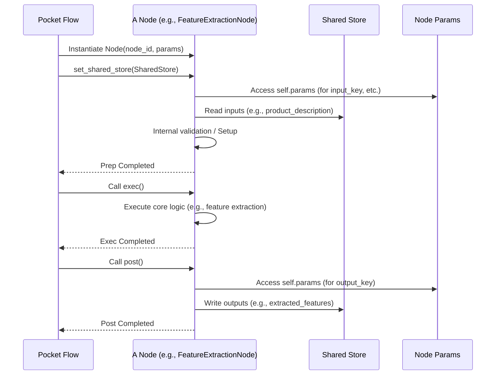
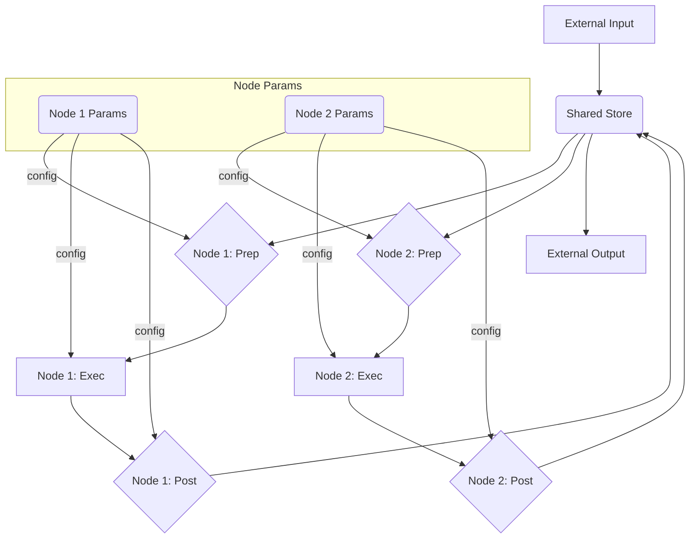

# Chapter 2: Nodes: The Smallest Building Blocks

In the previous chapter, [Communication: Sharing Data Between Nodes](chapter_01.md), we established how different parts of a Pocket Flow application communicate using the **Shared Store** for dynamic data and **Params** for static configuration. Now, we're ready to explore the entities that *use* these communication mechanisms to perform actual work: **Nodes**. Nodes are the very heart of Pocket Flow, serving as the fundamental processing units that transform data and drive your AI application forward.

---

## Problem & Motivation

Building sophisticated AI applications, especially those leveraging Large Language Models (LLMs), often involves a sequence of distinct, yet interconnected, operations. Imagine creating an AI assistant that first retrieves relevant information, then summarizes it, then uses the summary to generate a creative response, and finally formats it for display. Without a clear structure, this can quickly become a tangled mess of functions, making it hard to manage, debug, or extend.

This is the problem **Nodes** solve. Pocket Flow needs a way to break down complex tasks into small, manageable, and highly focused units. Each unit should have a clear responsibility, operate on specific inputs, and produce defined outputs, all while being resilient to failures. Without this modularity, our "Pocket Flow" would be less of a flow and more of a bottleneck, hindering rapid development and iteration.

For example, consider an application that generates marketing copy from a product description. This task can be broken down into:
1.  A node that extracts key features from the description.
2.  A node that generates multiple slogan options based on the features.
3.  A node that evaluates and selects the best slogan.
4.  A node that formats the chosen slogan for a specific platform.
Each of these steps is a perfect candidate for a Node, making the overall system robust and easy to modify.

---

## Core Concept Explanation

At its core, a **Node** in Pocket Flow is an encapsulated unit of work, analogous to a specialized worker in an assembly line. Each node is designed to perform a *single, focused task*, such as fetching data, calling an LLM API, processing text, or storing results. This adherence to the Single Responsibility Principle makes nodes highly reusable, testable, and easier to understand.

Every node in Pocket Flow follows a well-defined lifecycle: `Prep -> Exec -> Post`.
*   The **`Prep`** (Preparation) phase is where the node gathers its necessary inputs from the [Shared Store](chapter_01.md) and [Params](chapter_01.md), performs any initial validation, or sets up resources required for its task. Think of it as a worker checking their tools and materials before starting.
*   The **`Exec`** (Execution) phase is the core of the node's function. This is where the actual work happens – an LLM call is made, data is transformed, or a calculation is performed. This is the worker actively building or processing.
*   The **`Post`** (Post-processing) phase handles the output of the `Exec` phase. The node might store results back into the Shared Store, clean up temporary data, or format the output. This is the worker putting away their tools and presenting the finished component.

This structured lifecycle ensures a consistent pattern for data handling, execution, and result processing across all nodes, contributing to the framework's predictability and robustness. Furthermore, nodes can be equipped with built-in retry mechanisms (to handle transient failures) and fallback logic (to provide alternative actions if the primary task fails), significantly enhancing the resilience of your applications.

---

## Practical Usage Examples

Let's illustrate how to define and use a basic node in Pocket Flow. Remember our marketing copy generator example? We'll start with a simple node that "extracts" key features.

First, let's imagine a base `Node` class that provides the `prep`, `exec`, and `post` structure.

```python
# pocket_flow/core/node.py (Conceptual Base Class)
from typing import Dict, Any, Optional

class BaseNode:
    def __init__(self, node_id: str, params: Dict[str, Any]):
        self.node_id = node_id
        self.params = params
        self.shared_store: Optional[Dict[str, Any]] = None # Will be set by the Flow

    def set_shared_store(self, store: Dict[str, Any]):
        self.shared_store = store

    def prep(self) -> None:
        """Prepares the node for execution, fetching data from shared_store."""
        raise NotImplementedError

    def exec(self) -> None:
        """Executes the node's main logic."""
        raise NotImplementedError

    def post(self) -> None:
        """Processes the results and stores them in shared_store."""
        raise NotImplementedError
```
*This `BaseNode` provides the fundamental blueprint for all nodes, ensuring they adhere to the `prep`, `exec`, `post` lifecycle.*

Now, let's create our first concrete node: `FeatureExtractionNode`.

```python
# my_app/nodes.py
from pocket_flow.core.node import BaseNode
from typing import Dict, Any

class FeatureExtractionNode(BaseNode):
    def __init__(self, node_id: str, params: Dict[str, Any]):
        super().__init__(node_id, params)
        self.product_description: str = ""
        self.extracted_features: list[str] = []

    def prep(self) -> None:
        # Get product description from Shared Store using a predefined key
        # self.params['input_key'] might be 'raw_product_description'
        input_key = self.params.get("input_key", "product_description")
        if self.shared_store and input_key in self.shared_store:
            self.product_description = self.shared_store[input_key]
        else:
            raise ValueError(f"Product description not found in Shared Store under '{input_key}'")
        print(f"[{self.node_id}] Prep: Retrieved description.")

    def exec(self) -> None:
        # Simulate feature extraction (e.g., using an LLM or simple regex)
        # For this example, we'll just split words and pick some
        if not self.product_description:
            raise RuntimeError("No product description to process.")
        words = self.product_description.lower().split()
        # Simple extraction logic
        self.extracted_features = [
            word for word in ["durable", "lightweight", "stylish", "innovative"]
            if word in words
        ]
        print(f"[{self.node_id}] Exec: Extracted features: {self.extracted_features}")

    def post(self) -> None:
        # Store the extracted features back into the Shared Store
        # self.params['output_key'] might be 'extracted_product_features'
        output_key = self.params.get("output_key", "extracted_features")
        if self.shared_store:
            self.shared_store[output_key] = self.extracted_features
        print(f"[{self.node_id}] Post: Stored features.")

```
*This `FeatureExtractionNode` takes a product description from the `Shared Store`, simulates extracting features, and then places the results back into the `Shared Store`. Notice how `prep`, `exec`, and `post` each handle a distinct part of the process.*

Now, let's see how you would instantiate and "run" this node (in a simplified manner, as actual orchestration happens via Flows).

```python
# main.py (Simulated Node execution)
from my_app.nodes import FeatureExtractionNode

# 1. Initialize the Shared Store (as discussed in Chapter 1)
my_shared_store = {
    "product_description": "Our new **Durable** and **lightweight** backpack is also very **stylish** with its **innovative** design!",
    "some_other_data": 123
}

# 2. Define Params for our node
node_params = {
    "input_key": "product_description",
    "output_key": "extracted_product_features",
    "model_name": "text-davinci-003" # Example param, not used in simple exec
}

# 3. Instantiate the node
feature_node = FeatureExtractionNode(node_id="extract_features_01", params=node_params)
feature_node.set_shared_store(my_shared_store) # Connect the store

# 4. Manually trigger the node's lifecycle methods
print("--- Running FeatureExtractionNode ---")
feature_node.prep()
feature_node.exec()
feature_node.post()
print("--- Node Execution Complete ---")

# 5. Check the Shared Store for results
print("\nFinal Shared Store:")
for key, value in my_shared_store.items():
    print(f"  {key}: {value}")

```
**Expected Output:**
```
--- Running FeatureExtractionNode ---
[extract_features_01] Prep: Retrieved description.
[extract_features_01] Exec: Extracted features: ['durable', 'lightweight', 'stylish', 'innovative']
[extract_features_01] Post: Stored features.
--- Node Execution Complete ---

Final Shared Store:
  product_description: Our new **Durable** and **lightweight** backpack is also very **stylish** with its **innovative** design!
  some_other_data: 123
  extracted_product_features: ['durable', 'lightweight', 'stylish', 'innovative']
```
*This example demonstrates the full lifecycle of a Node, from initialization to its interaction with the Shared Store. We can clearly see `prep` fetching input, `exec` performing the task, and `post` writing the output back, modifying the `my_shared_store`.*

---

## Internal Implementation Walkthrough

The conceptual `BaseNode` class forms the foundation for all nodes in Pocket Flow. Let's delve a bit deeper into what happens within its structure.

### The `BaseNode` Structure
A node's core functionality revolves around its `node_id`, `params`, and its connection to the `shared_store`.

*   **`__init__(self, node_id: str, params: Dict[str, Any])`**: The constructor sets up the node's unique identifier and its immutable configuration parameters. These `params` often dictate behavior (e.g., input/output keys, API endpoint, model temperature).
*   **`set_shared_store(self, store: Dict[str, Any])`**: This crucial method injects the global `Shared Store` into the node. Nodes do not *create* the Shared Store; they are provided with access to it by the orchestrating [Flow](chapter_03.md). This decouples node implementation from store management.
*   **`prep(self) -> None`**: This method is intended for pre-computation, data validation, and resource allocation. A typical `prep` method would:
    *   Read specific data points from `self.shared_store`.
    *   Validate the existence and format of required `self.params`.
    *   Perform quick checks to ensure the `exec` phase can proceed successfully.
    *   Prepare internal state variables of the node.
*   **`exec(self) -> None`**: This is where the primary business logic resides. This method performs the node's core task, which could involve:
    *   Calling an external API (LLM, database, web service).
    *   Performing complex data transformations.
    *   Executing machine learning models.
    *   All computations that lead to the node's primary output.
*   **`post(self) -> None`**: This method is for handling the results of `exec` and preparing the node's state for subsequent nodes. Common tasks include:
    *   Writing results to `self.shared_store` under a specific key.
    *   Cleaning up temporary resources.
    *   Transforming output into a format expected by downstream nodes.

### Node Lifecycle Sequence
The execution of a node follows a clear, sequential pattern:


*This sequence diagram visually represents the `Prep -> Exec -> Post` lifecycle, showing how the Pocket Flow orchestrator interacts with a Node, and how the Node interacts with the Shared Store and its own internal parameters.*

### Robustness: Retry and Fallback
As noted in the `CURRENT ABSTRACTION DETAILS`, Nodes can also implement retry and fallback mechanisms. This means:
*   **Retries**: If `exec` (or `prep`/`post`) fails due to transient issues (e.g., network error, API rate limit), the node can be configured to automatically try again a specified number of times with an exponential backoff.
*   **Fallback**: If a node repeatedly fails or encounters a critical error, a predefined fallback mechanism can be triggered. This might involve using a simpler, less accurate method, returning a default value, or signaling an alternative path for the [Flow](chapter_03.md) to take. These mechanisms are typically implemented within the `exec` method or wrapped around its call within the Flow's execution logic.

---

## System Integration

Nodes are designed to be highly modular, but they don't operate in a vacuum. They are deeply integrated with other core components of Pocket Flow:

*   **[Communication: Sharing Data Between Nodes](chapter_01.md)**: As seen in the examples, Nodes are the primary consumers and producers of data in the **Shared Store**. They read their necessary inputs from specific keys in the store during `prep` and write their results back to the store during `post`. Their behavior can also be fine-tuned by **Params**, which provide immutable configuration values unique to each node instance. This central communication hub is what allows nodes to pass information seamlessly without direct coupling.

*   **[Flows: Orchestrating Nodes with Actions](chapter_03.md)**: While we manually called `prep`, `exec`, and `post` in our example, in a real Pocket Flow application, it's the `Flow` that orchestrates the execution of multiple nodes. A Flow defines the sequence, conditions, and error handling for a graph of interconnected nodes. It's the Flow that injects the Shared Store into each node and manages the overall lifecycle and dependencies. Nodes are the "workers," and Flows are the "project managers."

The data flow within the system with respect to Nodes is straightforward:


*This diagram illustrates how Nodes read from and write to the Shared Store, guided by their individual Parameters, within the larger context of a Pocket Flow application.*

---

## Best Practices & Tips

To maximize the effectiveness and maintainability of your Pocket Flow applications using Nodes, consider these best practices:

*   **Single Responsibility Principle (SRP)**: Design each node to do one thing and do it well. Avoid creating "god nodes" that attempt to perform multiple unrelated tasks. This enhances reusability, testability, and clarity.
*   **Idempotency (where possible)**: Strive to make your `exec` methods idempotent. This means running the same node multiple times with the same inputs should produce the same output and not cause unintended side effects. This is crucial for robust retry mechanisms.
*   **Clear Input/Output Contracts**: Explicitly define what keys a node expects to read from the Shared Store during `prep` and what keys it will write to during `post`. Document these contracts in your node's docstrings. Use descriptive parameter names for `input_key` and `output_key`.
*   **Use `Prep` for Validation and Setup**: Leverage the `prep` phase for input validation, ensuring all necessary data and parameters are present and correctly formatted *before* the main `exec` logic runs. This fails fast and prevents costly errors later.
*   **Use `Post` for Storing and Cleanup**: Reserve the `post` phase for writing results to the Shared Store and any necessary cleanup. Avoid performing additional business logic here; `post` should primarily concern itself with output management.
*   **Handle Errors Gracefully**: Implement robust error handling within your `exec` methods. Utilize Pocket Flow's retry and fallback mechanisms (often configured at the Flow level) to make your applications resilient. Log errors comprehensively.
*   **Minimize Internal State**: While nodes can have internal state (like `self.extracted_features` in our example), try to minimize it. The Shared Store should be the primary mechanism for state transfer between nodes. This simplifies debugging and reasoning about data flow.
*   **Keep Code Blocks Short**: As a general rule, keep the logic within `prep`, `exec`, and `post` methods concise. If a method becomes too long or complex, it's often a sign that the node's responsibility can be further broken down or that helper functions are needed.

---

## Chapter Conclusion

Nodes are the atomic units of work in Pocket Flow, providing a robust, modular, and extensible way to build complex AI applications. By adhering to the `Prep -> Exec -> Post` lifecycle and focusing on single responsibilities, nodes bring order and predictability to your application's logic. They seamlessly integrate with the Shared Store and Params for communication, forming the bedrock upon which more complex orchestrations are built.

Understanding nodes is paramount, as they are the building blocks you'll define to execute every step of your LLM-powered applications. With this foundation, you are now ready to see how these individual building blocks are assembled and directed to achieve complete workflows.

In the next chapter, [Flows: Orchestrating Nodes with Actions](chapter_03.md), we will explore how to connect multiple nodes, define their execution order, handle dependencies, and manage the overall application flow.