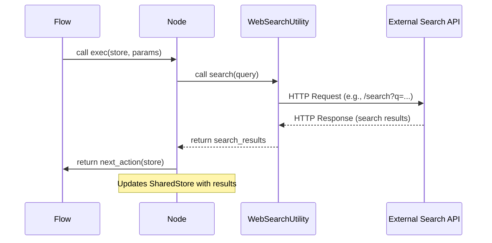

# Chapter 5: Utility Functions: Connecting to the Real World

Welcome back to Pocket Flow! In the previous chapter, [What is Pocket Flow?](chapter_04.md), we gained a high-level understanding of the framework's philosophy and core components. We learned that Pocket Flow is designed for building AI applications by orchestrating `Nodes` into `Flows`, all communicating via a `Shared Store`. Now, it's time to bridge the gap between our internal AI logic and the vast external world.

---

### Problem & Motivation

The real power of an AI application isn't just in its ability to process information internally; it's in its capacity to interact with the world, fetch real-time data, and leverage specialized external services. Imagine an LLM application that needs to answer a question about current events, summarize a specific web page, or interact with a proprietary database. Without a mechanism to connect to these external systems, our AI would be confined to its training data, quickly becoming outdated and limited.

This is where *Utility Functions* come into play. Many LLM frameworks provide pre-built integrations with popular APIs (like OpenAI, Google Search, various embedding models). While convenient, this approach can lead to vendor lock-in, limit customization, and make it difficult to swap out services or implement unique functionalities. Pocket Flow deliberately *avoids* providing these opinionated, built-in integrations. Instead, it empowers you to define your own. This philosophy emphasizes maximum flexibility, ensuring you have complete control over how your AI system connects to external services. By implementing custom utilities, you craft the "body" of your AI system, allowing its "brain" (the LLM-powered `Nodes`) to perceive and act upon the real world exactly as you intend.

For this chapter, let's consider a common use case: an LLM application that needs to provide up-to-date information. To achieve this, it must be able to perform a web search. We will build a simple `WebSearchUtility` that a Pocket Flow `Node` can invoke to fetch search results.

---

### Core Concept Explanation

In Pocket Flow, **Utility Functions** are essentially external wrappers around APIs, tools, or any functionality that interacts with the "real world" outside the framework's core logic. Think of them as the hands, eyes, and ears of your AI system. They handle tasks like:

*   **Making API Calls**: Interacting with LLMs (e.g., OpenAI, Anthropic), search engines (e.g., Google, Brave), image generators, data APIs, etc.
*   **Database Interactions**: Reading from or writing to databases.
*   **File System Operations**: Reading or writing files.
*   **Tool Usage**: Integrating with external tools or libraries.

The key idea is that Pocket Flow's `Nodes` focus purely on processing data and making decisions based on their defined tasks. When a `Node` needs to perform an action requiring external interaction, it *delegates* that action to a Utility Function. These utilities are independent Python modules or classes that your project defines, providing a clean separation of concerns. This modular design means you can easily swap out a search provider, change an LLM endpoint, or update an API key without altering the core `Flow` or `Node` logic. It promotes adaptability and ensures your application remains agile and maintainable as external services evolve.

---

### Practical Usage Examples

Let's illustrate our web search use case. First, we'll define a simple `WebSearchUtility`. Then, we'll see how a `Node` can leverage it.

#### 1. Defining a Simple `WebSearchUtility`

We'll create a basic utility that simulates a web search. In a real application, this would use a library like `requests` to call a search API.

```python
# File: utilities/web_search.py
import time

class WebSearchUtility:
    """
    A simple utility to simulate a web search.
    In a real app, this would query a search engine API.
    """
    def search(self, query: str) -> str:
        print(f"Searching for: '{query}'...")
        time.sleep(1) # Simulate network delay
        # Dummy result for demonstration
        if "Pocket Flow" in query:
            return "Pocket Flow is a minimalist LLM framework focused on graph-based task modeling."
        return f"Results for '{query}': Example search data from a mock API."

```
This `WebSearchUtility` class has a `search` method that takes a `query` string and returns a simulated search result. Notice how it's completely independent of Pocket Flow's core components.

#### 2. Using the Utility within a `Node`

Now, let's create a `Node` that uses this `WebSearchUtility`.

```python
# File: nodes/search_node.py
from pocket_flow import Node, SharedStore, Params
from utilities.web_search import WebSearchUtility

class SearchQueryNode(Node):
    def __init__(self, node_id: str, web_search_utility: WebSearchUtility):
        super().__init__(node_id)
        self.web_search_utility = web_search_utility

    def exec(self, store: SharedStore, params: Params):
        query = params.get("search_query", "default AI query")
        search_results = self.web_search_utility.search(query)
        store.set("search_results", search_results)
        return self.next_action("continue")

```
Here, our `SearchQueryNode` receives an instance of `WebSearchUtility` during its initialization. In its `exec` method, it retrieves a `search_query` from `Params`, uses the utility to perform the search, and then stores the `search_results` in the `SharedStore` for subsequent nodes to access.

#### 3. Orchestrating the `Node` in a `Flow`

Finally, we'd integrate this `Node` into a `Flow`.

```python
# File: my_app_flow.py
from pocket_flow import Flow, SharedStore, Params
from nodes.search_node import SearchQueryNode
from utilities.web_search import WebSearchUtility

# Initialize the utility
my_web_searcher = WebSearchUtility()

# Initialize the node with the utility
search_node = SearchQueryNode("initial_search", my_web_searcher)

# Create a flow (simplified for brevity)
my_flow = Flow("main_flow")
my_flow.add_node(search_node)
# ... add more nodes ...

# Example execution
initial_params = Params({"search_query": "What is Pocket Flow?"})
final_store = my_flow.run(SharedStore(), initial_params)
print("\n--- Final Store Content ---")
print(final_store.get("search_results"))

```
In this example, we instantiate our `WebSearchUtility` and pass it directly to the `SearchQueryNode` during the `Flow` setup. When `my_flow.run()` is called, `SearchQueryNode` will execute, trigger the web search via the utility, and store the results. The output will reflect the simulated search result.

---

### Internal Implementation Walkthrough

While Pocket Flow doesn't dictate the *internal* implementation of your utilities, it defines the *interface* implicitly: your utility should expose methods that `Nodes` can call. A typical utility structure involves a Python class, often stateless, encapsulating the logic for interacting with a specific external service.

Let's visualize the interaction when a `Node` uses a Utility:



1.  **Flow orchestrates Node**: A `Flow` (via its internal `run` method) calls the `exec` method of a `Node`.
2.  **Node calls Utility**: Inside its `exec` method, the `Node` retrieves necessary parameters (e.g., `query` from `Params`) and calls a method on its injected `WebSearchUtility` instance (e.g., `self.web_search_utility.search(query)`).
3.  **Utility interacts with External API**: The `WebSearchUtility` then performs the actual external call. This typically involves using an HTTP client library (like `requests` for synchronous operations or `httpx` for asynchronous ones) to send a request to the external service (e.g., a Google Search API endpoint).
4.  **External API responds**: The external service processes the request and sends back a response, usually in JSON format.
5.  **Utility processes and returns**: The `WebSearchUtility` receives this response, parses it, and transforms it into a format suitable for the `Node`. It then returns this processed data to the `Node`.
6.  **Node updates SharedStore**: The `Node` receives the results from the utility and updates the `SharedStore` with this information, making it available for subsequent `Nodes` in the `Flow`. It then returns an `Action` to the `Flow`.

The internal details of `WebSearchUtility` (e.g., handling API keys, pagination, rate limits) are entirely encapsulated within `utilities/web_search.py`, keeping the `Node` code clean and focused on its specific task within the flow.

---

### System Integration

Utility Functions integrate into Pocket Flow primarily through `Nodes` and the `Shared Store` or `Params` for data exchange.

*   **Node-Utility Connection**: As shown, `Nodes` are the primary consumers of utilities. A utility instance is typically passed to a `Node` during its initialization (`__init__`). This is a form of dependency injection, making the `Node` decoupled from the utility's creation and specific implementation. This makes `Nodes` highly testable, as you can easily mock utilities during unit tests. You can pass the same utility instance to multiple nodes if they need to share access to the same external service.

*   **Data Flow with Shared Store and Params**:
    *   **Inputs to Utility**: `Nodes` often retrieve necessary input parameters for utilities from the `Params` object (for static configurations) or the `Shared Store` (for dynamic data generated by previous nodes). For instance, a `SearchQueryNode` might take the `search_query` from `Params`.
    *   **Outputs from Utility**: The results returned by a utility are typically stored by the `Node` back into the `Shared Store`. This makes the real-world data accessible to other `Nodes` downstream in the `Flow`. For example, our `SearchQueryNode` puts `search_results` into the `Shared Store`.

*   **Flow Orchestration**: The `Flow` defines the sequence of `Nodes`. By orchestrating `Nodes` that leverage utilities, the `Flow` effectively defines when and how the AI interacts with the external world. For example, a `Flow` might have a `SearchQueryNode` followed by a `SummarizeResultsNode` (which uses an LLM utility) and then a `RespondToUserNode`. The `Flow` ensures that the search happens *before* summarization.

This structured integration ensures that while utilities provide powerful external capabilities, the core logic of your AI application remains within the clear boundaries of `Nodes` and `Flows`, maintaining the framework's minimalist and flexible design. For more on how `Nodes` and `Flows` interact with data, refer to [Communication: Sharing Data Between Nodes](chapter_01.md) and [Nodes: The Smallest Building Blocks](chapter_02.md).

---

### Best Practices & Tips

1.  **Encapsulation and Single Responsibility**: Each utility should ideally focus on a single external service or type of interaction (e.g., `WebSearchUtility`, `LLMAPIUtility`, `DatabaseClientUtility`). This makes them easier to understand, test, and maintain.
2.  **Robust Error Handling**: External services can fail. Implement comprehensive `try...except` blocks in your utilities to handle network issues, API errors, rate limits, and unexpected responses. Utilities should raise custom exceptions or return clear error indicators that `Nodes` can interpret.
3.  **Configuration via `Params`**: Use `Params` to pass configuration details to `Nodes` that then forward them to utilities. This includes API keys, endpoints, model names, or other environment-dependent settings. This keeps your utility code clean and configurable.
    ```python
    # Node getting API key from Params
    api_key = params.get("LLM_API_KEY")
    self.llm_utility.configure(api_key=api_key)
    ```
4.  **Asynchronous Operations**: Given the `Async.Mdc` in the project name, consider making your utilities asynchronous where external calls involve I/O (network requests, file operations). This allows your Pocket Flow application to remain responsive. Your `exec` methods in `Nodes` can then `await` the utility calls.
    ```python
    # Example for an async utility method
    import httpx
    class AsyncWebSearchUtility:
        async def search(self, query: str) -> str:
            async with httpx.AsyncClient() as client:
                response = await client.get(f"https://api.example.com/search?q={query}")
                response.raise_for_status()
                return response.json().get("results", "")
    ```
5.  **Testing in Isolation**: Since utilities are plain Python classes, they are easy to unit test independently. Mock the external API calls to ensure your utility logic (parsing, error handling) works correctly without making actual network requests.
6.  **Security**: Never hardcode sensitive information like API keys directly in your code. Use environment variables, a secure configuration management system, or pass them securely via `Params` (retrieved from secure sources).
7.  **Clear Documentation**: Document what each utility does, its required inputs, expected outputs, and any potential errors it might return.

---

### Chapter Conclusion

Utility Functions are the unsung heroes of real-world AI applications built with Pocket Flow. They provide the crucial bridge between your intelligent `Nodes` and the vast array of external services, allowing your AI to perceive and act upon dynamic information. By designing your own utilities, you gain unparalleled flexibility, avoid vendor lock-in, and ensure your application is adaptable and robust. This approach empowers you to build AI systems that are truly connected to the world, extending their capabilities far beyond internal processing.

Now that we understand how to connect our AI to the real world, the next step is to explore how to process large volumes of data efficiently. Join us in the next chapter as we delve into [Batch Processing: Efficiently Handling Large Inputs](chapter_06.md).