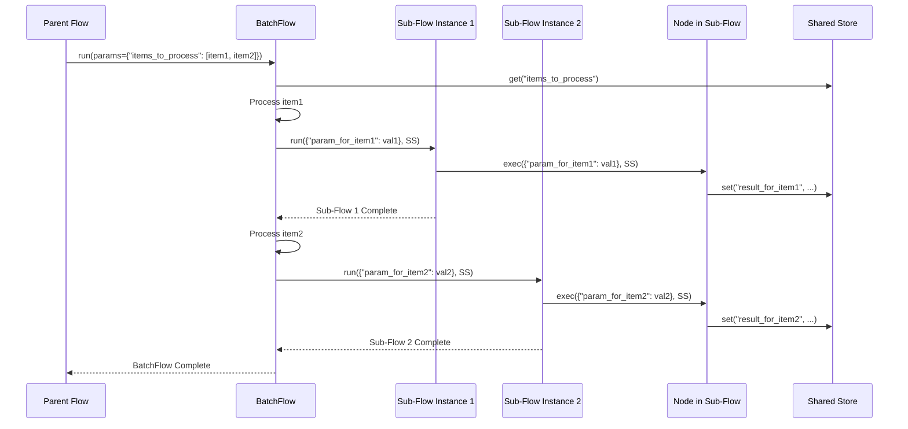

# Chapter 6: Batch Processing: Efficiently Handling Large Inputs

In the previous chapter, [Utility Functions: Connecting to the Real World](chapter_05.md), we explored how Pocket Flow allows you to integrate external tools and APIs into your LLM applications. These utilities are essential for bringing real-world capabilities to your flows. However, as applications grow, you'll inevitably encounter scenarios where you need to process not just a single input, but a large collection of inputs, or repeatedly execute a specific task. This often involves handling lists of data, processing chunks of a large document, or iterating over a dataset for individual analysis.

---

### Problem & Motivation

Many real-world AI applications involve processing significant amounts of data. Imagine you have a massive legal document that needs summarization, or a list of thousands of customer queries that each require classification by an LLM. Directly passing these huge inputs to a single node or flow can be inefficient, exceed token limits, or even cause memory issues. Furthermore, you often want to apply the *same logic* (a node or a sub-flow) to *each item* in a collection, collecting the individual results.

Without a dedicated mechanism, you might find yourself writing cumbersome loops outside your Pocket Flow definitions, or creating single-purpose nodes that manually manage iteration, which breaks the clean, focused design of individual [Nodes](chapter_02.md) and [Flows](chapter_03.md). This is precisely the problem Batch Processing aims to solve: enabling efficient, structured, and scalable handling of large inputs or repeated execution directly within the Pocket Flow framework, maintaining the clarity and reusability of your components. A concrete use case throughout this chapter will be: **Summarizing a very long document by first splitting it into manageable chunks, and then summarizing each chunk individually.**

---

### Core Concept Explanation

Pocket Flow introduces two specialized components to address batch processing needs: `BatchNode` and `BatchFlow`. Both are designed to handle collections of data, but they operate at different levels of abstraction.

A **`BatchNode`** is a type of [Node](chapter_02.md) designed to process an *iterable* of items one by one. When a `BatchNode` receives its input (which must be an iterable like a list, tuple, or generator), its `exec()` method is called for *each individual item* in that iterable. The results from each execution are then typically aggregated and returned as a single collection. Think of a `BatchNode` as an assembly line worker who processes one part at a time from a conveyor belt, performing the same operation on each. It's ideal for simple, repetitive tasks on individual data points.

A **`BatchFlow`**, on the other hand, is a specialized [Flow](chapter_03.md) that orchestrates the repeated execution of an *entire sub-flow* multiple times. It takes an iterable, where each item in the iterable represents the [Params](chapter_01.md) for a single run of the sub-flow. The `BatchFlow` will then initiate a separate instance of its designated sub-flow for each set of parameters. This is incredibly powerful for complex tasks where each item requires a sequence of operations involving multiple nodes. Imagine a factory manager who directs a specialized team (a sub-flow) to process each order (an item with specific parameters) from a queue, ensuring each order goes through the same multi-step process. This makes `BatchFlow` perfect for scenarios like chunk-based processing (like our document summarization example) or iterating over a dataset for complex analysis.

---

### Practical Usage Examples

Let's illustrate how `BatchNode` and `BatchFlow` work with practical examples, building towards our document summarization goal.

#### Example 1: Basic BatchNode for Simple Iteration

Here, a `BatchNode` processes a list of numbers, squaring each one.

```python
from pocket_flow import Node, SharedStore, Flow

class SquareBatchNode(Node):
    def prep(self, params: dict, store: SharedStore) -> dict:
        # In a BatchNode, 'prep' can set up general context
        # but the individual item is handled by 'exec'.
        return {"input_list": params.get("numbers", [])}

    def exec(self, item: int, store: SharedStore) -> int:
        # 'item' here is one element from the 'input_list' iterable
        print(f"Squaring: {item}")
        return item * item

    def post(self, prep_result: dict, exec_results: list, store: SharedStore) -> str:
        # 'exec_results' is a list of results from each 'exec' call
        store.set("squared_numbers", exec_results)
        print(f"BatchNode finished. Results: {exec_results}")
        return "next"

# Define a simple flow to run our BatchNode
square_flow = Flow("Square Numbers Batch")
square_flow.add_node(SquareBatchNode, "squarer", actions={"next": None})

# Run the flow with an iterable input
store = SharedStore()
params = {"numbers": [1, 2, 3, 4, 5]}
square_flow.run(params, store)
# Expected output:
# Squaring: 1
# Squaring: 2
# Squaring: 3
# Squaring: 4
# Squaring: 5
# BatchNode finished. Results: [1, 4, 9, 16, 25]
```
In this example, `SquareBatchNode` takes a list `[1, 2, 3, 4, 5]`. Its `exec` method is called five times, once for each number, and then `post` collects all the individual squared results into a list `[1, 4, 9, 16, 25]`. The `item` parameter in `exec` is crucial for `BatchNode`'s item-by-item processing.

#### Example 2: Basic BatchFlow for Orchestrating Sub-Flows

Now, let's see how a `BatchFlow` can run a simple sub-flow multiple times.

```python
from pocket_flow import Node, SharedStore, Flow, BatchFlow

class GreeterNode(Node):
    def exec(self, params: dict, store: SharedStore) -> str:
        name = params.get("name", "Guest")
        message = f"Hello, {name}!"
        store.set(f"greeting_for_{name}", message)
        print(message)
        return "next"

# Define a sub-flow that will be executed for each item
greet_sub_flow = Flow("Greeter Sub-Flow")
greet_sub_flow.add_node(GreeterNode, "greeter", actions={"next": None})

# Define the BatchFlow that runs the greet_sub_flow
batch_greeter_flow = BatchFlow("Batch Greeter", sub_flow=greet_sub_flow)

# Prepare an iterable of parameters for each sub-flow run
names_to_greet = [
    {"name": "Alice"},
    {"name": "Bob"},
    {"name": "Charlie"}
]

store = SharedStore()
batch_greeter_flow.run({"items_to_process": names_to_greet}, store)
# Expected output:
# Hello, Alice!
# Hello, Bob!
# Hello, Charlie!
```
Here, `batch_greeter_flow` takes a list of dictionaries, each containing a `name`. For each dictionary, it runs the `greet_sub_flow`, effectively greeting each person individually. Notice how the `items_to_process` parameter, which holds the iterable, is the key input for a `BatchFlow`.

#### Example 3: Document Summarization with BatchFlow

Let's implement our motivating use case. We'll need a way to chunk text and a node to summarize each chunk.

```python
from pocket_flow import Node, SharedStore, Flow, BatchFlow
from typing import List

# Assume these exist or are simple stubs for demonstration
class TextChunkerNode(Node):
    def exec(self, params: dict, store: SharedStore) -> List[str]:
        full_text = params.get("document_text", "")
        chunk_size = params.get("chunk_size", 100)
        # Simple chunking logic for illustration
        chunks = [full_text[i:i + chunk_size] for i in range(0, len(full_text), chunk_size)]
        store.set("document_chunks", chunks)
        print(f"Document chunked into {len(chunks)} parts.")
        return "next"

class LLMSummaryNode(Node):
    def exec(self, params: dict, store: SharedStore) -> str:
        chunk_text = params.get("chunk", "")
        # In a real scenario, this would call an LLM API
        summary = f"Summary of '{chunk_text[:30]}...': Example summary for this chunk."
        store.append("all_chunk_summaries", summary) # Append to a list in SharedStore
        print(f"Summarized chunk: {chunk_text[:50]}...")
        return "next"

# --- Main Flow Definition ---

# 1. Define the sub-flow for summarizing a single chunk
summarize_chunk_flow = Flow("Summarize Single Chunk")
summarize_chunk_flow.add_node(LLMSummaryNode, "llm_summarizer", actions={"next": None})

# 2. Define the main Flow which includes chunking and then the BatchFlow
main_document_summary_flow = Flow("Main Document Summary Flow")
main_document_summary_flow.add_node(TextChunkerNode, "chunker", actions={"next": "batch_summarizer"})

# 3. Create a BatchFlow that uses 'summarize_chunk_flow' as its sub-flow
#    It takes the 'document_chunks' from the store and maps each chunk to 'chunk' param for the sub-flow.
batch_summarizer_flow = BatchFlow(
    "Batch Summarizer",
    sub_flow=summarize_chunk_flow,
    # This mapper function ensures each chunk becomes the 'chunk' parameter for the sub-flow
    item_to_params_mapper=lambda item_chunk: {"chunk": item_chunk}
)
main_document_summary_flow.add_node(
    batch_summarizer_flow,
    "batch_summarizer",
    input_mapping={"items_to_process": "document_chunks"}, # 'items_to_process' is the key for BatchFlow
    actions={"next": None}
)

# --- Execute the Flow ---
long_document = "This is a very long document that needs to be summarized. It contains multiple paragraphs and details about various topics. Each part must be processed individually to ensure accurate and concise summaries are generated. This approach allows us to handle documents of arbitrary length by breaking them down into smaller, manageable chunks. The process is scalable and efficient, making it suitable for large-scale data processing tasks. The final output will be a collection of summaries, one for each chunk, which can then be further aggregated if needed. This demonstrates the power of batch processing in Pocket Flow." * 5 # Make it longer
store = SharedStore()
store.set("all_chunk_summaries", []) # Initialize list for results

main_document_summary_flow.run({"document_text": long_document, "chunk_size": 150}, store)

final_summaries = store.get("all_chunk_summaries", [])
print("\n--- Final Aggregated Summaries ---")
for i, summary in enumerate(final_summaries):
    print(f"Summary {i+1}: {summary}")
```
Here, `TextChunkerNode` splits the `long_document`. The `BatchFlow` `batch_summarizer_flow` then picks up these chunks from the `SharedStore` (via `input_mapping` for `items_to_process`) and, using `item_to_params_mapper`, creates individual parameter sets `{ "chunk": <current_chunk_text> }` for each run of `summarize_chunk_flow`. The `LLMSummaryNode` within `summarize_chunk_flow` then processes these parameters, and its results are gathered in the `all_chunk_summaries` list in the `SharedStore`.

---

### Internal Implementation Walkthrough

Understanding the internal mechanics of `BatchNode` and `BatchFlow` clarifies how they manage iteration and orchestration.

#### BatchNode Mechanics

When a `BatchNode` (e.g., `SquareBatchNode`) is activated within a flow:
1.  **`prep()` execution**: The `prep()` method runs once, receiving the initial `params` and `SharedStore`. It sets up any necessary context and identifies the iterable to process.
2.  **Iterative `exec()` calls**: The core of `BatchNode` involves a loop. It retrieves the specified iterable (e.g., `params["numbers"]` or an item from `SharedStore`). For *each item* in this iterable, the `exec()` method of the `BatchNode` is called, passing only that single `item` as its first argument, along with the `SharedStore`. Each `exec()` call operates independently on its item.
3.  **Result Aggregation**: The return value from each `exec()` call is collected into an internal list.
4.  **`post()` execution**: After all items have been processed and all `exec()` calls are complete, the `post()` method is invoked. It receives the `prep_result` and the aggregated list of `exec_results`, allowing for final processing or storing the combined outcome in the `SharedStore`.

#### BatchFlow Mechanics

A `BatchFlow` (e.g., `batch_greeter_flow`) is more complex as it orchestrates other [Flows](chapter_03.md):
1.  **Input Identification**: The `BatchFlow` first identifies the iterable it needs to process. This iterable is typically passed via its `items_to_process` parameter, often mapped from the `SharedStore` or initial `params` in the parent flow.
2.  **Parameter Mapping (`item_to_params_mapper`)**: For each item in the identified iterable, the `BatchFlow` uses its optional `item_to_params_mapper` function (if provided) to transform the current `item` into a set of `params` suitable for the `sub_flow`. If no mapper is provided, the item itself is passed as the `params`.
3.  **Sub-Flow Instantiation and Execution**: For *each* generated set of parameters, the `BatchFlow` effectively instantiates and runs its `sub_flow` as an independent execution unit. This means the `sub_flow` goes through its entire lifecycle (nodes, actions, etc.) for each item.
4.  **Result Collection**: The `BatchFlow` monitors the completion of each sub-flow run and collects their outcomes. How results are explicitly collected (e.g., by appending to a list in the `SharedStore` within the sub-flow, as shown in `LLMSummaryNode`) is crucial. The `BatchFlow` itself doesn't directly aggregate results from the sub-flows; rather, the sub-flows are responsible for writing their results to the `SharedStore` in a way that can be collectively retrieved later.

Here's a simplified sequence diagram for a `BatchFlow` orchestrating multiple `Sub-Flow` runs:


This diagram illustrates how the `BatchFlow` iteratively calls its `sub_flow` for each item. Each `Sub-Flow Instance` then interacts with its nodes and the `Shared Store` independently, allowing for results to be stored and aggregated.

---

### System Integration

Batch Processing components are deeply integrated into the Pocket Flow ecosystem:

*   **With [Nodes](chapter_02.md)**: `BatchNode` is itself a specialized `Node`. Its `prep`, `exec`, and `post` lifecycle methods are consistent with standard nodes, but `exec` is called per item. `BatchFlow` orchestrates *standard nodes* (or other flows) within its `sub_flow`.
*   **With [Flows](chapter_03.md)**: `BatchFlow` is a powerful extension of the `Flow` concept. It *contains* and *repeatedly executes* another `Flow` (its `sub_flow`), enabling complex, multi-step operations for each item in a batch.
*   **With [Communication: Shared Store and Params](chapter_01.md)**:
    *   **Shared Store**: Critical for both `BatchNode` and `BatchFlow`. `BatchNodes` often read their iterable input from the `SharedStore` and write aggregated results back to it. `BatchFlows` also read their `items_to_process` from the `SharedStore`, and crucially, individual runs of the `sub_flow` use the `SharedStore` to pass data between their own nodes and to store their specific results.
    *   **Params**: For `BatchFlows`, `Params` are the primary mechanism for passing *item-specific data* to each instance of the `sub_flow`. The `item_to_params_mapper` is explicitly designed to transform each iterable item into the `params` dictionary for a sub-flow run.
*   **With [Utility Functions](chapter_05.md)**: Batch processing often relies heavily on utilities. For example, a `TextChunkerNode` (which might internally use a utility) feeds its output to a `BatchFlow`. Individual LLM calls within a `BatchFlow`'s sub-flow will typically be made through `Utility Functions` (like `LLMSummaryNode` calling an LLM API). This combination allows for robust, scalable external interactions.

The data flow for our document summarization example shows this integration:
1.  The `main_document_summary_flow` starts with initial `params` (document text, chunk size).
2.  `TextChunkerNode` reads `document_text` from `params`, performs chunking, and writes `document_chunks` to the `SharedStore`.
3.  The `BatchFlow` (`batch_summarizer_flow`) is activated. It takes `document_chunks` from the `SharedStore` (via `input_mapping`).
4.  For each `chunk` in `document_chunks`, the `BatchFlow` generates new `params` (`{"chunk": current_chunk}`).
5.  These `params` are passed to the `summarize_chunk_flow`.
6.  Inside `summarize_chunk_flow`, `LLMSummaryNode` reads `params["chunk"]`, generates a summary (using a hypothetical LLM utility), and appends it to `store["all_chunk_summaries"]`.
7.  Once all sub-flows complete, the `main_document_summary_flow` can retrieve the aggregated `all_chunk_summaries` from the `SharedStore`.

---

### Best Practices & Tips

To effectively leverage `BatchNode` and `BatchFlow`, consider these best practices:

*   **Choose the Right Tool**:
    *   Use `BatchNode` for simple, atomic operations on each item that don't require complex orchestration (e.g., transforming data, simple validation, individual API calls without multi-step logic).
    *   Use `BatchFlow` when each item in your batch requires a complex, multi-step workflow involving several nodes and potentially conditional logic. It's best when you need to re-run an *entire Flow* for each item.
*   **Memory Management**: Be mindful of accumulating results. If your batch processes millions of items, collecting all results in a single list in the `SharedStore` or in the `BatchNode`'s `exec_results` can consume significant memory. Consider:
    *   Writing results to an external database or file system incrementally within the sub-flow or `BatchNode`'s `exec`.
    *   Using generators for inputs to avoid loading all data into memory at once.
*   **Error Handling**: Decide how your batch process should behave if an individual item causes an error. Pocket Flow's default behavior might stop the entire flow. You might need to add `try-except` blocks within your `BatchNode`'s `exec` or `BatchFlow`'s sub-flow nodes to gracefully handle item-level errors and log them, allowing the batch to continue processing other items.
*   **Idempotency**: Design your batch operations to be idempotent where possible. This means running the same batch multiple times with the same input should produce the same result, without unintended side effects. This is crucial for retries and recovery.
*   **Concurrency/Parallelism**: While Pocket Flow's core `BatchNode` and `BatchFlow` are sequential by default, you can design your sub-flows or `BatchNode`'s `exec` to leverage Python's `asyncio` or `threading.ThreadPoolExecutor` for concurrent operations if your tasks are I/O-bound (e.g., multiple API calls). This moves concurrency into the `exec` method or sub-flow logic itself, rather than the batch orchestration. For true parallel execution across multiple processes/machines, you might need external orchestration combined with Pocket Flow.
*   **Clear `item_to_params_mapper`**: For `BatchFlows`, make your `item_to_params_mapper` explicit and robust. It's the bridge between your raw batch item and the parameters expected by your sub-flow. Ensure it handles edge cases or missing data gracefully.

---

### Chapter Conclusion

`BatchNode` and `BatchFlow` are indispensable tools in the Pocket Flow framework, empowering you to efficiently handle large datasets and repetitive tasks. By abstracting the complexities of iteration and orchestration, they allow you to maintain clean, modular, and scalable LLM applications. Whether you're processing a simple list with a `BatchNode` or orchestrating sophisticated, multi-node workflows for each item in a collection using a `BatchFlow`, these components ensure your applications can gracefully scale to real-world data volumes. Mastering batch processing is key to building robust and performant AI solutions with Pocket Flow.

Next, we'll build upon these concepts to explore even more advanced patterns for LLM applications, delving into how Pocket Flow can be used to construct sophisticated decision-making systems and intelligent loops.

[Agents & Workflows: Advanced LLM Application Patterns](chapter_07.md)