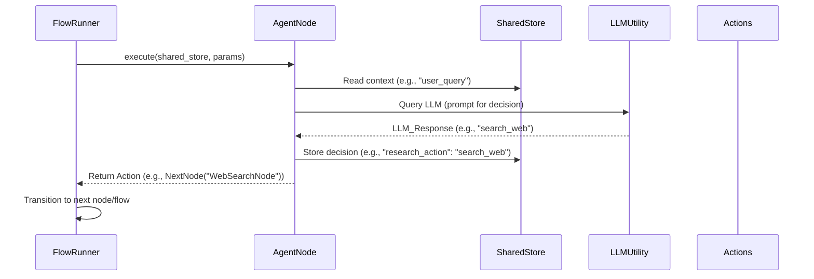
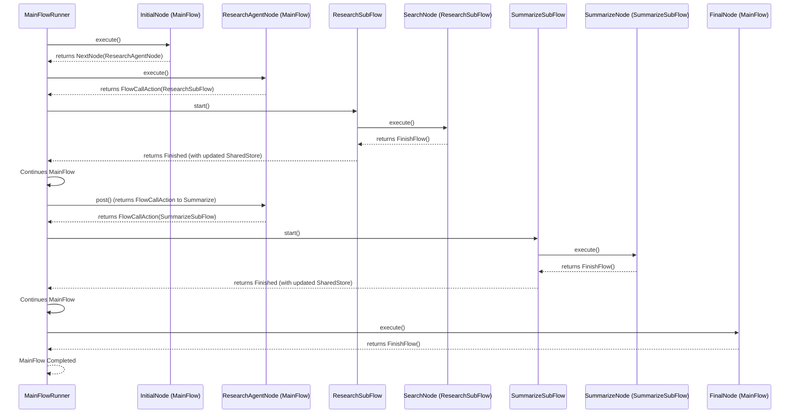

# Chapter 7: Agents & Workflows: Advanced LLM Application Patterns

Building on the foundation laid in previous chapters, especially with how we efficiently handle inputs using [Batch Processing: Efficiently Handling Large Inputs](chapter_06.md), we now turn our attention to more sophisticated patterns. While batch processing excels at repetitive tasks, many real-world LLM applications require dynamic decision-making, contextual adaptation, and the ability to break down highly complex problems into manageable, interconnected stages. This chapter introduces *Agents* and *Workflows*, advanced patterns that elevate Pocket Flow's capability from structured task execution to intelligent, multi-step problem-solving.

---

### Problem & Motivation

Traditional LLM applications often struggle with open-ended tasks that require multiple steps of reasoning, external tool use, and contextual adaptation. A simple sequence of Nodes, while effective for predefined operations, quickly becomes rigid when the exact path or required tools are not known beforehand. For instance, consider an AI assistant tasked with answering a user's question. This might involve first searching the web, then summarizing the search results, potentially cross-referencing an internal knowledge base, and finally synthesizing a coherent answer. Each step might depend on the outcome of the previous one, and the assistant needs to make intelligent decisions about *what to do next* based on the current context.

This lack of dynamic control and the challenge of managing complex, multi-stage processes are significant hurdles. Without a structured approach, developers would resort to intricate conditional logic within a single Node or an unwieldy, hardcoded Flow, making the application difficult to develop, debug, and maintain. Pocket Flow addresses this by providing `Agent` patterns for dynamic decision-making and `Workflow` patterns for systematic decomposition of complex tasks.

Our guiding use case for this chapter will be an **Intelligent Research Assistant**. This assistant needs to dynamically decide between different information sources (e.g., internal database vs. web search), summarize findings, and then potentially refine the search based on initial results, all to answer a complex query effectively. This scenario demands both intelligent decision-making (Agents) and the orchestration of multiple distinct operations (Workflows).

---

### Core Concept Explanation

At the heart of building sophisticated LLM applications with Pocket Flow are two advanced patterns: **Agents** and **Workflows**. These patterns allow for the creation of systems that can dynamically react to information and systematically tackle complex problems.

An **Agent** in Pocket Flow is essentially a specialized `Node` that leverages an LLM to make dynamic decisions based on the current `Shared Store` context and its defined capabilities. Unlike a standard Node that performs a predefined action, an Agent `Node` reasons about *what action to take next*. It can decide to call a specific utility function (e.g., a web search tool), transition to a different part of the Flow, or even modify the `Shared Store` to guide subsequent operations. This imbues the application with a level of intelligence and adaptability that goes beyond linear execution. Agents are typically driven by carefully crafted LLM prompts that guide their decision-making process, often by instructing them to "tool call" or select from a predefined set of actions.

**Workflows**, on the other hand, are about decomposing large, intricate problems into smaller, more manageable sub-tasks, each represented by its own `Flow`. Rather than having one monolithic `Flow` for an entire complex application, you can design multiple, focused `Flows` (often called *SubFlows*). A higher-level `Flow` can then orchestrate these SubFlows, effectively creating a hierarchical structure. This modularity improves readability, reusability, and makes complex systems easier to debug and maintain. The parent `Flow` acts as a coordinator, deciding when and how to invoke these SubFlows, often guided by the decisions made by an Agent.

Together, Agents and Workflows form a powerful combination. An Agent might decide to initiate a specific SubFlow based on its reasoning, or a SubFlow might conclude by handing control back to an Agent for further decision-making. This synergy allows Pocket Flow to model highly adaptive and multi-stage reasoning processes, moving closer to autonomous AI behaviors.

---

### Practical Usage Examples

Let's revisit our **Intelligent Research Assistant** use case. We want an agent to decide whether to search a predefined knowledge base or perform a web search, then summarize, and potentially refine.

First, let's define a simple `AgentNode` that uses an LLM to decide on the next action. We'll assume a `LLMUtility` exists (as covered in [Utility Functions](chapter_05.md)).

```python
# Assuming a basic LLMUtility is available
from pocket_flow.core import Node, Flow, SharedStore, Params
from pocket_flow.actions import NextNode, FlowCallAction, FinishFlow
from pocket_flow.utilities import LLMUtility # Hypothetical LLM utility

class ResearchDecisionAgentNode(Node):
    def prep(self, shared_store: SharedStore, params: Params):
        self.query = shared_store.get("user_query")

    def exec(self, shared_store: SharedStore, params: Params):
        llm_response = LLMUtility.call_llm(
            prompt=f"Given the query: '{self.query}', should I 'search_web' or 'search_kb'? Respond with just the action.",
            model="gpt-3.5-turbo",
            temperature=0.1
        )
        # Store the LLM's decision for post() to act upon
        shared_store.set("research_action", llm_response.strip().lower())

    def post(self, shared_store: SharedStore, params: Params):
        action = shared_store.get("research_action")
        if action == "search_web":
            print("Agent decided: Web Search")
            return NextNode("WebSearchNode")
        elif action == "search_kb":
            print("Agent decided: Knowledge Base Search")
            return NextNode("KBSearchNode")
        else:
            print(f"Agent made an unknown decision: {action}. Defaulting to Web Search.")
            return NextNode("WebSearchNode")

# Example usage:
# A flow would initiate with this agent node.
```
This `ResearchDecisionAgentNode` reads the user's query, consults an LLM to decide on a research strategy, and then returns an `Action` to transition to the appropriate search node. The LLM's simple response guides the flow dynamically.

Now, let's look at how Workflows enable chaining these operations. We'll define simple placeholder Nodes and then combine them into a main `ResearchWorkflow`.

```python
# Simple placeholder nodes for demonstration
class WebSearchNode(Node):
    def exec(self, shared_store: SharedStore, params: Params):
        query = shared_store.get("user_query")
        print(f"Performing web search for: {query}...")
        shared_store.set("search_results", f"Web results for {query}...")
    def post(self, shared_store: SharedStore, params: Params):
        return FinishFlow() # Or NextNode to a summarizer

class KBSearchNode(Node):
    def exec(self, shared_store: SharedStore, params: Params):
        query = shared_store.get("user_query")
        print(f"Searching Knowledge Base for: {query}...")
        shared_store.set("search_results", f"KB results for {query}...")
    def post(self, shared_store: SharedStore, params: Params):
        return FinishFlow() # Or NextNode to a summarizer

# Define SubFlows
class WebSearchSubFlow(Flow):
    def __init__(self):
        super().__init__("WebSearchSubFlow", [WebSearchNode("WebSearchNode")], start_node="WebSearchNode")

class KBSearchSubFlow(Flow):
    def __init__(self):
        super().__init__("KBSearchSubFlow", [KBSearchNode("KBSearchNode")], start_node="KBSearchNode")

# A main flow that uses the agent and calls sub-flows
class ResearchOrchestratorFlow(Flow):
    def __init__(self):
        super().__init__(
            "ResearchOrchestratorFlow",
            [
                ResearchDecisionAgentNode("ResearchAgent"),
            ],
            start_node="ResearchAgent"
        )
        # We need to map the NextNode actions from ResearchAgent to FlowCallActions
        # In a real system, the flow orchestration logic would handle this mapping
        # For simplicity, let's imagine the agent directly returns FlowCallAction
        # Or, more realistically, the main flow defines transitions based on agent output
        # For this example, we'll simplify and show how a FlowCallAction works

# This example simplifies the transition logic.
# A more advanced flow could map agent decisions to FlowCallAction dynamically.
```
The `ResearchOrchestratorFlow` would start with the `ResearchDecisionAgentNode`. Based on the agent's decision, it would then transition to either the `WebSearchNode` or `KBSearchNode`. To demonstrate *Workflows* (calling sub-flows), we can introduce a `SummarizationFlow` that processes the results:

```python
class SummarizeNode(Node):
    def prep(self, shared_store: SharedStore, params: Params):
        self.results = shared_store.get("search_results")

    def exec(self, shared_store: SharedStore, params: Params):
        summary = LLMUtility.call_llm(
            prompt=f"Summarize the following research results: {self.results}",
            model="gpt-3.5-turbo",
            temperature=0.5
        )
        shared_store.set("final_summary", summary.strip())
        print(f"Summary created: {summary.strip()[:50]}...")
    
    def post(self, shared_store: SharedStore, params: Params):
        return FinishFlow() # End of summarization

class SummarizationSubFlow(Flow):
    def __init__(self):
        super().__init__(
            "SummarizationSubFlow",
            [SummarizeNode("SummarizeNode")],
            start_node="SummarizeNode"
        )

# A more complete Orchestrator Flow
class CompleteResearchFlow(Flow):
    def __init__(self):
        super().__init__(
            "CompleteResearchFlow",
            nodes=[
                ResearchDecisionAgentNode("ResearchAgent"),
                WebSearchNode("WebSearch"), # Renamed for clarity in flow
                KBSearchNode("KBSearch"),
                SummarizeNode("Summarize") # Direct node for simplicity
            ],
            start_node="ResearchAgent"
        )
        # Define transitions explicitly based on agent output or intermediate steps
        self.add_transition("ResearchAgent", "search_web", "WebSearch")
        self.add_transition("ResearchAgent", "search_kb", "KBSearch")
        self.add_transition("WebSearch", "finish", "Summarize") # Assume WebSearch returns 'finish' action
        self.add_transition("KBSearch", "finish", "Summarize") # Assume KBSearch returns 'finish' action
        self.add_transition("Summarize", "finish", None) # Final node

    # A simple run method for demonstration, normally handled by a FlowRunner
    def run(self, initial_shared_store: SharedStore, initial_params: Params):
        print("Starting CompleteResearchFlow...")
        flow_runner = PocketFlowRunner() # Hypothetical runner class
        final_store, final_status = flow_runner.run(self, initial_shared_store, initial_params)
        print("Flow finished.")
        print(f"Final Summary: {final_store.get('final_summary')}")
        return final_store

# Initializing and running the flow
# initial_ss = SharedStore({"user_query": "Explain quantum entanglement"})
# initial_params = Params({})
# complete_flow = CompleteResearchFlow()
# final_data = complete_flow.run(initial_ss, initial_params)
```
This demonstrates how an `AgentNode` makes a decision, and then the `Flow` orchestrates the subsequent steps, potentially using sub-flows or simply chaining nodes. The `add_transition` calls show how the `Flow` itself handles the dynamic routing based on the agent's output.

---

### Internal Implementation Walkthrough

Understanding how Agents and Workflows operate internally provides insight into their power and flexibility.

#### AgentNode Internals

An `AgentNode` is a direct extension of the basic `Node` abstraction (`src/core/node.py`). Its distinguishing characteristic lies within its `exec()` method, where it typically interacts with an `LLMUtility` (from `src/utilities/llm_utility.py`) to perform reasoning.

1.  **Context Gathering (`prep`)**: The `AgentNode`'s `prep()` method gathers relevant information from the `SharedStore` (e.g., user query, previous results, current state) to construct a comprehensive context for the LLM.
2.  **Decision-Making (`exec`)**: The `exec()` method formulates a prompt that instructs an LLM to choose from a set of predefined actions or tools. This prompt is critical, often employing techniques like "few-shot learning" or "chain-of-thought" to guide the LLM's reasoning. The LLM's response, which represents its decision, is then parsed and stored back into the `SharedStore`.
3.  **Action Return (`post`)**: The `post()` method then inspects the decision stored in the `SharedStore` (or directly from `exec`'s parsed output) and returns an appropriate `Action` (e.g., `NextNode(target_node_name)`, `FlowCallAction(sub_flow_instance)`, `FinishFlow()`). This is where the dynamic routing is determined.

The core loop for an Agent typically looks like this:


The design emphasizes that the `AgentNode` itself is agnostic to *how* the decision is made, as long as it receives an interpretable output from the LLM. The actual LLM interaction logic is encapsulated within `LLMUtility`, adhering to the principle of separating concerns.

#### Workflow (SubFlow) Internals

Workflows, or more specifically, the ability to call SubFlows, is managed by the `FlowRunner` (a conceptual orchestrator not explicitly shown in `src/core/flow.py` but implied). The mechanism relies on a special `Action` type: `FlowCallAction`.

1.  **Parent Flow Execution**: A parent `Flow` executes its nodes in sequence.
2.  **`FlowCallAction` Encountered**: When a `Node` within the parent `Flow` (or the `FlowRunner` itself, based on transitions) returns a `FlowCallAction(sub_flow_instance)`, the `FlowRunner` recognizes this as a request to pause the current `Flow`'s execution and begin executing the specified `sub_flow_instance`.
3.  **SubFlow Execution**: The `FlowRunner` then initiates the `sub_flow_instance` with the current `SharedStore` and `Params`. The SubFlow runs to completion, modifying the `SharedStore` as it proceeds.
4.  **Resumption of Parent Flow**: Once the `sub_flow_instance` returns a `FinishFlow()` action, the `FlowRunner` resumes the parent `Flow` from the point it left off. The `SharedStore` now contains any updates made by the SubFlow, effectively passing data between the parent and child flows.

This hierarchical execution model allows for complex task decomposition:


The `FlowRunner` manages the call stack of `Flows`, ensuring proper data context and seamless transitions between parent and child executions. This approach makes `Flow` instances highly reusable, as they can be invoked as standalone processes or as components of larger Workflows.

---

### System Integration

Agents and Workflows are not standalone features; they are deeply integrated with Pocket Flow's core abstractions, enhancing their capabilities:

-   **[Communication: Sharing Data Between Nodes](chapter_01.md)**: The `Shared Store` is paramount. Agents rely on it to read context for decision-making and to write their decisions or intermediate results. Workflows use it to pass data seamlessly between sub-flows. `Params` can configure agent behavior (e.g., allowed tools, specific LLM models) or specify optional sub-flow parameters.

-   **[Nodes: The Smallest Building Blocks](chapter_02.md)**: Agents are specialized `Nodes`. They inherit the `prep`, `exec`, and `post` lifecycle, but their `exec` method is distinguished by its LLM-driven reasoning. This demonstrates the extensibility of the `Node` abstraction.

-   **[Flows: Orchestrating Nodes with Actions](chapter_03.md)**: Workflows are essentially compositions of `Flows`. The `Flow`'s ability to define transitions based on `Actions` (including `FlowCallAction` to invoke sub-flows and `NextNode` driven by agent decisions) is what enables the orchestration of complex, multi-stage processes.

-   **[Utility Functions: Connecting to the Real World](chapter_05.md)**: Agents heavily depend on `Utility Functions` to perform their reasoning (by calling an LLM) and to execute external actions (like web searches, database queries, or API calls) based on their decisions. These utilities provide the "tools" an agent can wield.

-   **Data Flow**: Data flows between agents and workflows primarily via the `Shared Store`. An agent reads the current state from the `Shared Store`, makes a decision, and potentially updates the `Shared Store` with new instructions or results. A sub-flow receives the `Shared Store` from its parent, operates on it, and returns the modified `Shared Store` upon completion, ensuring a continuous flow of information through the entire multi-stage process.

---

### Best Practices & Tips

Leveraging Agents and Workflows effectively requires careful design and adherence to best practices:

1.  **Clear Agent Prompts**: Design agent prompts to be unambiguous, explicitly listing available tools/actions and expected output formats (e.g., JSON for parsing). Use few-shot examples if the LLM struggles with consistent output.
2.  **Define Agent Boundaries**: Give agents a clear, focused responsibility. An agent should decide *what* to do, not necessarily *how* to do every minute detail. Delegate granular execution to other specialized Nodes or SubFlows.
3.  **Modular Workflows**: Decompose complex tasks into the smallest logical `Flows` possible. This maximizes reusability, simplifies testing, and makes debugging individual stages easier. Think of `Flows` as functions in a program.
4.  **Shared Store Discipline**: Be intentional about what data is stored in the `Shared Store`. Avoid dumping everything; only store what's necessary for subsequent nodes/flows. Clearly define keys and expected data types.
5.  **Error Handling & Fallbacks**: Agents should be designed to handle unexpected LLM responses or tool failures. Implement fallback mechanisms (e.g., retry, default action, specific error handling nodes/flows). Workflows should similarly have mechanisms to catch and handle errors propagated from sub-flows.
6.  **Observability & Logging**: Implement robust logging within AgentNodes to capture LLM inputs, outputs, decisions made, and tool calls. For Workflows, log the start and end of each sub-flow, and the transitions between nodes. This is crucial for understanding complex execution paths.
7.  **Iterative Refinement**: Agent prompts and workflow structures often require iterative refinement. Start with a simple version and gradually add complexity, testing at each step.
8.  **Performance Considerations**: LLM calls are often the slowest part of an agent's execution. Minimize unnecessary LLM calls. For workflows, be mindful of the overhead of starting/stopping sub-flows, though Pocket Flow is designed to minimize this.
9.  **Security**: If agents are calling external tools, ensure proper API key management and input sanitization to prevent injection vulnerabilities.

---

### Chapter Conclusion

This chapter concludes our comprehensive journey through Pocket Flow by introducing Agents and Workflows, two powerful patterns that enable the construction of highly intelligent and adaptive LLM applications. We've seen how `Agents` imbue our applications with dynamic decision-making capabilities, allowing them to reason about context and choose optimal paths using LLMs. Simultaneously, `Workflows` provide the architectural framework for breaking down complex problems into modular, reusable `Flows`, fostering maintainability and scalability.

From basic communication via the `Shared Store` to the sophisticated orchestration of `Nodes` and `Flows`, and finally to the intelligent decision-making powered by `Agents` and structured by `Workflows`, Pocket Flow offers a minimalist yet robust toolkit for building cutting-edge AI applications. By combining these core abstractions with well-defined `Utility Functions` and efficient `Batch Processing` techniques, developers can create AI systems that are not only powerful but also flexible, understandable, and easy to evolve. Pocket Flow empowers you to model complex tasks as elegant, interconnected graphs, bringing clarity and control to the world of LLM application development.