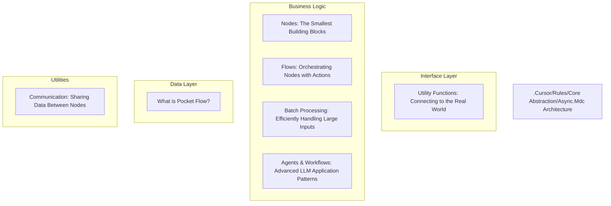
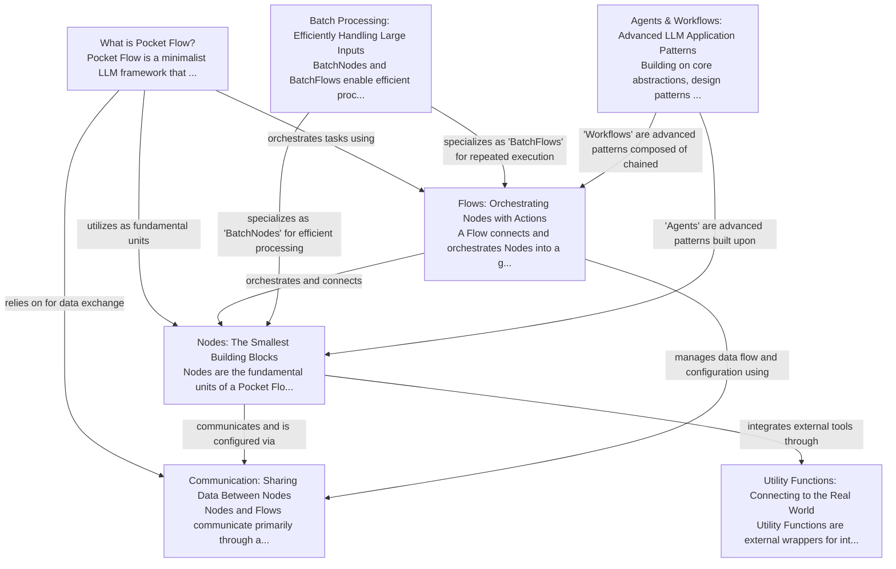

# .Cursor/Rules/Core Abstraction/Async.Mdc Tutorial

Welcome to the comprehensive tutorial for .Cursor/Rules/Core Abstraction/Async.Mdc. This tutorial is automatically generated from the codebase to help you understand the core concepts and implementation patterns.

## Project Overview

Pocket Flow is a minimalist LLM framework that simplifies building AI applications by modeling complex tasks as a graph of interconnected steps, using a shared data store for communication. It emphasizes lightweight design and flexibility for integrating various LLM tools. The framework's core comprises 'Nodes', which perform focused tasks, orchestrated by 'Flows' that define the operational sequence, all communicating via a 'Shared Store' and 'Params'.

## System Architecture

## Component Relationships

## Table of Contents

1. [Chapter 1: Communication: Sharing Data Between Nodes](chapter_01.md) - Comprehensive documentation for Communication: Sharing Data Between Nodes following structured metho...
2. [Chapter 2: Nodes: The Smallest Building Blocks](chapter_02.md) - Comprehensive documentation for Nodes: The Smallest Building Blocks following structured methodology...
3. [Chapter 3: Flows: Orchestrating Nodes with Actions](chapter_03.md) - Comprehensive documentation for Flows: Orchestrating Nodes with Actions following structured methodo...
4. [Chapter 4: What is Pocket Flow?](chapter_04.md) - Comprehensive documentation for What is Pocket Flow? following structured methodology...
5. [Chapter 5: Utility Functions: Connecting to the Real World](chapter_05.md) - Comprehensive documentation for Utility Functions: Connecting to the Real World following structured...
6. [Chapter 6: Batch Processing: Efficiently Handling Large Inputs](chapter_06.md) - Comprehensive documentation for Batch Processing: Efficiently Handling Large Inputs following struct...
7. [Chapter 7: Agents & Workflows: Advanced LLM Application Patterns](chapter_07.md) - Comprehensive documentation for Agents & Workflows: Advanced LLM Application Patterns following stru...

## How to Use This Tutorial

1. **Start with Chapter 1** to understand the foundational concepts
2. **Follow the sequence** - each chapter builds upon previous concepts
3. **Practice with code examples** - every chapter includes practical examples
4. **Refer to diagrams** - use architecture diagrams for visual understanding
5. **Cross-reference concepts** - chapters link to related topics

## Tutorial Features

- **Progressive Learning**: Concepts are introduced in logical order
- **Code Examples**: Every chapter includes practical, executable code
- **Visual Diagrams**: Mermaid diagrams illustrate complex relationships
- **Cross-References**: Easy navigation between related concepts
- **Beginner-Friendly**: Written for newcomers to the codebase

## Contributing

This tutorial is auto-generated from the codebase. To improve it:
1. Update the source code documentation
2. Add more detailed comments to key functions
3. Regenerate the tutorial using the documentation system

---

*Generated using AI-powered codebase analysis*
