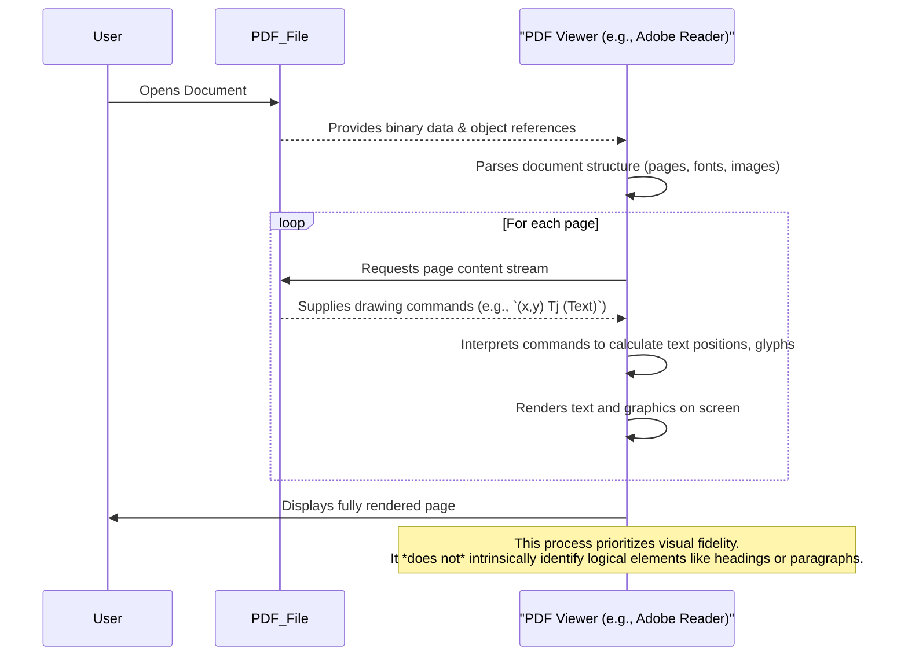

# Chapter 1: The Challenge of PDF Document Structure

---

This is the foundational chapter for our project, "Pdf Conversion Using Neural Networks". We begin by exploring the core problem that necessitates our innovative approach: the inherent structural limitations of PDF documents.

## Problem & Motivation

Portable Document Format (PDF) files are ubiquitous. They are the go-to standard for sharing documents, reports, and invoices because they reliably preserve visual appearance across different devices and operating systems. Whether you open a PDF on a laptop, tablet, or print it, it generally looks exactly the same. This fidelity to visual presentation is PDF's greatest strength, but it's also its fundamental weakness when it comes to *understanding* the document's content programmatically.

The real-world problem we face is that PDFs are designed like "digital paper." They contain instructions for drawing text, lines, and images at precise `(x, y)` coordinates on a page, much like a printer driver. However, they typically lack embedded information about the *logical structure* of the content. A PDF doesn't inherently know that a large, bold text string is a "title," or that a series of smaller text blocks form a "paragraph," or that neatly aligned columns of numbers constitute a "table." This makes it incredibly difficult to automatically extract information, convert documents into flexible formats like HTML or Markdown, or enable advanced content analysis.

For our project, "Pdf Conversion Using Neural Networks," addressing this challenge is paramount. If we cannot reliably identify the logical components of a PDF, our conversion process will simply produce a jumbled mess of text, stripping away all meaning and context. Imagine trying to convert a complex financial report PDF into an interactive web page. Without knowing which text is a heading, which is a data table, or which is a footnote, the resulting HTML would be inaccessible and useless. Our neural network-based approach aims to infer this missing structural information, bridging the gap between visual presentation and semantic meaning.

---

## Core Concept Explanation

At its heart, a PDF document describes a fixed-layout graphical rendition of content. Think of it as a set of instructions for a drawing program. When you create a PDF from a Word document, the semantic tags (like `<H1>`, `<P>`) that Word uses are often stripped away and replaced by drawing commands: "Draw character 'A' at position (100, 200) using font 'Arial-Bold-18pt'", "Draw character 'B' at position (110, 200)", and so on.

This focus on *visual layout* over *logical structure* is the root cause of the challenge. Logical structure refers to the hierarchical organization of content within a document, such as:

*   **Headings**: Titles, subtitles, section headers.
*   **Paragraphs**: Blocks of continuous text.
*   **Lists**: Bulleted or numbered items.
*   **Tables**: Grids of data with rows and columns.
*   **Figures**: Images with captions.
*   **Footnotes/Endnotes**: Supplementary information.

The consequences of this missing structural information are significant. For developers, extracting clean, structured data from PDFs becomes a manual, labor-intensive, and often error-prone task. Traditional methods often rely on brittle heuristics (e.g., "text in 24pt bold font is a heading"), which easily break with slight variations in document design. For users, it means PDFs are often inaccessible to screen readers, difficult to copy-paste accurately, and impossible to reflow for different screen sizes, severely limiting their utility beyond simple viewing and printing. Our project's goal is to overcome these fundamental limitations by intelligently inferring the structure that the PDF format itself neglects.

---

## Practical Usage Examples

To illustrate the challenge, let's consider what happens when we attempt to extract text from a PDF without any structural awareness. Traditional PDF text extraction libraries provide methods to get raw text, but they often struggle to maintain logical relationships.

### Example: Naive Text Extraction

Consider a simple PDF page containing a section heading and a short paragraph. A human would instantly recognize these components.

```markdown
# Section 1.1: Introduction
This project aims to solve the problem of PDF structure recovery.
```

A naive text extraction often results in a flattened, unstructured string, losing vital semantic cues.

```python
# conceptual_pdf_parser.py
class NaivePdfParser:
    """
    Simulates a basic PDF text extractor that prioritizes reading order
    but loses structural context.
    """
    def __init__(self, raw_pdf_data: str):
        self.raw_data = raw_pdf_data

    def extract_all_text(self) -> str:
        """
        Extracts all visible text strings, concatenating them
        without preserving logical breaks or hierarchies.
        """
        # In a real library, this would involve complex parsing of PDF objects.
        # For demonstration, we simulate the output of such a process.
        
        # Imagine raw_pdf_data contains something like:
        # text_objects = [
        #     {'text': 'Section 1.1:', 'font_size': 18, 'y_coord': 750},
        #     {'text': 'Introduction', 'font_size': 18, 'y_coord': 750},
        #     {'text': 'This project aims to solve the problem of PDF structure recovery.', 'font_size': 12, 'y_coord': 720}
        # ]
        
        # A naive extractor might just join these with spaces
        # and not detect the heading or paragraph structure.
        return "Section 1.1: Introduction This project aims to solve the problem of PDF structure recovery."

# --- Simulating the usage ---
sample_pdf_data = "Placeholder for actual PDF binary data or text components."
parser = NaivePdfParser(sample_pdf_data)
extracted_text = parser.extract_all_text()

print(f"--- Naive Extraction Output ---")
print(extracted_text)
print(f"Length: {len(extracted_text)} characters")
```

**Output:**
```
--- Naive Extraction Output ---
Section 1.1: Introduction This project aims to solve the problem of PDF structure recovery.
Length: 85 characters
```

**Explanation:**
As seen in the output, the distinction between the heading ("Section 1.1: Introduction") and the subsequent paragraph is completely lost. There's no newline, no indication of font changes, and no semantic tag. While the raw text is extracted, its *meaningful structure* is destroyed. This flattening of content is a prime example of the challenge we aim to overcome.

---

## Internal Implementation Walkthrough

Understanding *why* PDFs lack logical structure requires a brief look at how they are constructed internally. A PDF file is essentially a collection of objects (dictionaries, arrays, streams) that define various document characteristics, such as pages, fonts, images, and most importantly for our discussion, text.

When a PDF viewer renders a page, it processes a sequence of drawing commands stored in content streams. For text, these commands are operators like:

*   `BT` and `ET`: Begin Text and End Text objects.
*   `Tf`: Sets the font and font size.
*   `Td` or `TD`: Sets the text position and potentially the leading (line spacing).
*   `Tj` or `'`: Shows a text string.

These are all low-level graphical commands. For instance, to display "Hello World", a PDF might contain something like `(Arial-Bold 12 Tf) (100 700 Td) (Hello) Tj (140 700 Td) (World) Tj`. Notice that there's no `<p>` or `<h1>` tag; just commands telling the renderer *where* to draw "Hello" and "World" on the page.

The fundamental issue is that the PDF specification, in its primary design, focuses on ensuring consistent visual output. It provides tools for positioning text and graphics with extreme precision, but it does not mandate or even strongly encourage the embedding of semantic information. While PDF does have an optional "Tagged PDF" feature for accessibility, it's often poorly implemented or entirely absent in many generated documents, and its structure can still be quite basic compared to rich document formats.

Here's a simplified sequence diagram illustrating the typical PDF rendering process, highlighting the absence of a "structural interpretation" step:



**Explanation:**
This flow clearly demonstrates that a PDF viewer's primary job is rendering. It takes drawing instructions and translates them into pixels on a screen. There's no inherent step where the viewer deduces "this block of text is a title" or "this group of lines forms a table." This is the core architectural characteristic of PDF that creates the problem our project seeks to solve.

---

## System Integration

The challenge of PDF document structure directly defines the starting point and the core problem statement for our "Pdf Conversion Using Neural Networks" project. This unstructured nature represents the raw input state that our entire system must process.

*   **Input Data**: The low-level PDF drawing commands and text positions, which are precisely what leads to the lack of logical structure, will be the direct input to our feature engineering pipeline.
    *   This initial data extraction and preprocessing will be detailed in [Direct Processing of Low-Level PDF Data](chapter_04.md).
*   **Feature Engineering**: The process of converting these raw, unstructured PDF elements (like text strings, their coordinates, font sizes, etc.) into meaningful features that a neural network can understand is crucial. The features must capture the subtle visual cues that humans use to infer structure.
    *   We will delve into this in [Designing Input Features for Models](chapter_05.md).
*   **Model Input**: The engineered features derived from the unstructured PDF data will feed directly into our recurrent neural network (RNN) and sequence-to-sequence (Seq2Seq) models. These models are specifically chosen for their ability to understand sequences and context, which is vital for inferring structure from a stream of text fragments.
    *   The architecture of these models is explained in [Recurrent Neural Networks (RNNs) and Seq2Seq Architecture](chapter_06.md).

Essentially, this chapter establishes *why* we need a sophisticated solution. The inherent lack of structure in PDFs is the fundamental obstacle that our entire system is designed to overcome, ultimately achieving the goal of accurate document structure recovery, as introduced in the next chapter.

---

## Best Practices & Tips

When working with PDFs, especially when you need to extract structured information, it's vital to acknowledge the challenges. Here are some best practices and common pitfalls to avoid:

### Recommended Usage Patterns:

1.  **Understand the Source**: Always consider how a PDF was created. Was it a natively generated document (e.g., from Word, LaTeX) or a scanned image converted to PDF (a "scanned PDF")? Scanned PDFs present even greater challenges, often requiring Optical Character Recognition (OCR) *before* any structural analysis can begin.
2.  **Verify Extraction Quality**: Never assume that a generic PDF text extractor will provide perfectly clean or structured data. Always inspect the output for missing information, jumbled text, or incorrect reading order.
3.  **Prioritize Layout Cues (Temporarily)**: While not ideal for robust solutions, for quick, ad-hoc tasks, visually identifiable layout cues (like consistent indents, font sizes, or character spacing) can sometimes be *manually* used to infer simple structures. This approach is highly fragile but might serve for one-off tasks.

### Common Pitfalls to Avoid:

1.  **Over-reliance on Simple Heuristics**: Relying solely on rules like "any text larger than 18pt is a heading" is a recipe for disaster. Font sizes, positions, and styles can vary wildly even within the same document type from different sources.
2.  **Ignoring Reading Order**: PDFs don't always store text in logical reading order. Text might be placed on the page based on rendering efficiency rather than human readability. A simple `x, y` sort might lead to incorrect sentence formation.
3.  **Assuming Consistent Formatting**: PDF documents from different authors or even different versions of the same software can have subtle formatting differences that break rigid parsing rules.
4.  **Not Handling Edge Cases**: Tables spanning multiple pages, complex multi-column layouts, images embedded within text, and special characters are common elements that break naive parsers.

By being acutely aware of these challenges and pitfalls, we can better appreciate the necessity and complexity of a robust, AI-driven solution like the one we are developing.

---

## Chapter Conclusion

In this chapter, we've laid the groundwork for our project by thoroughly examining the fundamental challenge posed by PDF documents: their inherent lack of logical content structure. We've seen how PDFs prioritize visual fidelity, effectively acting as digital printouts, which strips away the semantic meaning of titles, paragraphs, and tables. This makes automated data extraction and content repurposing a notoriously difficult task for traditional rule-based methods.

This critical understanding—that PDFs present raw visual data without explicit structural tags—is the driving force behind our entire project. It's why we turn to the power of neural networks, which excel at identifying complex patterns and inferring meaning from seemingly unstructured data. The limitations highlighted here are precisely what our recurrent neural network models are designed to overcome by learning to recognize document components from low-level visual cues.

Now that we understand the problem, we can define our objective. The next chapter will articulate the specific goal of our project: the reliable and accurate recovery of document structure from PDFs using neural networks.

[The Goal: Document Structure Recovery](chapter_02.md)