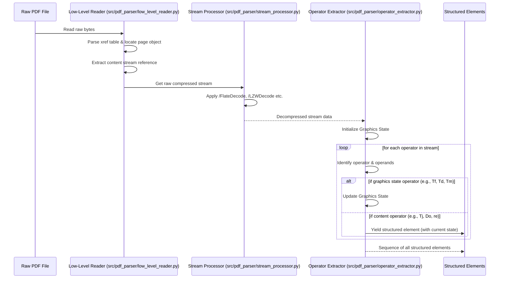

# Chapter 4: Direct Processing of Low-Level PDF Data

In the previous chapter, we explored how [Using Neural Networks for PDF Conversion](chapter_03.md) offers a powerful paradigm for automatically identifying and classifying structural elements within PDF documents. Neural networks, particularly recurrent architectures, excel at learning complex patterns from sequences. But for these powerful models to be effective, they need the *right kind* of input data. This leads us to a crucial question: What data from a PDF document should we feed to our neural networks, and how do we obtain it?

---

### Problem & Motivation

PDFs are a universal format for document exchange, but their primary design goal is visual fidelity, not semantic or logical structure preservation. They describe *how* things look on a page (e.g., "draw text 'Hello' at position X, Y with font F"), not *what* those things are (e.g., "this is a heading," "this is a paragraph"). Traditional methods for extracting information from PDFs often fall short: converting a PDF to an image loses all text semantics, while high-level parsers might abstract away important layout details or make incorrect assumptions about document structure.

For our project, "Pdf Conversion Using Neural Networks," this poses a significant challenge. Our neural networks need to understand the *implicit* structure that defines logical components like headings, paragraphs, and lists. This structure is often embedded in the precise positioning of text, font changes, line breaks, and other low-level drawing commands, not in explicit tags. Relying on visual interpretations or lossy, high-level parsing would strip away these critical clues, leaving our neural networks with insufficient information to learn effectively.

Consider a PDF where a title is visually large and centered, but technically just a sequence of characters drawn individually. A visual parser might struggle to identify it without context, while a high-level parser might group it with body text if not explicitly tagged. By directly processing the low-level PDF data, we aim to capture every granular detail – the exact character positions, font changes, operator sequences, and graphics states – that collectively form the rich input features for our neural networks. This direct approach ensures that the network has access to all potential structural cues, enabling it to recover the true logical document structure, even in complex or untagged PDFs.

---

### Core Concept Explanation: Direct Processing of Low-Level PDF Data

At its heart, a PDF document is a structured collection of objects that describe the content and layout of pages. It's essentially a page description language, similar in concept to PostScript. When we talk about "direct processing of low-level PDF data," we mean interacting with this fundamental representation rather than relying on an interpretation (like rendering an image) or a pre-packaged semantic abstraction.

Instead of seeing a rendered page, we see a sequence of commands and data:
*   **PDF Objects:** Dictionaries, arrays, numbers, strings, streams, and null values. These define everything from page trees to fonts, images, and content streams.
*   **Content Streams:** These are the most crucial part for structure recovery. They contain a sequence of graphics operators (e.g., `BT` for Begin Text, `ET` for End Text, `Tj` for show text, `Tm` for set text matrix, `Td` for move text position, `f` for fill path) and their operands (like text strings, coordinates, font names). These operators dictate exactly *how* content is drawn on a page.

Direct processing means we are parsing these content streams byte-by-byte, identifying each operator and extracting its operands. This approach allows us to retain:
*   **Precise Text Positioning:** Every character's exact coordinates. This is vital for understanding spatial relationships and detecting layout patterns.
*   **Font Information:** Font names, sizes, and styles are critical indicators of semantic roles (e.g., large bold text is often a heading).
*   **Drawing Commands:** Information about lines, rectangles, and other graphics can delineate tables, sections, or figures.
*   **Operator Sequences:** The order in which commands appear can reveal implicit grouping or structural patterns.

By capturing this granular data, we avoid the information loss inherent in visual rendering or high-level parsing. For instance, if a title is set in a specific font and size, and positioned at the top of a page, direct processing will capture all these attributes. A neural network can then learn that this combination of attributes strongly suggests a "Heading" logical component. This comprehensive, raw data forms the essential foundation upon which our neural networks will build their understanding of document structure.

---

### Practical Usage Examples

To illustrate direct processing, let's look at how we might conceptually extract low-level elements from a PDF. While a full PDF parser is complex, these snippets demonstrate the principles of accessing and interpreting raw data. We'll use a simplified approach, imagining the output of a low-level parser.

**Use Case:** Extracting raw text drawing commands and their associated properties from a PDF page.

#### Example 1: Accessing Raw PDF Content Stream Data
This shows how to open a PDF and get access to the raw, compressed content stream of a page. This stream contains the actual PDF operators and operands.

```python
from PyPDF2 import PdfReader
import zlib # For decompression

# Assuming 'sample.pdf' is a real PDF file
try:
    reader = PdfReader("sample.pdf")
    page = reader.pages[0] # Get the first page

    # Get the raw, potentially compressed, content stream data
    content_stream_object = page.get_contents()
    raw_stream_data = content_stream_object.get_data()

    print(f"Accessed raw stream data (first 100 bytes): {raw_stream_data[:100]}...")

    # Decompress if necessary (PyPDF2 often handles this, but conceptually important)
    # This is a conceptual example for illustration
    if '/Filter' in content_stream_object.get('/Filter', {}):
        # In a real scenario, you'd check the filter type (e.g., /FlateDecode)
        print("Stream indicates it might be compressed. Attempting decompression.")
        decompressed_data = zlib.decompress(raw_stream_data)
        print(f"Decompressed data (first 100 bytes): {decompressed_data[:100]}...")
    else:
        decompressed_data = raw_stream_data
        print("Stream does not appear compressed.")

except FileNotFoundError:
    print("Error: 'sample.pdf' not found. Please create a dummy PDF or provide a valid path.")
except Exception as e:
    print(f"An error occurred: {e}")

```
*Explanation: This code snippet demonstrates how to open a PDF using `PyPDF2` and retrieve the raw content stream data for the first page. It also conceptually shows how one might check for and attempt to decompress the stream, which is a necessary step before parsing the individual PDF operators.*

#### Example 2: Identifying and Extracting a Conceptual Text Operator
Once decompressed, the stream is a sequence of bytes. We conceptually look for specific PDF operators, like `Tj` (show text).

```python
# Conceptual example: imagine this is part of a decompressed PDF content stream
# In reality, this would be read byte by byte, not line by line.
decompressed_stream_segment = b"BT\n/F1 12 Tf\n100 700 Td\n(Hello World) Tj\nET\n"

print("Parsing conceptual decompressed stream segment...")
elements = []

# A simplified, illustrative parser (not production-ready)
stream_str = decompressed_stream_segment.decode('latin-1')
current_font = None
current_font_size = None
current_x = 0
current_y = 0

for line in stream_str.splitlines():
    if "Tf" in line: # Font setting operator (e.g., /F1 12 Tf)
        parts = line.strip().split()
        if len(parts) >= 3:
            current_font = parts[0]
            current_font_size = float(parts[1])
            print(f"  - Detected font change: {current_font} size {current_font_size}")
    elif "Td" in line: # Text positioning operator (e.g., 100 700 Td)
        parts = line.strip().split()
        if len(parts) >= 3:
            try:
                current_x = float(parts[0])
                current_y = float(parts[1])
                print(f"  - Detected text position: ({current_x}, {current_y})")
            except ValueError:
                pass # Malformed Td
    elif "Tj" in line: # Show text operator (e.g., (Hello World) Tj)
        text_start = line.find('(')
        text_end = line.rfind(')')
        if text_start != -1 and text_end != -1 and text_end > text_start:
            text = line[text_start + 1:text_end]
            element = {
                "type": "text",
                "content": text,
                "font_name": current_font,
                "font_size": current_font_size,
                "x_pos": current_x,
                "y_pos": current_y
            }
            elements.append(element)
            print(f"  - Extracted Text: '{text}' with font {current_font} at ({current_x}, {current_y})")

print("\nAll extracted elements:")
for el in elements:
    print(el)
```
*Explanation: This conceptual parser iterates through a decompressed stream segment. It demonstrates how to identify common text-related PDF operators (`Tf` for font, `Td` for position, `Tj` for showing text) and extract their associated parameters. This process transforms raw operator sequences into structured data points.*

#### Example 3: The Structured Output of Low-Level Processing
The output of our low-level processing stage for a document would be a sequence of such structured elements, representing every significant drawing command and its attributes.

```python
# This is a sample of the structured data that would be output
# by our low-level PDF data processor for part of a page.
structured_low_level_data_sequence = [
    {
        "op_type": "text",
        "value": "Project Title",
        "font": "/F1",
        "font_size": 24.0,
        "x": 100.0,
        "y": 750.0,
        "color": (0, 0, 0),
        "width": 120.0, # Estimated width
        "height": 24.0  # Estimated height
    },
    {
        "op_type": "text",
        "value": "Chapter 4: Direct Processing",
        "font": "/F2",
        "font_size": 16.0,
        "x": 100.0,
        "y": 700.0,
        "color": (0, 0, 0),
        "width": 180.0,
        "height": 16.0
    },
    {
        "op_type": "text",
        "value": "This paragraph discusses low-level PDF parsing...",
        "font": "/F3",
        "font_size": 10.0,
        "x": 100.0,
        "y": 650.0,
        "color": (0, 0, 0),
        "width": 400.0,
        "height": 10.0
    },
    {
        "op_type": "path",
        "path_type": "line",
        "start_x": 90.0,
        "start_y": 690.0,
        "end_x": 300.0,
        "end_y": 690.0,
        "stroke_width": 1.0,
        "color": (0, 0, 0)
    }
]

print("--- Sample of Structured Low-Level Data Output ---")
for item in structured_low_level_data_sequence[:2]: # Displaying first two for brevity
    print(f"Type: {item['op_type']}, Content/Value: '{item.get('value', 'N/A')}', "
          f"Font: {item.get('font', 'N/A')} {item.get('font_size', 'N/A')}, "
          f"Position: ({item.get('x', 'N/A')}, {item.get('y', 'N/A')})")

print("\nThis sequence is the input to feature engineering.")
```
*Explanation: This dictionary represents the rich, structured, low-level data our system would extract. Each element corresponds to a piece of content (text, graphic, etc.) along with its precise attributes like type, value, font, size, and position. This is the raw material from which our neural networks will learn the document's logical structure.*

---

### Internal Implementation Walkthrough

The actual implementation of a robust low-level PDF parser is complex, typically involving a state machine to track graphics states (current font, color, transformation matrix, etc.) and interpret operators. Here's a conceptual step-by-step walkthrough of what happens internally:

**Step 1: File Reading and Object Resolution**
The parser begins by reading the PDF file bytes. It first identifies the file's header, footer, and, most importantly, the Cross-Reference Table (xref table). This table acts as an index, mapping object IDs to their byte offsets within the file. When a page object needs to be processed, the parser uses the xref table to quickly locate and load the associated page dictionary.

```python
# src/pdf_parser/low_level_reader.py (Conceptual)
import mmap
import re

def _read_xref_table(file_map):
    # In reality, this is complex: find startxref, read xref table entries
    print("Step 1a: Reading Cross-Reference Table (xref) to locate objects...")
    # Simplified: imagine we found the xref and can resolve object IDs
    return {
        "page_tree_id": 2, # Example object ID for page tree
        "content_stream_id_page_1": 10, # Example object ID for page 1's content stream
    }

def get_pdf_object_data(file_path, object_id):
    """Conceptually retrieves raw data for a specific PDF object ID."""
    with open(file_path, 'rb') as f:
        with mmap.mmap(f.fileno(), 0, access=mmap.ACCESS_READ) as mm:
            xref = _read_xref_table(mm) # Placeholder for real xref parsing
            # In a real parser, we'd use the xref to jump to the object's offset
            # and parse it based on its type (dict, stream, etc.)
            print(f"Step 1b: Retrieving object {object_id} data (conceptual).")
            # For a content stream, this would return the raw stream bytes
            # For this example, we return dummy bytes to represent a stream
            if object_id == xref.get("content_stream_id_page_1"):
                 return b"<< /Filter /FlateDecode /Length 50 >>\nstream\nx\x9c...endstream"
            return b"some_other_object_data"
```
*Explanation: This shows the initial phase where the parser maps PDF object IDs to their physical locations in the file using the cross-reference table. This allows efficient access to any part of the PDF, such as a page's content stream.*

**Step 2: Stream Decompression**
Content streams often contain compressed data (e.g., using `FlateDecode` which is zlib compression). Before parsing the operators, this data must be decompressed. The stream dictionary specifies the compression filter(s) used.

```python
# src/pdf_parser/stream_processor.py (Conceptual)
import zlib

def decompress_pdf_stream(raw_stream_bytes, filters=None):
    """Decompresses a PDF stream based on specified filters."""
    # In a real scenario, filters would come from the stream dictionary
    if filters is None:
        filters = ['/FlateDecode'] # Common default

    decompressed_data = raw_stream_bytes
    for filter_name in filters:
        if filter_name == '/FlateDecode':
            # Remove stream/endstream markers and dictionary if present for raw bytes
            stream_start = decompressed_data.find(b'stream') + len(b'stream')
            stream_end = decompressed_data.find(b'endstream')
            if stream_start != -1 and stream_end != -1:
                compressed_content = decompressed_data[stream_start:stream_end].strip()
                try:
                    decompressed_data = zlib.decompress(compressed_content)
                    print("Step 2: Decompressed stream using FlateDecode.")
                except zlib.error as e:
                    print(f"Zlib decompression error: {e}")
                    return raw_stream_bytes # Return original if decompression fails
            else:
                 print("No 'stream'/'endstream' markers found for decompression.")
        # Add logic for other filters like /LZWDecode
    return decompressed_data
```
*Explanation: This function demonstrates the critical step of decompressing the content stream data. It typically involves using libraries like `zlib` for `FlateDecode` compressed streams, revealing the raw PDF operator sequences.*

**Step 3: Operator Parsing and State Management**
This is the core of direct processing. The parser iterates through the decompressed stream, identifying PDF operators (like `Tf`, `Td`, `Tj`, `BT`, `ET`) and their preceding operands. It maintains a graphics state stack, which tracks the current font, text matrix, current text position, color, etc. Every time an operator affecting the graphics state is encountered, the parser updates its internal state. When a text-drawing operator like `Tj` is found, the parser records the text string along with the current font, size, and position from its graphics state.

```python
# src/pdf_parser/operator_extractor.py (Conceptual)
import re

def parse_pdf_operators(decompressed_stream_data):
    """Parses a decompressed PDF content stream, yielding structured elements."""
    print("Step 3: Parsing operators and managing graphics state...")
    elements = []
    # Current graphics state (simplified)
    current_state = {
        "font_name": None, "font_size": None, "x": 0.0, "y": 0.0,
        "text_matrix": [1, 0, 0, 1, 0, 0] # Identity matrix
    }
    operands_buffer = []

    # Extremely simplified tokenization - a real parser would use regex or a tokenizer
    tokens = re.findall(rb'([-\d\.]+\s+[-\d\.]+\s+Td|[-\d\.]+\s+Tf|\(.+?\)\s+Tj|BT|ET|\S+)', decompressed_stream_data)

    for token in tokens:
        token = token.decode('latin-1').strip()
        if token == "BT": # Begin Text
            print("  - BT: Starting text object.")
            operands_buffer = [] # Clear buffer for new text object
        elif token == "ET": # End Text
            print("  - ET: Ending text object.")
            operands_buffer = []
        elif token.endswith("Tf"): # Font operator e.g., "/F1 12 Tf"
            parts = token.split()
            current_state["font_name"] = parts[0] if len(parts) > 0 else None
            current_state["font_size"] = float(parts[1]) if len(parts) > 1 else None
            print(f"  - Tf: Set font to {current_state['font_name']} size {current_state['font_size']}")
        elif token.endswith("Td"): # Text position operator e.g., "100 700 Td"
            parts = token.split()
            if len(parts) >= 2:
                current_state["x"] = float(parts[0])
                current_state["y"] = float(parts[1])
                print(f"  - Td: Set text position to ({current_state['x']}, {current_state['y']})")
        elif token.endswith("Tj") or token.endswith("TJ"): # Show text operator e.g., "(Hello World) Tj"
            text_match = re.search(r'\((.*?)\)', token)
            if text_match:
                text_content = text_match.group(1)
                elements.append({
                    "op_type": "text",
                    "value": text_content,
                    "font": current_state["font_name"],
                    "font_size": current_state["font_size"],
                    "x": current_state["x"],
                    "y": current_state["y"]
                })
                print(f"  - Tj: Extracted text '{text_content}' at ({current_state['x']}, {current_state['y']})")
        # For other operators (path, image, etc.), similar logic would apply.
        else:
            operands_buffer.append(token) # Collect operands for other operators
    return elements
```
*Explanation: This function simulates the core logic of an operator parser. It iterates through tokens in the decompressed stream, updates a conceptual graphics state based on operators like `Tf` (font) and `Td` (position), and then extracts text content when a `Tj` (show text) operator is encountered, associating it with the current graphics state attributes.*

The overall flow for processing a page's content stream would look like this:


*Explanation: This sequence diagram illustrates the complete internal flow. It starts with reading the raw PDF, resolving objects via the xref table, decompressing content streams, and finally, parsing operators while maintaining the graphics state to yield a sequence of rich, structured low-level elements.*

---

### System Integration

The "Direct Processing of Low-Level PDF Data" component sits at the very beginning of our project's data pipeline, acting as the foundational data provider.

**Input:** Raw PDF document file (`.pdf`).

**Output:** A sequential stream of structured low-level elements. Each element is a dictionary (like in Example 3) representing a single logical drawing operation (e.g., a text segment, a line, an image) along with its complete set of attributes (content, font, size, precise coordinates, color, etc.).

This component directly integrates with the subsequent stage: [Designing Input Features for Models](chapter_05.md). The sequence of structured elements generated here serves as the raw material. Each element in this sequence will be transformed into one or more numerical features that the neural networks can consume.

```mermaid
graph TD
    A[Raw PDF Document] --> B(Direct Processing of Low-Level PDF Data)
    B --> C[Sequence of Structured Elements (e.g., JSON/List of Dicts)]
    C --> D(Feature Engineering for Neural Networks)
    D --> E(Recurrent Neural Networks (RNNs) & Seq2Seq Architecture)
    E --> F(Document Structure Recovery Output)
```
*Explanation: This architectural diagram highlights the central role of low-level PDF data processing. It's the first step, taking raw PDF files and transforming them into a structured sequence of elements. This sequence then flows into feature engineering, which prepares the data for the neural network models that perform the actual document structure recovery.*

By providing this rich, untainted stream of low-level data, we ensure that our feature engineering stage has the maximum possible information to extract meaningful patterns, and our neural networks have the best chance to accurately learn and recover the logical structure of complex PDF documents.

---

### Best Practices & Tips

When implementing and utilizing direct low-level PDF data processing, keep the following best practices in mind:

*   **Robust Error Handling:** PDFs can be malformed, corrupted, or use non-standard extensions. Implement comprehensive error handling (e.g., `try-except` blocks, graceful fallbacks) to prevent crashes and ensure your parser can handle a wide variety of inputs.
*   **State Management:** PDF parsing is stateful. Carefully manage the graphics state stack (current transformation matrix, font, color, etc.) to accurately attribute properties to content. Incorrect state management is a common source of parsing errors.
*   **Performance Optimization:** Parsing large PDFs byte-by-byte can be CPU-intensive. Consider techniques like lazy loading of objects, caching parsed data, and potential parallel processing for independent pages to improve performance.
*   **Intermediate Representation Design:** Design a clear, consistent, and comprehensive intermediate data structure for your extracted low-level elements. This structure should capture all relevant attributes (e.g., content, bounding box, font properties, color, PDF operator type) and be easily consumable by the subsequent feature engineering stage.
*   **Avoid Redundant Parsing:** If certain objects (like fonts or images) are referenced multiple times, parse them once and cache the results to avoid reprocessing.
*   **Incremental Processing:** For extremely large documents, avoid loading the entire PDF into memory. Process it page by page, or even stream-by-stream, to manage memory usage effectively.
*   **Tooling Awareness:** While this chapter focuses on direct processing, be aware of existing PDF parsing libraries (e.g., `pdfminer.six`, `PyPDF2`, `poppler` bindings). They can provide a starting point or inspiration, but for truly low-level, structure-agnostic parsing, custom or heavily modified solutions are often required.
*   **Validation:** Continuously validate the output of your low-level parser against various PDF documents (simple, complex, malformed) to ensure accuracy and completeness.

---

### Chapter Conclusion

This chapter has established the fundamental importance of **direct processing of low-level PDF data** for our project, "Pdf Conversion Using Neural Networks." We've seen that by eschewing visual interpretations and high-level abstractions, we gain direct access to the rich, granular information embedded within a PDF's content streams – details like precise character positions, font changes, and specific drawing commands. This approach is paramount because it ensures that our neural networks receive the most complete and unadulterated dataset possible, allowing them to effectively discern implicit structural cues and recover the logical components of a document.

We walked through the conceptual steps of reading PDF objects, decompressing content streams, and parsing individual operators to generate a sequence of structured elements. This process lays the groundwork for all subsequent stages of our project. With this robust foundation of raw, meaningful data, we are now ready to transform these low-level elements into a format that our neural networks can truly understand and learn from.

The next crucial step is to convert these structured low-level elements into numerical representations suitable for machine learning. This process, known as feature engineering, is what we will explore in the next chapter.

[Designing Input Features for Models](chapter_05.md)