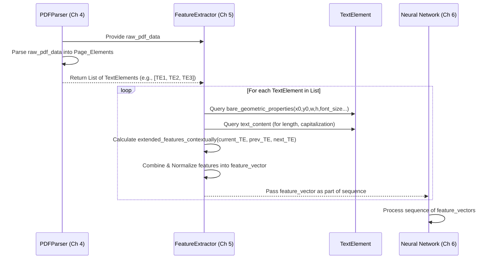

# Chapter 5: Designing Input Features for Models

Our journey through understanding and processing PDF documents has brought us to the crucial point of extracting meaningful information from the raw data. In the [previous chapter: Direct Processing of Low-Level PDF Data](chapter_04.md), we learned how to access and interpret the fundamental building blocks of a PDF document—its text fragments, images, and graphical commands—without relying on visual rendering. We established a foundation for converting proprietary PDF instructions into a more manageable internal representation.

However, a neural network cannot directly "see" or "understand" these raw textual elements as a human would. It requires structured, numerical input that captures the essence of each component and its context. This chapter, **"Designing Input Features for Models"**, focuses on bridging this gap. We'll explore how to transform the low-level PDF data into a rich set of engineered features, making the document's inherent structure interpretable by our neural network models.

---

### Problem & Motivation

PDF documents, as previously discussed in [Chapter 1: The Challenge of PDF Document Structure](chapter_01.md), are designed for precise visual layout rather than logical content flow. When we process raw PDF data, we obtain discrete elements, each with its own position, text, font, and size. The challenge is that a neural network needs more than just raw text or coordinates; it needs *features* that highlight the properties indicative of logical document structure. How can a model distinguish a "title" from a "paragraph," or a "header" from a "footnote," simply by looking at its raw data?

Consider a simple use case: identifying a **main title** in a document. While a human can easily spot it by its large font, central alignment, and position at the top of the page, a neural network needs explicit numerical clues. Without carefully designed input features, the model would struggle to discern these crucial patterns from the vast amount of low-level PDF information. This problem directly impacts our project's goal of [Document Structure Recovery](chapter_02.md), as the quality of the features dictates the neural network's ability to learn and classify document components accurately.

Good features are the "language" through which the neural network understands the raw PDF data. They provide the necessary context and characteristics for the model to make informed decisions about an element's structural role.

---

### Core Concept Explanation: Feature Engineering for PDFs

Input features are the numerical representations of characteristics derived from the raw data of each PDF element. These features serve as the primary input to our neural network models, allowing them to learn patterns and make predictions about the structural role of each piece of content. The process of *designing* these features, known as feature engineering, is critical because it directly influences the model's ability to recognize complex document structures.

We categorize the engineered features into two main types:

1.  **Bare Geometric Features**: These are intrinsic properties of an individual text element or graphic component. They are straightforward to extract and represent the most fundamental visual and positional attributes. Examples include the element's bounding box coordinates (x, y, width, height), its font size, font family, color, and actual text content. These features provide a basic fingerprint for each element, much like describing a building by its height, width, and number of floors.

2.  **Extended Contextual Features**: These features go beyond individual element properties and capture relationships between an element and its neighbors, or its position within the broader page layout. They provide rich contextual information, which is often crucial for understanding logical structure. Examples include the distance to the element above/below it, its indentation relative to the left margin, whether it's part of a bulleted list (based on surrounding elements), or its vertical alignment with other elements. These are like describing a building not just by its dimensions, but by its proximity to a park, its view of the river, or its connection to other buildings via a bridge. This relational information is vital because structural elements like headings and paragraphs are often defined by their *context* and *relationships* to surrounding text.

By combining these bare geometric and extended contextual features, we create a comprehensive numerical profile for each PDF element. This profile is then fed as a sequence into our recurrent neural network, allowing it to interpret the document's layout and content with a nuanced understanding, far beyond what raw bytes could offer.

---

### Practical Usage Examples

Let's illustrate how we might extract some basic and extended features for a simplified text element. Imagine we've already parsed a PDF document into a list of `text_elements`, where each element is an object containing its properties.

First, let's define a mock `TextElement` class for demonstration:

```python
class TextElement:
    def __init__(self, x0, y0, x1, y1, text, font_size, font_name):
        self.x0 = x0
        self.y0 = y0
        self.x1 = x1
        self.y1 = y1
        self.text = text
        self.font_size = font_size
        self.font_name = font_name
        self.width = x1 - x0
        self.height = y1 - y0

# Example mock text elements from a PDF page
elements_on_page = [
    TextElement(x0=50, y0=700, x1=550, y1=720, text="Chapter 5: Designing Input Features", font_size=20, font_name="Arial-Bold"),
    TextElement(x0=50, y0=650, x1=400, y1=665, text="This section explains feature engineering.", font_size=12, font_name="Arial"),
    TextElement(x0=70, y0=630, x1=450, y1=645, text="Key concepts are bare geometric features.", font_size=10, font_name="Arial"),
    TextElement(x0=70, y0=610, x1=450, y1=625, text="And extended contextual features.", font_size=10, font_name="Arial"),
]
```
This `TextElement` class simulates the kind of data we'd get after directly processing low-level PDF data, as discussed in [Chapter 4: Direct Processing of Low-Level PDF Data](chapter_04.md). Each instance holds basic positional and stylistic information.

#### Extracting Bare Geometric Features

For any given `TextElement`, extracting bare geometric features is straightforward. We simply access its properties.

```python
def extract_bare_features(element):
    return {
        "x0": element.x0,
        "y0": element.y0,
        "width": element.width,
        "height": element.height,
        "font_size": element.font_size,
        "text_length": len(element.text),
        "is_bold": "Bold" in element.font_name, # Simple heuristic
    }

# Example for the first element (a potential title)
title_features = extract_bare_features(elements_on_page[0])
print("Bare features for Title:", title_features)
```
**Explanation:** This code snippet defines a function `extract_bare_features` that takes a `TextElement` object and returns a dictionary of its fundamental properties. For our example title, it outputs its starting X/Y coordinates, width, height, font size, text length, and a boolean indicating if it's bold. These numerical values can now be fed into a neural network.

#### Calculating Extended Contextual Features

Extended features require looking at an element in relation to others. Let's calculate the vertical distance to the *next* element and its relative indentation.

```python
def extract_extended_features(current_element, next_element=None):
    features = {}
    if next_element:
        features["dist_to_next_y"] = current_element.y0 - next_element.y0
    else:
        features["dist_to_next_y"] = 0 # No next element
    
    # Assume page left margin is 50 for this example
    page_margin_x = 50
    features["indentation"] = current_element.x0 - page_margin_x
    
    return features

# Example for the second element (a potential paragraph)
paragraph_element = elements_on_page[1]
next_element_after_paragraph = elements_on_page[2]

extended_features = extract_extended_features(paragraph_element, next_element_after_paragraph)
print("Extended features for Paragraph:", extended_features)
```
**Explanation:** `extract_extended_features` computes contextual information. For the paragraph, it calculates the vertical distance to the next element (the first bullet point) and its horizontal indentation from an assumed page margin. Notice the indentation for the second element (50-50=0) vs. the third (70-50=20), which already gives a strong clue about nesting or list items. These features provide vital relational information that helps the model understand structure.

#### Combining Features into a Vector

Ultimately, we'll combine all relevant features for an element into a single numerical vector to serve as input for our neural network.

```python
import numpy as np

def create_feature_vector(element, next_element=None):
    bare = extract_bare_features(element)
    extended = extract_extended_features(element, next_element)
    
    # Order matters for the neural network input
    feature_list = [
        bare["x0"], bare["y0"], bare["width"], bare["height"],
        bare["font_size"], bare["text_length"], float(bare["is_bold"]),
        extended["dist_to_next_y"], extended["indentation"]
    ]
    return np.array(feature_list)

# Generate a feature vector for the second element
feature_vector = create_feature_vector(elements_on_page[1], elements_on_page[2])
print("Combined feature vector for Paragraph:\n", feature_vector)
print("Vector shape:", feature_vector.shape)
```
**Explanation:** This function `create_feature_vector` combines the outputs of our bare and extended feature extraction. It's crucial that the order of features is consistent for all elements, as the neural network learns patterns based on the position within the vector. The final output is a NumPy array, a standard input format for neural networks.

---

### Internal Implementation Walkthrough

The actual process of designing and extracting features involves a dedicated component, often called a `FeatureExtractor`. This component takes the intermediate representation of PDF elements (produced by the low-level data processing) and transforms them into sequences of feature vectors.

Here's a conceptual step-by-step walkthrough:

1.  **PDF Element Collection (from Chapter 4):**
    *   The `PDFParser` (or similar module from [Chapter 4: Direct Processing of Low-Level PDF Data](chapter_04.md)) first processes the raw PDF instructions.
    *   It yields a list of `Page` objects, each containing a sorted list of `TextElement`, `ImageElement`, and `VectorGraphic` objects. For this chapter, we primarily focus on `TextElement`s.

2.  **Feature Extraction Initialization:**
    *   A `FeatureExtractor` class is instantiated, potentially with configuration for specific features to include or exclude.
    *   It might pre-compute global page statistics (like average font size, page margins) that are used for relative feature calculations.

3.  **Iterating Through Elements:**
    *   For each page, the `FeatureExtractor` iterates through the list of `TextElement`s in their natural reading order (typically top-to-bottom, left-to-right). This order is critical for sequence models like RNNs.

4.  **Calculating Bare Geometric Features:**
    *   For each `current_element`, its direct attributes (`x0`, `y0`, `width`, `height`, `font_size`, `font_name`, `text_content`, `text_length`, `is_bold`, `is_italic`, `color`, etc.) are read and normalized if necessary.

5.  **Calculating Extended Contextual Features:**
    *   To calculate these, the `FeatureExtractor` needs context. It might look at:
        *   The `previous_element` and `next_element` in the sequence to compute vertical and horizontal distances, alignment, and indentation relative to neighbors.
        *   Global page information: For features like "percentage of page height," "relative x position."
        *   Grouping information: Identify elements likely belonging to the same line, paragraph, or list item (a sub-problem often solved with heuristics or clustering *before* feature extraction for the RNN).
        *   Language-specific features: e.g., presence of common heading keywords, capitalization patterns.

6.  **Feature Vector Assembly and Normalization:**
    *   All calculated features for the `current_element` are combined into a fixed-size numerical vector.
    *   **Normalization/Scaling** is often applied here (e.g., Min-Max Scaling or Z-score Standardization) to ensure all features contribute equally to the model and prevent features with larger numerical ranges from dominating. This is a best practice for most machine learning models.

7.  **Sequence Generation:**
    *   The `FeatureExtractor` yields a sequence of these feature vectors, one for each `TextElement` on the page, in the correct order. This sequence becomes the input for the recurrent neural network.

Here's a simplified sequence diagram illustrating the internal flow:



---

### System Integration

The `FeatureExtractor` component plays a pivotal role as the **bridge** between the low-level data processing and the high-level neural network models. Its output is the direct input to the [Recurrent Neural Networks (RNNs) and Seq2Seq Architecture](chapter_06.md) that we will discuss in the next chapter.

The data flow is clear:

1.  **Input:** Raw PDF File
2.  **Stage 1: Low-Level Processing** (Handled by modules described in [Chapter 4: Direct Processing of Low-Level PDF Data](chapter_04.md))
    *   Parses PDF commands, extracts text, fonts, positions, graphics.
    *   Output: A structured list of `TextElement` objects (and other element types), representing the physical components on each page.
3.  **Stage 2: Feature Engineering** (This Chapter)
    *   The `FeatureExtractor` takes the list of `TextElement`s.
    *   Calculates a diverse set of bare geometric and extended contextual features for each element.
    *   Transforms these features into normalized numerical vectors.
    *   Output: A *sequence* of feature vectors, ordered according to the document's reading flow.
4.  **Stage 3: Model Training/Inference** (Handled by modules described in [Chapter 6: Recurrent Neural Networks (RNNs) and Seq2Seq Architecture](chapter_06.md))
    *   The RNN-based model consumes this sequence of feature vectors.
    *   It learns the patterns within these features to predict the logical label (e.g., 'title', 'paragraph', 'list_item') for each corresponding text element.

This structured approach ensures that each component focuses on its specific task, making the overall system modular and easier to debug and improve.

---

### Best Practices & Tips

*   **Feature Scaling is Crucial**: Always normalize or standardize your numerical features (e.g., using `MinMaxScaler` or `StandardScaler` from scikit-learn). Features with vastly different scales (e.g., `x_coordinate` vs. `is_bold` boolean) can confuse neural networks and lead to slower training or suboptimal performance. Apply scaling *before* feeding data to the model.

*   **Iterative Feature Refinement**: Feature engineering is often an iterative process. Start with a basic set of features, evaluate model performance, and then incrementally add or refine features that you hypothesize might capture more relevant information. Domain expertise (understanding typical PDF layouts) is invaluable here.

*   **Avoid Redundancy and Collinearity**: While more features can sometimes be better, highly correlated features can add noise or make the model less efficient. For instance, if you have `width` and `x1-x0`, they are the same. Be mindful of introducing highly redundant features.

*   **Handling Categorical Features**: Features like `font_name` (e.g., "Arial-Bold", "Times-Roman") are categorical. They need to be converted into numerical representations, commonly using **one-hot encoding** or **embedding layers** in neural networks. For example, "Arial-Bold" could become `[1, 0, 0]`, "Times-Roman" `[0, 1, 0]`, etc.

*   **Context Window for Extended Features**: When calculating extended features, consider how far to look. Calculating distance to the *immediate* next element is usually sufficient, but sometimes you might need to look 2-3 elements ahead or behind, or even calculate features relative to the overall page (e.g., "is element in the top quarter of the page?").

*   **Beware of "Data Leakage"**: Ensure that features are calculated *only* from information available at inference time, and not from the ground-truth labels. For instance, you shouldn't create a feature like "is_title_based_on_label" as that would directly reveal the answer.

---

### Chapter Conclusion

In this chapter, we've dissected the critical process of **Designing Input Features for Models**. We've seen how transforming raw PDF data into structured numerical features is not just a technical step but an art that significantly impacts the effectiveness of our neural network. By understanding the distinction between bare geometric and extended contextual features, and by implementing practical methods for their extraction, we equip our models with the "language" needed to interpret the complex visual and logical structure of PDF documents.

These carefully engineered feature vectors are the direct link between the raw document content and the learning capabilities of our neural networks. With this foundation, we are now ready to delve into how these feature sequences are processed by powerful machine learning architectures. The next chapter will explore the specifics of **Recurrent Neural Networks (RNNs) and Seq2Seq Architecture**, detailing how they consume these features to perform the crucial task of document structure recovery.

[Next Chapter: Recurrent Neural Networks (RNNs) and Seq2Seq Architecture](chapter_06.md)