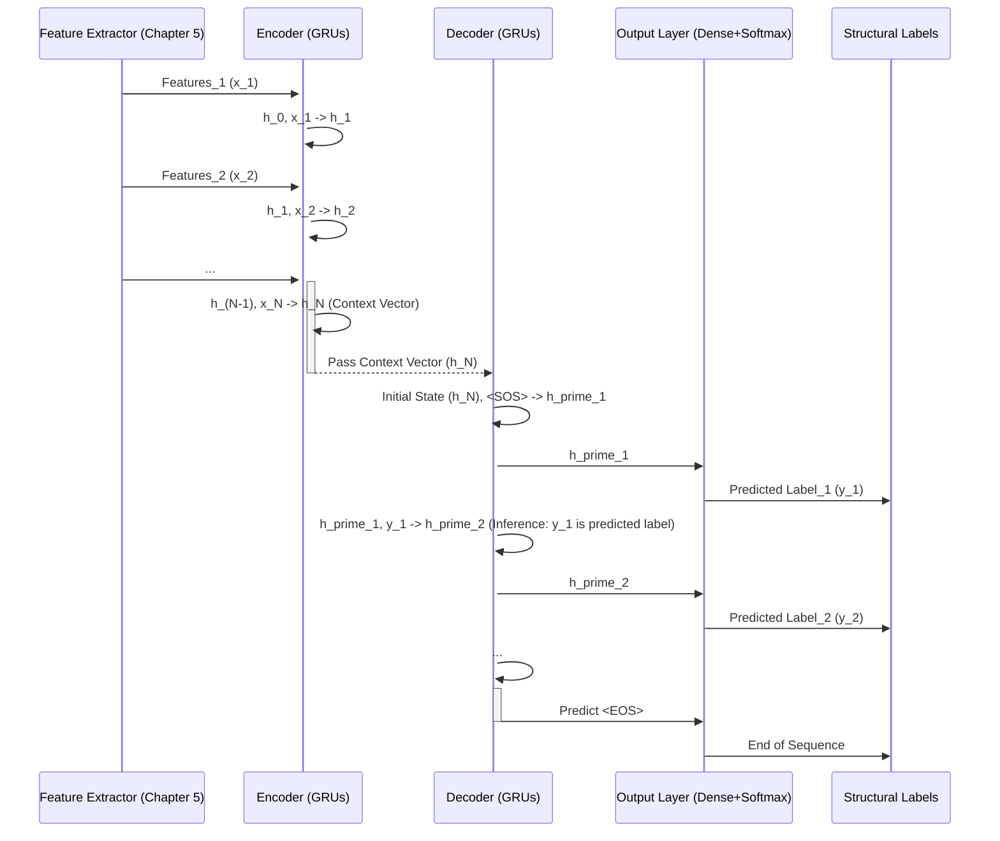

# Chapter 6: Recurrent Neural Networks (RNNs) and Seq2Seq Architecture

In the [previous chapter on designing input features](chapter_05.md), we delved into transforming raw PDF commands into structured, machine-readable features. These features—from geometric properties to semantic embeddings—provide a rich representation of individual PDF elements. However, a crucial challenge remains: how do we process these *sequences* of features to understand the *overall structure* of a document? PDFs are inherently sequential streams of drawing commands, and their logical components (like headings, paragraphs, or figures) are defined by the *relationships* between these sequential elements, not just individual ones. This chapter introduces the powerful neural network architectures specifically designed to tackle this sequential problem: Recurrent Neural Networks (RNNs) and their advanced form, the Sequence-to-Sequence (Seq2Seq) model.

---

### Problem & Motivation

PDF documents, at their core, are ordered streams of instructions that tell a renderer how to place text, lines, and images on a page. While we've extracted detailed features for each *individual* instruction or character, the true meaning—whether a block of text is a title, a paragraph, or part of a list—emerges from its context within the entire sequence. Traditional machine learning models struggle to capture this long-range dependency and the inherent *sequential nature* of content. For example, a single word's position might be identical in a title and a footnote, but its surrounding words and their styles provide the critical clues for classification.

The specific problem this chapter addresses is the need to *understand the sequential context* of PDF elements to accurately recover their logical structure. We need a model that can "read" the stream of features, remember what it has seen previously, and use that memory to make informed decisions about the current element's role and to predict the structure of upcoming elements. For instance, when processing a series of text fragments, the model needs to recognize that a bold, large-font fragment followed by several lines of smaller text constitutes a "Heading" followed by a "Paragraph," rather than just isolated text blocks.

Our concrete use case is to take a sequence of engineered features derived from PDF commands and output a corresponding sequence of structural labels. Imagine a PDF containing a document title, followed by an author's name, then an abstract, and finally several paragraphs. Each of these components is a *sequence* of smaller PDF elements. We want our model to process the input features for these elements and output labels like `[B-TITLE, I-TITLE, E-TITLE, B-AUTHOR, E-AUTHOR, B-ABSTRACT, ..., I-PARAGRAPH, E-PARAGRAPH]`. This requires a model that can map an input sequence to an output sequence, where the length and content of the output depend on the input's sequential properties.

---

### Core Concept Explanation

Recurrent Neural Networks (RNNs) are a class of neural networks specifically designed to process sequential data. Unlike feedforward networks where inputs are processed independently, RNNs have a "memory" that allows information to persist from one step of the sequence to the next. This memory is managed through a hidden state, which is updated at each step, making RNNs ideal for tasks where context from previous inputs is crucial for understanding the current input.

The basic idea of an RNN is that for an input sequence `x_1, x_2, ..., x_T`, it computes a sequence of hidden states `h_1, h_2, ..., h_T` and a sequence of outputs `y_1, y_2, ..., y_T`. At each time step `t`, the current hidden state `h_t` is a function of the current input `x_t` and the previous hidden state `h_{t-1}`. This recurrent connection allows information to flow across time steps, enabling the network to learn long-term dependencies within the sequence.

A significant advancement in RNNs are Gated Recurrent Units (GRUs), which address some of the limitations of vanilla RNNs, such as the vanishing gradient problem, making them more effective at learning long-range dependencies. GRUs achieve this through "gates" – reset and update gates – that control how much of the past information (the previous hidden state) should be passed along and how much of the new information (from the current input) should be incorporated. This selective memory allows GRUs to effectively remember relevant information over long sequences and forget irrelevant information, greatly improving their performance on complex sequential tasks.

The Sequence-to-Sequence (Seq2Seq) architecture builds upon RNNs (often using GRUs or LSTMs) to tackle problems where both the input and output are sequences, and their lengths can vary. A Seq2Seq model consists of two main parts:
1.  **Encoder**: This part takes the input sequence (e.g., features from PDF elements) and processes it step-by-step using an RNN (like GRU). It compresses the entire input sequence into a fixed-size context vector, which effectively summarizes all the information from the input.
2.  **Decoder**: This part takes the context vector generated by the encoder as its initial state and generates the output sequence (e.g., structural labels) step-by-step, also using an RNN (like GRU). At each step, it uses the previous hidden state, the previous output, and the context vector to predict the next element in the output sequence.

Together, the encoder and decoder work like a translator: the encoder "reads" the entire input sentence (PDF features) and understands its meaning, and the decoder "writes" the translated sentence (structural labels) based on that understanding.

---

### Practical Usage Examples

Let's illustrate how we might define and use a GRU-based Seq2Seq model conceptually for our PDF structure recovery task.

First, imagine we have our engineered features for each PDF element as a sequence. Each element could be a line of text, an image, or a drawing command. Our input sequence might look like `[feature_vector_1, feature_vector_2, ..., feature_vector_N]`.

Here's how you might define a simple GRU encoder:

```python
import tensorflow as tf
from tensorflow.keras.models import Model
from tensorflow.keras.layers import Input, GRU, Dense

# Assume FEATURE_DIM is the size of each engineered feature vector
# Assume MAX_SEQUENCE_LENGTH is the maximum number of elements in a PDF page/section

# Encoder Input: A sequence of feature vectors
encoder_inputs = Input(shape=(MAX_SEQUENCE_LENGTH, FEATURE_DIM))

# Encoder GRU layer. return_state=True means it will output its final hidden state
encoder_gru = GRU(units=256, return_state=True)
encoder_outputs, state_h = encoder_gru(encoder_inputs)

# The 'state_h' is our context vector summarizing the input sequence
print(f"Encoder output shape: {encoder_outputs.shape}")
print(f"Context vector shape: {state_h.shape}")
```
*Explanation:* This code snippet sets up the `encoder` part of our Seq2Seq model. It takes an input sequence where each item is a feature vector (`FEATURE_DIM` size) and the sequence itself has a `MAX_SEQUENCE_LENGTH`. The `GRU` layer processes this sequence. Crucially, `return_state=True` ensures that the final hidden state of the GRU (which effectively *summarizes* the entire input sequence) is captured as `state_h`. This `state_h` will be passed to the decoder.

Next, we define the decoder, which uses this context vector to generate the output sequence (our structural labels).

```python
# Decoder Input: A sequence for label generation (initially padding, then predicted labels)
# For training, decoder gets the 'target' sequence shifted
decoder_inputs = Input(shape=(None, 1)) # Placeholder for labels, e.g., one-hot encoded label ID

# Decoder GRU layer, initialized with the encoder's context vector
decoder_gru = GRU(units=256, return_sequences=True, return_state=True)
decoder_outputs, _ = decoder_gru(decoder_inputs, initial_state=state_h)

# Output layer: Predicts a label for each element in the sequence
# Assume NUM_LABELS is the total number of possible structural labels (e.g., B-TITLE, I-PARAGRAPH)
decoder_dense = Dense(NUM_LABELS, activation='softmax')
output_labels = decoder_dense(decoder_outputs)

# The full Seq2Seq model
model = Model([encoder_inputs, decoder_inputs], output_labels)
model.summary()
```
*Explanation:* This part constructs the `decoder`. It takes `decoder_inputs` (which, during training, would be the *actual* target structural labels shifted by one timestep, to help it learn to predict the *next* label). The `decoder_gru` is initialized with `state_h` from the encoder, giving it the context. `return_sequences=True` makes sure it outputs a prediction for *each* step in the output sequence. Finally, a `Dense` layer with `softmax` activation converts the GRU's output into a probability distribution over our `NUM_LABELS`. The `model` combines both encoder and decoder.

This combined model can now be trained with sequences of PDF features as encoder input, and sequences of corresponding structural labels as decoder input (shifted) and target output. During inference (when converting a new PDF), the decoder would predict labels one-by-one, feeding its own prediction as the next input.

---

### Internal Implementation Walkthrough

The internal flow of our GRU-based Seq2Seq architecture for PDF structure recovery follows a clear path:

1.  **Input Feature Stream**: The process begins with the sequence of engineered features, as discussed in [Chapter 5: Designing Input Features for Models](chapter_05.md). Each feature vector represents a low-level PDF element (text fragment, image bounding box, path command, etc.) and contains information like geometric position, size, font properties, and even embedding vectors.

2.  **Encoder Processing (GRUs)**:
    *   The encoder, comprised of one or more GRU layers, takes this sequence of feature vectors as input.
    *   At each time step `t`, the GRU unit receives the feature vector `x_t` and the previous hidden state `h_{t-1}`.
    *   It updates its internal gates (reset and update) to decide what information to keep from `h_{t-1}` and what new information to incorporate from `x_t` to compute the new hidden state `h_t`.
    *   This process continues until the entire input sequence is consumed.
    *   The *final hidden state* of the encoder GRU, often referred to as the *context vector*, `h_N`, encapsulates the learned representation of the entire input sequence. This vector holds the "memory" of the document's sequential flow.

3.  **Context Vector Transfer**: The context vector (`h_N`) is then passed directly as the initial hidden state to the decoder GRU. This is how the decoder "understands" the meaning of the input sequence before it even starts generating the output.

4.  **Decoder Processing (GRUs & Prediction)**:
    *   The decoder, also typically a GRU layer, starts generating the output sequence, which consists of structural labels (e.g., `B-TITLE`, `I-PARAGRAPH`).
    *   At its first step, it takes a special "start-of-sequence" token (or a simple zero vector) as input and its initial hidden state is the context vector `h_N` from the encoder.
    *   It produces a hidden state and an output. The output goes through a `Dense` layer with a `softmax` activation to predict the probability distribution over all possible structural labels for that specific element.
    *   During training, the decoder's next input is usually the *actual* previous target label (teacher forcing). During inference, its next input is the *predicted* previous label, allowing it to generate the sequence autonomously.
    *   This process continues until an "end-of-sequence" token is predicted or a maximum output length is reached.

Here's a simplified sequence diagram illustrating the data flow within the Seq2Seq architecture:


*Explanation:* The diagram shows how the Feature Extractor feeds individual feature vectors into the Encoder. The Encoder iteratively updates its hidden state, eventually producing a final "Context Vector" which summarizes the input. This context is then passed to the Decoder, which uses it to generate the sequence of structural labels, one by one.

---

### System Integration

The Recurrent Neural Networks and the Seq2Seq architecture form the *central processing engine* of our PDF conversion system. They connect seamlessly with both the input preparation and the subsequent evaluation stages of the project:

1.  **Input Integration**: The input to the Seq2Seq model comes directly from the output of the [Designing Input Features for Models](chapter_05.md) process. The feature engineering pipeline (as discussed in Chapter 5) takes the raw, low-level PDF data (from [Direct Processing of Low-Level PDF Data](chapter_04.md)) and transforms it into sequences of numerical feature vectors. These sequences are then fed into the encoder part of our Seq2Seq model. This tight coupling ensures that the model receives a rich, contextualized representation of the PDF content.

2.  **Output Integration**: The output of the Seq2Seq model is a sequence of predicted structural labels, such as `B-HEADING`, `I-PARAGRAPH`, `E-IMAGE`, `O` (outside of any defined structure), etc. This sequence represents the recovered logical structure of the PDF document. This labeled output is then the primary data used in the [Measuring Model Performance and Accuracy](chapter_07.md) chapter. The accuracy of these predicted labels against a ground truth dataset will determine the overall effectiveness of our neural network approach.

**Data Flow Example:**

```mermaid
graph TD
    A[Raw PDF Data] --> B[Direct Processing (Chapter 4)]
    B --> C[Low-Level PDF Elements]
    C --> D[Feature Engineering (Chapter 5)]
    D --> E[Sequence of Engineered Features]
    E --> F{Encoder (GRUs)}
    F -- Context Vector --> G{Decoder (GRUs)}
    G --> H[Sequence of Predicted Structural Labels]
    H --> I[Performance Metrics (Chapter 7)]
```
*Explanation:* Raw PDF data is first processed to extract low-level elements. These elements are then transformed into engineered features, forming a sequence. This sequence feeds into the Encoder, which creates a context vector. The Decoder uses this context to generate a sequence of structural labels. Finally, these predicted labels are used to measure the model's performance.

---

### Best Practices & Tips

1.  **Choose the Right RNN Variant**: While vanilla RNNs are foundational, GRUs (as used here) and LSTMs (Long Short-Term Memory units) are almost always preferred for practical applications due to their ability to handle vanishing/exploding gradients and capture long-term dependencies. For tasks requiring very long sequence memory or higher complexity, LSTMs might offer a slight edge over GRUs, though GRUs are often computationally more efficient.
2.  **Handle Variable Sequence Lengths**: PDF pages or documents can have vastly different numbers of elements. You'll need to pad shorter sequences to a `MAX_SEQUENCE_LENGTH` and use masking layers in your model to prevent the padded values from influencing learning. Conversely, very long documents might need to be chunked or truncated.
3.  **Teacher Forcing During Training**: For Seq2Seq models, *teacher forcing* is a common and effective training technique where the ground truth (actual) output from the previous time step is fed as input to the decoder for the current time step, rather than the decoder's own prediction. This helps stabilize training and accelerates convergence. During inference, however, the model must rely on its own predictions.
4.  **Attention Mechanisms**: For complex Seq2Seq tasks, particularly when input sequences are very long, the single fixed-size context vector can become a bottleneck (losing information). *Attention mechanisms* allow the decoder to "look back" at different parts of the input sequence at each decoding step, giving more weight to relevant encoder outputs. While not explicitly detailed in the example, incorporating attention can significantly boost performance for structure recovery of complex documents.
5.  **Hyperparameter Tuning**: Experiment with the number of GRU layers, the `units` (hidden state size), learning rate, batch size, and dropout regularization. These hyperparameters can significantly impact model performance.
6.  **Gradient Clipping**: RNNs are susceptible to exploding gradients, where gradients grow extremely large during backpropagation, leading to unstable training. Gradient clipping (limiting the magnitude of gradients) is a crucial technique to prevent this.
7.  **Output Label Encoding**: For structural labels, use one-hot encoding for the final `Dense` layer output. If labels have a sequence (e.g., `B-TITLE`, `I-TITLE`), the `categorical_crossentropy` loss function is appropriate. If using a simpler encoding or single labels, adapt your loss function accordingly.

---

### Chapter Conclusion

This chapter has laid the foundation for the core machine learning engine of our PDF conversion project: Recurrent Neural Networks and the Seq2Seq architecture. We've seen how RNNs, particularly GRUs, excel at processing sequential data, making them ideal for understanding the flow of low-level PDF commands. The Seq2Seq model extends this by enabling us to map an input sequence of engineered features to an output sequence of logical structural labels, directly addressing the challenge of document structure recovery. By taking the learned context from the encoder and leveraging it in the decoder, we can effectively "translate" raw PDF data into meaningful, structured components like titles, paragraphs, and images.

With the architecture now defined, the next critical step is to evaluate its effectiveness. The recovered structural labels are only useful if they accurately reflect the true document structure. Therefore, our journey continues in the next chapter, where we will explore various methods and metrics for
[Measuring Model Performance and Accuracy](chapter_07.md).