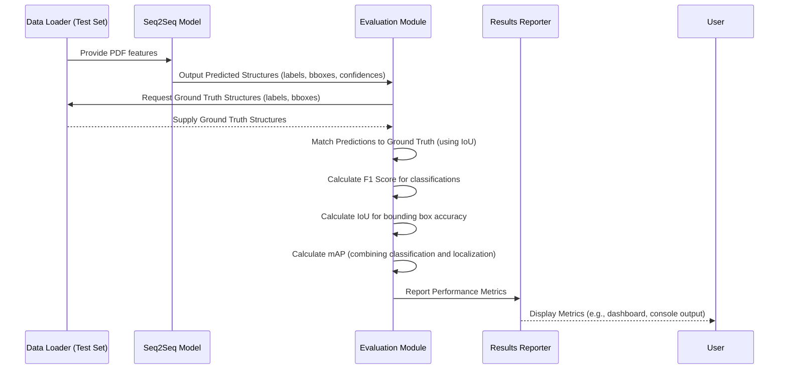

# Chapter 7: Measuring Model Performance and Accuracy

After meticulously designing input features from low-level PDF data in [Designing Input Features for Models](chapter_05.md) and building sophisticated recurrent neural networks with a sequence-to-sequence architecture in [Recurrent Neural Networks (RNNs) and Seq2Seq Architecture](chapter_06.md), the crucial next step is to determine how effective our models actually are. It's not enough to simply train a neural network; we need a robust, objective way to quantify its success in recovering document structure. This chapter delves into the methodologies for measuring model performance and accuracy, providing the essential tools to understand, validate, and improve our PDF conversion system.

---

### **1. Understanding & Adoption Documentation**

#### **Concept Overview**

Measuring model performance and accuracy refers to the process of quantitatively evaluating how well a trained machine learning model performs its intended task. For our "Pdf Conversion Using Neural Networks" project, this means assessing if the neural network can accurately identify and label logical document components (like titles, paragraphs, lists, figures) and correctly locate their boundaries within a PDF. These measurements provide objective insights beyond subjective visual inspection, enabling data-driven decisions about model effectiveness and areas for improvement.

#### **Problem-Solution Fit**

The core problem addressed by this chapter is the need for an **objective and quantifiable assessment** of our document structure recovery model. Without proper metrics, we wouldn't know if our neural network is truly learning to parse PDF structure, or if one model architecture is better than another. This chapter provides the solution by introducing standard performance and accuracy metrics, transforming the qualitative goal of "better structure recovery" into measurable values. By using metrics like F1 score, Intersection Over Union (IoU), and mean Average Precision (mAP), we can precisely evaluate our model's ability to classify structural elements and accurately predict their spatial locations.

#### **Quick Start: Key Metrics at a Glance**

At its core, evaluating our model involves comparing its predictions to a known "ground truth" (correctly labeled document structures). The primary metrics we'll use are:

*   **F1 Score**: Ideal for classification tasks, it's a balanced measure of precision and recall. Useful for checking if our model correctly labels a text block as, say, a "heading" or a "paragraph."
*   **Intersection Over Union (IoU)**: Critical for localization, it measures the spatial overlap between a predicted bounding box and a ground truth bounding box. This tells us *how well* our model locates a detected component.
*   **Mean Average Precision (mAP)**: A comprehensive metric widely used in object detection. It aggregates precision and recall across multiple classes and IoU thresholds, providing an overall picture of detection and localization quality for all structural components.

#### **Architecture Context**

Within the project's overall architecture, the "Measuring Model Performance and Accuracy" component sits at the *evaluation phase* of the machine learning pipeline. Once the [Recurrent Neural Networks (RNNs) and Seq2Seq Architecture](chapter_06.md) has been trained on [Direct Processing of Low-Level PDF Data](chapter_04.md) with [Designing Input Features for Models](chapter_05.md), it produces predictions (e.g., bounding boxes and class labels for document components). These predictions are then fed into the evaluation module, alongside the corresponding ground truth data. This module quantifies the discrepancy between predictions and ground truth, generating the performance metrics that inform further model refinement or deployment.

---

### **2. Implementation & Usage Documentation**

#### **Problem & Motivation: Why Metrics Matter**

Consider a PDF containing a title, several paragraphs, and a table. Our neural network's job is to identify these components and their locations. If we simply look at the output, we might see some correctly identified elements, but how do we know if it's "good enough"? Is it more important to find *all* titles (even if some aren't actually titles), or to be absolutely sure that anything we label as a title *is* indeed a title? This trade-off, and the need for precision in localization, highlights the limitations of subjective assessment.

The real-world problem is that ambiguity in document structure recovery leads to poor downstream applications. For instance, if our model mislabels a paragraph as a heading, an automated summarizer might prioritize the wrong content. If it draws inaccurate bounding boxes around tables, data extraction tools will fail. This is why objective, quantitative metrics are not just good practice; they are *critical* for validating that our neural network truly solves [The Goal: Document Structure Recovery](chapter_02.md). They provide the concrete evidence needed to confidently claim our neural network approach to [Using Neural Networks for PDF Conversion](chapter_03.md) is effective.

#### **Core Concept Explanation: The Language of Evaluation**

To objectively assess our model, we rely on established metrics that break down performance into interpretable components.

**F1 Score: Balancing Precision and Recall**
The F1 score is a single metric that represents the harmonic mean of Precision and Recall.
*   **Precision** answers: "Of all the items the model *predicted* as positive (e.g., a 'heading'), how many were *actually* positive?" High precision means fewer false positives.
*   **Recall** answers: "Of all the items that were *actually* positive, how many did the model *correctly identify*?" High recall means fewer false negatives.
The F1 score is especially useful when dealing with imbalanced datasets (e.g., many paragraphs, but few titles), as it penalizes models that favor one over the other.

**Intersection Over Union (IoU): The Overlap Metric**
IoU is a spatial metric, primarily used for object detection and segmentation tasks. It quantifies the overlap between a predicted bounding box (or segmentation mask) and its corresponding ground truth bounding box. The formula is simply the area of the intersection divided by the area of the union of the two boxes. A higher IoU value (closer to 1) indicates a better spatial match. For example, if our model predicts a bounding box around a paragraph, IoU tells us how accurately that box encloses the *actual* paragraph.

**Mean Average Precision (mAP): The Comprehensive Detector Metric**
mAP is a standard metric for evaluating object detection models, which aligns perfectly with our task of detecting and classifying structural components. It combines aspects of precision, recall, and localization (through IoU). For each class (e.g., 'title', 'paragraph'), Average Precision (AP) is calculated by plotting the precision-recall curve and finding the area under it. The mAP is then the average of these AP values across all classes. It considers a detection "correct" only if its predicted class is right *and* its IoU with a ground truth box exceeds a certain threshold (e.g., 0.5). This provides a holistic measure of the model's ability to both classify and accurately locate multiple types of objects.

#### **Practical Usage Examples: Putting Metrics to Work**

Let's look at how we might calculate these metrics in a simplified Python context.

##### **Example 1: Calculating F1 Score for Classification**

Suppose our model predicts whether each line of text is a 'paragraph' (1) or 'other' (0).

```python
from sklearn.metrics import f1_score

# Ground truth labels (what they actually are)
true_labels = [1, 1, 0, 1, 0, 0, 1]
# Model predictions
predicted_labels = [1, 0, 0, 1, 1, 0, 1]

f1 = f1_score(true_labels, predicted_labels)
print(f"F1 Score: {f1:.2f}")
# Expected Output: F1 Score: 0.75
```
This snippet uses scikit-learn to calculate the F1 score. A score of 0.75 indicates a reasonable balance between correctly identifying paragraphs (recall) and avoiding mislabeling non-paragraphs as paragraphs (precision).

##### **Example 2: Calculating Intersection Over Union (IoU)**

Let's define a simple function to calculate IoU for two bounding boxes, represented as `[x1, y1, x2, y2]`.

```python
def calculate_iou(boxA, boxB):
    # Determine the coordinates of the intersection rectangle
    xA = max(boxA[0], boxB[0])
    yA = max(boxA[1], boxB[1])
    xB = min(boxA[2], boxB[2])
    yB = min(boxA[3], boxB[3])

    # Compute the area of intersection
    interArea = max(0, xB - xA) * max(0, yB - yA)

    # Compute the area of both prediction and ground-truth boxes
    boxAArea = (boxA[2] - boxA[0]) * (boxA[3] - boxA[1])
    boxBArea = (boxB[2] - boxB[0]) * (boxB[3] - boxB[1])

    # Compute the intersection over union
    iou = interArea / float(boxAArea + boxBArea - interArea)
    return iou

# Example bounding boxes: [x_min, y_min, x_max, y_max]
ground_truth_box = [10, 10, 50, 50]
predicted_box = [15, 15, 55, 55]

iou_val = calculate_iou(ground_truth_box, predicted_box)
print(f"IoU: {iou_val:.2f}")
# Expected Output: IoU: 0.64
```
Here, an IoU of 0.64 means there's a 64% overlap between the predicted and actual box. Typically, an IoU of 0.5 or higher is considered a correct detection.

##### **Example 3: Conceptualizing Mean Average Precision (mAP)**

Calculating mAP is more involved as it aggregates results across multiple classes and IoU thresholds. Instead of a full code block, let's illustrate the *idea* for a single class (Average Precision, AP).

Imagine our model predicts several "heading" components. We would:
1.  Sort predictions by confidence score.
2.  Iterate through predictions, marking each as a True Positive (TP) if it matches a ground truth (with IoU > threshold) or False Positive (FP) otherwise.
3.  Calculate Precision and Recall at each step.
4.  Plot Precision vs. Recall and compute the area under this curve to get AP for "heading".
5.  Repeat for all other classes (e.g., "paragraph", "table") and average their APs to get mAP.

#### **Internal Implementation Walkthrough: Evaluation Pipeline**

The evaluation process typically follows these steps:

1.  **Prediction Generation**: The trained Seq2Seq model processes the input features derived from low-level PDF data and outputs sequences of predicted labels and bounding boxes for each detected structural component.
2.  **Data Alignment**: For each PDF document in the test set, the model's predictions must be aligned with the corresponding ground truth annotations. This involves matching predicted components to ground truth components.
3.  **Metric Calculation**:
    *   For **classification labels** (e.g., 'title', 'paragraph'), F1 scores are computed.
    *   For **bounding boxes**, IoU is calculated for each matched pair.
    *   For **object detection** as a whole, mAP is computed by considering correct classifications and sufficient IoU overlap (e.g., IoU > 0.5).
4.  **Aggregation**: Individual document scores are aggregated to provide overall dataset-level metrics.

Let's visualize this flow:


This diagram illustrates how the `Evaluation Module` orchestrates the comparison of model predictions against the ground truth to produce the final performance metrics. This typically happens in a script like `evaluate_model.py`.

#### **API & Interface Reference**

While the project utilizes its own custom logic for specific data handling, the core metric calculations often leverage well-established libraries.

*   **F1 Score**: Typically accessed via `sklearn.metrics.f1_score`.
    *   `f1_score(y_true, y_pred, average='weighted')`: Calculates F1 score, with `average='weighted'` suitable for multi-class imbalanced datasets.
*   **IoU**: Often implemented as a utility function within the project (like `calculate_iou` above) or found in computer vision libraries (e.g., `torchvision.ops.box_iou`).
    *   `calculate_iou(box1, box2)`: Returns a float representing the overlap.
*   **mAP**: Complex to implement from scratch, usually handled by frameworks or dedicated evaluation libraries (e.g., `pycocotools` for COCO dataset metrics, or custom implementations for document understanding benchmarks).
    *   A typical interface might be: `evaluate_map(ground_truth_annotations, predicted_detections, iou_thresholds=[0.5, 0.75])`.

#### **Configuration & Usage Patterns**

*   **Choosing Metrics**:
    *   If your primary concern is text block classification (e.g., "is this a paragraph or a heading?"), **F1 Score** is paramount.
    *   If accurate spatial location is key (e.g., "does the bounding box precisely enclose the title?"), **IoU** is essential.
    *   For a holistic evaluation of the entire document structure recovery, which involves both classification and localization of multiple component types, **mAP** is the go-to metric.
*   **IoU Thresholds**: For mAP and often for individual IoU checks, a threshold (e.g., 0.5) is critical. A predicted box is considered a match only if its IoU with a ground truth box exceeds this threshold. Using `mAP@0.5` means the AP is calculated considering only detections with IoU >= 0.5.
*   **Evaluation Frequency**: Metrics are typically calculated at the end of each training epoch on a validation set to track progress, and finally on a separate, unseen test set for the final reported performance.

#### **Integration Examples: Model Evaluation Workflow**

After training our `Seq2Seq` model (let's assume it's `trained_model` in `model.py`), the evaluation might look something like this in `evaluate_script.py`:

```python
# evaluate_script.py (simplified)
import torch
from data_loader import get_test_dataloader # from chapter_04 context
from model import Seq2SeqModel # from chapter_06 context
from metrics_utils import calculate_iou, calculate_f1_score # custom utils

# Load the trained model
model = Seq2SeqModel(...)
model.load_state_dict(torch.load('trained_seq2seq_model.pth'))
model.eval() # Set model to evaluation mode

test_loader = get_test_dataloader()
all_true_labels = []
all_predicted_labels = []
all_iou_scores = []

with torch.no_grad(): # No gradient calculations during evaluation
    for batch_features, batch_true_structures in test_loader:
        predictions = model(batch_features) # Model outputs (labels, bboxes)

        # Simplified processing for metrics
        for pred_struct, true_struct in zip(predictions, batch_true_structures):
            # Assuming pred_struct and true_struct contain lists of (label, bbox)
            # This part needs careful matching logic for complex structures
            
            # Example for F1 (simplified, actual logic handles multiple labels per doc)
            all_true_labels.extend([s.label for s in true_struct])
            all_predicted_labels.extend([s.predicted_label for s in pred_struct])
            
            # Example for IoU (simplified, assumes one-to-one match for demonstration)
            if pred_struct and true_struct: # check if lists are not empty
                iou_val = calculate_iou(pred_struct[0].bbox, true_struct[0].bbox)
                all_iou_scores.append(iou_val)

# Calculate overall metrics
overall_f1 = calculate_f1_score(all_true_labels, all_predicted_labels)
avg_iou = sum(all_iou_scores) / len(all_iou_scores) if all_iou_scores else 0

print(f"Overall F1 Score: {overall_f1:.2f}")
print(f"Average IoU: {avg_iou:.2f}")

# mAP calculation would be more complex, involving matching with IoU thresholds
# and per-class precision-recall curve computation.
```
This script demonstrates the general flow: load data, get model predictions, and then feed those into the metric calculation functions. The `metrics_utils.py` would contain functions like `calculate_iou` and `calculate_f1_score`, and potentially more complex functions for mAP.

---

### **3. Development & Best Practices**

#### **Best Practices**

*   **Separate Test Set**: Always evaluate your final model on a completely unseen test set. Do not use the validation set for final reporting as you might have indirectly optimized for it during hyperparameter tuning.
*   **Contextual Metrics**: While standard metrics are great, consider if your project requires domain-specific evaluations. For document structure, this might include metrics for reading order accuracy or consistency across pages.
*   **Visualizing Errors**: Don't just look at numbers. Visualize false positives (model detected something that wasn't there) and false negatives (model missed something that was there). This provides crucial qualitative insight into model weaknesses.
*   **Threshold Selection**: The IoU threshold for considering a detection "correct" is a hyperparameter. Experiment with different thresholds (e.g., 0.5, 0.75) to understand your model's robustness. Reporting mAP@[0.5:0.95] (average mAP over various IoU thresholds) is a common, robust practice.
*   **Baseline Comparison**: Always compare your neural network's performance against simpler rule-based systems or existing parsers. This helps justify the complexity of the neural network approach.

#### **Advanced Usage: Beyond Basic Metrics**

*   **Per-Class Metrics**: In addition to overall mAP, look at AP for individual classes. A low AP for 'table' might indicate issues with table detection, while a high AP for 'paragraph' is good news.
*   **Metric Logging and Tracking**: Integrate with tools like MLflow, Weights & Biases, or TensorBoard to log and visualize metrics over training epochs, allowing for easy comparison of different model runs and architectures.
*   **Handling Ambiguity**: Document structure can sometimes be ambiguous (e.g., "is this a caption or part of the image?"). Consider allowing for multiple valid ground truth annotations or developing fuzzy matching metrics.
*   **Performance vs. Inference Speed**: While accuracy is key, for production systems, the speed at which your model can process PDFs is also crucial. Consider metrics like inferences per second or latency.

#### **Troubleshooting: Common Issues and Solutions**

*   **Low F1 Score (especially for rare classes)**:
    *   *Issue*: Imbalanced dataset where rare classes are underrepresented.
    *   *Solution*: Use data augmentation, adjust class weights during training, or employ techniques like Focal Loss.
*   **Low IoU Scores**:
    *   *Issue*: Poor bounding box regression by the model.
    *   *Solution*: Re-evaluate feature engineering (Chapter 5), especially geometric features. Experiment with different loss functions for bounding box regression (e.g., IoU loss, GIoU loss). Increase regularization to prevent overfitting to specific bounding box patterns.
*   **High False Positives / False Negatives**:
    *   *Issue*: Model is either too aggressive (many FPs) or too conservative (many FNs).
    *   *Solution*: Adjust the confidence threshold for detections. A higher threshold reduces FPs but may increase FNs. Retrain with more diverse data or experiment with model capacity.
*   **Metrics Fluctuate Wildly**:
    *   *Issue*: Unstable training, small validation set, or inconsistent data processing.
    *   *Solution*: Increase validation set size, ensure data preprocessing is consistent, check learning rate schedules, and add more regularization.

#### **Related Concepts**

The quality of our model's performance is intrinsically linked to earlier stages of the project:

*   **[Designing Input Features for Models](chapter_05.md)**: Well-engineered features directly enable the model to make accurate predictions, which then translate to better metrics. Poor features lead to poor performance.
*   **[Recurrent Neural Networks (RNNs) and Seq2Seq Architecture](chapter_06.md)**: The architecture itself dictates the model's capacity to learn complex patterns. Different RNN variants (LSTMs, GRUs) or attention mechanisms can significantly impact accuracy, which is then measured by these metrics.
*   **Data Annotation Quality**: The ground truth data used for training and evaluation is paramount. Errors in manual annotations will directly skew performance metrics, potentially leading to misleading conclusions.

---

### **Chapter Conclusion**

This chapter has provided a comprehensive overview of how to quantitatively assess the performance and accuracy of our "Pdf Conversion Using Neural Networks" project. We've explored critical metrics like the F1 score for classification, Intersection Over Union (IoU) for localization, and mean Average Precision (mAP) for a holistic evaluation of object detection. Understanding these metrics is not merely an academic exercise; it is fundamental to validating our approach, iterating on model designs, and ultimately ensuring that our neural network effectively addresses [The Challenge of PDF Document Structure](chapter_01.md) and achieves [The Goal: Document Structure Recovery](chapter_02.md).

By applying these evaluation methodologies, we gain objective insights into the strengths and weaknesses of our models. This allows us to make informed decisions, drive continuous improvement, and build a robust, reliable system for converting low-level PDF data into a structured, usable format. With a clear understanding of both how to build these sophisticated models and how to rigorously evaluate them, the project culminates in a complete and validated solution for neural network-based PDF structure recovery.