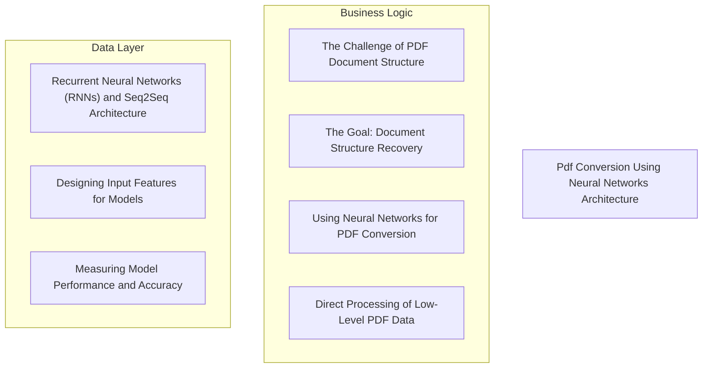
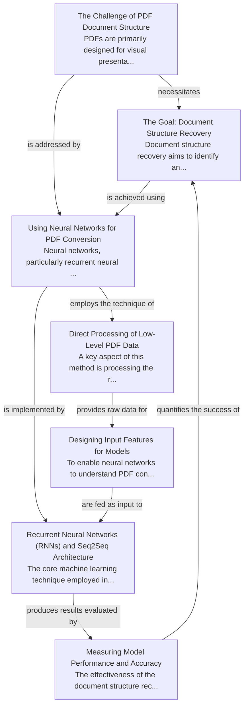

# Pdf Conversion Using Neural Networks Tutorial

Welcome to the comprehensive tutorial for Pdf Conversion Using Neural Networks. This tutorial is automatically generated from the codebase to help you understand the core concepts and implementation patterns.

## Project Overview

The project addresses the inherent structural limitations of PDF documents by employing recurrent neural networks for document structure recovery. This process involves directly converting low-level PDF data into engineered features, which are then processed by a sequence-to-sequence model to identify logical content components. The effectiveness of this neural network-based approach is quantitatively assessed using standard performance and accuracy metrics.

## System Architecture

## Component Relationships

## Table of Contents

1. [Chapter 1: The Challenge of PDF Document Structure](chapter_01.md) - Comprehensive documentation for The Challenge of PDF Document Structure following structured methodo...
2. [Chapter 2: The Goal: Document Structure Recovery](chapter_02.md) - Comprehensive documentation for The Goal: Document Structure Recovery following structured methodolo...
3. [Chapter 3: Using Neural Networks for PDF Conversion](chapter_03.md) - Comprehensive documentation for Using Neural Networks for PDF Conversion following structured method...
4. [Chapter 4: Direct Processing of Low-Level PDF Data](chapter_04.md) - Comprehensive documentation for Direct Processing of Low-Level PDF Data following structured methodo...
5. [Chapter 5: Designing Input Features for Models](chapter_05.md) - Comprehensive documentation for Designing Input Features for Models following structured methodology...
6. [Chapter 6: Recurrent Neural Networks (RNNs) and Seq2Seq Architecture](chapter_06.md) - Comprehensive documentation for Recurrent Neural Networks (RNNs) and Seq2Seq Architecture following ...
7. [Chapter 7: Measuring Model Performance and Accuracy](chapter_07.md) - Comprehensive documentation for Measuring Model Performance and Accuracy following structured method...

## How to Use This Tutorial

1. **Start with Chapter 1** to understand the foundational concepts
2. **Follow the sequence** - each chapter builds upon previous concepts
3. **Practice with code examples** - every chapter includes practical examples
4. **Refer to diagrams** - use architecture diagrams for visual understanding
5. **Cross-reference concepts** - chapters link to related topics

## Tutorial Features

- **Progressive Learning**: Concepts are introduced in logical order
- **Code Examples**: Every chapter includes practical, executable code
- **Visual Diagrams**: Mermaid diagrams illustrate complex relationships
- **Cross-References**: Easy navigation between related concepts
- **Beginner-Friendly**: Written for newcomers to the codebase

## Contributing

This tutorial is auto-generated from the codebase. To improve it:
1. Update the source code documentation
2. Add more detailed comments to key functions
3. Regenerate the tutorial using the documentation system

---

*Generated using AI-powered codebase analysis*
