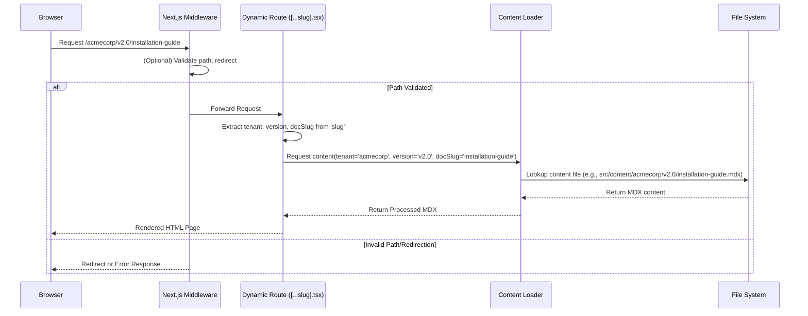

# Chapter 1: Multi-Tenant Document Routing

---

## Problem & Motivation

Imagine building a documentation platform that needs to serve content for multiple products, each potentially having different versions, all from a single codebase. A traditional approach might involve creating separate deployments or complex subdomains for each product and version. This quickly becomes a maintenance nightmare, making it difficult to manage updates, share components, and ensure consistency across your documentation ecosystem.

The core problem this project addresses is the need for a *flexible and scalable way to dynamically serve versioned documentation for multiple tenants* from a unified platform. Without intelligent routing, a request for "Acme Corp's documentation for version 2.0 on getting started" (`/acmecorp/v2.0/getting-started`) would either fail or require hardcoding every possible path. This leads to rigid systems that are hard to adapt as new tenants are added or versions evolve.

Our Multi-Tenant Document Routing abstraction solves this by intelligently parsing incoming URL paths. For example, when a user accesses `/tenant-name/v1.0/introduction`, the system needs to precisely identify `tenant-name` as the tenant, `v1.0` as the documentation version, and `introduction` as the specific document slug. This information is crucial for fetching the correct content, applying tenant-specific theming, and ensuring a seamless user experience.

---

## Core Concept Explanation

Multi-Tenant Document Routing is the *brain* behind how our platform understands what documentation to display based on the URL. At its heart, it's about mapping a structured URL path—like `/tenant-identifier/version-number/document-slug`—to the actual content file (e.g., an MDX file) residing within our file system. This process is dynamic, meaning we don't pre-define every possible route; instead, the system *infers* the context from the URL itself.

This abstraction primarily leverages Next.js's powerful **dynamic routing** capabilities. Next.js allows us to define routes that can capture variable parts of a URL using square brackets, such as `[...slug].tsx`. This `[...slug]` catches all segments of a path after a base, enabling us to extract tenant, version, and document information. Complementing this, **middleware** plays a vital role by intercepting requests *before* they hit a page component, allowing us to perform initial path validation, redirection, or context injection.

Think of it like a smart postal service for your documentation. When a letter (a browser request) arrives with an address like "Acme Corp, Version 2.0, Getting Started Guide," our routing system (the postal worker) doesn't need to know every single address in the world. Instead, it understands the *structure* of the address: "First part is the Company, second is the Edition, third is the specific Document." It then uses this understanding to direct the letter to the correct content "mailbox." This intelligent parsing is fundamental to building a scalable and maintainable multi-tenant documentation platform.

---

## Practical Usage Examples

Let's see how our routing abstraction handles a typical request. Our goal is to translate a URL like `/my-tenant/v1.0/getting-started` into renderable content.

First, we define a dynamic catch-all route in Next.js. This file will be responsible for rendering all tenant/version/document paths.

```typescript jsx
// src/pages/[...slug].tsx
import { useRouter } from 'next/router';
import React from 'react';
import DocumentViewer from '../components/DocumentViewer'; // Assume this component exists

export default function DocumentPage() {
  const router = useRouter();
  const { slug } = router.query; // slug will be an array like ['my-tenant', 'v1.0', 'getting-started']

  if (!slug || slug.length < 3) {
    // Handle invalid paths, e.g., redirect to 404
    return <div>Loading or Invalid Path...</div>;
  }

  const [tenant, version, ...documentPath] = slug;
  const docSlug = documentPath.join('/'); // Reconstruct the full document path

  // In a real app, DocumentViewer would fetch content based on tenant, version, docSlug
  return (
    <DocumentViewer
      tenantId={tenant as string}
      versionId={version as string}
      documentSlug={docSlug}
    />
  );
}
```
*Explanation:* This Next.js page component (`[...slug].tsx`) catches any path that doesn't match a more specific route. `router.query.slug` will be an array containing the segments of the URL. We then extract the `tenant`, `version`, and `documentSlug` from this array, passing them to a `DocumentViewer` component which will handle content fetching and rendering.

Next, a basic middleware setup helps in pre-processing the request or handling early redirects.

```typescript
// middleware.ts
import { NextResponse } from 'next/server';
import type { NextRequest } from 'next/server';

export function middleware(request: NextRequest) {
  const { pathname } = request.nextUrl;

  // Example: Redirect root path to a default tenant/version
  if (pathname === '/') {
    return NextResponse.redirect(new URL('/default-tenant/v1.0/introduction', request.url));
  }

  // Example: Block specific paths or validate tenant existence (simplified)
  if (pathname.startsWith('/admin')) {
    // You could check for authentication here
    // return NextResponse.redirect(new URL('/login', request.url));
  }

  return NextResponse.next();
}

export const config = {
  matcher: ['/', '/:tenant/:version/:path*'], // Apply middleware to these paths
};
```
*Explanation:* The `middleware.ts` file runs before a request is processed by a page. Here, we've shown an example of redirecting the root path to a default landing page. The `matcher` config specifies which routes this middleware should apply to, including our multi-tenant document paths. This provides an early opportunity to shape the request or enforce policies.

---

## Internal Implementation Walkthrough

The Multi-Tenant Document Routing works through a coordinated effort between Next.js's file-based routing and custom logic to parse the URL segments.

Here's a step-by-step breakdown of what happens when a user navigates to `/acmecorp/v2.0/installation-guide`:

1.  **Request Interception (Middleware):**
    *   The browser sends a request to `/acmecorp/v2.0/installation-guide`.
    *   The `middleware.ts` file (if configured to match this path) is executed. It can perform checks (e.g., tenant validation, authentication, initial redirects) before the request reaches a page. For instance, it might check if `acmecorp` is a valid tenant.

2.  **Dynamic Route Matching:**
    *   Next.js's routing system identifies that `/acmecorp/v2.0/installation-guide` matches the `src/pages/[...slug].tsx` (or `src/app/[...slug]/page.tsx`) dynamic route.
    *   The entire path segment after `pages/` (or `app/`) is captured into the `slug` parameter. In our example, `slug` becomes `['acmecorp', 'v2.0', 'installation-guide']`.

3.  **Context Extraction in Page Component:**
    *   Inside `src/pages/[...slug].tsx`, the `useRouter()` hook provides access to `router.query.slug`.
    *   Our component then destructures this array:
        ```javascript
        const [tenant, version, ...documentPath] = slug;
        const docSlug = documentPath.join('/'); // Handles multi-segment slugs like 'getting-started/setup'
        ```
    *   Now, we have `tenant = 'acmecorp'`, `version = 'v2.0'`, and `docSlug = 'installation-guide'`.

4.  **Content Loading Initiation:**
    *   These extracted parameters (`tenant`, `version`, `docSlug`) are then passed down to a content loading mechanism (e.g., a `DocumentViewer` component or `getStaticProps` function).
    *   This content loader (which will be detailed in [Documentation Source Loader](chapter_03.md)) uses these parameters to locate the corresponding MDX file within our structured content directory (e.g., `src/content/tenants/acmecorp/v2.0/installation-guide.mdx`).

5.  **Content Rendering:**
    *   Once the MDX content is loaded and processed, it's rendered by the React component, potentially with interactive components and tenant-specific styling.

Here's a simplified sequence diagram illustrating the flow:



*Explanation:* This diagram shows how a user's request is first handled by the Next.js middleware, then passed to the dynamic route component. The component extracts routing parameters and passes them to a content loader, which in turn fetches the relevant MDX file from the file system. Finally, the processed content is returned and rendered in the browser.

---

## System Integration

The Multi-Tenant Document Routing abstraction is the gateway to our entire documentation platform. It directly integrates with several other core abstractions:

*   **Documentation Content Structure**: The routing logic relies heavily on a predictable content file system structure. For instance, if a request comes in for `/tenant/version/doc-slug`, the system expects to find the content at a path like `src/content/tenant/version/doc-slug.mdx`. This tight coupling ensures that the routing can accurately locate the desired documentation. You can learn more about this in [Documentation Content Structure](chapter_02.md).

*   **Documentation Source Loader**: Once the router has identified the `tenant`, `version`, and `documentSlug`, it hands off these parameters to the [Documentation Source Loader](chapter_03.md). This loader is responsible for reading the actual MDX file from the file system, parsing it, and preparing it for rendering. The routing mechanism acts as the "address finder," and the loader acts as the "content retriever."

*   **Interactive MDX Components**: The content retrieved by the loader, after being routed, often contains custom React components embedded within MDX files. The routing ensures that when an MDX file is processed and rendered, these [Interactive MDX Components](chapter_05.md) are correctly hydrated and displayed, providing rich, interactive experiences tailored to the specific documentation page.

*   **System Data APIs**: While not directly involved in the initial routing path, the extracted tenant and version information can be used to scope calls to [System Data APIs](chapter_04.md). For example, a search API might receive the `tenant` and `version` as parameters to return search results relevant *only* to that specific documentation context.

The flow of information is linear: Routing identifies the context -> Content Structure defines where to look -> Source Loader fetches -> Interactive Components enhance -> APIs provide dynamic data.

---

## Best Practices & Tips

*   **Consistency is Key**: Ensure your content directory structure (`src/content/{tenant}/{version}/{doc}.mdx`) strictly mirrors the URL structure you intend to expose. Any deviation will lead to broken links or content not being found.
*   **Handle Invalid Routes Gracefully**: Always include logic in your `[...slug].tsx` component and/or middleware to catch incomplete or invalid paths (e.g., `/my-tenant` without a version or document). This could involve redirects to a default version, a 404 page, or an error message.
    ```typescript jsx
    // src/pages/[...slug].tsx (excerpt)
    if (!slug || slug.length < 3) {
      // Redirect to a default landing page or 404
      // router.replace('/404');
      return <div>Please specify a tenant, version, and document.</div>;
    }
    ```
*   **Middleware for Early Exits**: Use `middleware.ts` for operations that should happen *before* a page component renders. This is ideal for authentication checks, A/B testing, locale detection, or mass redirects, saving computation on the page component level.
*   **Define Clear URL Patterns**: Communicate your URL structure (`/:tenant/:version/:doc-slug`) clearly to content creators and system users. This helps in predicting paths and organizing content effectively.
*   **Performance Considerations**: While dynamic routing is powerful, excessive computation in `getStaticProps` (if using Static Site Generation) or `getServerSideProps` (for Server-Side Rendering) for every possible path can impact build times or server load. Consider strategies like on-demand ISR (Incremental Static Regeneration) for less frequently updated content or efficient caching.
*   **SEO-Friendly URLs**: The clear `/:tenant/:version/:doc-slug` structure is generally good for SEO, as it provides clear context to search engines. Avoid overly complex or query-string-heavy URLs for core documentation.
*   **Security**: If tenant identifiers or versions could potentially be used for malicious path traversals (e.g., `../private`), ensure your content loader rigorously sanitizes and validates these parameters before constructing file paths.

---

## Chapter Conclusion

In this chapter, we've explored the fundamental concept of Multi-Tenant Document Routing, the cornerstone of our dynamic documentation platform. We've understood how it solves the problem of serving diverse, versioned content from a single codebase by intelligently parsing URLs using Next.js's dynamic routing and middleware. From practical code examples to a detailed internal walkthrough, we've seen how requests are translated into specific tenant, version, and document contexts. This routing mechanism acts as the critical entry point, seamlessly integrating with our content structure, loader, and interactive components.

By mastering this routing strategy, we lay the groundwork for a highly scalable and maintainable documentation system. As we move forward, the information extracted by this routing layer will be crucial for the next step: understanding how our documentation content is physically organized and accessed.

Let's proceed to the next chapter to dive into how we structure our content to support this dynamic routing:

[Documentation Content Structure](chapter_02.md)