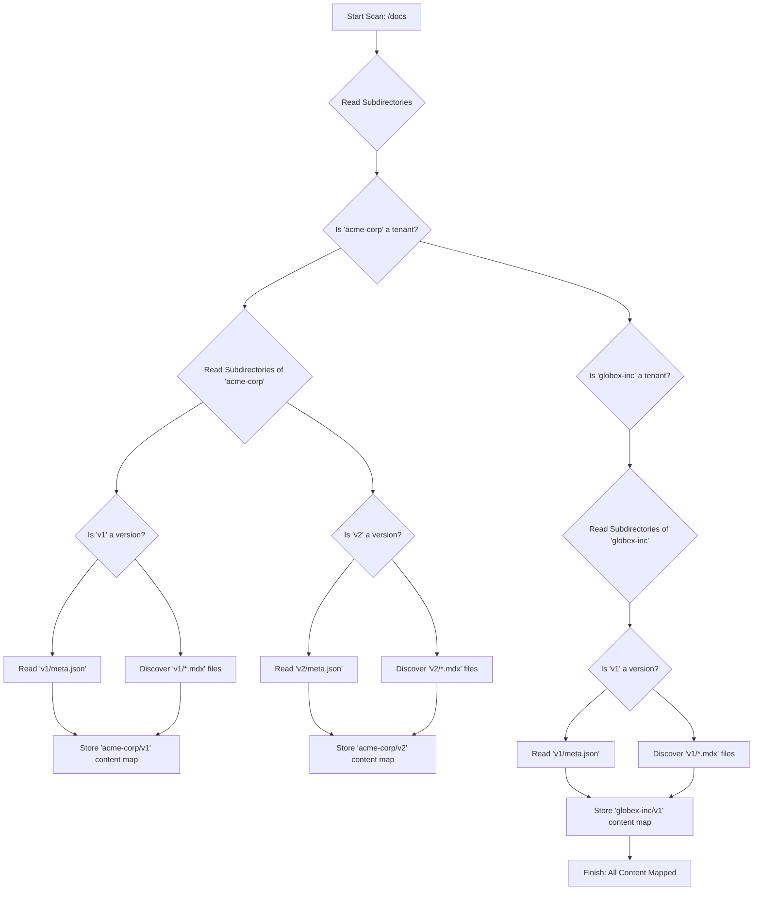

# Chapter 2: Documentation Content Structure

In the previous chapter, we explored [Multi-Tenant Document Routing](chapter_01.md), understanding how our application dynamically maps incoming URLs to the correct tenant, version, and document. While routing dictates *where* to look, this chapter delves into *what* to look for and *how* it's organized. It defines the bedrock on which all documentation content rests, ensuring our dynamic routing can consistently find and serve the right information.

---

### Problem & Motivation

Imagine a sprawling documentation system serving multiple products or clients, each with several active versions of their documentation. Without a clear, consistent organization strategy, managing these diverse content sets would quickly descend into chaos. A `multi-tenant-docs` platform specifically needs to address challenges like: how to easily add a new tenant's documentation, how to introduce a new version without affecting old ones, and how to maintain consistent navigation across different content sets.

The core problem this chapter addresses is the need for a **scalable, predictable, and maintainable file system structure** that can house content for an arbitrary number of tenants and versions. For instance, if 'Acme Corp' needs a 'v1' and 'v2' of their product docs, and 'Globex Inc.' needs a 'v1', how do we structure the files such that a router can reliably find `/acme-corp/v2/getting-started` or `/globex-inc/v1/api-reference`? Without such a structure, content management becomes a significant bottleneck, impacting development speed and content accuracy.

---

### Core Concept Explanation

The **Documentation Content Structure** defines a rigid yet flexible hierarchical file system layout. This structure is the backbone for content discovery, enabling the platform to support multi-tenancy and versioning effortlessly. At its heart, the methodology is a straightforward nesting of directories:

1.  **Tenant Root**: Each top-level directory represents a unique tenant (e.g., `acme-corp`, `globex-inc`). This clearly segregates documentation per client or product.
2.  **Version Subdirectory**: Inside each tenant directory, subdirectories correspond to different documentation versions (e.g., `v1`, `v2`, `main`). This allows tenants to maintain multiple active versions simultaneously, ensuring changes to one don't impact others.
3.  **Document Files**: Within each version directory, actual documentation content resides as `.mdx` files. MDX, a powerful superset of Markdown, allows embedding interactive React components directly within your static content, offering a rich and dynamic documentation experience.
4.  **Metadata File**: Crucially, each version directory also contains a `meta.json` file. This file acts as a manifest for the documentation within that version, defining the navigation structure (sidebar links, order, titles), and other version-specific settings. It's the key to dynamically generating user-friendly navigation.

This hierarchical approach simplifies content management and enables modularity. Adding a new tenant or a new version is as simple as creating a new directory and populating it with MDX files and a `meta.json`. The consistency of this structure is paramount for automated content processing by subsequent system components.

---

### Practical Usage Examples

Let's illustrate this structure with an example. Suppose we have `acme-corp` with `v1` and `v2` documentation, and `globex-inc` with `v1`.

#### Example 1: File System Layout

Here's how the content directory (`docs` in this case) would look:

```
docs/
├── acme-corp/
│   ├── v1/
│   │   ├── index.mdx
│   │   ├── getting-started.mdx
│   │   ├── api-reference.mdx
│   │   └── meta.json
│   └── v2/
│       ├── index.mdx
│       ├── new-feature.mdx
│       ├── api-reference.mdx
│       └── meta.json
└── globex-inc/
    └── v1/
        ├── index.mdx
        ├── overview.mdx
        └── meta.json
```
This tree structure visually demonstrates the clear separation by tenant and version. Each `.mdx` file is a distinct document.

#### Example 2: `meta.json` for Navigation

The `meta.json` file within each version directory defines the sidebar navigation and document titles.

```json
// docs/acme-corp/v2/meta.json
{
  "index": "Introduction to v2",
  "getting-started": "Getting Started with v2",
  "new-feature": "Exciting New Feature",
  "api-reference": {
    "title": "API Reference",
    "theme": {
      "toc": false,
      "collapsed": true
    }
  }
}
```
This `meta.json` specifies the display titles for `index.mdx`, `getting-started.mdx`, `new-feature.mdx`, and `api-reference.mdx`. It also shows how to customize presentation (e.g., `collapsed` for `API Reference`).

#### Example 3: Simple MDX Content

An `.mdx` file combines Markdown with React components.

```mdx
// docs/acme-corp/v2/getting-started.mdx
import { Callout } from '@/components/Callout';

# Getting Started with Acme Corp v2

Welcome to the new and improved Acme Corp documentation!

<Callout type="info">
  This guide assumes basic familiarity with our platform.
</Callout>

## Installation

To get started, first install our CLI tool:

```bash
npm install -g @acmecorp/cli
```
This MDX file uses standard Markdown (`#`, `##`, ````bash````) and imports a custom React `Callout` component for an enriched content experience.

---

### Internal Implementation Walkthrough

The "Documentation Content Structure" itself is a passive concept – it's a convention. The "implementation" comes from the parts of our system that *read* and *interpret* this structure. Conceptually, a **Content Discovery Service** would scan the `docs` directory, building an in-memory representation of all available tenants, versions, and documents, along with their associated metadata.

Here's a conceptual flow:

1.  **Scanning the `docs` directory**: A utility function (often at build-time or on demand) initiates a recursive scan of the root `docs` directory.
2.  **Identifying Tenants**: Any direct subdirectory of `docs/` is identified as a tenant.
3.  **Identifying Versions**: Within each tenant directory, subdirectories are identified as documentation versions.
4.  **Processing `meta.json`**: For each version directory, the `meta.json` file is read and parsed. This file's content is crucial for building the navigation tree and understanding document properties.
5.  **Discovering MDX Files**: All `.mdx` files within a version directory are cataloged, associating them with their tenant and version. The filename (without extension) becomes the document slug.

This process results in a comprehensive "content map" that other parts of the application, like the [Documentation Source Loader](chapter_03.md) and the router, can query efficiently.


This diagram illustrates the conceptual journey of the system as it recursively navigates the `docs` directory to build a complete map of all available content.

---

### System Integration

The **Documentation Content Structure** is foundational, acting as the bridge between raw files and the dynamic platform:

*   **Integration with [Multi-Tenant Document Routing](chapter_01.md)**: The routing mechanism heavily relies on this structure. When a request comes in for `/tenant/version/document`, the router uses the `tenant` and `version` segments to locate the corresponding directory. The `document` segment then directly maps to an `.mdx` file within that version's directory. Without this predictable structure, the router would not know where to find the content.
*   **Integration with [Documentation Source Loader](chapter_03.md)**: Once the router has identified the correct `.mdx` file based on the URL and content structure, the `Documentation Source Loader` is responsible for reading that specific file, processing its MDX content (including React components), and preparing it for rendering. The loader's job is made significantly easier because the content structure provides an unambiguous path to the source file.
*   **Integration with System Data APIs**: The `meta.json` files, once processed, feed into backend APIs that provide structured data for navigation menus, version pickers, and search indexes. This allows the frontend to dynamically render navigation without directly parsing the file system.

Data flows from the structured file system, gets interpreted into a content map, which then informs both routing decisions and content loading, ultimately delivering the correct documentation to the user.

---

### Best Practices & Tips

*   **Consistency is Key**: Always adhere strictly to the `tenant/version/document.mdx` and `meta.json` pattern. Deviations will break routing and content loading.
*   **Meaningful File Naming**: Use descriptive, URL-friendly filenames (e.g., `getting-started.mdx` instead of `gs.mdx`). These often become part of the URL.
*   **`meta.json` Management**:
    *   Keep `meta.json` clear and concise. For very large version directories, consider tools to generate or validate `meta.json` programmatically.
    *   Ensure all `.mdx` files intended for navigation are referenced in `meta.json`. Files not listed will still be accessible via direct URL but won't appear in auto-generated navigation.
*   **Versioning Strategy**: Decide early on how you'll manage versions (e.g., `v1`, `v2`, `main`, `next`). Use consistent naming. Consider having a "latest" symlink or redirect to simplify access to the most current stable version.
*   **Avoid Deep Nesting in Documents**: While the `tenant/version` structure is hierarchical, try to keep document `.mdx` files directly within their version directory rather than creating further subdirectories for documents, unless absolutely necessary. This simplifies URLs and `meta.json`.
*   **Version-Specific Assets**: Place any images or assets specific to a version directly within that version's directory (e.g., `docs/acme-corp/v1/images/diagram.png`) to ensure content portability across versions.

---

### Chapter Conclusion

This chapter has laid out the fundamental principles of organizing documentation content within our multi-tenant platform. By establishing a clear, hierarchical file system structure based on tenants and versions, complemented by `meta.json` for metadata, we create a robust foundation for dynamic content delivery. This structured approach simplifies content management, ensures scalability, and provides the necessary predictability for other system components to function effectively.

Understanding this content structure is crucial as we move forward. The next step is to explore how this structured content is actually read and processed. In the following chapter, we'll dive into the **[Documentation Source Loader](chapter_03.md)**, which takes these organized MDX files and transforms them into renderable documentation pages, ready for the user.