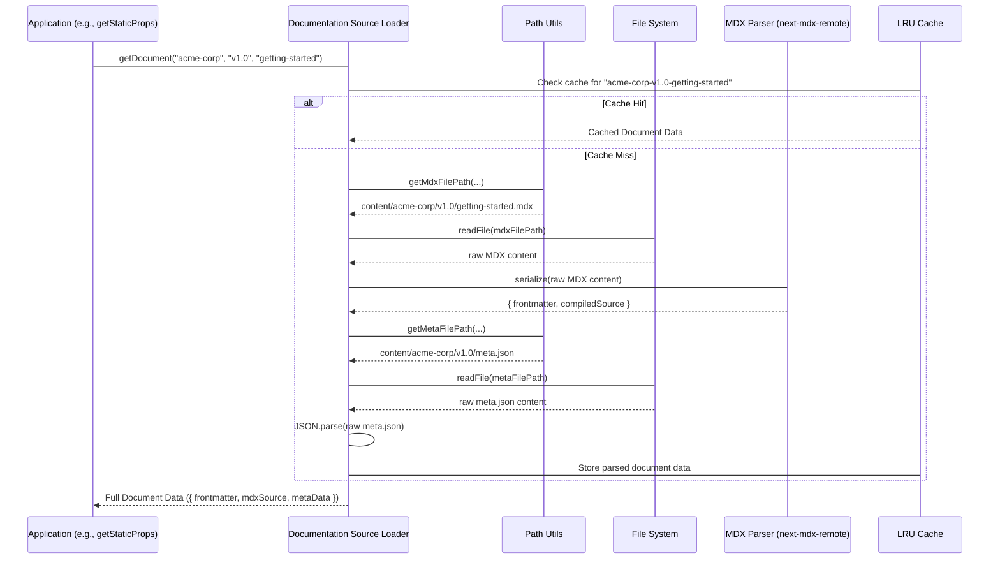

# Chapter 3: Documentation Source Loader

In the [previous chapter, "Documentation Content Structure"](chapter_02.md), we established a robust, hierarchical file system for organizing all our documentation content, enabling multi-tenancy and versioning. We learned how `content/{tenant}/{version}/{slug}.mdx` forms the bedrock of our content storage. However, simply having files on a disk isn't enough; our application needs a sophisticated mechanism to read, parse, and transform these raw files into usable data that can be displayed to users. This is precisely where the Documentation Source Loader comes into play.

---

### Problem & Motivation

The core problem this abstraction solves is bridging the gap between static files on the filesystem and dynamic content within our Next.js application. Our documentation lives in MDX files, complemented by `meta.json` files for structural metadata. Without a dedicated loader, our application would face several challenges:

1.  **Direct File System Access**: Repeatedly reading raw MDX and JSON files directly within UI components or API routes would lead to boilerplate, inefficient code, and poor separation of concerns.
2.  **Content Parsing**: MDX files require specialized parsing to extract frontmatter (metadata like title, description) and transform the content into a format renderable by React. Manually handling this parsing logic for every document would be cumbersome.
3.  **Structured Data Retrieval**: The application needs to retrieve specific documents or lists of documents based on a logical combination of tenant, version, and document slug, not just raw file paths.
4.  **Performance**: Reading and parsing files on every request can be slow, especially in a server-side rendering (SSR) or API context. We need mechanisms for efficient data fetching, often leveraging caching.

The Documentation Source Loader addresses these issues by providing a unified, performant, and reliable interface for accessing our structured documentation content. For example, when a user navigates to `/acme-corp/v1.0/getting-started`, the loader is responsible for finding the `content/acme-corp/v1.0/getting-started.mdx` file, reading its contents, parsing its frontmatter and MDX body, and combining it with relevant `meta.json` data, all while abstracting the underlying file system operations.

---

### Core Concept Explanation

The Documentation Source Loader is the central utility that understands our [Documentation Content Structure](chapter_02.md) and makes its contents accessible to the rest of the application. Think of it as a specialized librarian for our documentation: you tell it what book (document) you need (tenant, version, slug), and it fetches, decodes, and presents it to you in a readable format, knowing exactly where to look and how to interpret the content.

Its primary responsibilities include:

1.  **Path Resolution**: Translating a logical request (tenant, version, slug) into an absolute file system path for the MDX file and its corresponding `meta.json`.
2.  **File Reading**: Asynchronously reading the raw content of the MDX file and `meta.json`.
3.  **MDX Parsing**: Processing the MDX content to separate its **frontmatter** (key-value metadata at the top of the file) from the main **MDX body** (the markdown content itself). This often involves using a dedicated MDX parsing library.
4.  **Metadata Extraction**: Parsing the `meta.json` file, which typically contains ordering, titles, and other navigation-related metadata for documents within a directory.
5.  **Data Consolidation**: Combining the parsed MDX frontmatter, MDX body, and `meta.json` data into a single, structured object that the application can easily consume.
6.  **Caching**: Optionally, storing parsed content in memory to avoid redundant file system operations and parsing, significantly improving performance during development and build processes.

By encapsulating these operations, the loader provides a clean, predictable API. This separation of concerns ensures that our UI components and data fetching logic don't need to worry about file paths, parsing rules, or caching strategies; they simply request the content they need, and the loader handles the complexities.

---

### Practical Usage Examples

Let's illustrate how we would typically interact with the Documentation Source Loader to fetch content for our application. We'll focus on two common scenarios: retrieving a single document and retrieving a list of documents for navigation.

#### Fetching a Single Document

Imagine we need to display the "Getting Started" guide for `acme-corp`'s `v1.0` documentation.

```typescript
// src/lib/docs/loader.ts (hypothetical loader file)
// Example: Function to get a single document
// In a real application, this would be called within getStaticProps or an API route.
import { getDocument } from '@/lib/docs/loader'; // Adjust import path as needed

async function fetchGettingStartedDoc() {
  const tenant = 'acme-corp';
  const version = 'v1.0';
  const slug = 'getting-started';

  try {
    const doc = await getDocument(tenant, version, slug);
    console.log(`Document Title: ${doc.frontmatter.title}`);
    console.log(`Document Description: ${doc.frontmatter.description}`);
    // The 'mdxSource' contains the processed MDX content ready for rendering.
    // We'll see how this is used in Chapter 5.
    console.log(`MDX Content Length: ${doc.mdxSource.length} characters`);
    return doc;
  } catch (error) {
    console.error(`Failed to load document: ${error.message}`);
    return null;
  }
}

fetchGettingStartedDoc();
```
*Explanation*: The `getDocument` function takes the `tenant`, `version`, and `slug` as arguments. It returns a structured object containing the parsed `frontmatter` (metadata embedded in the MDX file) and `mdxSource` (the serialized MDX content ready for rendering by a component like `next-mdx-remote`). This makes it easy to access all necessary information for a document page.

#### Fetching All Documents in a Version

For building navigation menus or sitemaps, we often need to list all available documents within a specific tenant and version.

```typescript
// src/lib/docs/loader.ts (hypothetical loader file)
// Example: Function to get a list of documents in a specific version
import { getDocumentsInVersion } from '@/lib/docs/loader'; // Adjust import path

async function fetchAcmeCorpV1Docs() {
  const tenant = 'acme-corp';
  const version = 'v1.0';

  try {
    const docs = await getDocumentsInVersion(tenant, version);
    console.log(`Documents for ${tenant}/${version}:`);
    docs.forEach(doc => {
      console.log(`- Slug: ${doc.slug}, Title: ${doc.frontmatter.title}`);
    });
    return docs;
  } catch (error) {
    console.error(`Failed to load documents: ${error.message}`);
    return [];
  }
}

fetchAcmeCorpV1Docs();
```
*Explanation*: The `getDocumentsInVersion` function scans the specified tenant and version directory, identifies all MDX files, parses their frontmatter, and returns an array of light-weight document objects. Each object includes the `slug` and `frontmatter` necessary for generating navigation links, without loading the full MDX content until a specific document is requested.

---

### Internal Implementation Walkthrough

Understanding the internal workings of the Documentation Source Loader reveals how it seamlessly transforms file system structures into application-ready data. Here’s a step-by-step breakdown:

#### 1. Input and Path Resolution

The loader's journey begins with logical identifiers: `tenant`, `version`, and `slug`. It uses these to construct the exact physical path to the MDX file and its accompanying `meta.json`.

```typescript
// Simplified path resolution logic (from src/lib/docs/utils.ts)
import path from 'path';

const DOCS_CONTENT_DIR = path.join(process.cwd(), 'content');

export function getMdxFilePath(tenant: string, version: string, slug: string): string {
  return path.join(DOCS_CONTENT_DIR, tenant, version, `${slug}.mdx`);
}

export function getMetaFilePath(tenant: string, version: string): string {
  // meta.json is usually at the root of the version directory
  return path.join(DOCS_CONTENT_DIR, tenant, version, 'meta.json');
}
```
*Explanation*: These utility functions use Node.js's `path` module to safely construct file paths, ensuring cross-platform compatibility. `process.cwd()` refers to the current working directory of the Node.js process.

#### 2. File Reading

Once the path is resolved, the loader reads the file content asynchronously.

```typescript
// Simplified file reading (from src/lib/docs/loader.ts)
import { promises as fs } from 'fs';

async function readFileContent(filePath: string): Promise<string> {
  try {
    return await fs.readFile(filePath, 'utf-8');
  } catch (error) {
    if ((error as NodeJS.ErrnoException).code === 'ENOENT') {
      throw new Error(`File not found: ${filePath}`);
    }
    throw error;
  }
}
```
*Explanation*: We use `fs.promises.readFile` for asynchronous file operations, which is crucial for non-blocking I/O in server-side environments. Robust error handling checks for missing files (`ENOENT`).

#### 3. MDX Parsing

This is a critical step where the raw MDX string is processed. Libraries like `next-mdx-remote` (or similar) are commonly used. They handle:
*   Extracting **frontmatter**: The YAML block at the top of an MDX file (e.g., `--- title: Getting Started ---`).
*   Serializing **MDX content**: Transforming the MDX markdown into a format (often JSON) that can be passed to a React component for rendering, including support for custom components.

```typescript
// Example MDX file content: content/acme-corp/v1.0/getting-started.mdx
/*
---
title: Getting Started
description: Your first steps with Acme Corp products.
order: 1
---

## Welcome!

This guide will help you set up your environment.

<Button variant="primary">Click Me</Button>
*/
```

```typescript
// Simplified MDX parsing (from src/lib/docs/loader.ts)
import { serialize } from 'next-mdx-remote/serialize';

interface ParsedMdx {
  frontmatter: Record<string, any>;
  mdxSource: string; // Serialized MDX for next-mdx-remote
}

async function parseMdx(rawMdx: string): Promise<ParsedMdx> {
  // The 'serialize' function handles frontmatter extraction and MDX processing
  const mdx = await serialize(rawMdx, { parseFrontmatter: true });
  return {
    frontmatter: mdx.frontmatter,
    mdxSource: mdx.compiledSource, // Use compiledSource for the serialized MDX
  };
}
```
*Explanation*: The `serialize` function from `next-mdx-remote` does the heavy lifting. It returns `frontmatter` as a plain object and `compiledSource` which is a string representation of the MDX suitable for client-side rendering with `MDXRemote`.

#### 4. `meta.json` Parsing

The `meta.json` file provides metadata about a directory's contents, often used for ordering and titling in navigation.

```json
// Example meta.json: content/acme-corp/v1.0/meta.json
[
  {
    "slug": "getting-started",
    "title": "Getting Started",
    "icon": "🚀"
  },
  {
    "slug": "advanced-config",
    "title": "Advanced Configuration",
    "icon": "⚙️"
  }
]
```

```typescript
// Simplified meta.json parsing (from src/lib/docs/loader.ts)
interface DocumentMeta {
  slug: string;
  title: string;
  icon?: string;
  // ... other metadata
}

async function getDirectoryMeta(tenant: string, version: string): Promise<DocumentMeta[]> {
  const metaFilePath = getMetaFilePath(tenant, version);
  try {
    const rawMeta = await readFileContent(metaFilePath);
    return JSON.parse(rawMeta);
  } catch (error) {
    if ((error as NodeJS.ErrnoException).code === 'ENOENT') {
      return []; // No meta.json, return empty array
    }
    throw new Error(`Failed to parse meta.json for ${tenant}/${version}: ${error.message}`);
  }
}
```
*Explanation*: This function reads the `meta.json` file and parses its JSON content. It gracefully handles cases where `meta.json` might not exist for a given version.

#### 5. Caching Strategy (Performance Optimization)

For frequently accessed documents, especially during `getStaticProps` or development, caching parsed results significantly improves performance.

```typescript
// Simplified caching mechanism (from src/lib/docs/loader.ts)
import LRUCache from 'lru-cache'; // A common Node.js caching library

// Cache for parsed documents
const docCache = new LRUCache<string, ParsedMdx & { frontmatter: Record<string, any> }>({
  max: 100, // Maximum 100 documents in cache
  ttl: 1000 * 60 * 5, // Cache items expire after 5 minutes
});

async function getDocumentWithCache(tenant: string, version: string, slug: string) {
  const cacheKey = `${tenant}-${version}-${slug}`;
  if (docCache.has(cacheKey)) {
    console.log(`Cache hit for ${cacheKey}`);
    return docCache.get(cacheKey);
  }

  // ... (logic to read and parse MDX and meta.json as above) ...
  const mdxFilePath = getMdxFilePath(tenant, version, slug);
  const rawMdx = await readFileContent(mdxFilePath);
  const { frontmatter, mdxSource } = await parseMdx(rawMdx);

  const fullDoc = { frontmatter, mdxSource, tenant, version, slug };
  docCache.set(cacheKey, fullDoc);
  console.log(`Cache miss, loaded ${cacheKey}`);
  return fullDoc;
}
```
*Explanation*: This simple LRU (Least Recently Used) cache stores parsed document data. Before performing file operations and parsing, it checks if the document is already in the cache. This is particularly effective during development with hot module reloading or on serverless functions where cold starts are a concern.

#### Interaction Flow

The complete flow, integrating these steps, can be visualized:



---

### System Integration

The Documentation Source Loader is a foundational piece that integrates deeply with several other core abstractions in the `multi-tenant-docs` project:

*   **[Multi-Tenant Document Routing](chapter_01.md)**: This chapter detailed how the application dynamically extracts `tenant`, `version`, and `slug` from the URL. These extracted parameters are directly fed into the Documentation Source Loader's functions (e.g., `getDocument`, `getDocumentsInVersion`) to retrieve the correct content. The router dictates *what* content is needed, and the loader provides it.

*   **[Documentation Content Structure](chapter_02.md)**: The loader's internal logic is entirely dependent on the content structure defined in the previous chapter. It expects MDX files at `content/{tenant}/{version}/{slug}.mdx` and `meta.json` files within version directories. Any change to the content structure would directly require adjustments within the loader.

*   **Next.js Data Fetching (`getStaticProps`, `getStaticPaths`)**: In a Next.js application, the loader's functions are primarily called within `getStaticProps` (for fetching data to render a single page at build time) and `getStaticPaths` (for generating all possible page paths based on available documents). This allows for highly optimized, pre-rendered documentation pages.

    ```typescript
    // Example: pages/[tenant]/[version]/[...slug].tsx
    import { getDocument, getDocumentsInVersion } from '@/lib/docs/loader';
    import { serialize } from 'next-mdx-remote/serialize'; // Or pass mdxSource directly

    export async function getStaticPaths() {
      // Logic to fetch all possible tenant/version/slug combinations
      // using getDocumentsInVersion across all tenants/versions
      const paths = await getAllDocumentPaths(); // A helper function using loader
      return { paths, fallback: false };
    }

    export async function getStaticProps({ params }) {
      const { tenant, version, slug } = params;
      const doc = await getDocument(tenant, version, Array.isArray(slug) ? slug.join('/') : slug);

      if (!doc) {
        return { notFound: true };
      }

      // The 'mdxSource' from the loader is already serialized,
      // so we might just pass it directly if loader handles serialize.
      // If loader only returns raw MDX, we'd serialize here.
      return {
        props: {
          frontmatter: doc.frontmatter,
          mdxSource: doc.mdxSource,
        },
      };
    }
    ```

*   **[Interactive MDX Components](chapter_05.md)**: The `mdxSource` returned by the loader is the compiled, serialized version of the MDX content. This `mdxSource` is then passed to the `MDXRemote` component (from `next-mdx-remote`) on the client-side. This component interprets the `mdxSource` and renders the documentation, including any custom React components embedded within the MDX.

---

### Best Practices & Tips

To ensure the Documentation Source Loader remains robust, performant, and maintainable, consider the following best practices:

*   **Robust Error Handling**: Always anticipate scenarios like missing files, malformed MDX (e.g., invalid frontmatter), or corrupt `meta.json`. Implement clear error messages and appropriate fallback mechanisms (e.g., returning `null` for a missing document, or an empty array for missing directory metadata).
*   **Strategic Caching**: While a simple LRU cache is shown, consider the deployment environment. For serverless functions, a more persistent cache (like Redis) might be beneficial for long-term performance gains across invocations, though for `getStaticProps`, in-memory caching is often sufficient during build.
*   **Schema Validation**: For `meta.json` files and MDX frontmatter, implement schema validation (e.g., using Zod or Joi). This ensures that the metadata conforms to expected types and structures, preventing runtime errors and making the data more reliable for UI components.
*   **Asynchronous Operations**: Always use Node.js `fs.promises` for file system operations. Synchronous operations (`fs.readFileSync`) can block the event loop, severely impacting performance in server-side rendering or API routes.
*   **Path Safety**: When constructing file paths, always use `path.join()` to correctly handle operating system differences (e.g., `/` vs `\`) and prevent path traversal vulnerabilities if any part of the path could come from untrusted user input (though typically, `tenant`, `version`, `slug` are controlled by file names in this project).
*   **Progressive Loading for Navigation**: When fetching lists of documents for navigation, only load the essential metadata (slug, title, order). Avoid parsing the full MDX content for every document until it's explicitly requested. This keeps navigation menus fast and lightweight.
*   **Clear API Design**: The loader's public API (e.g., `getDocument`, `getDocumentsInVersion`) should be clear, concise, and focused on specific responsibilities. Avoid exposing internal helper functions unless absolutely necessary.

---

### Chapter Conclusion

The Documentation Source Loader is the unsung hero of our `multi-tenant-docs` platform. It transforms static files into dynamic, application-ready content, abstracting away the complexities of file system interactions and content parsing. By understanding its role in path resolution, MDX processing, and data consolidation, we empower our application to efficiently serve versioned, tenant-specific documentation. Its seamless integration with routing and data fetching mechanisms ensures that our structured content can be displayed effortlessly.

With our content now loadable and parsable, the next logical step is to explore how we can integrate *other* dynamic data, such as search results, user-specific information, or real-time analytics, into our documentation experience. This leads us directly to the exploration of how our system interacts with external services and backend logic.

[Next Chapter: System Data APIs](chapter_04.md)