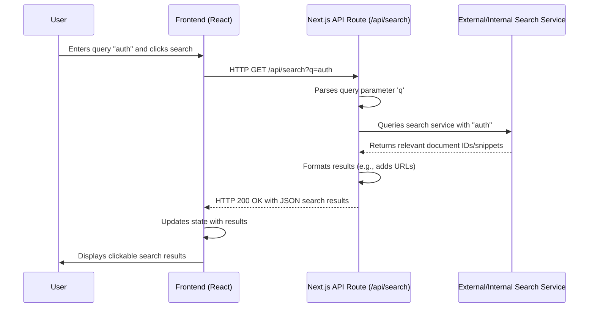

# Chapter 4: System Data APIs

Having established how our multi-tenant documentation platform dynamically routes requests and efficiently loads structured content through the [Documentation Source Loader](chapter_03.md), we now turn our attention to how the platform integrates dynamic data. While MDX files provide excellent static content, real-world applications often require interacting with external data sources, user-specific information, or dynamic search results. This is where System Data APIs come into play.

---

### Problem & Motivation

Static documentation, even when richly formatted and version-controlled, has inherent limitations. It cannot, by itself, display a user's specific project list, integrate real-time data from an external service, or provide a sophisticated search experience beyond simple text matching within loaded files. Relying solely on static content would severely restrict the functionality and interactivity of our multi-tenant documentation platform.

The core problem this abstraction addresses is the need to bridge the gap between static content and dynamic application features. For example, imagine a documentation page explaining how to use a particular project management tool. It would be incredibly valuable if that page could dynamically fetch and display *your* actual projects from the project management system. Similarly, a global search function needs to query an index, not just the currently loaded MDX file, to provide comprehensive results.

This chapter's central use case revolves around two primary needs: fetching a list of dynamic projects that a user might be working on, and enabling a robust, platform-wide search functionality that goes beyond the immediate MDX content. These capabilities elevate the documentation from a passive reader to an interactive tool, making it far more valuable to its users.

---

### Core Concept Explanation

The "System Data APIs" abstraction in our `multi-tenant-docs` project refers to a set of backend endpoints responsible for providing or managing data that isn't directly embedded in the MDX documentation files. These APIs are implemented using Next.js API Routes, which allow us to create serverless functions directly within our Next.js application, making them simple to deploy and manage alongside our frontend.

Think of these APIs as the "brain" or "data layer" that extends beyond the documentation content. While the [Documentation Source Loader](chapter_03.md) is like a librarian who fetches books from shelves, these APIs are like the specialist who can tell you about new books that just arrived, or help you find any book in the entire library, not just the ones currently on display. They abstract away the complexity of interacting with external services or databases.

Key functionalities provided by these APIs include:
*   **Project Management Data**: Endpoints to retrieve lists of projects, project details, or other related entities specific to a tenant or user.
*   **User & Supplier Information**: APIs to fetch user profiles, permissions, or details about suppliers that might be referenced in documentation.
*   **Search Functionality**: A crucial API that processes search queries, queries a search index (e.g., ElasticSearch, Algolia, or a simpler in-memory index), and returns relevant documentation snippets or links.

By providing a clean interface through HTTP endpoints, these APIs allow our frontend (React components embedded in MDX, or standard Next.js pages) to fetch dynamic data securely and efficiently, transforming static documentation into a dynamic and integrated experience.

---

### Practical Usage Examples

Let's illustrate how our frontend components would interact with these System Data APIs for our motivating use cases: fetching dynamic projects and implementing search.

#### Use Case 1: Fetching Dynamic Project List

First, we need a backend API route to serve our project data. For simplicity, we'll simulate this with a static array, but in a real application, it would query a database or an external service.

**1. Create the API Route (`pages/api/projects.js`)**

```javascript
// pages/api/projects.js
export default function handler(req, res) {
  if (req.method === 'GET') {
    // In a real app, this would fetch from a DB or external service
    const projects = [
      { id: 'proj-001', name: 'Acme Product Alpha', status: 'Active' },
      { id: 'proj-002', name: 'Beta Service Rollout', status: 'Planning' },
      { id: 'proj-003', name: 'Internal Tooling Upgrade', status: 'Completed' },
    ];
    res.status(200).json(projects);
  } else {
    res.setHeader('Allow', ['GET']);
    res.status(405).end(`Method ${req.method} Not Allowed`);
  }
}
```
*This Next.js API route responds to `GET` requests at `/api/projects` with a JSON array of mock project data. It handles unsupported HTTP methods gracefully.*

**2. Create a React Component to Consume the API (`components/ProjectList.js`)**

```jsx
// components/ProjectList.js
import React, { useEffect, useState } from 'react';

const ProjectList = () => {
  const [projects, setProjects] = useState([]);
  const [loading, setLoading] = useState(true);

  useEffect(() => {
    fetch('/api/projects') // Calls our Next.js API route
      .then(res => res.json())
      .then(data => {
        setProjects(data);
        setLoading(false);
      })
      .catch(error => {
        console.error("Failed to fetch projects:", error);
        setLoading(false);
      });
  }, []);

  if (loading) return <p>Loading projects...</p>;

  return (
    <div>
      <h3>Your Active Projects</h3>
      <ul>
        {projects.map(project => (
          <li key={project.id}>
            <strong>{project.name}</strong> ({project.status})
          </li>
        ))}
      </ul>
    </div>
  );
};

export default ProjectList;
```
*This React component fetches the project data from our `/api/projects` endpoint when it mounts. It displays a loading message and then renders the project names and statuses in a list.*

#### Use Case 2: Implementing Search Functionality

**1. Create the Search API Route (`pages/api/search.js`)**

```javascript
// pages/api/search.js
export default function handler(req, res) {
  if (req.method === 'GET') {
    const { q } = req.query; // Get the search query from URL parameters

    if (!q) {
      return res.status(400).json({ message: 'Query parameter "q" is required.' });
    }

    // In a real app, this would query a search index (e.g., ElasticSearch, Algolia)
    // For this example, we'll simulate results based on the query.
    const mockResults = [
      { id: 'doc-001', title: `Result for '${q}' in Feature A`, url: '/docs/tenant/v1/feature-a' },
      { id: 'doc-002', title: `Guide related to '${q}'`, url: '/docs/tenant/v1/guides/advanced' },
    ];

    const filteredResults = mockResults.filter(result =>
      result.title.toLowerCase().includes(q.toLowerCase())
    );

    res.status(200).json(filteredResults);
  } else {
    res.setHeader('Allow', ['GET']);
    res.status(405).end(`Method ${req.method} Not Allowed`);
  }
}
```
*This API route accepts a `q` (query) parameter and returns mock search results that contain the query string. This simulates how a real search service would respond.*

**2. Create a React Component for Search Input (`components/SearchBox.js`)**

```jsx
// components/SearchBox.js
import React, { useState } from 'react';

const SearchBox = () => {
  const [query, setQuery] = useState('');
  const [results, setResults] = useState([]);
  const [loading, setLoading] = useState(false);

  const handleSearch = async (e) => {
    e.preventDefault();
    if (!query.trim()) return;

    setLoading(true);
    try {
      const res = await fetch(`/api/search?q=${encodeURIComponent(query)}`);
      const data = await res.json();
      setResults(data);
    } catch (error) {
      console.error("Failed to fetch search results:", error);
    } finally {
      setLoading(false);
    }
  };

  return (
    <div>
      <form onSubmit={handleSearch}>
        <input
          type="text"
          value={query}
          onChange={(e) => setQuery(e.target.value)}
          placeholder="Search documentation..."
        />
        <button type="submit" disabled={loading}>
          {loading ? 'Searching...' : 'Search'}
        </button>
      </form>
      {results.length > 0 && (
        <ul>
          {results.map(result => (
            <li key={result.id}>
              <a href={result.url}>{result.title}</a>
            </li>
          ))}
        </ul>
      )}
      {results.length === 0 && query.trim() && !loading && <p>No results found.</p>}
    </div>
  );
};

export default SearchBox;
```
*This component provides a search input field. When the user submits a query, it calls our `/api/search` route and displays the returned results as clickable links. It also shows loading and no-results states.*

---

### Internal Implementation Walkthrough

Next.js API Routes are essentially Node.js serverless functions. They reside within the `pages/api` directory of your Next.js project. Each file in this directory typically exports a default function that acts as an API handler.

#### The Anatomy of a Next.js API Route

1.  **File Location**: Any file inside `pages/api` becomes an API endpoint. For example, `pages/api/users.js` becomes `/api/users`.
2.  **The Handler Function**: Each API route file exports a default asynchronous function that receives two arguments: `req` (the incoming `http.IncomingMessage` object, extended by Next.js) and `res` (the outgoing `http.ServerResponse` object, also extended).

    ```javascript
    // pages/api/example.js
    export default function handler(req, res) {
      // req.method: HTTP method (GET, POST, PUT, DELETE)
      // req.query: Query parameters (e.g., ?id=123)
      // req.body: Request body for POST/PUT requests

      if (req.method === 'GET') {
        res.status(200).json({ message: 'This is a GET request!' });
      } else if (req.method === 'POST') {
        res.status(200).json({ message: 'Received POST data', data: req.body });
      } else {
        // Handle other methods or send 405 Method Not Allowed
        res.setHeader('Allow', ['GET', 'POST']);
        res.status(405).end(`Method ${req.method} Not Allowed`);
      }
    }
    ```
    *This example shows how to handle different HTTP methods within a single API route. It demonstrates accessing `req.method` and `req.body`, and setting response status and JSON data.*

3.  **Request and Response Objects**:
    *   `req`: Provides access to the HTTP method (`req.method`), URL query parameters (`req.query`), and request body (`req.body`).
    *   `res`: Allows setting the HTTP status code (`res.status()`), sending JSON data (`res.json()`), or ending the response (`res.end()`).

#### Data Flow for a Search Query

Let's visualize the interaction when a user performs a search using our `SearchBox` component and the `pages/api/search.js` API.


*This sequence diagram illustrates the flow from a user interacting with the search component, through the Next.js API route, to an (abstract) search index, and back to the user interface.*

In a real scenario, the `SearchIndex` could be a dedicated service like Algolia or ElasticSearch, or even a pre-built static search index generated during build time and loaded by the API route. The API route acts as a crucial intermediary, abstracting the search logic from the frontend.

---

### System Integration

The System Data APIs are a vital bridge, connecting our static documentation frontend with dynamic backend capabilities and external data sources.

*   **Integration with [Interactive MDX Components](chapter_05.md)**: This is perhaps the most direct integration point. As shown in the "Practical Usage Examples," React components (like `ProjectList` or `SearchBox`) are designed to fetch data from these APIs. When these React components are embedded within an MDX file, the documentation becomes interactive, displaying dynamic data. This means a user could see their personalized project dashboard right within a documentation page.

*   **Complementing the [Documentation Source Loader](chapter_03.md)**: The `Documentation Source Loader` is responsible for processing *static* content (MDX files). The System Data APIs handle *dynamic* content. They work in tandem: the loader provides the foundational documentation, and the APIs enhance it with real-time or personalized data. For instance, a search API might index content parsed by the loader.

*   **Data Flow**: The typical data flow involves:
    1.  A user navigates to a documentation page rendered by the router (Chapter 1) using content processed by the loader (Chapter 3).
    2.  An embedded React component (Chapter 5) on that page makes an `HTTP` request to a System Data API endpoint.
    3.  The API endpoint processes the request, potentially interacts with a database or external service, and returns `JSON` data.
    4.  The React component receives this data and updates the UI, seamlessly integrating dynamic information into the static documentation context.

This clear separation of concerns allows for robust development: the documentation structure and loading are independent of the dynamic data sources, yet they can be tightly integrated on the client side for a rich user experience.

---

### Best Practices & Tips

When designing and implementing System Data APIs using Next.js API Routes, consider the following best practices for maintainability, performance, and security:

*   **API Design (RESTful Principles)**:
    *   Use clear, descriptive endpoint names (e.g., `/api/projects`, `/api/users`).
    *   Utilize standard HTTP methods (GET for retrieval, POST for creation, PUT/PATCH for updates, DELETE for removal).
    *   Return meaningful HTTP status codes (200 OK, 201 Created, 204 No Content, 400 Bad Request, 401 Unauthorized, 403 Forbidden, 404 Not Found, 500 Internal Server Error).
    *   Return consistent JSON response structures, especially for errors.

*   **Error Handling**:
    *   Implement robust error handling within your API routes. Catch exceptions from database queries or external service calls.
    *   Send appropriate error status codes and informative (but not overly detailed for security reasons) error messages.

    ```javascript
    // Example: Error handling in API route
    export default async function handler(req, res) {
      if (req.method === 'GET') {
        try {
          // const data = await database.fetchSomething(); // Real world scenario
          const data = { id: 'item-1', name: 'Some Data' }; // Mock
          res.status(200).json(data);
        } catch (error) {
          console.error("API error:", error);
          res.status(500).json({ message: 'Internal Server Error', details: error.message });
        }
      } else {
        res.status(405).end(`Method ${req.method} Not Allowed`);
      }
    }
    ```
    *This snippet demonstrates wrapping API logic in a `try...catch` block to handle potential errors and return a 500 status code with a general error message.*

*   **Security Considerations**:
    *   **Authentication & Authorization**: For sensitive data, implement user authentication (e.g., using JWTs, session management) and authorization checks within your API routes to ensure only authorized users can access or modify data.
    *   **Input Validation**: Always validate user input (`req.query`, `req.body`) to prevent injection attacks and ensure data integrity.
    *   **Environment Variables**: Use `process.env` for sensitive API keys, database credentials, and other configuration secrets, never hardcode them.

*   **Performance Optimization**:
    *   **Caching**: Implement caching strategies where appropriate to reduce redundant database queries or external API calls. Next.js offers various data fetching strategies that can leverage caching.
    *   **Pagination**: For APIs that return large datasets (e.g., many projects, extensive search results), implement pagination to avoid overwhelming the client and improve response times.
    *   **Minimize Data Transfer**: Only return the necessary data. Avoid sending entire objects if only a few fields are needed.

*   **Testing**: Write unit and integration tests for your API routes to ensure they function correctly and handle edge cases as expected.

---

### Chapter Conclusion

This chapter has explored the crucial role of System Data APIs in transforming our `multi-tenant-docs` platform from a static content viewer into a dynamic, interactive application. We've seen how Next.js API Routes provide the backend infrastructure to deliver dynamic data, handle search queries, and manage external information like project lists or user data. By creating these dedicated endpoints, we empower our frontend components to fetch and display real-time information, significantly enhancing the user experience.

The integration of these APIs with [Interactive MDX Components](chapter_05.md) is key to unlocking the full potential of dynamic documentation. In the next chapter, we will dive deeper into how these interactive components are built, how they consume these APIs, and how they seamlessly blend with the static MDX content to create a rich and engaging user interface.

---

[Next Chapter: Interactive MDX Components](chapter_05.md)