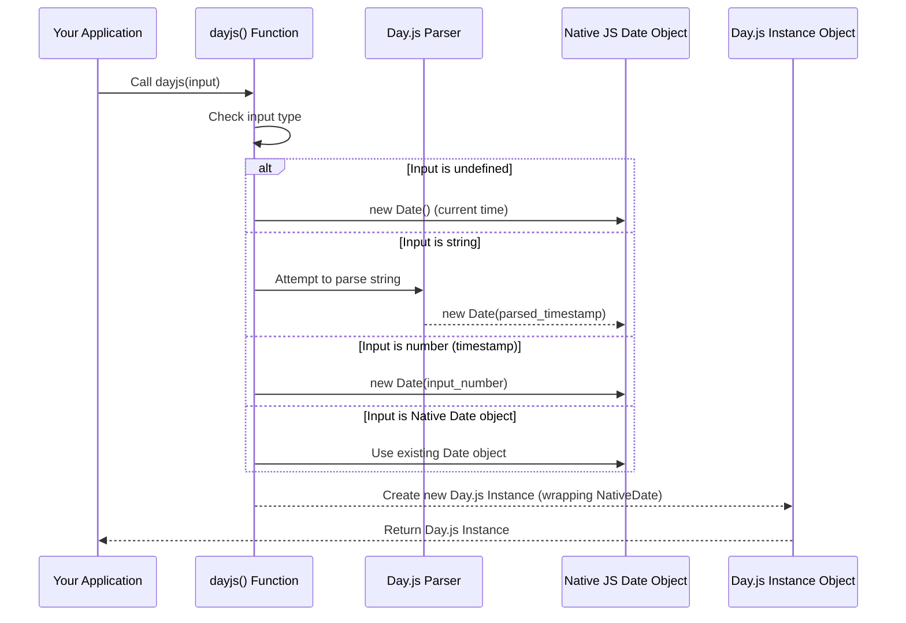

# Chapter 1: The Day.js Object

Welcome to the Day.js documentation! This is your starting point for understanding how to work with dates and times efficiently in JavaScript using Day.js.

---

## Problem & Motivation

Working with dates and times in JavaScript can often be a source of frustration. The native `Date` object, while fundamental, presents several challenges: it's mutable, its parsing behavior can be inconsistent across browsers, and formatting dates for display frequently requires verbose and complex code. Developers frequently encounter issues like unintended side effects when modifying date objects, difficulties in internationalizing date formats, and performance overhead from larger date libraries that include many features not always needed.

For modern web applications, developers need a date library that is *lightweight*, *predictable*, and *easy to use*. Day.js was created precisely to address these problems. It offers a solution that minimizes bundle size while providing a powerful and intuitive API for all common date and time operations, ensuring consistent behavior across different environments.

Consider a common scenario: you need to display a user's last login timestamp in a readable format, calculate how long ago a post was published, or schedule an event for a specific future date. Without a robust library, these tasks can lead to fragile, hard-to-maintain code. Day.js provides a streamlined way to handle these needs, ensuring that your date operations are clear, reliable, and performant.

---

## Core Concept Explanation: The `dayjs()` Function

At the heart of the Day.js library is the main `dayjs()` function. Think of it as the *constructor* or the *entry point* to all date-related functionalities within Day.js. Whenever you need to work with a date or time, your first step will typically be to call `dayjs()`.

When you invoke `dayjs()`, it returns a Day.js object – specifically, an *immutable date instance*. "Immutable" is a key concept here: it means that once a Day.js object is created, its internal date and time value cannot be changed. Any operation that appears to modify the date (like adding days, subtracting hours, or changing the year) will actually return a *brand new* Day.js object with the updated value, leaving the original object untouched. This immutability significantly reduces bugs caused by accidental side effects in your code, making date manipulations more predictable and safer, especially in complex applications.

The `dayjs()` function is incredibly versatile. It can be called without any arguments to get the current date and time, or it can accept various inputs like standard JavaScript `Date` objects, strings (which it intelligently parses), numbers (representing timestamps), or even other Day.js objects to parse and wrap specific dates. It intelligently understands many different input formats and creates a corresponding Day.js instance ready for manipulation and display.

Beyond creating date instances, the `dayjs()` function also serves as a gateway to global utility methods and the robust plugin system. While its primary role is instantiation, you'll find that the `dayjs` object itself is the central hub for accessing virtually everything Day.js has to offer, from configuring locales to extending functionality.

---

## Practical Usage Examples

Let's explore how to use the `dayjs()` function to create date objects for our motivating use case: handling user activity timestamps, such as a user's last login.

### 1. Creating a Day.js Object for the Current Date and Time

The simplest way to get a Day.js object is to call `dayjs()` without any arguments. This will give you an immutable instance representing the *exact moment* it was called.

```javascript
import dayjs from 'dayjs';

// Get the current date and time
const now = dayjs();
console.log(now.toString());
// Expected Output (similar to): 'Fri Oct 27 2023 10:30:00 GMT-0400 (Eastern Daylight Time)'
```
*Explanation*: `dayjs()` is called without any parameters, resulting in a Day.js object representing the current date and time. The `.toString()` method is used here to get a readable string representation, which is helpful for debugging and quick checks.

### 2. Creating a Day.js Object from a String

Day.js can parse various common date and time string formats. This is incredibly useful when dealing with data coming from APIs or user inputs, like a saved login timestamp.

```javascript
import dayjs from 'dayjs';

// Parse a specific date and time string
const lastLoginTime = dayjs('2023-01-15 14:30:00');
console.log(lastLoginTime.format('YYYY-MM-DD HH:mm:ss'));
// Expected Output: '2023-01-15 14:30:00'
```
*Explanation*: Here, `dayjs()` takes a string as an argument. It attempts to parse this string into a date. The `.format()` method is then used to display it in a specific, readable format that matches our requirements.

### 3. Creating a Day.js Object from a Native JavaScript `Date` Object

If you already have a standard JavaScript `Date` object, perhaps from an existing system or a third-party library, you can easily convert it into a Day.js object.

```javascript
import dayjs from 'dayjs';

// Create a native JavaScript Date object
const jsDate = new Date(2022, 11, 25, 12, 0, 0); // December 25, 2022, 12:00:00
const dayjsFromJsDate = dayjs(jsDate);
console.log(dayjsFromJsDate.format('MMMM D, YYYY [at] h:mm A'));
// Expected Output: 'December 25, 2022 at 12:00 PM'
```
*Explanation*: An existing `Date` object is passed to `dayjs()`. Day.js wraps this native object, providing its extended functionalities while preserving the original date value. This is useful for interoperability.

### 4. Creating a Day.js Object from a Unix Timestamp (Milliseconds)

Timestamps are numbers representing the number of milliseconds (or seconds) since the Unix Epoch (January 1, 1970, 00:00:00 UTC). Day.js handles these effortlessly, which is common for backend communication.

```javascript
import dayjs from 'dayjs';

// Unix timestamp in milliseconds
const timestampMs = 1678886400000; // Represents Mar 15, 2023 12:00:00 GMT+0000
const dayjsFromTimestamp = dayjs(timestampMs);
console.log(dayjsFromTimestamp.toDate());
// Expected Output (similar to): Wed Mar 15 2023 08:00:00 GMT-0400 (Eastern Daylight Time)
```
*Explanation*: A large number representing milliseconds since the Unix Epoch is passed to `dayjs()`. This is a common format for storing dates in databases or APIs. The `.toDate()` method converts the Day.js object back to a native `Date` object for inspection.

---

## Internal Implementation Walkthrough

When you call `dayjs(input)`, a series of internal steps occur to provide you with a robust Day.js object. While the library is lightweight, its core parsing logic is intelligent and efficient.

At a high level, the `dayjs()` function acts as a *factory function*. It doesn't directly return a bare `Date` instance, but rather orchestrates the creation of a wrapper object that encapsulates a native `Date` object or its timestamp.

1.  **Input Type Check**: The first thing Day.js does is examine the `input` argument you've provided. Is it `undefined` (no argument), a `string`, a `number`, a `Date` object, or another Day.js object?
2.  **Internal `Date` Object Creation/Wrapping**:
    *   **No argument (`dayjs()`):** If `input` is `undefined`, Day.js internally creates a standard JavaScript `new Date()` object, representing the current date and time.
    *   **Native `Date` object (`dayjs(jsDate)`):** If `input` is already a `Date` object, Day.js wraps this existing object, effectively reusing its internal timestamp.
    *   **String (`dayjs('...')`):** If `input` is a `string`, Day.js employs its internal parsing logic to convert the string into a valid JavaScript `Date` object. It handles various common formats (like ISO 8601, RFC 2822). If parsing fails or the format is ambiguous, it may fall back to `new Date(input)` which relies on the browser's native parsing capabilities (which can be inconsistent).
    *   **Number (Timestamp) (`dayjs(167...)`):** If `input` is a `number`, Day.js assumes it's a Unix timestamp (milliseconds by default) and creates a `new Date(input)` directly.
    *   **Day.js Object (`dayjs(otherDayjsObject)`):** If `input` is already a Day.js object, it simply clones the existing object to create a new, independent Day.js instance, maintaining immutability.
3.  **Wrapping and Augmentation**: Once an internal native `Date` object (or its timestamp) is established, Day.js wraps it within its own object structure. This wrapper then gets all the methods and properties that make Day.js so powerful (e.g., `format`, `add`, `subtract`, `startOf`, etc.). Crucially, all these methods operate on *copies* of the internal date, preserving the immutability of the original instance.

This process ensures that regardless of your input, you consistently receive a Day.js object that behaves predictably and offers the full range of library features.


*Explanation*: This sequence diagram illustrates the internal flow when `dayjs(input)` is called. It shows how the `dayjs()` function intelligently handles different input types to create or utilize a native `Date` object, and then wraps it with its own methods to create the immutable Day.js instance you work with.

---

## System Integration

The `dayjs()` function is the foundational entry point for interacting with the entire Day.js ecosystem. It seamlessly integrates with all other components of the library by providing the initial Day.js object upon which all operations are performed.

*   **Date Instance Methods**: Once you have a Day.js object created by `dayjs()`, you can immediately call various methods on it for manipulation, formatting, and querying. For example, `dayjs().add(1, 'day')` uses the instance created by `dayjs()` and then applies the `add` method to it. This forms the basis of [Day.js Date Instance](chapter_02.md), where we will delve deeper into these powerful methods.
*   **Plugin System**: Day.js's core minimalist design is augmented by its robust plugin system. You typically initialize plugins by calling `dayjs.extend(pluginFunction)`. While `dayjs()` creates the date instances, the global `dayjs` object itself (the function reference you import) is used to load these extensions. Once loaded, these plugins augment the capabilities of all subsequent Day.js objects created by `dayjs()`, adding features like relative time, timezones, or custom parsing. This powerful extensibility is covered in [Day.js Plugins](chapter_05.md).
*   **Locale Settings**: Global locale settings are also configured directly on the `dayjs` function (e.g., `dayjs.locale('fr')`). Any `dayjs()` call made afterward will respect the configured locale for parsing and formatting. This allows for easy internationalization of your date displays and inputs, which is essential for global applications. This is explored further in [Locale Settings](chapter_04.md).

In essence, `dayjs()` is not just a simple function; it's the gateway to a powerful, interconnected system for comprehensive date and time management within your applications.

---

## Best Practices & Tips

1.  **Always use `dayjs()` for new instances**: Resist the temptation to directly manipulate native `Date` objects if you're using Day.js. Consistently creating Day.js objects ensures you benefit from its immutability and extensive, predictable API.
2.  **Understand Immutability**: Remember that Day.js objects are immutable. Operations like `add()`, `subtract()`, or `startOf()` return *new* Day.js objects. Always assign the result of these operations to a new variable or overwrite the existing one:
    ```javascript
    import dayjs from 'dayjs';

    let d = dayjs(); // d represents current time
    console.log(`Original: ${d.format('HH:mm:ss')}`); // e.g., '10:30:00'

    const tomorrow = d.add(1, 'day'); // Correct: assign the new object
    console.log(`Tomorrow: ${tomorrow.format('YYYY-MM-DD')}`);
    console.log(`Original 'd' is unchanged: ${d.format('YYYY-MM-DD')}`);
    ```
    *Explanation*: `d.add(1, 'day')` returns a *new* Day.js object representing the next day. The original `d` object remains unchanged, demonstrating immutability.
3.  **Explicit Parsing for Strings**: While Day.js is smart about parsing common date strings, for critical applications or when dealing with ambiguous or non-standard formats, consider using the `dayjs(string, format)` overload (available with the `CustomParseFormat` plugin) to explicitly define the input format. This prevents unexpected parsing behavior across different environments or browser inconsistencies.
4.  **Validate Inputs**: If parsing a string might fail, especially with user input, always check if the resulting Day.js object is valid using `dayjs(input).isValid()`. This allows you to handle bad input gracefully.

    ```javascript
    import dayjs from 'dayjs';

    const validDate = dayjs('2023-10-27');
    console.log(`'2023-10-27' is valid: ${validDate.isValid()}`); // true

    const invalidDate = dayjs('not a date string');
    console.log(`'not a date string' is valid: ${invalidDate.isValid()}`); // false
    ```
    *Explanation*: The `.isValid()` method is crucial for robust error handling when dealing with date inputs that might not conform to expected formats.

---

## Troubleshooting

*   **"My date isn't changing after `add()`/`subtract()`!"**: This is almost always due to forgetting Day.js's immutability. As discussed in Best Practices, methods that modify a date return a *new* Day.js object. You must assign the result of these operations back to a variable.
*   **"My string isn't parsing correctly."**:
    *   Double-check the format of your input string. Day.js expects common ISO 8601 or RFC 2822 formats by default (e.g., `'YYYY-MM-DDTHH:mm:ssZ'`, `'YYYY-MM-DD'`, `'MM/DD/YYYY'`).
    *   If your string format is unusual or non-standard, you likely need to install and use the `CustomParseFormat` plugin (`dayjs.extend(CustomParseFormat)`) and provide a specific format string to `dayjs()`.
    *   Ensure your string doesn't contain unexpected characters, inconsistencies, or unhandled timezone abbreviations.
*   **"Timezones are off when I parse or display a date."**: Day.js works with local time by default. If you need specific timezone handling (e.g., always UTC, or a specific named timezone like 'America/New_York'), you'll need to install and use the `utc` and/or `timezone` plugins and explicitly configure them.

---

## Chapter Conclusion

In this chapter, we've explored the fundamental `dayjs()` function, the very starting point for all your date and time operations with Day.js. We've learned that it's a versatile factory function that creates immutable Day.js objects, capable of parsing various inputs from the current time to strings, numbers, and native `Date` objects. Understanding its role as the library's entry point and its commitment to immutability is crucial for writing robust and predictable date manipulation code.

The `dayjs()` object you create is not just a simple date; it's an instance packed with methods that allow you to interact with and transform dates in powerful ways. In the next chapter, we will dive deeper into these capabilities, examining the various methods available on a Day.js date instance for parsing, validating, manipulating, and displaying dates and times. You'll learn how to format dates for display, add or subtract time, compare dates, and much more.

Ready to start manipulating dates? Let's move on to the next chapter!

[Day.js Date Instance](chapter_02.md)