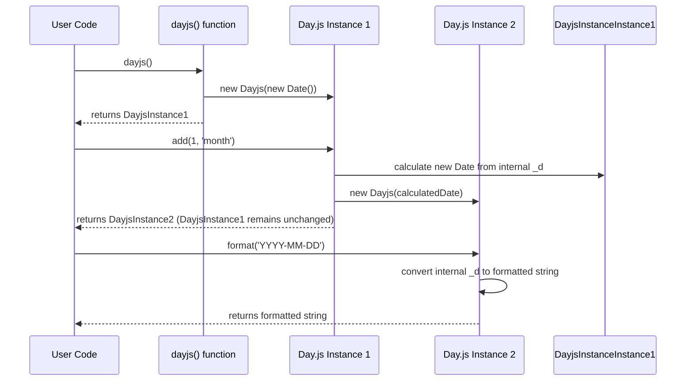

# Chapter 2: Day.js Date Instance

In the [previous chapter](chapter_01.md), we were introduced to the `dayjs()` function, which serves as the primary gateway to the Day.js library. We learned that calling this function, without arguments or with various inputs, is how we initiate interaction with dates and times. The crucial next step after calling `dayjs()` is understanding what it returns: the Day.js Date Instance. This chapter delves into this fundamental object, the very core of how you'll interact with dates throughout your Day.js projects.

---

### Problem & Motivation

Working with dates and times in JavaScript using the native `Date` object can be notoriously challenging. Developers often face issues with mutability, where modifying one `Date` object unexpectedly alters another reference to it, leading to bugs that are hard to trace. Furthermore, the native `Date` object's API is often considered cumbersome for common tasks like formatting into human-readable strings, performing calculations (e.g., "add 5 days"), or checking relationships between dates. These tasks typically require writing verbose, error-prone custom utility functions or relying on heavier third-party libraries.

The Day.js Date Instance solves these specific problems by encapsulating a specific date and time within an immutable, intuitive object. This immutability ensures that when you perform an operation, you always get a *new* Day.js Date Instance, leaving the original untouched. This predictable behavior drastically reduces side effects and simplifies date logic. It provides a rich, chainable API that makes complex date manipulations and formatting surprisingly straightforward and readable, making it ideal for modern web applications that frequently interact with time-sensitive data.

Consider a common scenario: you need to display a user's subscription renewal date, which is 30 days after their registration date, and then format it nicely. Without Day.js, you might manually create a `Date` object, use `setDate()`, and then extract components to build a string. With Day.js, this becomes a simple, readable chain of operations on a Day.js Date Instance, as we'll see shortly.

---

### Core Concept Explanation

A **Day.js Date Instance** is an object returned when you call the `dayjs()` function. Think of it as a specialized container for a single, specific point in time. Unlike JavaScript's native `Date` object, which can be modified directly (mutated), a Day.js Date Instance is **immutable**. This means that any operation you perform on it, such as adding days or changing the year, will always return a *new* Day.js Date Instance with the updated value, leaving the original instance completely unchanged.

This immutability is a cornerstone feature of Day.js, promoting more predictable and less error-prone code. It allows for a powerful pattern known as **method chaining**, where you can call multiple methods one after another on the same line, each returning a new instance that the next method operates on. For example, you can take a date, add a month, and then format it, all in a single, fluent expression. The Day.js Date Instance effectively wraps a native `Date` object internally, providing a much cleaner and more functional interface for interacting with it. It's essentially a lightweight, specialized wrapper designed for convenience, performance, and reliability when dealing with date and time information.

---

### Practical Usage Examples

Let's illustrate how to use the Day.js Date Instance to solve our motivating use case: displaying a subscription renewal date 30 days after registration.

First, let's create a basic Day.js Date Instance representing today's date.

```javascript
import dayjs from 'dayjs';

// Create a Day.js Date Instance for the current moment
const now = dayjs();
console.log(now);
// Expected output: A Day.js object representing the current date and time
```
*Explanation*: The `dayjs()` function, when called without any arguments, creates a Day.js Date Instance representing the precise moment of its execution. This `now` object is our first Day.js Date Instance.

Now, let's say a user registered today, and their subscription renews in 30 days. We'll use the `add()` method.

```javascript
import dayjs from 'dayjs';

const registrationDate = dayjs(); // User registered today
const renewalDate = registrationDate.add(30, 'days');
console.log(renewalDate);
// Expected output: A Day.js object representing a date 30 days from now
```
*Explanation*: The `add(value, unit)` method is called on `registrationDate`. It adds 30 units of 'days' to the date. Crucially, `registrationDate` *remains unchanged*. A brand new `renewalDate` instance is created with the updated value.

Finally, we need to format this `renewalDate` into a human-readable string. The `format()` method handles this.

```javascript
import dayjs from 'dayjs';

const registrationDate = dayjs();
const renewalDate = registrationDate.add(30, 'days');
const formattedRenewal = renewalDate.format('YYYY-MM-DD');
console.log(`Your subscription renews on: ${formattedRenewal}`);
// Example output: "Your subscription renews on: 2023-11-15" (if today is Oct 16)
```
*Explanation*: The `format(template)` method takes a string template (e.g., 'YYYY-MM-DD') and returns a string representation of the date. Common format tokens like `YYYY` (full year), `MM` (month), and `DD` (day of month) are used here.

We can also chain these operations for a more concise expression:

```javascript
import dayjs from 'dayjs';

// Get today's date, add 30 days, then format it.
const futureDateFormatted = dayjs().add(30, 'days').format('MMMM D, YYYY');
console.log(`Future date: ${futureDateFormatted}`);
// Example output: "Future date: November 15, 2023"
```
*Explanation*: This single line demonstrates the power of method chaining. `dayjs()` returns an instance, `add()` is called on it, which returns a *new* instance, and then `format()` is called on *that* new instance.

You can also extract specific components of a date:

```javascript
import dayjs from 'dayjs';

const specificDate = dayjs('2023-10-26');
console.log(`Year: ${specificDate.year()}`);    // 2023
console.log(`Month: ${specificDate.month()}`);  // 9 (0-indexed for October)
console.log(`Day: ${specificDate.date()}`);     // 26
// Expected output for 'specificDate': Year: 2023, Month: 9, Day: 26
```
*Explanation*: Methods like `year()`, `month()`, and `date()` allow you to retrieve individual components of the Day.js Date Instance. Note that `month()` is 0-indexed, meaning January is 0 and December is 11, consistent with native JavaScript `Date` behavior.

---

### Internal Implementation Walkthrough

When you call `dayjs()`, the library doesn't just return a plain JavaScript `Date` object. Instead, it constructs an instance of an internal `Dayjs` class (or a similar constructor function). This `Dayjs` instance then encapsulates a native `Date` object internally, typically stored in a private-like property (e.g., `_d`). All the methods like `add()`, `format()`, `year()`, etc., are defined on the `Dayjs.prototype`.

Let's trace a simplified internal flow for `dayjs().add(1, 'month').format('YYYY-MM-DD')`:

1.  **`dayjs()` Call**:
    *   The global `dayjs` function is invoked.
    *   It internally creates a new native `Date` object (e.g., `new Date()`).
    *   It then creates a new `Dayjs` instance, passing this native `Date` object to its constructor.
    *   `dayjs()` returns this newly created `Dayjs` instance. Let's call it `instance1`.

2.  **`.add(1, 'month')` Call**:
    *   The `add` method is called on `instance1`.
    *   Inside the `add` method:
        *   It reads the internal native `Date` (`instance1._d`).
        *   It performs the `add` operation (e.g., adds one month) not by modifying `instance1._d` directly, but by calculating a *new* `Date` value.
        *   It then creates another *new* `Dayjs` instance using this calculated `Date` value.
    *   `add()` returns this newly created `Dayjs` instance. Let's call it `instance2`. `instance1` remains untouched.

3.  **`.format('YYYY-MM-DD')` Call**:
    *   The `format` method is called on `instance2`.
    *   Inside the `format` method:
        *   It reads `instance2._d`.
        *   It uses its internal formatting logic, based on the provided template 'YYYY-MM-DD', to construct the final string representation.
    *   `format()` returns this string.


*Explanation*: This sequence diagram illustrates how `dayjs()` creates the first instance, and subsequent methods like `add()` create *new* instances, adhering to the immutability principle. The `format()` method then takes one of these instances and renders its value as a string. The core logic for these methods resides within the `Dayjs` class's prototype, making them available to all instances.

---

### System Integration

The Day.js Date Instance is the central piece around which the entire Day.js ecosystem revolves.

1.  **Creation with [The Day.js Object](chapter_01.md)**: As discussed, `dayjs()` is the factory function. It's responsible for parsing various inputs (strings, numbers, native `Date` objects) and consistently returning a valid Day.js Date Instance. This ensures a unified interface for date creation across your application.

2.  **Locale Management with [Locale Settings](chapter_04.md)**: Day.js Date Instances are inherently aware of the currently set locale. When you call methods like `format('MMMM')`, the month name returned will correspond to the active locale. You can also specify a locale for an individual instance or globally using `dayjs.locale()`.
    ```javascript
    import dayjs from 'dayjs';
    import 'dayjs/locale/es'; // Import Spanish locale

    const englishDate = dayjs().format('MMMM'); // e.g., "October"
    const spanishDate = dayjs().locale('es').format('MMMM'); // e.g., "octubre"
    console.log(`English: ${englishDate}, Spanish: ${spanishDate}`);
    ```

3.  **Extensibility with [Day.js Plugins](chapter_05.md)**: The power of Day.js instances is greatly enhanced by its plugin system. Plugins extend the `Dayjs.prototype`, adding new methods to instances. For example, the `isBetween` plugin adds `dayjs().isBetween()` method, or the `relativeTime` plugin adds `dayjs().fromNow()`. This modular approach keeps the core small while allowing instances to gain sophisticated functionality on demand.
    ```javascript
    import dayjs from 'dayjs';
    import relativeTime from 'dayjs/plugin/relativeTime';
    dayjs.extend(relativeTime);

    const pastDate = dayjs().subtract(5, 'hours');
    console.log(pastDate.fromNow()); // Expected output: "5 hours ago"
    ```
    This demonstrates how `dayjs.extend()` adds a `fromNow()` method directly onto the Day.js Date Instance.

---

### Best Practices & Tips

*   **Embrace Immutability**: Always remember that Day.js operations return *new* instances. Don't expect `myDate.add(1, 'day')` to modify `myDate`. Instead, assign the result: `const newDate = myDate.add(1, 'day');`. This prevents unexpected side effects and makes your code more predictable.
*   **Leverage Method Chaining**: For sequences of operations, chaining methods is highly readable and concise.
    ```javascript
    // Good: Chaining for clarity
    const nextMonthSameDay = dayjs()
                             .add(1, 'month')
                             .startOf('day')
                             .format('YYYY-MM-DD');
    ```
*   **Check for Validity**: Before performing operations on a Day.js instance derived from user input or external data, always check if it's a valid date using `dayjsInstance.isValid()`.
    ```javascript
    const invalidDate = dayjs('not a date');
    if (!invalidDate.isValid()) {
        console.error('Invalid date provided!');
    }
    ```
*   **Avoid Mixing with Native `Date` Objects**: While Day.js can parse native `Date` objects and convert itself back to one (`dayjsInstance.toDate()`), generally try to stick to Day.js instances for all date manipulations within your application to maintain consistency and leverage Day.js's benefits fully.
*   **Locale Awareness**: If your application supports multiple languages, ensure you're handling locales correctly. Either set a global locale or apply it per instance, especially before formatting for display.
*   **Performance Considerations**: Day.js instances are lightweight, but creating many instances in extremely tight loops without need can still have a minor overhead. For most web applications, this is negligible, but it's a good mental note for performance-critical scenarios.

---

### Chapter Conclusion

The Day.js Date Instance is the workhorse of the Day.js library. By understanding its immutable nature, its rich API, and how to chain operations, you unlock a powerful and intuitive way to handle dates and times in JavaScript. It solves the common pain points of native `Date` objects by providing a consistent, predictable, and highly extensible interface. From simple formatting to complex manipulations, mastering the Day.js Date Instance is key to efficient and robust date management.

Having learned how to create and interact with individual Day.js Date Instances, we are now perfectly positioned to explore the specific methods available for modifying these dates without altering the original. In the next chapter, we will dive into [Immutable Date Operations](chapter_03.md), focusing on the specific methods that allow you to add, subtract, and set various date components while preserving the integrity of your original date instances.