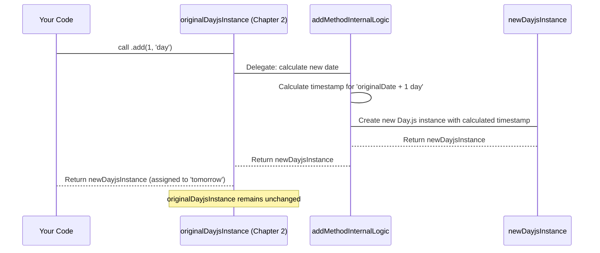

# Chapter 3: Immutable Date Operations

Welcome back! In the [previous chapter on the Day.js Date Instance](chapter_02.md), we explored how to create and access properties of a `Day.js Date Instance` – an object encapsulating a specific date and time. This chapter builds directly on that foundation, diving into one of Day.js's most fundamental and powerful design principles: *immutability* in date operations.

---

### Problem & Motivation

Imagine you're developing a complex calendar application. You have a `currentDate` object representing today. Now, you need to calculate dates for "next week", "previous month", or "tomorrow" for various display purposes, all while ensuring that your `currentDate` object itself *never* changes. If date manipulation methods were mutable (i.e., they modified the original date object), every time you calculated "next week", your `currentDate` would jump forward, leading to unpredictable behavior and hard-to-trace bugs. Debugging such issues in large applications can become a nightmare, as a change in one part of the codebase might inadvertently alter a date object being used elsewhere.

This is precisely the problem Day.js solves with immutable date operations. It ensures that your original date objects remain untouched, providing a consistent and predictable state for your application. This design choice is crucial for building robust applications, especially when dealing with concurrent operations or complex data flows where preserving original data is paramount. For our calendar app, this means we can calculate "next week's date" from `currentDate` without worrying that `currentDate` itself will silently advance.

---

### Core Concept Explanation

At its heart, *immutability* means "unchangeable." When applied to Day.js, it means that any operation you perform on a `Day.js Date Instance` — such as adding days, subtracting months, or moving to the start of a week — will *never* modify the original `Day.js Date Instance`. Instead, these operations return a **brand new `Day.js Date Instance`** that reflects the result of the manipulation.

Think of it like performing arithmetic on a number. If you have the number `5` and you add `2` to it, the number `5` itself doesn't become `7`. Instead, `5 + 2` *results* in `7`, a new value. Day.js treats its date instances in the same way. This design paradigm has several benefits: it makes your code more predictable, easier to reason about, and significantly reduces the likelihood of unintended side effects. It also enables elegant method chaining, as each operation returns a new instance that can immediately have another operation called on it.

---

### Practical Usage Examples

Let's see immutability in action by solving our calendar app's need to calculate different dates from a fixed reference.

First, let's create a base `Day.js Date Instance`:

```javascript
import dayjs from 'dayjs';

// Our immutable reference date
const today = dayjs('2023-10-26T10:00:00');
console.log('Original Date:', today.format());
// Expected output: Original Date: 2023-10-26T10:00:00+XX:XX (timezone will vary)
```
Here, `today` is our starting point. We'll perform operations on it without changing it.

#### Adding Units of Time

The `add()` method allows you to add a specified amount of a unit (like days, months, years, hours, etc.) to a date. Notice how `tomorrow` is a new instance, and `today` remains unchanged.

```javascript
const tomorrow = today.add(1, 'day');
console.log('Tomorrow:', tomorrow.format());
console.log('Is Original Date changed?', today.format());
// Expected output: Tomorrow: 2023-10-27T10:00:00+XX:XX
// Expected output: Is Original Date changed? 2023-10-26T10:00:00+XX:XX
```
As you can see, `today` retains its original value, demonstrating immutability.

#### Subtracting Units of Time

Similarly, the `subtract()` method creates a new `Day.js Date Instance` with the specified units removed.

```javascript
const lastWeek = today.subtract(7, 'day');
console.log('Last Week:', lastWeek.format());
console.log('Original Date after subtract:', today.format());
// Expected output: Last Week: 2023-10-19T10:00:00+XX:XX
// Expected output: Original Date after subtract: 2023-10-26T10:00:00+XX:XX
```
Again, `today` is untouched. `lastWeek` is a brand new object.

#### Getting Start or End of a Unit

Methods like `startOf()` and `endOf()` are also immutable, returning a new instance set to the beginning or end of a specified time unit.

```javascript
const startOfMonth = today.startOf('month');
const endOfDay = today.endOf('day');

console.log('Start of Month:', startOfMonth.format());
console.log('End of Day:', endOfDay.format());
console.log('Original Date after startOf/endOf:', today.format());
// Expected output: Start of Month: 2023-10-01T00:00:00+XX:XX
// Expected output: End of Day: 2023-10-26T23:59:59+XX:XX
// Expected output: Original Date after startOf/endOf: 2023-10-26T10:00:00+XX:XX
```
These methods are incredibly useful for aligning dates to common boundaries, and they do so immutably.

#### Chaining Operations

One of the great benefits of immutability is method chaining. Since each operation returns a new `Day.js Date Instance`, you can immediately call another method on the result.

```javascript
const nextMonthStart = today.add(1, 'month').startOf('month');
console.log('Start of next month:', nextMonthStart.format());
console.log('Original Date after chaining:', today.format());
// Expected output: Start of next month: 2023-11-01T00:00:00+XX:XX
// Expected output: Original Date after chaining: 2023-10-26T10:00:00+XX:XX
```
This chain first adds one month to `today` (creating a new instance for 'next month'), and then calls `startOf('month')` on *that new instance* (creating yet another instance for the start of next month). `today` remains pristine.

---

### Internal Implementation Walkthrough

While Day.js's source code is optimized, the conceptual flow for an immutable operation like `add()` can be visualized as follows:

1.  **Input:** An existing `Day.js Date Instance` (let's call it `originalDate`) and parameters for the operation (e.g., `amount`, `unit` for `add()`).
2.  **Calculation:** The internal logic of the method takes the `originalDate`'s timestamp, applies the requested manipulation (e.g., adds `amount` of `unit`s), and calculates a *new* date and time value.
3.  **New Instance Creation:** Instead of modifying `originalDate`, Day.js uses this newly calculated date/time value to construct and return a **completely new `Day.js Date Instance`**.

This process ensures that no references to `originalDate` are altered.


The `addMethodInternalLogic` is a simplified representation of how Day.js would internally handle the calculation and then delegate the creation of a fresh instance. This abstraction allows Day.js to be performant while maintaining its core immutability principle.

---

### System Integration

Immutable date operations are deeply integrated with the very nature of a `Day.js Date Instance`. Every method designed to modify a date (like `add`, `subtract`, `set`, `startOf`, `endOf`) adheres to this principle, ensuring consistency across the library.

These operations build upon the foundational `Day.js Date Instance` (as covered in [Chapter 2: Day.js Date Instance](chapter_02.md)) by taking an existing instance and effectively "cloning" its internal state, applying a modification to the clone, and then encapsulating this modified state in a *new* `Day.js Date Instance`. This new instance then provides all the same methods for querying and formatting that were discussed in Chapter 2.

Furthermore, these operations often precede interactions with other Day.js features. For example, you might perform several immutable operations to derive a target date, and then pass that resulting `Day.js Date Instance` to a plugin (as will be discussed in [Chapter 5: Day.js Plugins](chapter_05.md)) for more specialized handling or formatting. The `Day.js Object` (as explored in [Chapter 1: The Day.js Object](chapter_01.md)) itself is the entry point to create these initial immutable instances.

---

### Best Practices & Tips

1.  **Always Capture Return Values**: This is the most crucial tip. If you call `date.add(1, 'day')`, the original `date` is *not* modified. You *must* assign the result to a new variable or the original variable.

    ```javascript
    let myDate = dayjs(); // Original date
    myDate.add(1, 'day'); // INCORRECT: myDate is not updated!

    console.log(myDate.format()); // Still the original date

    myDate = myDate.add(1, 'day'); // CORRECT: myDate is reassigned to the new date instance
    console.log(myDate.format()); // Now it's tomorrow
    ```

2.  **Embrace Method Chaining**: Immutability naturally lends itself to chaining. Use it to write concise and readable date manipulations.

    ```javascript
    const complexDate = dayjs()
        .add(2, 'weeks')
        .subtract(5, 'hours')
        .endOf('day');
    console.log(complexDate.format());
    ```

3.  **Use `clone()` for Intentional Copies**: If you need to make a copy of a `Day.js Date Instance` *before* performing operations, `clone()` is your friend. Although operations are immutable, `clone()` explicitly creates a duplicate instance, which can be useful if you're passing dates around and want to ensure even reference integrity isn't an issue.

    ```javascript
    const original = dayjs();
    const copy = original.clone();

    const modifiedCopy = copy.add(1, 'day'); // modifiedCopy is a new instance
    console.log('Original still:', original.format());
    console.log('Copy (unmodified) still:', copy.format());
    console.log('Modified copy:', modifiedCopy.format());
    ```

4.  **Benefits for Debugging and Concurrency**: Understanding immutability makes your code significantly easier to debug, as you don't have to trace where a date object might have been unexpectedly modified. It also makes Day.js instances inherently thread-safe in environments like web workers, as there are no shared mutable states.

---

### Chapter Conclusion

Immutability is a cornerstone of Day.js's design, making it a predictable, reliable, and delightful library to work with for date and time manipulation. By consistently returning new `Day.js Date Instance` objects for every modification, Day.js eliminates common pitfalls associated with mutable date libraries, enabling robust applications and elegant code through method chaining. Embracing this concept is key to leveraging Day.js effectively.

In the next chapter, we will explore how Day.js handles different [Locale Settings](chapter_04.md), allowing you to display and parse dates according to various cultural conventions around the world.