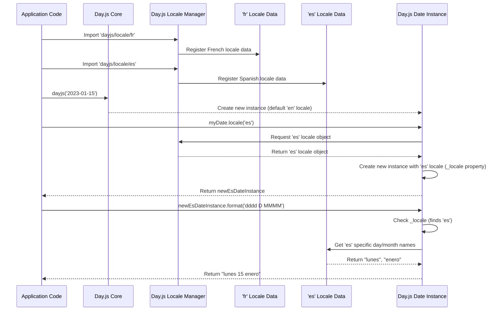

# Chapter 4: Locale Settings

Welcome back! In our previous chapter, [Immutable Date Operations](chapter_03.md), we explored how Day.js ensures that date manipulations always return new instances, preserving the original date object. This immutability is crucial for predictable and robust date management. Now, let's shift our focus to making those dates speak different languages – literally. Day.js provides powerful features for localizing date and time representations, allowing your application to cater to a global audience.

---

### Problem & Motivation

Imagine you're building a web application that needs to display dates to users worldwide. An American user might expect "January 15, 2023" or "01/15/2023", while a French user would prefer "15 janvier 2023" or "15/01/2023", and a German user might see "15. Januar 2023". Without proper localization, your application would display dates in a single, potentially unfamiliar format, leading to confusion and a poor user experience for international users.

This is the core problem that **Locale Settings** in Day.js addresses. It's not just about the order of day, month, and year, but also about the names of months and days of the week, relative time phrases ("2 hours ago"), and even numerical separators. Providing a localized experience is vital for any application aiming for global reach and user satisfaction. Day.js solves this by allowing you to define language-specific formatting rules, ensuring dates and times are presented naturally according to the user's cultural context.

---

### Core Concept Explanation

At its heart, **Locale Settings** in Day.js refers to a collection of language-specific rules and translations used when formatting or displaying dates and times. Think of it as a dictionary and a set of grammar rules for a particular language, specifically tailored for dates. Each locale defines details like:

*   **Month names**: "January", "February" vs. "Janvier", "Février"
*   **Day names**: "Sunday", "Monday" vs. "Dimanche", "Lundi"
*   **Date formats**: "MM/DD/YYYY" vs. "DD/MM/YYYY"
*   **Relative time formats**: "2 hours ago" vs. "il y a 2 heures"
*   **Week start day**: Sunday for US, Monday for many European countries

Day.js comes with English (US) as its default locale. To use other locales, you need to load them explicitly. Once loaded, you can set a *global locale* that affects all subsequent Day.js instances, or you can apply a *locale per instance*, allowing different dates in your application to display in different languages simultaneously without interfering with each other. This flexibility ensures that your date representations are always culturally appropriate.

---

### Practical Usage Examples

Let's see how Day.js's locale settings can be used to solve our motivating problem of displaying dates in different languages.

#### 1. Loading and Setting a Global Locale

First, we need to load the desired locale. Day.js keeps its locale definitions in separate files to maintain its small bundle size. You typically import them and then use `dayjs.locale()` to activate them.

```javascript
import dayjs from 'dayjs';
import 'dayjs/locale/fr'; // Import the French locale

// Get the current date
const now = dayjs();

// Set the global locale to French
dayjs.locale('fr');

// Format the date – now it uses French rules
console.log(now.format('dddd, MMMM D, YYYY'));
// Expected output (e.g.): "lundi, janvier 15, 2023" (if now is Jan 15, 2023)
```
*Explanation*: We import the French locale data, then call `dayjs.locale('fr')` to make French the default language for *all* future Day.js operations. The `.format()` method then automatically uses the French month and day names.

#### 2. Reverting to the Default (or another) Global Locale

You can change the global locale as many times as needed. If you want to go back to the default English locale (or any other loaded locale), just call `dayjs.locale()` again.

```javascript
import dayjs from 'dayjs';
import 'dayjs/locale/es'; // Import Spanish locale

// Set global locale to Spanish
dayjs.locale('es');
const spanishDate = dayjs();
console.log(spanishDate.format('dddd, D MMMM YYYY'));
// Expected output (e.g.): "lunes, 15 enero 2023"

// Revert to English (default)
dayjs.locale('en');
const englishDate = dayjs();
console.log(englishDate.format('dddd, D MMMM YYYY'));
// Expected output (e.g.): "Monday, 15 January 2023"
```
*Explanation*: We first set the global locale to Spanish, format a date, and then set it back to English. Notice how the output changes based on the active global locale at the time of formatting.

#### 3. Setting a Locale Per-Instance

Sometimes, you need to display dates in different languages *within the same application context*, without affecting other dates. Day.js allows you to set a locale for a specific date instance using the `.locale()` method on the instance itself.

```javascript
import dayjs from 'dayjs';
import 'dayjs/locale/de'; // Import German locale
import 'dayjs/locale/it'; // Import Italian locale

const someDate = dayjs('2023-01-15');

// Create a German instance
const germanDate = someDate.locale('de');
console.log('German:', germanDate.format('dddd, D. MMMM YYYY'));
// Expected output: "German: Sonntag, 15. Januar 2023"

// Create an Italian instance
const italianDate = someDate.locale('it');
console.log('Italian:', italianDate.format('dddd, D MMMM YYYY'));
// Expected output: "Italian: domenica, 15 gennaio 2023"

// Original instance remains unaffected by global or instance changes
console.log('Original:', someDate.format('dddd, D MMMM YYYY'));
// Expected output: "Original: Sunday, 15 January 2023" (assuming default 'en')
```
*Explanation*: We create a base `dayjs` instance. Then, we use `.locale('de')` and `.locale('it')` *on that instance* to create *new* instances that are configured with German and Italian locales, respectively. The original `someDate` instance remains in the default English locale because of Day.js's immutability principle.

#### 4. Getting Locale Data

You can also access the raw locale data registered with Day.js, which can be useful for dynamic UI elements like dropdowns for month names.

```javascript
import dayjs from 'dayjs';
import 'dayjs/locale/fr';

// Get the full locale object for 'fr'
const frLocaleData = dayjs.localeData('fr');

console.log('French month names:', frLocaleData.months());
// Expected output: ["janvier", "février", "mars", ...]

console.log('French week start day:', frLocaleData.firstDayOfWeek());
// Expected output: 1 (Monday)
```
*Explanation*: `dayjs.localeData('fr')` retrieves the complete locale object for the specified language. This object provides methods like `.months()` to get an array of month names or `.firstDayOfWeek()` to determine which day the week starts on for that locale.

---

### Internal Implementation Walkthrough

Let's peek under the hood to understand how Day.js manages locales.

1.  **Locale Registration**: When you `import 'dayjs/locale/fr';`, a JavaScript file containing the French locale definition is executed. This file typically calls `dayjs.locale(localeObject, null, true);` internally. This registers the `localeObject` (which contains month names, day names, format rules, etc.) with Day.js under the key 'fr'.

2.  **`dayjs.locale(key)` - Global Switch**: When you call `dayjs.locale('fr')`, Day.js looks up the registered locale object for 'fr'. It then sets this object as the *currently active global locale*. All new `dayjs()` instances created afterward will inherit this global locale by default.

3.  **`dayjs().locale(key)` - Instance-Specific**: When you call `.locale('de')` on a specific `dayjs` instance, like `myDate.locale('de')`, Day.js creates a *new* `dayjs` instance. This new instance is a copy of `myDate` but has its `_locale` property set to the German locale object. The original `myDate` instance remains untouched, preserving its original locale setting due to immutability.

4.  **Formatting**: When you call `.format()` on a `dayjs` instance, the method first checks if the instance has an `_locale` property specifically set. If it does, it uses that locale object for formatting. If not, it falls back to the *globally active locale*. The format string (e.g., `'dddd, MMMM D, YYYY'`) is then parsed, and corresponding locale-specific values (like `dddd` mapping to full day name) are retrieved from the selected locale object.

Here's a simplified sequence diagram illustrating the flow for setting an instance-specific locale and then formatting:



---

### System Integration

Locale settings are fundamental to how Day.js interacts with its core data structures and methods:

*   **[Day.js Date Instance](chapter_02.md)**: Every `Day.js Date Instance` either inherits the global locale or has its own specific locale assigned. When you call methods like `.format()`, `.fromNow()`, or `.calendar()` on a date instance, these methods query the instance's active locale to get the correct language-specific strings and formatting rules. The locale data directly influences the *output representation* of the date.

*   **[Day.js Plugins](chapter_05.md)**: Many Day.js plugins, especially those dealing with advanced formatting, relative time, or internationalization, rely heavily on locale data. For example, the `relativeTime` plugin uses the locale to determine phrases like "a few seconds ago" or "in 2 months". These plugins extend the functionality of the `Day.js Date Instance` and will honor the active locale of the instance they operate on.

Data flow for locale settings is straightforward: Locale data files are loaded and registered with a central Day.js locale manager. This manager provides the necessary locale objects when requested by the `dayjs()` constructor or by a `dayjs` instance via its `.locale()` method. The chosen locale then guides all display-related operations for that specific date instance or globally.

---

### Best Practices & Tips

1.  **Load Only What You Need**: Don't import all locales if your application only supports a few. Each imported locale increases your bundle size. Use dynamic imports if locales are loaded on demand.
    ```javascript
    // Bad: Large bundle
    // import 'dayjs/locale/*';

    // Good: Only necessary locales
    import 'dayjs/locale/fr';
    import 'dayjs/locale/de';
    ```

2.  **Avoid Global Locale Changes in Libraries**: If you're building a reusable component or library, avoid calling `dayjs.locale()` globally, as it will affect other parts of the application using Day.js. Instead, use instance-specific `.locale()` methods to ensure your component is self-contained.
    ```javascript
    // In a reusable component
    const myLocalizedDate = dayjs(someInput).locale('fr');
    console.log(myLocalizedDate.format('LL')); // Will be in French
    // Global locale remains unaffected
    ```

3.  **Detect User's Language**: In a real-world application, you'd typically detect the user's preferred language (e.g., from browser settings, user profile) and then dynamically load and set the appropriate Day.js locale.

4.  **Fallback Mechanism**: If a requested locale isn't available, Day.js will typically fall back to the default English locale. Always ensure you have English loaded as a base.

5.  **Caching Loaded Locales**: Day.js automatically caches loaded locales, so repeated calls to `dayjs.locale('fr')` after the initial import are efficient.

---

### Chapter Conclusion

Locale settings are a cornerstone of building internationalized applications with Day.js. You've learned how to load locale data, set global and instance-specific locales, and understand how Day.js uses this data for formatting. The immutability principle ensures that setting an instance-specific locale doesn't inadvertently alter other date objects, providing robust and predictable behavior.

Next, we'll dive into another powerful feature that enhances Day.js's capabilities: its **plugin system**. This allows you to extend the core library with advanced functionalities like relative time, timezones, and more, further solidifying Day.js as a versatile date utility.

Continue to: [Day.js Plugins](chapter_05.md)