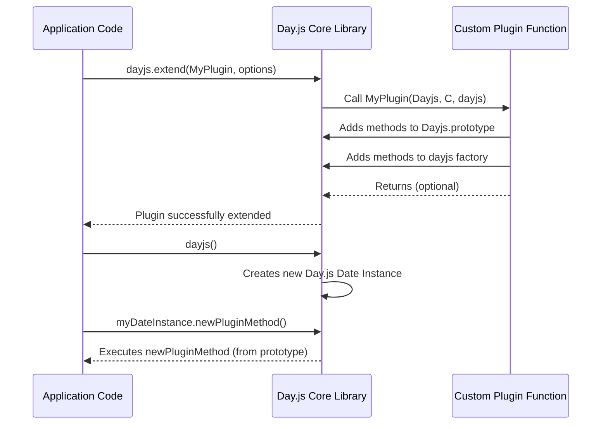

# Chapter 5: Day.js Plugins

Having explored the foundational aspects of Day.js, from creating [The Day.js Object](chapter_01.md) and manipulating [Day.js Date Instance](chapter_02.md) with [Immutable Date Operations](chapter_03.md), to customizing their display through [Locale Settings](chapter_04.md), we now arrive at a cornerstone of Day.js's design philosophy: its robust plugin system. While `Locale Settings` allow for adapting existing functionalities to different cultures, plugins empower Day.js to grow beyond its minimalist core, adding entirely new capabilities without bloating the base library.

---

### Problem & Motivation

The core philosophy of Day.js is to be as lightweight and performant as possible. This means that many advanced date and time functionalities, while incredibly useful, are not included in the default bundle. Imagine a scenario where you need to calculate the *duration* between two dates, or parse a date string that includes a *timezone* offset, or even work with complex *relative time* expressions like "in 5 minutes." Without these features, developers would have to implement them manually, leading to repetitive code, potential errors, and a larger project footprint if third-party libraries were used instead.

This is where Day.js plugins become indispensable. They solve the problem of feature creep by providing a modular way to extend the library. Instead of a monolithic date library packed with every conceivable feature, Day.js offers a minimalist core that developers can *selectively augment* with only the functionalities they need. This keeps the initial bundle size small, ensuring faster load times and better performance for most applications. For instance, if your project needs to calculate the difference between two timestamps, the `duration` plugin offers an elegant and efficient solution without adding unnecessary code for features like complex formatting or timezone handling that your project might not require.

Let's consider a common use case: determining the remaining time until a specific event. For example, showing a countdown like "2 hours, 30 minutes, and 15 seconds left." The core Day.js library can easily get the current time and the event time, but calculating and formatting the *duration* between them requires additional logic. This problem perfectly illustrates why Day.js embraces a plugin-based architecture – to deliver powerful, yet optional, capabilities that keep the main library concise and focused.

---

### Core Concept Explanation

At its heart, the Day.js plugin system is a mechanism for extending the `dayjs` object (the main factory function) and the `Day.js Date Instance` (the object returned by `dayjs()`). A *plugin* is essentially a JavaScript function that, when passed to `dayjs.extend()`, adds new methods or properties to Day.js. This design allows developers to pick and choose advanced features, keeping their application's bundle size minimal.

Think of the Day.js core as a versatile multi-tool with only the most essential functions – a screwdriver, perhaps. While it's great for common tasks, you might occasionally need a saw, a wrench, or a pair of pliers. Instead of buying a completely new, heavier multi-tool that includes all these, Day.js provides a way to *attach* these additional tools (plugins) as needed. This means you only carry the extra weight when you actually need that specific tool.

Key terminology revolves around the `dayjs.extend()` method. This is the global function you call to "load" a plugin. When you call `dayjs.extend(myPlugin)`, `myPlugin` is executed internally by Day.js, receiving references to the main `Dayjs` constructor and the `dayjs` factory function. Inside the plugin function, you can then add new methods directly to `Dayjs.prototype` (for instance-specific methods like `addDuration()`) or to the `dayjs` factory itself (for static methods like `dayjs.duration()`). This allows for seamless integration, making the new functionalities feel like native Day.js features.

---

### Practical Usage Examples

Let's tackle our motivating use case: calculating and displaying the duration until an event. For this, we'll use the official Day.js `duration` plugin.

First, you need to install the `duration` plugin (if you haven't already). This is typically done via npm:

```bash
npm install dayjs @dayjs/plugin-duration
```
This command adds the `duration` plugin package to your project, making it available for import.

Now, let's see how to use it to calculate the time left until an event.

```javascript
// Import Day.js and the duration plugin
import dayjs from 'dayjs';
import duration from 'dayjs/plugin/duration';

// Extend Day.js with the duration plugin
dayjs.extend(duration);

const now = dayjs();
const futureEvent = dayjs('2024-12-25T10:00:00'); // Christmas Day 2024

// Calculate the duration between now and the event
const timeLeft = dayjs.duration(futureEvent.diff(now));

console.log(`Time until event (in milliseconds): ${futureEvent.diff(now)}`);
// Expected output: Time until event (in milliseconds): [a large number of milliseconds]
console.log(`Time left: ${timeLeft.humanize()}`);
// Expected output: Time left: in X months (or similar, depending on current date)
```
In this example:
1. We first `import` both the core `dayjs` library and the `duration` plugin.
2. The crucial step is `dayjs.extend(duration);`. This line tells Day.js to load and activate the duration plugin, making its features available.
3. We then create two `Day.js Date Instance` objects: `now` and `futureEvent`.
4. `futureEvent.diff(now)` calculates the difference in milliseconds, which is a raw number.
5. `dayjs.duration(...)` then converts this raw millisecond difference into a `Day.js Duration Object`, which is a special object provided by the plugin.
6. Finally, `timeLeft.humanize()` is a method *added by the duration plugin* that formats the duration into a human-readable string like "in 2 months" or "3 days ago." This method wouldn't exist without the plugin.

Let's refine the output to show a more detailed breakdown:

```javascript
import dayjs from 'dayjs';
import duration from 'dayjs/plugin/duration';

dayjs.extend(duration);

const now = dayjs();
const futureEvent = dayjs('2024-12-25T10:00:00'); // Christmas Day 2024

const diffInMs = futureEvent.diff(now);
const timeLeft = dayjs.duration(diffInMs);

console.log(`Days: ${timeLeft.days()}`);
console.log(`Hours: ${timeLeft.hours()}`);
console.log(`Minutes: ${timeLeft.minutes()}`);
console.log(`Seconds: ${timeLeft.seconds()}`);
// Expected output:
// Days: X (number of full days remaining)
// Hours: Y (number of full hours remaining after days)
// Minutes: Z (number of full minutes remaining after hours)
// Seconds: W (number of full seconds remaining after minutes)
```
This demonstrates how the `duration` plugin adds methods like `days()`, `hours()`, `minutes()`, and `seconds()` to the duration object, allowing precise extraction of time components. These methods provide a structured way to access the calculated time difference, making it easy to build custom countdown displays.

---

### Internal Implementation Walkthrough

Understanding how `dayjs.extend()` works internally is key to appreciating Day.js's modularity. When you call `dayjs.extend(pluginFunction, options)`, Day.js performs a series of steps to integrate the new functionality.

1.  **Plugin Invocation**: Day.js takes the `pluginFunction` you provided and executes it. This function typically receives three arguments:
    *   `Dayjs`: The constructor function for `Day.js Date Instance` objects. This is often named `Dayjs` (capital D) inside plugins.
    *   `C`: The configuration object, which might be `undefined` or contain global settings.
    *   `dayjs`: The main `dayjs` factory function (lowercase d).

2.  **Extension Logic**: Inside the `pluginFunction`, the plugin developer writes code to add new methods or properties. Most commonly, this involves modifying `Dayjs.prototype` to add instance methods (e.g., `myDateInstance.isLeapYear()`) or modifying the `dayjs` factory directly to add static methods (e.g., `dayjs.myUtilityMethod()`).

3.  **Registration**: Day.js doesn't just execute the function once; it intelligently registers it. If the plugin adds methods that modify the `Dayjs` prototype, these modifications persist for all `Day.js Date Instance` objects created *after* the plugin has been loaded.

Let's visualize this process with a simplified sequence diagram:


This diagram illustrates that `dayjs.extend()` acts as a bridge, allowing your `MyPlugin` code to directly interact with and modify the internal structure (`Dayjs.prototype`, `dayjs` factory) of the core library. This is a powerful, yet controlled, way to achieve extensibility.

For example, a simple custom plugin to add an `isLeapYear` method might look like this internally:

```javascript
// Inside a plugin file (e.g., 'myLeapYearPlugin.js')
export default function (Dayjs, C, dayjs) {
  // Add an instance method to the Day.js Date Instance prototype
  Dayjs.prototype.isLeapYear = function () {
    const year = this.year(); // 'this' refers to the Day.js Date Instance
    return (year % 4 === 0 && year % 100 !== 0) || year % 400 === 0;
  };

  // Optionally, add a static method to the dayjs factory
  dayjs.isLeapYear = function (year) {
    return (year % 4 === 0 && year % 100 !== 0) || year % 400 === 0;
  };
}
```
When you call `dayjs.extend(myLeapYearPlugin)`, this function runs, and the `isLeapYear` method becomes available on every `Day.js Date Instance` object, and as a static method on the `dayjs` factory function.

---

### System Integration

Plugins are designed to integrate seamlessly with the existing Day.js ecosystem. They primarily extend two key components:

1.  **The `dayjs` factory function ([The Day.js Object](chapter_01.md))**: Plugins can add new static methods directly to the `dayjs` object. For example, the `duration` plugin adds `dayjs.duration()`, allowing you to create duration objects without needing a date instance first. Other plugins might add `dayjs.localeData()` for more advanced locale information or `dayjs.utc()` for timezone handling.
    ```javascript
    import dayjs from 'dayjs';
    import duration from 'dayjs/plugin/duration';
    dayjs.extend(duration);

    // Using a static method added by a plugin
    const d = dayjs.duration(1000, 'milliseconds');
    console.log(d.humanize()); // Expected output: a few seconds
    ```

2.  **The `Day.js Date Instance` prototype ([Day.js Date Instance](chapter_02.md))**: Most plugins add instance methods that operate on a specific date object. For example, the `isLeapYear` example we discussed earlier adds a method `myDate.isLeapYear()`. The `duration` plugin, when used in conjunction with a date instance, uses the `diff()` method which is part of the core, and then converts its output into a `Day.js Duration Object` which has its own set of methods.
    ```javascript
    import dayjs from 'dayjs';
    import isBetween from 'dayjs/plugin/isBetween'; // A different plugin example
    dayjs.extend(isBetween);

    const date = dayjs('2024-06-15');
    const start = dayjs('2024-06-01');
    const end = dayjs('2024-06-30');

    // Using an instance method added by a plugin
    console.log(date.isBetween(start, end)); // Expected output: true
    ```
    This shows how the `isBetween` plugin adds a method to the `Day.js Date Instance` prototype, allowing you to call it directly on any date object.

Plugins maintain the core design principles of Day.js, including [Immutable Date Operations](chapter_03.md). When a plugin method modifies a date (e.g., adding or subtracting time in a specialized way), it typically returns a *new* `Day.js Date Instance` object, leaving the original unaffected. This consistent behavior ensures predictable data flow and avoids side effects, making it easier to reason about date manipulations in your application.

---

### Best Practices & Tips

To get the most out of Day.js plugins while maintaining performance and code clarity, consider these best practices:

*   **Load Only What You Need**: The primary benefit of Day.js's plugin system is its modularity. Only `import` and `extend` the plugins your application genuinely requires. Loading unnecessary plugins will increase your bundle size, negating one of Day.js's key advantages.
*   **Load Plugins Early**: Always call `dayjs.extend()` for all your required plugins at the beginning of your application's entry point, *before* you start creating and manipulating Day.js objects. If you try to use a plugin method before its corresponding plugin has been loaded, you will encounter a "method not found" error.
    ```javascript
    // Correct: Load plugins first
    import dayjs from 'dayjs';
    import duration from 'dayjs/plugin/duration';
    dayjs.extend(duration);
    const d = dayjs.duration(10, 'minutes'); // Works!

    // Incorrect (would throw an error if duration plugin wasn't already loaded)
    // import dayjs from 'dayjs';
    // const d = dayjs.duration(10, 'minutes'); // Error! `dayjs.duration` is not a function
    // import duration from 'dayjs/plugin/duration';
    // dayjs.extend(duration);
    ```
*   **Avoid Name Collisions**: When developing custom plugins, be mindful of existing method names in Day.js or other plugins. While Day.js's plugin architecture handles some conflicts, explicitly avoiding them makes your code more robust.
*   **Organize Plugin Imports**: In larger projects, you might have many plugins. Grouping your `import` and `dayjs.extend()` calls in a single file (e.g., `dayjs-plugins.js`) and importing that file into your main application entry can improve readability and maintainability.
*   **Read Plugin Documentation**: Each official plugin (and good third-party ones) comes with its own documentation. Understand the specific API, options, and limitations of each plugin you use.

---

### Chapter Conclusion

Day.js plugins are a testament to the library's elegant design, balancing a tiny core with immense extensibility. By externalizing specialized functionalities into optional modules, Day.js empowers developers to tailor the library precisely to their project's needs, ensuring minimal bundle sizes and optimal performance. We've seen how plugins solve the challenge of adding complex features like duration calculations, how they integrate by extending the `dayjs` factory and `Day.js Date Instance` prototype, and the best practices for their efficient use.

This chapter concludes our comprehensive journey through Day.js. From the fundamental creation of [The Day.js Object](chapter_01.md) to understanding [Day.js Date Instance](chapter_02.md), mastering [Immutable Date Operations](chapter_03.md), customizing with [Locale Settings](chapter_04.md), and finally extending its capabilities with plugins, you now possess a solid foundation for leveraging Day.js in your modern JavaScript applications. The modularity provided by the plugin system ensures that Day.js remains a lightweight, powerful, and adaptable choice for all your date and time manipulation needs.