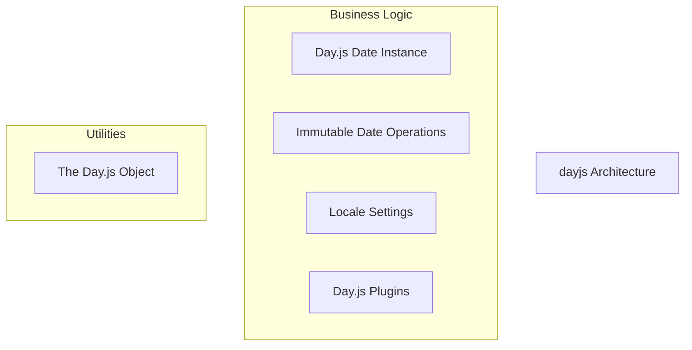
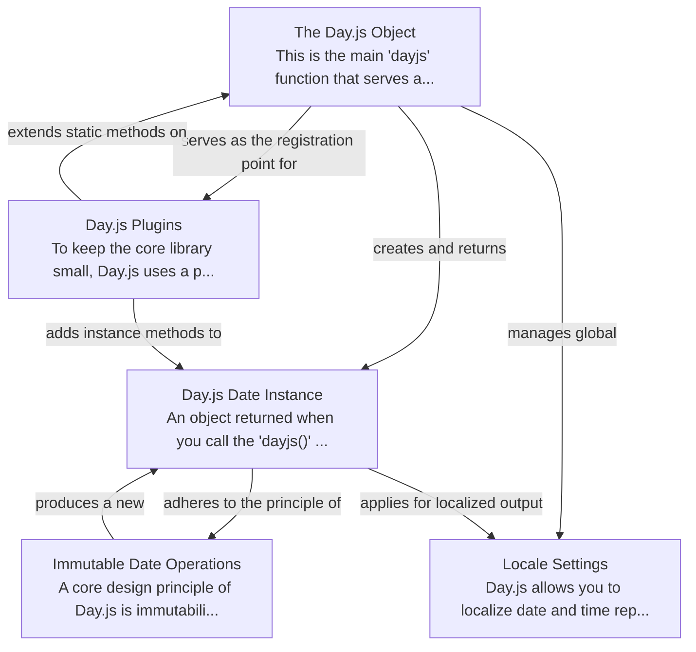

# dayjs Tutorial

Welcome to the comprehensive tutorial for dayjs. This tutorial is automatically generated from the codebase to help you understand the core concepts and implementation patterns.

## Project Overview

Day.js is a lightweight, immutable date library designed for parsing, validating, manipulating, and displaying dates and times in modern JavaScript applications. It features a minimalist core that is highly extensible through a robust plugin system, allowing developers to add advanced functionalities while keeping the bundle size small.

## System Architecture

## Component Relationships

## Table of Contents

1. [Chapter 1: The Day.js Object](chapter_01.md) - Comprehensive documentation for The Day.
2. [Chapter 2: Day.js Date Instance](chapter_02.md) - Comprehensive documentation for Day.
3. [Chapter 3: Immutable Date Operations](chapter_03.md) - Comprehensive documentation for Immutable Date Operations following structured methodology...
4. [Chapter 4: Locale Settings](chapter_04.md) - Comprehensive documentation for Locale Settings following structured methodology...
5. [Chapter 5: Day.js Plugins](chapter_05.md) - Comprehensive documentation for Day.

## How to Use This Tutorial

1. **Start with Chapter 1** to understand the foundational concepts
2. **Follow the sequence** - each chapter builds upon previous concepts
3. **Practice with code examples** - every chapter includes practical examples
4. **Refer to diagrams** - use architecture diagrams for visual understanding
5. **Cross-reference concepts** - chapters link to related topics

## Tutorial Features

- **Progressive Learning**: Concepts are introduced in logical order
- **Code Examples**: Every chapter includes practical, executable code
- **Visual Diagrams**: Mermaid diagrams illustrate complex relationships
- **Cross-References**: Easy navigation between related concepts
- **Beginner-Friendly**: Written for newcomers to the codebase

## Contributing

This tutorial is auto-generated from the codebase. To improve it:
1. Update the source code documentation
2. Add more detailed comments to key functions
3. Regenerate the tutorial using the documentation system

---

*Generated using AI-powered codebase analysis*
