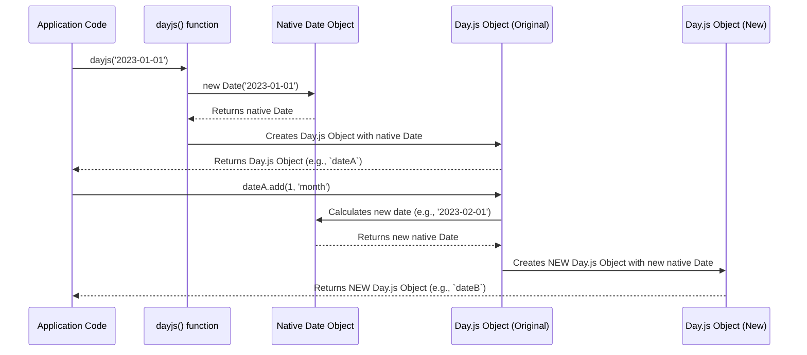

# Chapter 1: The Day.js Object

This is the first chapter in our tutorial series for Day.js. We're excited to begin our journey by exploring the foundational concept of this powerful library.

---

### Problem & Motivation

Working with dates and times in JavaScript can often be a source of frustration. The native `Date` object, while functional, has a notoriously cumbersome API for common operations like formatting, adding or subtracting time, and complex comparisons. Developers frequently encounter issues with inconsistent parsing across browsers, verbose syntax, and the inherent mutability of the native `Date` object, which can lead to unexpected side effects in larger applications.

This complexity leads to bugs, increased development time, and difficult-to-maintain codebases when applications need to handle even slightly advanced date logic. The need for a simple, predictable, and efficient way to manage dates is paramount for virtually any modern web application, from scheduling tools to e-commerce platforms.

Day.js steps in to solve these problems by providing a lean, consistent, and intuitive API for date manipulation. At its core, Day.js introduces the 'Day.js Object' – an immutable wrapper around the native `Date` object. This object streamlines all date-related tasks, making them easier to read, write, and reason about. For instance, imagine needing to display the current date in a specific format, then calculating a date 7 days from now, and finally checking if that future date falls within a certain period. Without Day.js, this can be lengthy and error-prone; with it, it becomes a few concise method calls.

---

### Core Concept Explanation

The **Day.js Object** is the central pillar of the Day.js library. Think of it as a specialized, smart container designed specifically to hold and manage a single point in time (a date and time). When you create a Day.js Object, it encapsulates a specific `Date` value, offering a rich set of methods to interact with that date in a predictable and developer-friendly manner.

A crucial characteristic of the Day.js Object is its **immutability**. This means that any operation you perform on a Day.js Object, such as adding days or formatting it, does not change the original object. Instead, these operations return an *entirely new* Day.js Object with the updated date value. This immutability is a key feature that prevents side effects and makes your date logic much safer and easier to debug, especially in asynchronous or component-based applications.

You create a Day.js Object by simply calling the `dayjs()` function. This function can be called without arguments to get the current date and time, or it can accept various inputs like strings, numbers, or even native `Date` objects to parse a specific date. Once you have a Day.js Object, you can chain multiple methods together, making your code concise and expressive. This powerful object allows you to parse dates from different formats, validate if a date is valid, manipulate dates (add/subtract time), and format dates into human-readable strings, all with a consistent and easy-to-learn API.

---

### Practical Usage Examples

Let's walk through some practical examples using the Day.js Object, addressing our motivating use case of displaying, manipulating, and comparing dates.

#### Creating Your First Day.js Object

The simplest way to get started is by creating a Day.js object representing the current date and time.

```javascript
import dayjs from 'dayjs';

// Create a Day.js object for the current date and time
const now = dayjs();

console.log(now);
// Expected output: A Day.js object representing the current date and time
// (e.g., Dayjs { "$D": 15, "$M": 6, "$y": 2023, ... })
```
Here, `dayjs()` is called without any arguments, which defaults to creating an object for the current moment.

#### Formatting Dates

One of the most common tasks is displaying dates in a user-friendly format. The `format()` method allows you to do just that using a flexible token-based system.

```javascript
import dayjs from 'dayjs';

const now = dayjs();

// Format the current date into "YYYY-MM-DD HH:mm:ss"
const formattedDate = now.format('YYYY-MM-DD HH:mm:ss');
console.log(formattedDate);
// Expected output: "2023-07-15 14:30:45" (example)

// Format in a more readable style: "D MMMM, YYYY"
const readableDate = now.format('D MMMM, YYYY');
console.log(readableDate);
// Expected output: "15 July, 2023" (example)
```
The `format()` method takes a string where specific tokens like `YYYY`, `MM`, `DD`, `HH`, `mm`, `ss` are replaced by the corresponding date parts.

#### Manipulating Dates (Adding/Subtracting Time)

The `add()` and `subtract()` methods are incredibly useful for calculating future or past dates. Remember, these methods return *new* Day.js objects due to immutability.

```javascript
import dayjs from 'dayjs';

const today = dayjs('2023-07-15'); // Start with a specific date

// Add 7 days to today
const sevenDaysLater = today.add(7, 'day');
console.log(sevenDaysLater.format('YYYY-MM-DD'));
// Expected output: "2023-07-22"

// Subtract 2 months from today
const twoMonthsAgo = today.subtract(2, 'month');
console.log(twoMonthsAgo.format('YYYY-MM-DD'));
// Expected output: "2023-05-15"
```
The `add()` and `subtract()` methods take two arguments: the amount to add/subtract and the unit of time (e.g., 'day', 'month', 'year', 'hour').

#### Comparing Dates

Day.js provides intuitive methods like `isBefore()`, `isAfter()`, and `isSame()` to compare two Day.js objects.

```javascript
import dayjs from 'dayjs';

const dateA = dayjs('2023-01-01');
const dateB = dayjs('2023-06-15');
const dateC = dayjs('2023-01-01');

console.log(dateA.isBefore(dateB)); // Is dateA before dateB?
// Expected output: true

console.log(dateB.isAfter(dateA)); // Is dateB after dateA?
// Expected output: true

console.log(dateA.isSame(dateC)); // Is dateA the same as dateC?
// Expected output: true
```
These methods return a boolean (`true` or `false`), making conditional logic around dates very straightforward.

#### Getting Parts of a Date

You can extract specific parts of a date, like the year, month, or day of the week, using `get()` or dedicated methods.

```javascript
import dayjs from 'dayjs';

const myDate = dayjs('2023-07-15T10:30:00');

console.log('Year:', myDate.year());
// Expected output: Year: 2023

console.log('Month (0-indexed):', myDate.month());
// Expected output: Month (0-indexed): 6 (July is the 7th month, 0-indexed is 6)

console.log('Day of Week (0=Sunday):', myDate.day());
// Expected output: Day of Week (0=Sunday): 6 (Saturday)

console.log('Hour:', myDate.hour());
// Expected output: Hour: 10
```
These methods offer direct access to various components of the date, simplifying common data extraction tasks.

---

### Internal Implementation Walkthrough

At its core, the Day.js Object is a sophisticated wrapper around the native JavaScript `Date` object. When you call `dayjs()`, the library performs several key steps to construct this immutable object.

1.  **Input Parsing**: The `dayjs()` function first inspects its arguments. If no arguments are provided, it initializes a native `new Date()` object representing the current time. If arguments like strings, numbers, or `Date` objects are given, Day.js intelligently parses them into a valid `Date` instance. This parsing mechanism is more robust and consistent than the native `Date` parser across different environments.

2.  **Object Instantiation**: Once a valid native `Date` object is obtained, Day.js creates a new instance of its internal `Dayjs` class (or similar structure). This `Dayjs` instance stores the native `Date` object internally.

3.  **Method Binding**: The `Dayjs` instance is then populated with all the convenient methods like `format()`, `add()`, `subtract()`, `isBefore()`, etc. These methods are designed to operate on the internal native `Date` object.

4.  **Immutability Enforcement**: Crucially, any method that modifies the date (e.g., `add()`, `subtract()`) does not alter the internal `Date` object of the *current* `Dayjs` instance. Instead, it calculates the new date value, creates a *brand new* native `Date` object for this new value, and then returns a *new Day.js Object* encapsulating this new date. This ensures the original `Day.js Object` remains unchanged.

The process can be visualized as follows:


This design, particularly the immutability, is a cornerstone of Day.js, contributing to its predictability and ease of use. While you don't directly interact with the internal `Date` object, understanding this pattern helps clarify why operations return new instances. You can find the core logic for object creation and method definition typically within the main `dayjs/index.js` or `dayjs/src/index.js` files in the library's source code.

---

### System Integration

The Day.js Object is the nucleus around which the entire Day.js ecosystem revolves. Its core functionality for parsing, manipulating, and formatting dates is essential for any interaction with time.

While the Day.js Object is powerful on its own, its true extensibility shines when integrated with other core components of the Day.js library:

*   **[Locales](chapter_02.md)**: The Day.js Object itself is locale-aware. When you format a date, for instance, the output for month names or day names depends on the currently active locale. The Day.js Object queries the active locale settings to render dates appropriately for different languages and regions. This means a single Day.js Object can be formatted differently simply by changing the global locale setting or by passing a locale to the `format` method (if a plugin supports it).

*   **[Plugins](chapter_03.md)**: The modular design of Day.js allows you to extend the capabilities of the Day.js Object through plugins. Plugins effectively add new methods or override existing ones on the Day.js prototype. For example, a plugin for parsing ISO Week dates would add a method like `.isoWeek()` directly to the Day.js Object, allowing you to chain it like any other core method (e.g., `dayjs().isoWeek()`). This allows the Day.js Object to remain lightweight by default, while still being highly adaptable for advanced use cases without bloating its core.

The data flow is typically unidirectional from `dayjs()` function calls to the creation of Day.js Objects, which then interact with `Locales` for cultural rendering and utilize `Plugins` to enhance their operational capabilities.

---

### Best Practices & Tips

To get the most out of the Day.js Object, consider these best practices:

*   **Embrace Immutability**: Always remember that methods like `add()`, `subtract()`, `startOf()`, `endOf()`, etc., return *new* Day.js objects. If you forget to assign the result to a new variable, your changes will be lost.
    ```javascript
    let d = dayjs(); // Original object
    d.add(1, 'day'); // This operation doesn't change `d`
    console.log(d.format('YYYY-MM-DD')); // Still today's date

    // Correct way:
    let newD = d.add(1, 'day'); // Assign the new object
    console.log(newD.format('YYYY-MM-DD')); // Tomorrow's date
    ```

*   **Chain Methods for Readability**: Day.js's immutable nature makes method chaining very elegant and readable.
    ```javascript
    // Instead of:
    const startOfMonth = dayjs().startOf('month');
    const twoDaysLater = startOfMonth.add(2, 'day');
    console.log(twoDaysLater.format('MMMM D, YYYY'));

    // Do this:
    console.log(dayjs().startOf('month').add(2, 'day').format('MMMM D, YYYY'));
    ```

*   **Validate Input Dates**: If you're parsing dates from user input or external sources, it's a good practice to check if the resulting Day.js object is valid using `isValid()`.
    ```javascript
    const validDate = dayjs('2023-01-01');
    const invalidDate = dayjs('not-a-date');

    console.log(validDate.isValid()); // true
    console.log(invalidDate.isValid()); // false
    ```

*   **Prefer UTC for Storing, Local for Display**: When dealing with dates across timezones, it's often best practice to store dates in UTC (using `dayjs.utc()`) and convert them to the user's local timezone only for display purposes. This avoids common timezone-related bugs.

*   **Performance Considerations**: Day.js is incredibly lightweight. Its small bundle size and efficient operations contribute to excellent performance. However, in extremely performance-critical loops, creating millions of Day.js objects could have a minimal overhead. For most web applications, this is not a concern, and the benefits of its API far outweigh any minor overhead.

---

### Chapter Conclusion

In this chapter, we've taken a deep dive into the **Day.js Object**, the fundamental building block of the Day.js library. We've understood its core purpose as an immutable wrapper for native JavaScript dates, designed to simplify complex date operations. We explored how to create, format, manipulate, and compare these objects through practical, beginner-friendly examples, and briefly looked at its internal mechanics and how it champions immutability. Finally, we covered best practices to ensure you write robust and readable date logic.

The Day.js Object, with its consistent API and immutable design, eliminates many of the headaches traditionally associated with date handling in JavaScript. It provides a stable and predictable foundation for all your time-related needs.

Now that you have a solid grasp of the Day.js Object, we'll expand our understanding by exploring how Day.js handles different languages and regional formatting.

Next, we will explore: [Locales](chapter_02.md)