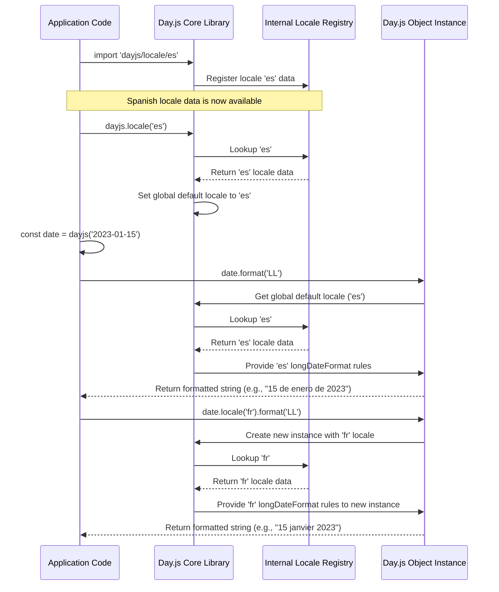

# Chapter 2: Locales

In the previous chapter, we explored the foundational building block of Day.js: [The Day.js Object](chapter_01.md). We learned how to create immutable date objects and perform basic manipulations. However, dates and times are not universally represented; their appearance and phrasing differ significantly across cultures and languages. This is precisely where Day.js's powerful **Locales** system comes into play, enabling your applications to speak the language of your users.

---

### Problem & Motivation

Imagine you're developing a global application that needs to display a date like "January 15, 2023" to users worldwide. While this format is common in English-speaking regions, it would be presented as "15 de enero de 2023" in Spanish, "15. Januar 2023" in German, or even with different calendar systems in other cultures. Without a robust mechanism to handle these variations, your application would fail to provide a localized, user-friendly experience, leading to confusion and dissatisfaction.

This is the core problem that Day.js Locales solve. They are essential for any application that targets a diverse audience, ensuring that date and time information is presented in a culturally appropriate and intelligible manner. For instance, consider displaying "2 days ago" in an activity feed. In French, this would be "il y a 2 jours," requiring more than just changing month or day names – it involves entirely different grammatical structures for relative time. Day.js Locales abstract away this complexity, allowing developers to focus on functionality while the library handles the internationalization (i18n) details.

---

### Core Concept Explanation

At its heart, a Day.js **Locale** is an object that encapsulates culture-specific formatting rules, names, and phrases for dates and times. Think of it as a dictionary and a grammar guide for a specific language or region. When you ask a Day.js object to format itself, it consults the currently active locale to get the correct names for months, days of the week, short-hand date formats, and even the relative time phrases (like "a few seconds ago" or "in 2 months").

Each locale object defines properties such as:

*   `months`: An array of full month names (e.g., `['January', 'February', ...]`).
*   `monthsShort`: An array of abbreviated month names (e.g., `['Jan', 'Feb', ...]`).
*   `weekdays`: An array of full weekday names (e.g., `['Sunday', 'Monday', ...]`).
*   `weekdaysShort`: An array of abbreviated weekday names.
*   `weekdaysMin`: An array of minimal weekday names (e.g., `['Su', 'Mo', ...]`).
*   `longDateFormat`: An object defining common date and time formats (e.g., `LTS`, `LT`, `L`, `LL`, `LLL`, `LLLL`).
*   `relativeTime`: An object containing rules for phrases like "a few seconds ago," "in an hour," etc.
*   `ordinal`: A function to add appropriate ordinal suffixes (e.g., 1st, 2nd, 3rd).

By bundling all this information into a single locale object, Day.js can dynamically adjust its output to match the desired language and regional conventions, making it a truly global library.

---

### Practical Usage Examples

Let's illustrate how to use locales in Day.js to solve our motivating use case of displaying dates and relative times in different languages.

First, you need to load the locale data. Day.js keeps its core small, so you must explicitly import any locale you intend to use.

```javascript
// Import Day.js core
import dayjs from 'dayjs';
// Import Spanish locale
import 'dayjs/locale/es';
// Import French locale
import 'dayjs/locale/fr';

console.log('Locales loaded.');
```
*Explanation*: We import the `dayjs` library and then specifically import the locale data for Spanish (`es`) and French (`fr`). These imports register the locale data with Day.js, making it available for use.

#### Setting a Global Locale

You can set a global locale, which will affect all subsequent Day.js objects that don't have a specific locale set.

```javascript
import dayjs from 'dayjs';
import 'dayjs/locale/es'; // Ensure locale is imported

// Set global locale to Spanish
dayjs.locale('es');

const date = dayjs('2023-01-15');
console.log(date.format('LL')); // Example: "15 de enero de 2023"
console.log(date.format('MMMM')); // Example: "enero"
```
*Explanation*: After importing the Spanish locale, we use `dayjs.locale('es')` to make Spanish the default language for all Day.js operations. When we format the date using `LL` (long date format) or `MMMM` (full month name), Day.js now uses the Spanish conventions.

#### Using Locales per Instance

Sometimes you need to format a date in a specific locale without changing the global setting. You can do this by calling `.locale()` on a Day.js object instance.

```javascript
import dayjs from 'dayjs';
import 'dayjs/locale/fr'; // Ensure locale is imported

// Global locale might be English by default or previously set
// dayjs.locale('en'); // (Optional) Explicitly set global to English

const specificDate = dayjs('2023-01-15');

// Format in French for this specific instance
console.log(specificDate.locale('fr').format('LL')); // Example: "15 janvier 2023"
console.log(specificDate.locale('fr').format('MMMM')); // Example: "janvier"
```
*Explanation*: Here, we create a `dayjs` object. Then, we chain `.locale('fr')` to it. This tells Day.js to use the French locale *only for this specific operation chain*, leaving the global locale unaffected. The output shows the date and month name in French.

#### Localized Relative Time

Locales are crucial for displaying relative times, such as "a few seconds ago" or "in 2 months."

```javascript
import dayjs from 'dayjs';
import 'dayjs/locale/es';
import 'dayjs/locale/fr';
import relativeTime from 'dayjs/plugin/relativeTime'; // Required for .fromNow()

dayjs.extend(relativeTime); // Extend Day.js with the relativeTime plugin

const futureDate = dayjs().add(2, 'month');

console.log('English (default):', futureDate.fromNow()); // Example: "in 2 months"
console.log('Spanish:', futureDate.locale('es').fromNow()); // Example: "en 2 meses"
console.log('French:', futureDate.locale('fr').fromNow()); // Example: "dans 2 mois"
```
*Explanation*: We first extend Day.js with the `relativeTime` plugin (which we'll cover in the next chapter). Then, we create a date two months in the future. By chaining `.locale('es')` and `.locale('fr')` before calling `.fromNow()`, we get the localized relative time phrases for each language, demonstrating the power of locale-specific phrasing.

---

### Internal Implementation Walkthrough

Understanding how Day.js handles locales internally helps appreciate its modular design. The core idea is that locale data is stored as simple JavaScript objects, and Day.js provides mechanisms to register and retrieve these objects.

1.  **Locale Data Files**: Each locale (e.g., `es.js`, `fr.js`) is a separate JavaScript file within the `dayjs/locale` directory. These files export a default object containing all the culture-specific definitions we discussed (month names, formats, relative time rules, etc.).

    ```javascript
    // Simplified example of dayjs/locale/es.js
    export default {
      name: 'es',
      months: 'enero_febrero_marzo_abril_mayo_junio_julio_agosto_septiembre_octubre_noviembre_diciembre'.split('_'),
      monthsShort: 'ene._feb._mar._abr._may._jun._jul._ago._sep._oct._nov._dic.'.split('_'),
      // ... other locale definitions
      relativeTime: {
        future: 'en %s',
        past: 'hace %s',
        s: 'unos segundos',
        m: 'un minuto',
        mm: '%d minutos',
        h: 'una hora',
        hh: '%d horas',
        d: 'un día',
        dd: '%d días',
        M: 'un mes',
        MM: '%d meses',
        y: 'un año',
        yy: '%d años'
      }
    };
    ```

2.  **Registration**: When you `import 'dayjs/locale/es'`, this import statement executes the `es.js` file. This file then calls a private Day.js function to register its locale object under its `name` property (e.g., 'es'). Day.js maintains an internal registry (a simple object or map) of all loaded locales.

3.  **Setting/Retrieving Locale**:
    *   `dayjs.locale(name)`: When you call this without a Day.js object, it attempts to find the locale in its internal registry. If found, it sets it as the *global default locale*. If not found, it might return a default (usually English). It also returns the current global locale name.
    *   `dayjs.locale(name, object)`: You can also pass a custom locale object directly to register it or overwrite an existing one.
    *   `dayjs_instance.locale(name)`: When called on a Day.js object instance, this method returns a *new* Day.js instance that is configured to use the specified locale, without affecting the global setting. This is crucial for immutability.

Here's a simplified sequence diagram for how a locale is set and used:


*Explanation*: The diagram shows how locale data is first registered, then how `dayjs.locale()` sets a global default, and finally how an instance-specific `.locale()` call creates a new Day.js object that uses a different locale for its operations.

---

### System Integration

Locales are deeply integrated with the core functionality of the [The Day.js Object](chapter_01.md). When you call a formatting method like `format()` or a relative time method like `fromNow()`, the Day.js object instance consults its associated locale (either the global default or an instance-specific one) to get the necessary cultural data.

*   **`Day.js Object` <-> Locales**: The methods of the `Day.js Object` that require cultural context (e.g., `format`, `fromNow`, `startOf('week')`, `weekday()`) will query the active locale for the relevant information. For example, `startOf('week')` needs to know which day marks the start of the week in a given locale (Sunday for US, Monday for many European countries).

*   **Plugins <-> Locales**: Many Day.js [Plugins](chapter_03.md) heavily rely on locales. The `relativeTime` plugin, as shown in our example, uses the `relativeTime` object within the locale definition to generate phrases like "in 2 months" or "2 months ago." Without locale data, such plugins would be limited to a single language or require custom translation logic. The `weekOfYear` plugin, for instance, might also rely on locale settings to determine the first week of the year.

The data flow is generally unidirectional: the `Day.js Object` (or its plugins) requests localization information *from* the locale, rather than the locale dictating the date object's internal state. This keeps the locale data purely declarative and separate from the date manipulation logic.

---

### Best Practices & Tips

1.  **Import Only What You Need**: Day.js is designed to be lightweight. To keep your bundle size small, only import the locale files that your application actually requires. Avoid importing all locales if you only need a few.
2.  **Set Global Locale Early (if constant)**: If your application predominantly uses one locale (e.g., based on user settings or browser language), set the global locale once at the application's entry point using `dayjs.locale('your-locale')`.
3.  **Use Instance Locales for Specific Needs**: For situations where you need to display a date in a locale different from the global setting, use `.locale('specific-locale')` on the Day.js object instance. This is safer and prevents unintended side effects on other date displays.
4.  **Detect User's Locale**: In a web application, you can often detect the user's preferred language using `navigator.language` or `navigator.languages` and then load and set the corresponding Day.js locale.
    ```javascript
    // Example: Detect and set browser language
    import dayjs from 'dayjs';
    import 'dayjs/locale/fr'; // Ensure required locales are imported

    const browserLanguage = navigator.language.split('-')[0]; // e.g., 'en', 'fr', 'es'
    if (dayjs.locale(browserLanguage)) { // Check if locale is registered
      dayjs.locale(browserLanguage);
      console.log(`Global locale set to: ${browserLanguage}`);
    } else {
      console.warn(`Locale ${browserLanguage} not available, falling back to default.`);
      dayjs.locale('en'); // Fallback to English
    }
    ```
5.  **Custom Locales**: If Day.js doesn't provide a locale for your specific needs, you can create and register your own custom locale object using `dayjs.locale('my-custom-locale', myCustomLocaleObject)`.
6.  **Immutable Nature**: Remember that `.locale()` on a Day.js object returns a *new* Day.js object. The original object remains unchanged, adhering to Day.js's immutable design principle.

---

### Chapter Conclusion

Locales are an indispensable feature of Day.js, transforming a powerful date manipulation library into a globally aware tool. We've seen how they define culture-specific date and time representations, from month names to complex relative time phrases. Understanding how to load, set, and utilize locales, both globally and on individual Day.js objects, is crucial for building applications that cater to an international audience. The internal mechanism, relying on simple JavaScript objects for locale definitions, showcases Day.js's elegant modularity.

Having mastered the concept of Locales and how they provide internationalization, we're now ready to explore how Day.js can be further extended and customized. In the next chapter, we will delve into [Plugins](chapter_03.md), the primary mechanism for adding new functionalities and tailoring Day.js to your project's unique requirements.