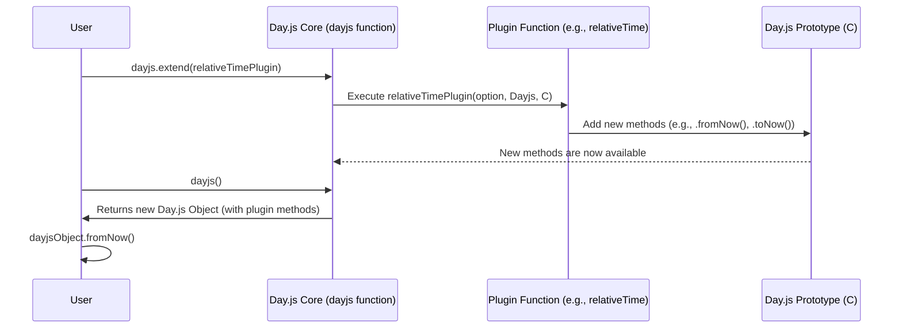

# Chapter 3: Plugins

Having explored how [Locales](chapter_02.md) allow Day.js to adapt its output for different languages and regions, we now turn our attention to `Plugins`. While locales customize *how* dates are displayed, plugins extend the very *functionality* of the `Day.js Object`, adding new methods and capabilities that aren't part of the lightweight core. This modular approach is fundamental to Day.js's design philosophy.

---

### Problem & Motivation

Day.js aims to be a minimal and fast library for date and time manipulation. However, handling dates can become incredibly complex, involving diverse requirements such as calculating precise durations, managing different timezones, performing advanced parsing, or even working with specific calendar systems. If all these features were bundled into the core library, Day.js would become significantly larger and heavier, defeating its primary goal of being lightweight.

This is where `Plugins` come in. They address the problem of balancing a small core size with extensive functionality. By offloading specialized features into optional plugins, Day.js allows developers to include only the capabilities they truly need, keeping their bundles small and efficient. This modularity empowers users to customize their Day.js experience, extending the immutable `Day.js Object` with powerful new methods for a wide range of advanced use cases.

For example, imagine you need to display the difference between two dates in a human-readable format, like "in 3 days" or "2 hours ago". The core Day.js library provides basic difference calculations, but not this natural language output. A `RelativeTime` plugin would solve this problem elegantly, without burdening all Day.js users with its code if they don't need it.

---

### Core Concept Explanation

At its heart, a Day.js `Plugin` is a small, self-contained piece of code that extends the core Day.js library. Plugins are designed to add new methods to the `Day.js Object`'s prototype, allowing all instances of `dayjs()` to access these new functionalities. This means that once a plugin is loaded, you can call its methods directly on any Day.js instance, just like built-in methods such as `.format()` or `.add()`.

To use a plugin, you typically import it and then register it with Day.js using the `dayjs.extend()` function. This tells Day.js to integrate the plugin's functionalities into its system. Think of it like adding an accessory to a tool: the basic tool (Day.js core) is functional on its own, but an accessory (plugin) enhances its capabilities for specific tasks. For instance, the `RelativeTime` plugin provides methods like `.fromNow()` to display time differences in a human-friendly way, while the `Timezone` plugin adds `.tz()` for managing timezones.

The beauty of this system lies in its flexibility. You can activate multiple plugins simultaneously, each adding its unique set of features. This ensures that Day.js remains lean for simple tasks but can be scaled up to handle the most complex date and time challenges with ease.

---

### Practical Usage Examples

Let's demonstrate how to use plugins with our motivating example: displaying relative time.

#### Quick Start: Using the `RelativeTime` Plugin

The `RelativeTime` plugin adds methods like `fromNow()` and `toNow()` to describe time differences.

1.  **Install the plugin** (if not already part of your setup, usually it's `npm install dayjs` and then plugins are accessed via `dayjs/plugin/...`).

2.  **Import and extend:**

    ```javascript
    import dayjs from 'dayjs';
    import relativeTime from 'dayjs/plugin/relativeTime'; // Import the plugin

    dayjs.extend(relativeTime); // Extend Day.js with the plugin
    ```

    *Explanation*: We first import the main Day.js library and then the `relativeTime` plugin. The `dayjs.extend(relativeTime)` call integrates this plugin into Day.js, making its methods available on all `dayjs()` instances. This step needs to happen only once, typically at the beginning of your application.

3.  **Use the new methods:**

    ```javascript
    const now = dayjs(); // Current date and time
    const futureDate = now.add(5, 'day'); // A date 5 days in the future
    const pastDate = now.subtract(2, 'hour'); // A date 2 hours in the past

    console.log(`Future date: ${futureDate.fromNow()}`); // Expected: "in 5 days"
    console.log(`Past date: ${pastDate.fromNow()}`);   // Expected: "2 hours ago"
    console.log(`Future date from another date: ${futureDate.from(pastDate)}`); // Expected: "in 5 days" (difference between pastDate and futureDate)
    ```

    *Explanation*: After extending, `dayjs()` instances now have access to `fromNow()` and `from()`. `fromNow()` calculates the difference relative to the current time, while `from(anotherDayjsObject)` calculates the difference relative to a specific past or future date.

#### Example: Using the `Timezone` Plugin

The `Timezone` plugin allows you to parse and display dates in specific timezones. It depends on the `UTC` plugin, so we'll extend both.

```javascript
import dayjs from 'dayjs';
import utc from 'dayjs/plugin/utc';
import timezone from 'dayjs/plugin/timezone';

dayjs.extend(utc); // UTC plugin is required for timezone
dayjs.extend(timezone); // Extend with the timezone plugin

// Create a Day.js object in a specific timezone
const newYorkTime = dayjs().tz('America/New_York');
console.log(`Current time in New York: ${newYorkTime.format('YYYY-MM-DD HH:mm:ss Z')}`);

// Convert an existing Day.js object to a different timezone
const berlinTime = dayjs().tz('Europe/Berlin');
console.log(`Current time in Berlin: ${berlinTime.format('YYYY-MM-DD HH:mm:ss Z')}`);
```

*Explanation*: We import and extend both `utc` and `timezone`. The `.tz('America/New_York')` method, provided by the `timezone` plugin, allows us to parse or convert a Day.js object to represent a specific geographical timezone, displaying the correct time and offset.

---

### Internal Implementation Walkthrough

Understanding how `dayjs.extend()` works internally helps in appreciating Day.js's modularity and even writing your own plugins. When you call `dayjs.extend(pluginFunction)`, Day.js executes the `pluginFunction`, passing it specific arguments that allow it to modify the core `Day.js Object` prototype.

The signature of a plugin function typically looks like this: `(option, Dayjs, C)`
*   `option`: An object passed during `dayjs.extend(plugin, option)`. This allows you to configure the plugin during initialization.
*   `Dayjs`: This is the `Dayjs` class itself, or more accurately, the constructor function used to create Day.js objects. You can use this to add static methods (e.g., `dayjs.isDayjs`).
*   `C`: This represents `Dayjs.prototype`. This is the most common argument used by plugins, as it allows them to add new instance methods (e.g., `.fromNow()`, `.tz()`) directly to all Day.js objects.

Let's visualize this process:



Consider a simplified example of how you might write a very basic custom plugin to add an `isWeekend()` method:

```javascript
// myCustomPlugin.js
export default (option, Dayjs, C) => {
  /**
   * Extends the Day.js prototype with an isWeekend method.
   * Checks if the current date instance falls on a Saturday or Sunday.
   * @returns {boolean} True if the date is a weekend, false otherwise.
   */
  C.prototype.isWeekend = function () {
    const day = this.day(); // `this.day()` returns 0 for Sunday, 6 for Saturday
    return day === 0 || day === 6;
  };

  // If you wanted a static method (e.g., dayjs.myStaticMethod)
  // Dayjs.myStaticMethod = () => { /* ... */ };
};
```

*Explanation*: This `myCustomPlugin.js` file defines a function that takes `option`, `Dayjs`, and `C`. Inside, it directly adds a new function `isWeekend` to `C.prototype`. The `this` keyword inside `isWeekend` will refer to the `Day.js Object` instance on which the method is called, allowing access to its internal date and other core methods like `this.day()`.

To use this custom plugin:

```javascript
import dayjs from 'dayjs';
import isWeekendPlugin from './myCustomPlugin'; // Assuming myCustomPlugin.js is in the same directory

dayjs.extend(isWeekendPlugin);

const saturday = dayjs('2023-10-28'); // A Saturday
const monday = dayjs('2023-10-30');   // A Monday

console.log(`Is ${saturday.format('YYYY-MM-DD')} a weekend? ${saturday.isWeekend()}`); // Expected: true
console.log(`Is ${monday.format('YYYY-MM-DD')} a weekend? ${monday.isWeekend()}`);     // Expected: false
```

*Explanation*: We import our custom plugin and extend Day.js with it. Now, any `dayjs()` instance, like `saturday` or `monday`, will have the `isWeekend()` method available, demonstrating how easily Day.js can be extended.

---

### System Integration

Plugins are designed to integrate seamlessly with the rest of the Day.js ecosystem, primarily by enhancing the capabilities of the `Day.js Object`.

*   **Enhancing the [Day.js Object](chapter_01.md):** The most direct integration is that plugins add new methods to the `Day.js Object`'s prototype. This means that any operation you perform on a `dayjs()` instance, such as adding or subtracting time, can then be followed by a plugin-provided method. For example, `dayjs().add(1, 'month').fromNow()`. The plugin methods operate on the immutable date state managed by the `Day.js Object`.

*   **Working with [Locales](chapter_02.md):** Plugins often work in conjunction with locales to provide culturally appropriate outputs. The `RelativeTime` plugin, for instance, uses the currently loaded locale to determine the correct phrasing for "in 5 days" or "2 hours ago". If you switch locales, the output of `fromNow()` will automatically adapt. This shows a powerful synergy where plugins provide the *functionality* and locales provide the *presentation*.

    ```javascript
    import dayjs from 'dayjs';
    import 'dayjs/locale/fr'; // Import French locale
    import relativeTime from 'dayjs/plugin/relativeTime';

    dayjs.extend(relativeTime);
    dayjs.locale('fr'); // Set global locale to French

    const futureDate = dayjs().add(3, 'day');
    console.log(`In French: ${futureDate.fromNow()}`); // Expected: "dans 3 jours"
    ```

    *Explanation*: By setting the locale to French, the `relativeTime` plugin automatically uses the French relative time phrases, demonstrating how plugins leverage locale information for internationalization.

*   **Data Flow:** When you create a `Day.js Object` using `dayjs()`, it represents a specific date and time. When you call a plugin method on this object, that method accesses the internal date value of the `Day.js Object` to perform its specialized operation. The plugin method might return a new `Day.js Object` (if it's a manipulation method) or a specific value (like a boolean or a string).

---

### Best Practices & Tips

To get the most out of Day.js plugins and ensure your application remains performant and maintainable, consider these best practices:

*   **Import Only What You Need:** Day.js is designed to be lean. Only import and extend the plugins that your application actually requires. Avoid extending all available plugins "just in case," as this will increase your bundle size unnecessarily.
    ```javascript
    // Good: Only import necessary plugins
    import dayjs from 'dayjs';
    import relativeTime from 'dayjs/plugin/relativeTime';
    dayjs.extend(relativeTime);

    // Bad (if you don't use them all): Importing and extending everything
    // import advancedFormat from 'dayjs/plugin/advancedFormat';
    // import customParseFormat from 'dayjs/plugin/customParseFormat';
    // dayjs.extend(advancedFormat);
    // dayjs.extend(customParseFormat);
    ```

*   **Extend Early and Once:** Call `dayjs.extend()` for all your plugins at the very beginning of your application's lifecycle, typically in your main entry file (e.g., `main.js`, `app.js`). Extending multiple times or at different points in your code can lead to unpredictable behavior or unnecessary overhead.
    ```javascript
    // In your main application entry point (e.g., main.js)
    import dayjs from 'dayjs';
    import relativeTime from 'dayjs/plugin/relativeTime';
    import timezone from 'dayjs/plugin/timezone';
    import utc from 'dayjs/plugin/utc';

    dayjs.extend(relativeTime);
    dayjs.extend(utc);
    dayjs.extend(timezone);

    // Now, anywhere else in your app, dayjs instances will have these methods.
    ```

*   **Understand Plugin Dependencies:** Some plugins might depend on others. For example, the `Timezone` plugin requires the `UTC` plugin. Always extend the dependent plugins first. The documentation for each plugin will usually specify its prerequisites.

*   **Custom Plugin Options:** If a plugin supports options, pass them during the `extend` call. This allows you to configure the plugin's behavior globally.
    ```javascript
    import dayjs from 'dayjs';
    import relativeTime from 'dayjs/plugin/relativeTime';

    // Configure relativeTime to not use suffixes (e.g., "5 days" instead of "in 5 days")
    dayjs.extend(relativeTime, {
      hideSuffix: true
    });

    const futureDate = dayjs().add(5, 'day');
    console.log(futureDate.fromNow()); // Expected: "5 days" (without 'in')
    ```

*   **Troubleshooting: Missing Methods:** The most common issue with plugins is forgetting to extend them. If you try to call a plugin method (e.g., `dayjs().fromNow()`) and get a `TypeError: dayjs(...).fromNow is not a function`, it almost certainly means you haven't imported and called `dayjs.extend()` for that specific plugin.

*   **Performance Considerations:** The act of extending a plugin is a one-time operation. Once extended, the new methods are added to the `Day.js Object` prototype, meaning there's minimal to no performance overhead when calling these methods subsequently, as they are direct method calls.

---

### Chapter Conclusion

This chapter has provided a comprehensive overview of Day.js `Plugins`, a cornerstone of its lightweight and modular design. We've seen how plugins allow the core library to remain small while offering extensive functionality for complex date and time manipulation. From understanding their conceptual role in solving the "feature bloat" problem to practical examples demonstrating their usage and an internal look at how they extend the `Day.js Object`, we've covered the essential aspects.

Plugins integrate seamlessly with the `Day.js Object` and [Locales](chapter_02.md), working together to provide powerful, customizable, and internationally aware date and time utilities. By adhering to best practices like extending early and importing only what's needed, you can leverage the full power of Day.js's plugin ecosystem efficiently.

This concludes our exploration of the Day.js documentation. We've covered the fundamental `Day.js Object`, customized output with [Locales](chapter_02.md), and now extended functionality with `Plugins`. These three concepts form the bedrock of working with Day.js, providing a robust and flexible solution for virtually any date and time challenge.