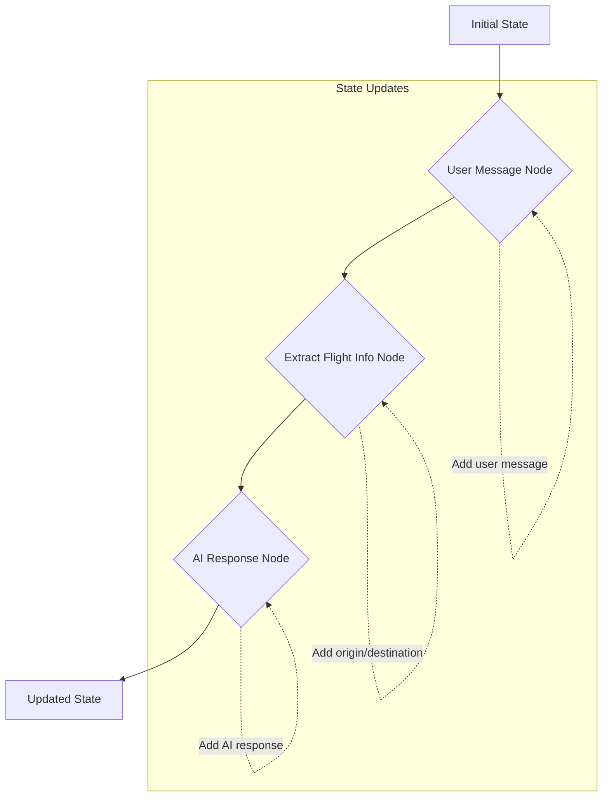

# Chapter 1: Agent's Conversational State

---

Welcome to the first chapter of the `gemini-fullstack-langgraph-quickstart` project documentation! In this chapter, we lay the groundwork for building intelligent agents by exploring the fundamental concept of an agent's conversational state. As this is our starting point, we'll build our understanding from the ground up, establishing crucial concepts that will empower our fullstack AI application.

---

### Problem & Motivation

Imagine interacting with a sophisticated AI assistant. You might ask, "What's the weather like in Paris?" and then follow up with, "What about Rome?" If the AI simply treated each query as a brand new request, it wouldn't understand that "What about Rome?" refers to the *weather* in Rome. This inability to remember past interactions or current context is a significant limitation for any truly intelligent system. Without memory, an AI agent cannot engage in meaningful, multi-turn conversations, track user preferences, or complete complex tasks that span several steps.

In our `gemini-fullstack-langgraph-quickstart` project, we're building an interactive AI application designed to provide a seamless user experience. To achieve this, our backend AI agent, powered by LangGraph, must maintain a *conversational state*. This state acts as the agent's memory, allowing it to remember past exchanges, understand the ongoing context, and make informed decisions. For instance, consider a user planning a trip:

*   **User:** "I'm looking for flights from New York to London."
*   **Agent:** "Great! For what dates are you planning to travel?"
*   **User:** "Around July 15th."

Here, the agent needs to remember "New York to London" when processing "July 15th." Without a conversational state, the agent would lose track of the destination and origin, making the interaction frustrating and inefficient. This chapter focuses on solving this core problem by defining how our agent stores and manages this vital information.

---

### Core Concept Explanation

At its heart, an **Agent's Conversational State** is a structured collection of data that represents the current context of an interaction with an AI agent. It's the agent's internal model of "what's happening now" and "what has happened before." Think of it like a whiteboard where all participants in a discussion can jot down important notes, questions, and decisions. Everyone refers to this whiteboard to stay on the same page.

In the context of LangGraph, the conversational state is the central data structure that is passed between different steps (called "nodes") of our agent's workflow. Each node can read from the state, perform an operation, and then write updated information back into the state. This continuous flow and modification of the state enable the agent to:

1.  **Remember Chat History**: Store all user queries and AI responses, allowing for contextual follow-ups.
2.  **Track Internal Thoughts/Decisions**: Record what the AI is trying to achieve, which tools it considered, or what its current goal is.
3.  **Store Extracted Information**: Keep track of key entities extracted from user inputs, like dates, locations, or product preferences.
4.  **Manage Tool Outputs**: Store the results of actions taken by the agent using external tools (e.g., flight search results).

LangGraph provides a powerful way to define and manage this state, often using a `TypedDict` or Pydantic model. This ensures that the data structure is explicit, type-safe, and predictable, which is crucial for building robust and debuggable AI applications. By carefully designing our agent's state, we empower it to maintain context and deliver a more intelligent and natural user experience.

---

### Practical Usage Examples

To effectively manage conversational context within LangGraph, we define a state object that holds all relevant information. For our `gemini-fullstack-langgraph-quickstart` project, a common approach is to use a `TypedDict` to define this state. Let's see how we might define a simple conversational state for our travel agent example, focusing on messages and potential flight details.

First, we define our `AgentState` using `TypedDict`:

```python
from typing import TypedDict, List, Dict, Any

class AgentState(TypedDict):
    """
    Represents the state of our agent's conversation.
    It includes chat messages and any extracted flight information.
    """
    messages: List[Dict[str, Any]]
    flight_details: Dict[str, Any] # e.g., {'origin': 'NYC', 'destination': 'LDN', 'date': '2024-07-15'}
```
This `AgentState` now defines the structure of the data that will flow through our agent's workflow. It expects a list of `messages` (representing chat history) and a dictionary for `flight_details`.

Next, let's illustrate how parts of this state might be updated by different "steps" or "nodes" in our agent's workflow. Imagine a user sends an initial message. An input node would add this message to the state:

```python
initial_state = AgentState(messages=[], flight_details={})

# A user sends a message
user_message = {"role": "user", "content": "I want to fly from New York to London."}

# An 'add_user_message' node might update the state like this:
def add_user_message_to_state(current_state: AgentState, new_message: Dict[str, Any]) -> AgentState:
    current_state['messages'].append(new_message)
    return current_state

updated_state_1 = add_user_message_to_state(initial_state, user_message)
print(updated_state_1['messages'])
# Expected Output: [{'role': 'user', 'content': 'I want to fly from New York to London.'}]
```
In this example, `add_user_message_to_state` simulates a node that appends a new user message to the `messages` list within the `AgentState`. This is how chat history is built up.

Now, let's say another node processes this message and extracts relevant flight details. This node would update the `flight_details` part of the state:

```python
# An 'extract_flight_info' node might update the state:
def extract_flight_info_from_message(current_state: AgentState) -> AgentState:
    # (Simplified: In reality, an LLM or parser would extract this)
    if "New York to London" in current_state['messages'][-1]['content']:
        current_state['flight_details']['origin'] = 'New York'
        current_state['flight_details']['destination'] = 'London'
    return current_state

updated_state_2 = extract_flight_info_from_message(updated_state_1)
print(updated_state_2['flight_details'])
# Expected Output: {'origin': 'New York', 'destination': 'London'}
```
Here, `extract_flight_info_from_message` simulates a node that parses the latest message and populates the `flight_details` dictionary. Each node in a LangGraph workflow operates on the current state and returns a (potentially modified) new state, allowing for a dynamic and contextual conversation.

---

### Internal Implementation Walkthrough

Internally, LangGraph manages the agent's conversational state as a central, mutable (or append-only, depending on the specific state definition) object that is passed from one "node" to the next in the workflow. When a LangGraph graph is executed, it starts with an initial state. As execution flows through the defined nodes and edges, each node receives the current state, performs its specific logic, and then returns a *new* state (or a dictionary of updates to be merged into the current state). LangGraph then takes this returned state and passes it along to the next node in the sequence.

Let's visualize this state flow with a simplified example using our travel agent:



**Explanation of the flow:**

1.  **Initial State**: The graph begins with an empty or predefined `AgentState`.
2.  **User Message Node**: This node is responsible for receiving the user's input. It takes the current state, appends the new user message to `state['messages']`, and returns the updated state.
3.  **Extract Flight Info Node**: This node receives the state that now includes the user's latest message. It processes this message (e.g., using an LLM or regex) to identify origin, destination, and possibly dates. It then updates `state['flight_details']` with the extracted information and returns the modified state.
4.  **AI Response Node**: This node receives the state, which now contains both the full chat history and any extracted flight details. It uses this context to generate an appropriate response (e.g., "For what dates are you planning to travel?"). It then appends this AI response to `state['messages']` and returns the final updated state for the current turn.

This iterative process of state modification ensures that every part of the agent's workflow has access to the most up-to-date conversational context. LangGraph efficiently manages the passing and merging of these state updates, abstracting away much of the complexity, allowing developers to focus on defining the logic of each node. In our project, this `AgentState` is typically defined in a file like `backend/core/state.py` or similar, serving as the single source of truth for the agent's memory.

---

### System Integration

The `Agent's Conversational State` is the backbone that connects various components of our `gemini-fullstack-langgraph-quickstart` project. It acts as the shared memory that allows different parts of the system to communicate and operate coherently.

*   **With [Agent Workflow Steps (Nodes)](chapter_02.md)**: This is the most direct integration. As discussed, every node in our LangGraph workflow (which we'll explore in detail in the next chapter) receives the current state as input and returns a modified state as output. Nodes are essentially functions that transform the state based on their specific responsibilities (e.g., processing user input, calling tools, generating responses). The `AgentState` defines the contract for what data nodes can access and modify.

*   **With [Agent Tools and Structured Outputs](chapter_04.md)**: When our agent decides to use an external tool (like a flight search API), the tool's input parameters often come directly from the `AgentState` (e.g., using `state['flight_details']['origin']` for the flight search). Critically, the *output* of these tools is then typically stored back into the `AgentState`. For example, after a flight search, the `state` might be updated with `state['flight_results'] = [...]`. This allows subsequent nodes to react to the tool's findings.

*   **With [User Interface Components](chapter_06.md)**: The frontend (React-based) of our fullstack application is designed to send user messages to the backend and display the agent's responses. Effectively, the frontend sends a user message that triggers an update to the `AgentState['messages']` on the backend. When the agent completes a turn and generates a response, the backend sends the latest AI message (from `AgentState['messages']`) back to the frontend for display. The full `AgentState` itself might not always be directly exposed to the frontend, but key parts (like the chat history) are synchronized. This integration ensures that the user interface always reflects the current status of the conversation.

*   **Data Flow and Interaction Patterns**: The `AgentState` facilitates a circular data flow:
    1.  **Frontend -> Backend**: User input from the UI is sent to the backend.
    2.  **Backend (LangGraph) -> State Update**: A LangGraph node processes the input, updating the `AgentState`.
    3.  **State Transformation -> Next Node**: The updated state is passed to the next node, which might call a tool.
    4.  **Tool Output -> State Update**: Tool results are incorporated back into the `AgentState`.
    5.  **State -> AI Response**: The final AI response is generated using the comprehensive state.
    6.  **Backend -> Frontend**: The AI response (part of the updated state) is sent back to the UI.

This continuous loop, orchestrated by LangGraph and centered around the `AgentState`, ensures a dynamic, contextual, and interactive experience for the user.

---

### Best Practices & Tips

Managing the agent's conversational state effectively is key to building robust and scalable AI applications. Here are some best practices:

*   **Keep State Minimal and Relevant**: Only store information that is absolutely necessary for the agent's decision-making or for generating responses. Overloading the state with unnecessary data can increase complexity, memory consumption, and slow down processing. For example, instead of storing the entire text of every tool output, consider storing a summary or just the key extracted entities.
*   **Define a Clear Schema**: Use `TypedDict` or Pydantic models for your `AgentState`. This provides type hinting, makes the state's structure explicit, and helps catch errors early. It also serves as excellent documentation for what information the agent expects and maintains.
*   **Encapsulate State Logic**: Avoid directly manipulating `AgentState` in an ad-hoc manner. Instead, define specific nodes or helper functions responsible for reading from and writing to particular parts of the state. This modularity improves readability and maintainability.
*   **Consider Immutability/Append-Only for History**: For certain parts of the state, like `messages`, consider an append-only pattern where new items are added to a list rather than modifying existing entries. This preserves history and can simplify debugging. LangGraph's default state management often merges updates, so understanding how your state fields behave (e.g., `messages: Annotated[list, add_messages]`) is crucial.
*   **Handle State Size for Long Conversations**: In very long conversations, the `messages` list can grow large. Consider implementing strategies for summarizing older messages or periodically archiving parts of the state to keep the active state manageable. This can involve an "episodic memory" node that condenses past interactions.
*   **Security and Privacy**: Be mindful of sensitive user information stored in the state. Implement appropriate data handling, encryption, or anonymization strategies if the agent is processing personally identifiable information (PII) or other confidential data. Ensure state is cleared or expired when a session ends.
*   **Error Handling in State Updates**: When a node attempts to update the state, ensure robust error handling. What happens if expected data is missing or malformed? Design your state and update logic to gracefully handle such scenarios, perhaps by logging errors or setting default values.
*   **Versioning State Schema**: As your project evolves, your `AgentState` schema might change. Plan for how to handle schema migrations if your application needs to support agents with older state formats, especially if states are persisted.

---

### Chapter Conclusion

In this chapter, we've established the critical role of an **Agent's Conversational State** in building intelligent, interactive AI applications. We learned that the state acts as the agent's memory, enabling it to track context, remember past interactions, and make informed decisions throughout a conversation. We explored how to define this state using `TypedDict`, saw practical examples of how different workflow steps can update it, and understood its internal management within LangGraph. Furthermore, we delved into how this core concept integrates with other parts of our fullstack project, from workflow steps to the user interface, and discussed best practices for its design and implementation.

Understanding and effectively managing the conversational state is the first step towards building a truly responsive and capable AI agent. With this foundation in place, we are now ready to explore how these state updates are orchestrated.

In the next chapter, we will dive into **[Agent Workflow Steps (Nodes)](chapter_02.md)**, where we'll learn how to define the individual actions and decision points that modify our agent's state and drive the conversation forward.