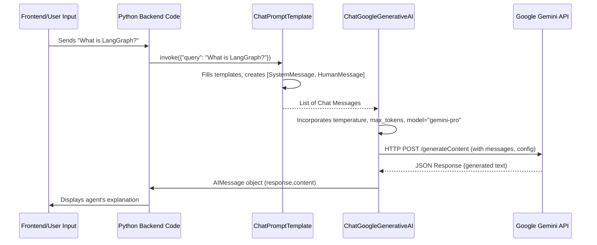

# Chapter 3: Agent Configuration and Prompts

In the previous chapter, [Agent Workflow Steps (Nodes)](chapter_02.md), we explored how individual actions or computations form the building blocks of our AI agent's logic. These nodes define *what* the agent can do. Now, we turn our attention to *how* the agent thinks, communicates, and makes decisions within these steps, which is largely controlled by its configuration and the prompts it uses to interact with the underlying language model.

---

### Problem & Motivation

Imagine building an AI assistant. Without clear instructions, it might act generically, struggle to maintain a consistent persona, or fail to produce responses relevant to a specific task. If our `gemini-fullstack-langgraph-quickstart` agent is meant to help users understand the project, a generic AI might start discussing unrelated topics or use overly complex jargon.

This is the problem that Agent Configuration and Prompts solve. They provide the necessary guidance and constraints for the AI to behave predictably, intelligently, and according to the application's specific goals. In our project, it's crucial for the agent to act as a knowledgeable guide about LangGraph, Gemini, and fullstack AI applications. Without well-crafted prompts and configurations, our agent wouldn't know to explain these concepts, manage conversational state, or understand when to use its tools—leading to a frustrating and unhelpful user experience. A concrete use case is instructing our agent to always explain technical terms in a beginner-friendly way, specifically within the context of the `gemini-fullstack-langgraph-quickstart` project.

---

### Core Concept Explanation

Agent Configuration and Prompts are the primary levers we pull to customize our AI agent's behavior.

**Agent Configuration** refers to the parameters that control the underlying Large Language Model (LLM) itself. This includes selecting the specific model (e.g., `gemini-pro`), setting its *temperature* (which dictates creativity vs. factual adherence), defining the maximum number of tokens it can generate, and other operational modes. These settings act as guardrails and tuning knobs for the LLM's output, influencing everything from the style of generated text to its adherence to constraints. For instance, a lower temperature makes the model more deterministic and focused, ideal for technical explanations.

**Prompts**, on the other hand, are the specific instructions, questions, and contextual information we provide to the LLM to guide its generation. They are essentially the "conversations" we have with the AI to steer its behavior. Prompts can be simple user questions, or complex multi-part messages that establish a persona (e.g., "You are a helpful assistant for the `gemini-fullstack-langgraph-quickstart` project"), provide examples (few-shot prompting), or define output formats. A well-designed prompt is critical for the LLM to understand its role and generate relevant, coherent, and useful responses that align with the application's goals. Together, configuration and prompts empower us to precisely sculpt the AI's intelligence.

---

### Practical Usage Examples

Let's illustrate how we configure our Gemini LLM and craft prompts to guide our agent.

First, we need to instantiate our language model with specific configurations. In this project, we leverage `ChatGoogleGenerativeAI` from LangChain.

```python
from langchain_google_genai import ChatGoogleGenerativeAI

# Configure the Gemini Pro model
llm = ChatGoogleGenerativeAI(
    model="gemini-pro",
    temperature=0.3, # Lower temperature for less creative, more factual responses
    max_tokens=2048  # Maximum tokens for output
)
print("LLM configured successfully.")
```
This code snippet configures the `gemini-pro` model with a low `temperature` for more consistent, factual output, suitable for technical explanations, and sets a `max_tokens` limit.

Next, we define a prompt to guide the agent's persona and task. We'll use LangChain's `ChatPromptTemplate`.

```python
from langchain_core.prompts import ChatPromptTemplate, SystemMessagePromptTemplate, HumanMessagePromptTemplate

# Define a system message for the agent's persona and context
system_message = SystemMessagePromptTemplate.from_template(
    "You are a helpful assistant focused on the `gemini-fullstack-langgraph-quickstart` project."
    "Explain concepts clearly and concisely, assuming the user is a beginner."
    "Always relate your answers back to the project where possible."
)

# Define a human message template for user input
human_message = HumanMessagePromptTemplate.from_template("{query}")

# Combine into a ChatPromptTemplate
chat_prompt = ChatPromptTemplate.from_messages([system_message, human_message])

print("Chat prompt template created.")
```
Here, we create a `SystemMessagePromptTemplate` to establish the agent's role and tone (helpful, beginner-friendly, project-focused). The `HumanMessagePromptTemplate` acts as a placeholder for the user's actual question (`{query}`).

Finally, we combine the configured LLM and the prompt template to invoke a response.

```python
# Create a chain to apply the prompt and then invoke the LLM
explanation_chain = chat_prompt | llm

# Example query
user_query = "What is LangGraph in the context of this project?"

# Invoke the chain with the user's query
response = explanation_chain.invoke({"query": user_query})

print("\nAgent's Explanation:")
print(response.content)
```
This final block demonstrates how the `chat_prompt` prepares the message for the `llm`. When `invoke` is called, the `user_query` is injected into the prompt, sent to the configured Gemini model, and the `response.content` contains the agent's explanation, which will adhere to the persona defined in the system message. This ensures the agent's output is specific to the `gemini-fullstack-langgraph-quickstart` project and beginner-friendly.

---

### Internal Implementation Walkthrough

At its core, when we combine an LLM and a prompt template using LangChain's expression language (the `|` operator), we're creating a runnable sequence.

1.  **Prompt Template Processing**: When `explanation_chain.invoke({"query": user_query})` is called, the `chat_prompt` component takes the `{"query": user_query}` dictionary. It then fills the `"{query}"` placeholder in the `HumanMessagePromptTemplate` and combines it with the `SystemMessagePromptTemplate`. The output of this step is a list of `Message` objects (e.g., `[SystemMessage(...), HumanMessage(...)]`) that are ready for the LLM.

2.  **LLM Invocation**: This list of messages is then passed to the `llm` (our `ChatGoogleGenerativeAI` instance). The `ChatGoogleGenerativeAI` class internally translates these LangChain `Message` objects into the specific API request format expected by Google's Gemini API. It also incorporates the `model`, `temperature`, `max_tokens`, and any other configuration parameters directly into the API call payload.

3.  **API Call**: The `ChatGoogleGenerativeAI` instance makes an HTTP request to the Google Gemini API endpoint (e.g., `https://generativelanguage.googleapis.com/v1beta/models/gemini-pro:generateContent`).

4.  **Response Handling**: Once the Gemini API responds, `ChatGoogleGenerativeAI` parses the JSON response and converts it back into a LangChain `AIMessage` object, which is then returned as the `response` in our example.

Here's a simplified sequence of how this interaction occurs:



This entire process occurs within the agent's backend logic, typically within a specific node's execution in `graph.py` or a dedicated LLM utility file like `llm_config.py`.

---

### System Integration

Agent configuration and prompts are fundamental to virtually every intelligent part of our `gemini-fullstack-langgraph-quickstart` project.

*   **With [Agent Workflow Steps (Nodes)](chapter_02.md)**: Each node in our LangGraph agent's workflow often uses its own specific prompt or a configured LLM. For instance, a "plan" node might use a prompt that encourages strategic thinking, while an "execute_tool" node might use a prompt focused on parsing tool outputs. The initial "entry" node always uses a core conversational prompt.
*   **Preparing for [Agent Tools and Structured Outputs](chapter_04.md)**: Prompts are critical for instructing the agent *when* and *how* to use its tools. A prompt might say, "If the user asks about the current weather, use the `get_weather` tool." Furthermore, prompts are used to guide the LLM to produce *structured outputs*—for example, asking it to return a JSON object with specific keys after using a tool, which is covered in detail in the next chapter.
*   **Dynamic Prompting with [Agent's Conversational State](chapter_01.md)**: The `Agent's Conversational State` is often used to dynamically populate parts of the prompt. For example, previous turns in the conversation (stored in the state) can be included in the prompt to provide context to the LLM, enabling the agent to maintain coherent dialogues and build upon prior interactions.

---

### Best Practices & Tips

1.  **Be Specific and Clear**: Ambiguous prompts lead to ambiguous responses. Clearly define the agent's role, the task, constraints, and desired output format.
2.  **Iterate and Refine**: Prompt engineering is an iterative process. Start simple, test, and gradually add complexity or constraints.
3.  **Use System Messages Effectively**: System messages are powerful for setting the agent's persona, overall instructions, and persistent rules. They guide the model's behavior throughout the interaction.
4.  **Understand Temperature**:
    *   **Low Temperature (e.g., 0.1-0.3)**: Ideal for tasks requiring factual accuracy, consistency, and less creativity (e.g., summarization, data extraction, technical explanations).
    *   **High Temperature (e.g., 0.7-1.0)**: Suitable for creative tasks, brainstorming, or generating diverse ideas.
5.  **Manage Token Usage**: Longer prompts and responses consume more tokens, leading to higher costs and potentially slower responses. Be concise and consider mechanisms for summarizing or filtering context from the `Agent's Conversational State`.
6.  **Guard Against Hallucinations**: For critical applications, instruct the LLM to state when it doesn't know an answer or to base its responses *only* on provided context.
7.  **Version Control Prompts**: Treat your prompts like code. Store them in version control to track changes and facilitate collaboration.

---

### Chapter Conclusion

Agent configuration and prompts are the backbone of an intelligent and effective AI application. By carefully selecting LLM parameters and crafting precise instructions, we define our agent's persona, guide its decision-making, and ensure it generates relevant, helpful responses tailored to the `gemini-fullstack-langgraph-quickstart` project. We've seen how to configure the underlying LLM and construct `ChatPromptTemplates` to steer the agent's output.

Understanding these concepts is crucial as we move forward. The ability of an agent to use external resources and produce specific, usable data relies heavily on how well it's prompted. In the next chapter, [Agent Tools and Structured Outputs](chapter_04.md), we will explore how prompts are used to instruct the agent to interact with external tools and generate responses in defined, machine-readable formats, further enhancing its capabilities beyond just generating free-form text.