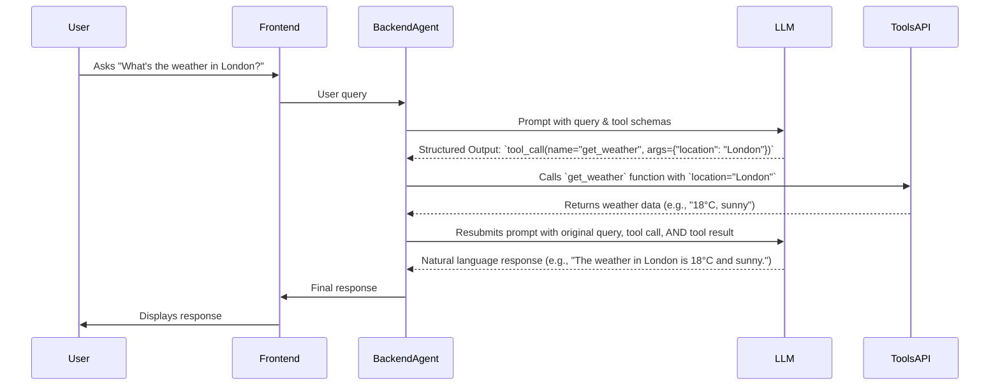

# Chapter 4: Agent Tools and Structured Outputs

In the previous chapter, [Agent Configuration and Prompts](chapter_03.md), we explored how to customize our agent's behavior and guide its language model interactions through effective prompting. While powerful, even the most sophisticated language models have inherent limitations: they operate on their training data and cannot, by themselves, interact with the real world, access up-to-the-minute information, or perform specific actions like booking a flight or querying a database.

---

### Problem & Motivation

Imagine building an AI agent for a fullstack application that needs to answer questions about current events, look up product details, or even generate images based on a user's request. A pure language model, confined to its training data, cannot fulfill such dynamic requirements. This limitation presents a significant challenge for creating truly interactive and useful AI applications.

This is the problem "Agent Tools and Structured Outputs" solves. It empowers our `gemini-fullstack-langgraph-quickstart` agent to *transcend* its inherent knowledge boundaries. Without tools, our agent would be an eloquent but isolated conversationalist. With tools, it becomes a proactive problem-solver capable of interacting with external systems. For instance, if a user asks "What's the weather like in Paris right now?", the agent can't know this inherently. It needs a mechanism to *look it up*. This chapter will guide us through implementing this crucial capability, enabling our agent to perform real-world actions and retrieve dynamic information.

---

### Core Concept Explanation

At its heart, **Agent Tools** are simply functions or APIs that our AI agent can choose to call. Think of them as the agent's "senses" and "limbs" – they allow it to perceive new information (like searching the web) and act upon the world (like sending an email). These tools are external capabilities that extend the agent's reach beyond its internal language model.

**Structured Outputs** are the mechanism by which the underlying language model communicates its *intention* to use a tool. Instead of just generating free-form text, the model can be prompted to output a specific, machine-readable format – often JSON – indicating which tool to call and with what arguments. This structured output acts as an instruction for our application to execute the chosen tool. For example, when asked "What's the weather in London?", the agent might internally generate a structured output like `{"tool_name": "get_current_weather", "location": "London"}`. Our application then intercepts this, executes the `get_current_weather` tool, and passes the result back to the agent for a natural language response.

These two concepts, tools and structured outputs, are foundational for building intelligent agents that can perform tasks requiring up-to-date information or interaction with external services. They transform a purely conversational AI into an actionable one.

---

### Practical Usage Examples

Let's demonstrate how we define a tool and how an agent might use it, using a simplified "web search" tool as our running example.

First, we define a simple tool function. In a real application, this might hit a search API.

```python
# tools.py (conceptual file in backend/app)
from langchain_core.tools import tool

@tool
def search_web(query: str) -> str:
    """Searches the web for the given query and returns a summary of relevant information."""
    # In a real app, this would call a search API like Google Search
    if "latest news on AI" in query.lower():
        return "Recent AI news includes advancements in multimodal models like Gemini, new regulations discussions, and increasing adoption in various industries."
    elif "weather in Paris" in query.lower():
        return "The weather in Paris is currently 15°C and partly cloudy, with a chance of light rain later today."
    else:
        return f"No specific result for '{query}'. This is a mock search tool."

print(search_web("What's the weather in Paris?"))
```
*Explanation*: We define a Python function `search_web` that takes a `query` string. The `@tool` decorator from `langchain_core` automatically registers this function as a tool the LLM can use, inferring its schema (name, description, arguments). When called, it provides a mock response.

Next, we need to inform our LLM about this tool so it can decide to use it. This involves passing the tool's schema to the model.

```python
# agent_setup.py (conceptual part of agent configuration)
from langchain_google_genai import ChatGoogleGenerativeAI
from langchain_core.tools import tool
# Assuming search_web is defined as above
from .tools import search_web

# Initialize the Gemini model
llm = ChatGoogleGenerativeAI(model="gemini-pro", temperature=0)

# Bind the tool to the LLM. This tells the LLM about the tool's existence and schema.
llm_with_tools = llm.bind_tools([search_web])

# Example of how the LLM might decide to use the tool
response = llm_with_tools.invoke("What's the weather like in Paris?")
print(response.tool_calls[0].model_dump_json(indent=2))
```
*Explanation*: We bind our `search_web` tool to the `ChatGoogleGenerativeAI` model. When `invoke` is called with a prompt like "What's the weather like in Paris?", the model recognizes that it doesn't know this information directly but *can* get it using the `search_web` tool. It then responds with a `tool_calls` object, which is a structured output detailing the tool name (`search_web`) and arguments (`location: Paris`).

Finally, our application needs to execute the tool based on the LLM's structured output and feed the result back.

```python
# agent_execution_step.py (conceptual part of a LangGraph node)
from .tools import search_web # Our defined tool

# This simulates a part of the LangGraph execution where a tool call is processed
def execute_tool_call(tool_call_object):
    tool_name = tool_call_object.name
    tool_args = tool_call_object.args

    if tool_name == "search_web":
        print(f"Executing search_web with query: {tool_args['query']}")
        result = search_web(tool_args['query'])
        return result
    else:
        return f"Error: Unknown tool {tool_name}"

# Assume 'response.tool_calls[0]' is the tool call object from the LLM
# In a real LangGraph, this would be handled within a tool_node
# For example, if the LLM outputted: {"tool_name": "search_web", "query": "weather in Paris"}
mock_tool_call = type('obj', (object,), {'name': 'search_web', 'args': {'query': 'weather in Paris'}})()
tool_result = execute_tool_call(mock_tool_call)
print(f"\nTool execution result: {tool_result}")

# The tool_result would then be passed back to the LLM in the next turn
# to generate a natural language response.
```
*Explanation*: This function `execute_tool_call` takes the structured `tool_call_object` received from the LLM. It checks the `tool_name` and calls the corresponding Python function with the provided arguments. The result of this tool execution is then captured and can be used to inform the agent's next action or response to the user. This completes the cycle: Agent (LLM) decides tool use -> Application executes tool -> Result goes back to Agent.

---

### Internal Implementation Walkthrough

The process of an AI agent using tools and structured outputs involves several key steps within the LangChain/LangGraph ecosystem:

1.  **Tool Definition**: We define Python functions and mark them as tools using `@tool` (or by creating `StructuredTool` instances). This generates a *tool schema* (JSON description) for each tool.
2.  **Tool Schema Binding**: These tool schemas are passed to the `bind_tools()` method of our language model instance (`ChatGoogleGenerativeAI`). This teaches the LLM about the available tools, their names, descriptions, and expected arguments.
3.  **LLM Inference with Tool Calling**: When the LLM receives a prompt, it considers both its internal knowledge and the available tools. If it determines a tool is relevant and necessary, it generates a structured output (a `tool_call` object) instead of a direct text response. This output contains the tool's name and the arguments to call it with.
4.  **Tool Execution**: A dedicated part of our application (often a specific node in a LangGraph workflow, as we'll see in [The LangGraph Orchestrator](chapter_05.md)) intercepts this `tool_call` output. It then looks up the actual Python function corresponding to the `tool_name` and executes it with the provided `args`.
5.  **Result Integration**: The output from the tool execution is then re-introduced into the conversation history or agent's state. This allows the LLM to process the tool's result and formulate a natural language response, or decide on further actions.

This entire sequence can be visualized:


*Explanation*: The sequence diagram illustrates the flow from a user query to a final response involving a tool. The `BackendAgent` acts as the orchestrator, passing information to the `LLM`, executing tools via `ToolsAPI`, and handling the flow back to the `User`. This dynamic interaction is crucial for responsive and informed AI applications.

---

### System Integration

Agent Tools and Structured Outputs are tightly integrated with other core components of our `gemini-fullstack-langgraph-quickstart` project:

*   **[Agent's Conversational State](chapter_01.md)**: The outputs of tool calls, whether successful results or errors, are often added to the agent's conversational state. This ensures that the agent "remembers" what tools it has used and their outcomes, allowing for context-aware follow-up questions or actions.
*   **[Agent Workflow Steps (Nodes)](chapter_02.md)**: In LangGraph, tool execution typically happens within a dedicated *node* in the graph. When the LLM outputs a `tool_call`, the workflow transitions to a "tool execution" node, which is responsible for running the actual Python function.
*   **[Agent Configuration and Prompts](chapter_03.md)**: The prompt engineers the LLM to understand *when* and *how* to use tools. Clear tool descriptions in the prompt, along with explicit instructions for structured output, significantly improve the agent's ability to utilize its tools effectively.
*   **[The LangGraph Orchestrator](chapter_05.md)**: The orchestrator is the mastermind that manages the flow. It determines when the LLM's output indicates a tool call, routes the execution to the appropriate tool node, and then brings the result back to the LLM for further processing or final response generation. It ensures the seamless back-and-forth between thinking (LLM), acting (Tools), and remembering (State).

---

### Best Practices & Tips

*   **Clear and Concise Tool Descriptions**: The LLM relies heavily on the tool's `description` to decide if and how to use it. Make these descriptions very clear, specifying what the tool does, what it expects as input, and what kind of output it provides.
*   **Atomic and Specific Tools**: Design tools to perform a single, well-defined task. Avoid "god tools" that try to do too much. This makes it easier for the LLM to understand and use them correctly.
*   **Robust Error Handling**: Tools can fail (APIs down, invalid inputs). Implement robust error handling within your tool functions and a strategy for the agent to recover or inform the user gracefully. The agent might be prompted to explain the error or suggest an alternative.
*   **Input Validation**: Validate inputs to your tools before execution. The LLM might occasionally generate incorrect arguments.
*   **Security Considerations**: Be extremely cautious about what capabilities you expose through tools. Tools that can modify sensitive data, access file systems, or make external requests should be carefully audited and secured.
*   **Limit Tool Overload**: While powerful, providing too many tools can sometimes confuse the LLM or increase processing time. Consider grouping related tools or using techniques to dynamically provide only relevant tools.

---

### Chapter Conclusion

Agent Tools and Structured Outputs are indispensable for building dynamic, interactive, and truly intelligent AI applications like our `gemini-fullstack-langgraph-quickstart`. They bridge the gap between a language model's inherent intelligence and the external world, enabling agents to retrieve real-time information, perform actions, and provide rich, context-aware responses. By mastering the definition, binding, and execution of tools, we empower our agent to be more than just a conversational interface – it becomes an active participant capable of solving real-world problems.

As we move forward, the next crucial step is to understand how these tools, along with the agent's state and individual steps, are brought together into a cohesive, decision-making workflow. This orchestration is precisely what [The LangGraph Orchestrator](chapter_05.md) handles, providing the framework to sequence these intelligent behaviors.