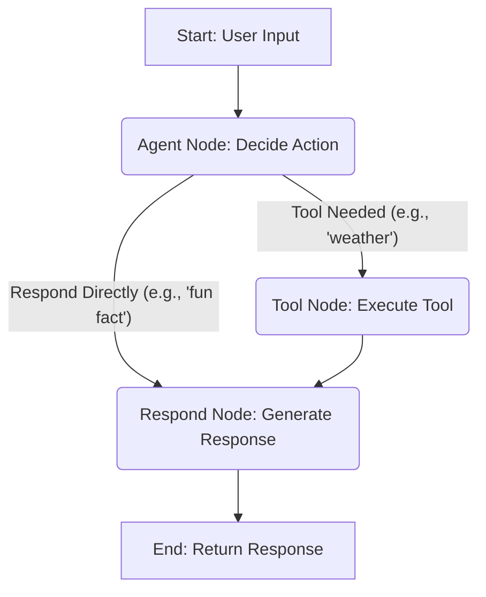

# Chapter 5: The LangGraph Orchestrator

In the previous chapter, [Agent Tools and Structured Outputs](chapter_04.md), we explored how our AI agent extends its capabilities by interacting with external systems and how it structures its internal reasoning for clearer communication. We defined the individual actions and specialized functions the agent can perform. However, simply having a collection of powerful tools and smart steps isn't enough; we need a way to *coordinate* these steps, making dynamic decisions about what to do next based on the ongoing conversation and goals.

---

### Problem & Motivation

Imagine a conversation with an AI agent. It's rarely a single-shot interaction. A user might ask a question, the agent might need to look up information, then clarify, then summarize, and finally respond. This multi-step, dynamic flow is impossible with a simple sequential program. Without a central director, the agent would get stuck after one action or be forced into a rigid, predefined path, unable to adapt to new information or user input.

This is the problem the LangGraph Orchestrator solves for our `gemini-fullstack-langgraph-quickstart` project. It's the brain that decides the *order* of operations, ensuring the agent intelligently navigates between thinking, acting, and responding. For example, when a user asks, "What's the weather like in New York?", the orchestrator ensures the agent first *decides* if a tool is needed, then *calls* the weather tool, *processes* the result, and finally *generates* a user-friendly response, potentially even looping back to ask for more details if the location was ambiguous. This dynamic decision-making is fundamental to building truly interactive and intelligent AI applications.

---

### Core Concept Explanation

The LangGraph Orchestrator is built upon **LangGraph**, a library designed to build robust and stateful multi-actor applications with LLMs. At its heart, LangGraph allows us to define agents as a series of connected **nodes** and **edges**, forming a **graph**.

Think of it like a sophisticated flowchart:

*   **Nodes**: These are the 'Agent Workflow Steps' we discussed in [Agent Workflow Steps (Nodes)](chapter_02.md). Each node performs a specific action, like invoking the LLM to make a decision, calling a tool, or simply formatting a final answer.
*   **Edges**: These are the arrows connecting the nodes, dictating the flow. Edges can be **conditional**, meaning the next node to execute depends on the output of the current node or the current 'Agent's Conversational State'. This conditional logic is what gives the agent its intelligence and adaptability.
*   **State**: LangGraph operates on a shared, mutable state, which is our 'Agent's Conversational State' (see [Agent's Conversational State](chapter_01.md)). Each node receives the current state, processes it, and returns an updated state. The orchestrator uses this updated state to decide the next transition.

The orchestrator essentially acts as a conductor, guiding the baton through the musical score (our graph). It starts at an entry point, executes a node, checks its output, and then uses the defined edges and conditions to determine which node to execute next, continuing until a finish point is reached or a loop condition is met. This robust structure enables complex conversational flows and reliable tool usage, making the agent far more capable than a simple prompt-response system.

---

### Practical Usage Examples

Let's illustrate how we construct a basic LangGraph orchestrator using our project's context. We'll define a simple graph that decides whether to call a tool or respond directly.

First, we define our agent's entry point and the various nodes (which would correspond to our agent's workflow steps):

```python
from langgraph.graph import StateGraph, START, END
from typing import TypedDict, Annotated, List
import operator

# Define the state (similar to Chapter 1)
class AgentState(TypedDict):
    chat_history: List[str]
    user_input: str
    tool_output: str
    intermediate_steps: Annotated[list, operator.add]

# Assume 'agent_node' and 'tool_node' are functions defined elsewhere (Chapter 2)
# For this example, let's create placeholders
def agent_node(state: AgentState):
    print("Agent is thinking...")
    # Simulate LLM decision: if user_input asks about weather, propose tool
    if "weather" in state["user_input"].lower():
        return {"intermediate_steps": ["tool_needed"]}
    return {"intermediate_steps": ["respond_directly"]}

def tool_node(state: AgentState):
    print("Calling tool...")
    # Simulate tool output
    return {"tool_output": "The weather is sunny."}

def respond_node(state: AgentState):
    print("Responding to user...")
    # Simulate response generation
    if state["tool_output"]:
        return {"chat_history": state["chat_history"] + [f"AI: {state['tool_output']}"]}
    return {"chat_history": state["chat_history"] + [f"AI: Understood: {state['user_input']}"]}

# Define the graph
workflow = StateGraph(AgentState)
```
*Explanation*: We start by importing necessary LangGraph components and defining a simplified `AgentState` for our example. We then define placeholder functions for `agent_node`, `tool_node`, and `respond_node` to represent our agent's workflow steps. `StateGraph(AgentState)` initializes our orchestrator, telling it to operate on the `AgentState`.

Next, we add the nodes to our graph:

```python
# Add nodes to the graph
workflow.add_node("agent", agent_node)
workflow.add_node("tool", tool_node)
workflow.add_node("respond", respond_node)
```
*Explanation*: Here, we register our functions (`agent_node`, `tool_node`, `respond_node`) as named nodes ("agent", "tool", "respond") within the `workflow` graph.

Now, we define the entry point and conditional edges:

```python
# Set the entry point
workflow.set_entry_point("agent")

# Define conditional logic for transitions
def route_agent_decision(state: AgentState):
    if "tool_needed" in state["intermediate_steps"]:
        return "call_tool"
    return "final_response"

# Add conditional edges from the 'agent' node
workflow.add_conditional_edges(
    "agent",
    route_agent_decision,
    {
        "call_tool": "tool",
        "final_response": "respond"
    }
)

# Add a normal edge from 'tool' to 'respond'
workflow.add_edge("tool", "respond")

# Set the finish point
workflow.set_finish_point("respond")
```
*Explanation*:
1.  `set_entry_point("agent")` designates the `agent_node` as where the workflow always begins.
2.  `route_agent_decision` is a function that inspects the current `AgentState` (specifically `intermediate_steps`) and returns a string ("call_tool" or "final_response") that dictates the next transition.
3.  `add_conditional_edges` tells the graph: *after* the "agent" node finishes, call `route_agent_decision`. If it returns "call_tool", go to the "tool" node; if "final_response", go to "respond".
4.  `add_edge("tool", "respond")` creates an unconditional transition: *after* the "tool" node finishes, always go to the "respond" node.
5.  `set_finish_point("respond")` marks the "respond" node as the end of this particular workflow run.

Finally, we compile and invoke our graph:

```python
# Compile the graph
app = workflow.compile()

# Invoke the graph with some input
print("--- User asks about weather ---")
initial_state = {"user_input": "What's the weather like?", "chat_history": [], "tool_output": "", "intermediate_steps": []}
result = app.invoke(initial_state)
print("Final State:", result)

print("\n--- User asks a general question ---")
initial_state_general = {"user_input": "Tell me a fun fact.", "chat_history": [], "tool_output": "", "intermediate_steps": []}
result_general = app.invoke(initial_state_general)
print("Final State:", result_general)
```
*Explanation*:
1.  `workflow.compile()` prepares the defined graph for execution.
2.  `app.invoke()` runs the graph starting from the `set_entry_point` with the provided `initial_state`. The output `result` is the final `AgentState` after the graph completes.
3.  We demonstrate two scenarios: one where a tool is "called" and another where the agent "responds directly," showcasing the conditional routing.

---

### Internal Implementation Walkthrough

The `StateGraph` object is central to the LangGraph orchestrator. When you define your workflow, you're essentially building a directed graph data structure.

Here's a simplified view of how the orchestrator works internally in our project, specifically referencing the conceptual structure you might find in `app/backend/core/agent_orchestrator.py`:

1.  **Graph Definition**:
    *   The `StateGraph` is initialized with a `TypedDict` that defines the agent's state (e.g., `AgentState`). This state is passed between nodes and updated by them.
    *   Each `add_node(name, function)` call registers a function (our workflow step from Chapter 2) with a unique name in the graph.
    *   `set_entry_point(node_name)` and `set_finish_point(node_name)` define where the execution starts and can optionally end.

2.  **Edge Creation**:
    *   `add_edge(source_node, target_node)` creates an unconditional transition: after `source_node` executes, `target_node` always runs next.
    *   `add_conditional_edges(source_node, router_function, routing_map)` is the core of dynamic behavior.
        *   After `source_node` completes, the `router_function` is called with the current `AgentState`.
        *   The `router_function` returns a string (e.g., "call_tool").
        *   LangGraph then looks up this string in the `routing_map` (e.g., `{"call_tool": "tool_node_name"}`).
        *   The execution then transitions to the node specified by the `routing_map`.

3.  **Execution Flow (`.invoke()`):**
    *   When `app.invoke(initial_state)` is called, the orchestrator begins at the `entry_point`.
    *   It retrieves the node function corresponding to the `entry_point` and executes it, passing the `initial_state`.
    *   The node function processes the state and returns an updated state.
    *   The orchestrator then evaluates the edges connected to the just-executed node.
    *   If it's an unconditional edge, it moves to the next node.
    *   If it's a conditional edge, it calls the `router_function` with the *updated state* to determine the next node.
    *   This process continues, passing the evolving state from node to node, until a `set_finish_point` is reached, or no further transitions are defined.

Here's a simplified mermaid diagram illustrating the flow we just demonstrated:


*Explanation*: This diagram visually represents the flow. The `Agent Node` makes a decision based on the input. If a tool is needed, it transitions to the `Tool Node`, otherwise directly to the `Respond Node`. Both paths eventually lead to the `Respond Node` before finishing.

---

### System Integration

The LangGraph Orchestrator sits at the heart of our backend, tying together all the conceptual pieces we've discussed:

*   **Reads from [Agent's Conversational State](chapter_01.md)**: The orchestrator's `StateGraph` is parameterized by our `AgentState`. Every node receives and updates this state, ensuring continuity across the entire workflow. The conditional edges rely heavily on inspecting this state to make routing decisions.
*   **Executes [Agent Workflow Steps (Nodes)](chapter_02.md)**: Each node in the LangGraph corresponds directly to an agent workflow step. The orchestrator is responsible for calling these functions in the correct sequence.
*   **Leverages [Agent Configuration and Prompts](chapter_03.md)**: While the orchestrator doesn't directly configure prompts, the nodes it executes (e.g., an LLM invocation node) will utilize the configured language models and prompts to perform their tasks.
*   **Dispatches to [Agent Tools and Structured Outputs](chapter_04.md)**: When the orchestrator decides, via its conditional logic, that a tool is needed, it directs the flow to a "tool-calling" node. This node then uses the mechanisms defined in Chapter 4 to execute the external tool and capture its output back into the `AgentState`.
*   **Prepares Output for [User Interface Components](chapter_06.md)**: Once the orchestrator reaches a `finish_point` (typically after a response generation node), the final `AgentState` containing the AI's response (e.g., in `chat_history`) is returned. This state is then used by the frontend to display the conversation to the user.

This central role ensures a cohesive and intelligent agent capable of complex, multi-turn interactions.

---

### Best Practices & Tips

1.  **Clear Node Responsibilities**: Each node should have a single, well-defined responsibility (e.g., "decide_tool", "call_weather_tool", "generate_response"). This makes the graph easier to understand, debug, and maintain.
2.  **Manage State Thoughtfully**: Only store necessary information in your `AgentState`. Overloading the state can lead to performance issues and make debugging harder. Use `Annotated` with `operator.add` or `operator.setitem` for lists and dictionaries to manage state updates effectively.
3.  **Modular Graphs**: For very complex agents, consider building sub-graphs that can be invoked as nodes within a larger graph. This promotes reusability and reduces complexity.
4.  **Descriptive Router Functions**: Ensure your conditional routing functions (`route_agent_decision` in our example) are clear and concise. Their names should reflect the decision they are making.
5.  **Error Handling Nodes**: Implement specific nodes or conditional edges to handle errors, unexpected tool outputs, or situations where the LLM produces an invalid structured output. This prevents the agent from crashing and allows for graceful recovery.
6.  **Visualizing the Graph**: Use tools or print statements (like `app.get_graph().draw_mermaid()`) to visualize your graph, especially during development. This helps in understanding the flow and identifying potential issues.

---

### Chapter Conclusion

The LangGraph Orchestrator is the unsung hero of our `gemini-fullstack-langgraph-quickstart` project, transforming a collection of smart components into a truly intelligent and adaptive AI agent. By defining nodes, edges, and state, it empowers our agent to engage in dynamic, multi-turn conversations, make informed decisions, and effectively leverage external tools. This robust framework ensures that the AI can respond contextually and appropriately, guiding the user experience.

Having established the intelligent backend, our next step is to explore how users will interact with it. In the upcoming [User Interface Components](chapter_06.md) chapter, we'll dive into how the frontend is built to communicate with this orchestrator and present the conversational flow to the user seamlessly.