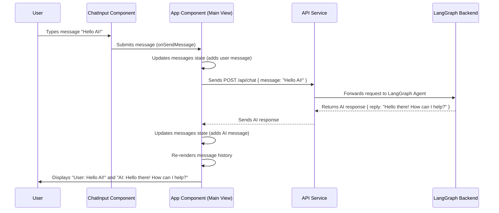

# Chapter 6: User Interface Components

In the previous chapter, we delved into [The LangGraph Orchestrator](chapter_05.md), understanding how it dynamically manages the flow of an AI agent's reasoning and tool use. We saw the "brain" of our AI application, responsible for intricate decision-making and state management. However, a powerful AI agent remains a theoretical concept without a means for users to interact with it. This is where **User Interface Components** come into play, serving as the bridge between the complex backend logic and a human user.

---

## Problem & Motivation

Imagine building an incredibly intelligent AI agent capable of understanding complex queries, using various tools, and maintaining a sophisticated conversational state. Without a user interface, this agent is effectively "blind" and "mute" to its human counterparts. The fundamental problem is communication: how does a user provide input to the agent, and how does the agent present its responses, thoughts, and progress in an understandable, interactive manner?

In the context of the `gemini-fullstack-langgraph-quickstart` project, the motivation is to create a complete, interactive fullstack AI application. This means moving beyond just the backend agent logic to provide a seamless user experience. We need components that allow users to type messages, send them to the agent, and then visually interpret the agent's replies, including potentially its intermediate reasoning steps or tool outputs. Without a well-designed user interface, the power of our LangGraph agent would be locked away, unusable by the very people it's designed to assist. Our concrete use case is a chat interface where a user can ask a question, and the UI displays both their question and the AI's answer, maintaining a conversational history.

---

## Core Concept Explanation

User Interface (UI) Components are the modular building blocks that constitute the frontend of an application. Think of them as individual widgets, buttons, input fields, or display areas, each designed for a specific interaction or presentation purpose. In our fullstack AI application, these components are responsible for everything a user sees and interacts with. They act as the "face" and "hands" of our application, allowing users to initiate conversations, observe the agent's progress, and receive information.

These components abstract away the complexities of browser rendering and user interaction, providing a consistent and reusable way to build the user experience. For instance, a chat application would have distinct components for typing a message, sending it, and displaying received messages. Each component focuses on a single responsibility, making the frontend easier to develop, test, and maintain. They handle the presentation logic, user input capture, and the visual feedback necessary to make the application feel responsive and intuitive.

Crucially, UI components are the only part of the application directly accessible to the end-user. They translate user actions (like typing text or clicking a button) into structured data that can be sent to the backend agent. Conversely, they take the agent's structured responses and render them into human-readable text, images, or other interactive elements. This bidirectional communication is fundamental to creating an engaging and functional AI application.

---

## Practical Usage Examples

Let's illustrate how basic UI components for a chat application might look, focusing on the core elements: an input field for the user and a display area for messages.

### User Input Component

This component allows the user to type their message and send it to the AI agent.

```jsx
// src/frontend/components/ChatInput.jsx (Conceptual)
import React, { useState } from 'react';

function ChatInput({ onSendMessage }) {
  const [message, setMessage] = useState('');

  const handleSubmit = (e) => {
    e.preventDefault();
    if (message.trim()) {
      onSendMessage(message); // Send message to parent handler
      setMessage('');
    }
  };

  return (
    <form onSubmit={handleSubmit}>
      <input
        type="text"
        value={message}
        onChange={(e) => setMessage(e.target.value)}
        placeholder="Type your message..."
      />
      <button type="submit">Send</button>
    </form>
  );
}

export default ChatInput;
```
This `ChatInput` component provides a text field and a send button. When the user types and submits, the `onSendMessage` function (provided by a parent component) is called with the user's input. The `useState` hook manages the current value of the input field.

### Message Display Component

This component is responsible for rendering individual messages from either the user or the AI agent.

```jsx
// src/frontend/components/MessageDisplay.jsx (Conceptual)
import React from 'react';

function MessageDisplay({ sender, text, type }) {
  const messageClass = sender === 'user' ? 'user-message' : 'ai-message';
  
  return (
    <div className={`message-container ${messageClass}`}>
      <span className="sender">{sender}:</span> {text}
      {type === 'tool_use' && <small>(Tool Use)</small>}
    </div>
  );
}

export default MessageDisplay;
```
The `MessageDisplay` component takes `sender` (e.g., "user" or "AI"), `text`, and `type` (e.g., "user_input", "ai_response", "tool_use") as properties. It dynamically applies a CSS class based on the sender to visually distinguish messages. This simple structure can be extended to handle rich content or indicate tool usage.

### Integrating Components into a Chat View

These individual components are then composed within a larger view or container component to create the full chat interface.

```jsx
// src/frontend/App.jsx (Conceptual main view)
import React, { useState } from 'react';
import ChatInput from './components/ChatInput';
import MessageDisplay from './components/MessageDisplay';

function App() {
  const [messages, setMessages] = useState([]);

  const handleSendMessage = async (userInput) => {
    const userMessage = { sender: 'user', text: userInput, type: 'user_input' };
    setMessages((prev) => [...prev, userMessage]);

    // Simulate sending to backend and getting AI response
    const aiResponse = await fetch('/api/chat', {
      method: 'POST',
      headers: { 'Content-Type': 'application/json' },
      body: JSON.stringify({ message: userInput }),
    }).then(res => res.json());

    const aiMessage = { sender: 'AI', text: aiResponse.reply, type: 'ai_response' };
    setMessages((prev) => [...prev, aiMessage]);
  };

  return (
    <div className="chat-app">
      <div className="message-history">
        {messages.map((msg, index) => (
          <MessageDisplay key={index} {...msg} />
        ))}
      </div>
      <ChatInput onSendMessage={handleSendMessage} />
    </div>
  );
}

export default App;
```
This `App` component demonstrates how `ChatInput` and `MessageDisplay` work together. It manages the `messages` state, handles the `onSendMessage` event from `ChatInput`, and dynamically renders a list of `MessageDisplay` components for the conversation history. The `fetch` call simulates the crucial interaction with our backend LangGraph agent.

---

## Internal Implementation Walkthrough

The internal implementation of User Interface Components, particularly in a React-based frontend as suggested by the project summary, revolves around a few key principles: component-based architecture, state management, and interaction with the backend API.

1.  **Component Hierarchy**: The frontend is built as a tree of nested components. A root component (e.g., `App.jsx`) contains smaller, specialized components (e.g., `ChatHistory`, `ChatInput`), which might further contain even smaller ones (e.g., `MessageDisplay`).
2.  **State Management**: Each component or a central parent component manages its own internal data, known as "state." For a chat application, this state would include the list of messages, the current text in the input box, and potentially loading indicators. When state changes, React efficiently re-renders only the affected parts of the UI.
3.  **Event Handling**: Components listen for user interactions like clicks, key presses, or form submissions. When an event occurs, an associated event handler function is triggered, which often updates the component's state or initiates a communication with the backend.
4.  **Backend Communication**: This is the most critical link. When a user submits a query via a UI component, the frontend makes an asynchronous API call (e.g., using `fetch` or `axios`) to the backend server. The backend, powered by [The LangGraph Orchestrator](chapter_05.md), processes this request and returns a response.
5.  **Rendering Agent Responses**: Upon receiving a response from the backend, the frontend updates its state, adding the AI's reply to the message history. This state change triggers a re-render of the relevant `MessageDisplay` components, making the AI's response visible to the user.

Here's a sequence diagram illustrating the typical interaction flow:


This flow illustrates how user interaction with `ChatInput` triggers a sequence of state updates and API calls, ultimately resulting in the `App` component rendering the AI's response in `MessageDisplay` for the user. The core logic of the AI resides in `LG` (LangGraph Backend), which the UI simply interacts with.

---

## System Integration

User Interface Components integrate with the rest of the `gemini-fullstack-langgraph-quickstart` system primarily through a well-defined **API endpoint**. The frontend, built with React, acts as a client that sends requests to and receives responses from the backend server.

1.  **Frontend-Backend API**: The frontend UI components do not directly interact with LangGraph. Instead, they communicate with a backend API (e.g., `/api/chat`). This API layer acts as a gateway, receiving user input, forwarding it to the [LangGraph Orchestrator](chapter_05.md), and then relaying the orchestrator's response back to the frontend. This separation of concerns is crucial for scalability and maintainability.
2.  **Data Flow**:
    *   **User Input**: When a user sends a message, the `ChatInput` component captures the text and passes it up to a parent component (like `App.jsx`). This parent component then constructs a JSON payload (e.g., `{ "message": "What is LangChain?" }`) and sends it via an HTTP POST request to the backend API endpoint.
    *   **Agent Output**: The backend API receives the input, invokes the LangGraph agent, and once the agent has processed the request and generated a response, the API sends a structured JSON response back to the frontend (e.g., `{ "reply": "LangChain is a framework..." }`).
    *   **Rendering**: The frontend's `App` component receives this JSON, parses it, updates its internal state (the `messages` array), and the `MessageDisplay` components re-render to show the AI's new message.

This clear demarcation ensures that the UI components are primarily concerned with presentation and user interaction, while the backend focuses on AI logic and data processing. The API contract between them defines the expected input and output formats, making both sides independent but interoperable.

---

## Best Practices & Tips

When developing User Interface Components for an AI application, adherence to best practices can significantly enhance the user experience and developer productivity.

*   **Provide Clear Feedback**: Users should always know what's happening. Implement loading indicators when waiting for an AI response, error messages for failures, and success messages for completed actions. This reduces perceived latency and user frustration.
*   **Modular Design**: Break down your UI into small, reusable components. A `MessageDisplay` component should only worry about displaying a single message, not the entire chat history. This makes components easier to test, maintain, and reason about.
*   **Responsiveness**: Ensure your UI components adapt well to different screen sizes (desktops, tablets, mobile). A fluid layout using CSS frameworks or responsive design techniques will make your application accessible to a wider audience.
*   **Accessibility**: Design your components with accessibility in mind. Use semantic HTML, provide adequate contrast for text, and ensure keyboard navigation is possible. This makes your application usable for people with disabilities.
*   **State Management**: For complex applications, consider a dedicated state management library (like Redux or Zustand, though React's Context API and `useState`/`useReducer` are often sufficient for smaller projects) to manage global application state, especially for data shared across many components.
*   **Error Handling**: Gracefully handle errors from the backend API. Display user-friendly messages instead of raw technical errors. Implement retry mechanisms for transient network issues.
*   **Performance Optimization**: Optimize rendering performance, especially for long lists of messages. Techniques like virtualization (rendering only visible items) or memoization (`React.memo`) can prevent unnecessary re-renders.

---

## Chapter Conclusion

In this chapter, we've explored the critical role of **User Interface Components** in transforming a powerful AI agent into a usable, interactive application. We've seen how these modular frontend building blocks enable users to communicate with the AI and observe its responses, bridging the gap between complex backend logic and human interaction. From input fields to message displays, UI components are the tangible representation of our fullstack AI system.

We understood their core purpose, walked through practical examples, examined their internal workings with a sequence diagram, and discussed their vital integration with the [LangGraph Orchestrator](chapter_05.md) via a dedicated API layer. By following best practices, we can ensure our UI is intuitive, responsive, and robust, providing a seamless experience for interacting with the intelligent agent.

With our understanding of both the backend AI agent and its frontend interface, we are now ready to bring these two halves together. The next chapter will focus on integrating these components into a cohesive **Fullstack AI Application**, demonstrating how the frontend and backend communicate to deliver a complete user experience.

Proceed to learn how these pieces fit together to form the complete application: [The Fullstack AI Application](chapter_07.md).