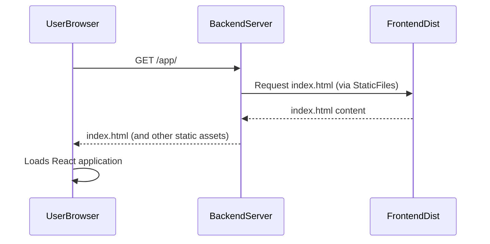

# Chapter 7: The Fullstack AI Application

In the preceding chapter, we explored the foundational aspects of [User Interface Components](chapter_06.md), understanding how individual elements like chat bubbles, input fields, and loading indicators are constructed to present information and capture user input. While these components are crucial, they are merely the building blocks. An AI application doesn't truly come alive until these frontend pieces are seamlessly integrated with a robust, intelligent backend. This chapter brings together all the pieces we've discussed, from the agent's internal workings to the user-facing interface, to form a cohesive, interactive fullstack AI application.

---

### Problem & Motivation

Developing an intelligent agent with sophisticated conversational abilities and tool-use capabilities, as detailed in previous chapters, is a significant achievement. However, without a user-friendly interface, this powerful agent remains inaccessible to end-users. Conversely, a beautiful frontend with no intelligent backend is just an empty shell. The core problem this chapter addresses is bridging this gap: how do we connect a dynamic, stateful AI agent built with LangGraph and Google Gemini to a responsive web frontend (like React) to create a single, unified, interactive user experience?

The motivation for a fullstack approach is clear: users expect intuitive, real-time interactions with AI. They want to type a query and see an intelligent response almost instantly, along with any relevant thought processes or actions the AI agent takes. This project aims to provide a quickstart for exactly that – demonstrating how the LangGraph-powered backend, which manages intricate conversational state and executes complex workflows, communicates with a React-based frontend to deliver a complete, engaging interaction. For example, a user asking "What's the weather like in New York?" should trigger the frontend to send this query to the backend agent, which then uses a tool to fetch weather data, processes it, and sends a concise, human-readable answer back to the frontend for display, all while maintaining the conversational context.

---

### Core Concept Explanation

The **Fullstack AI Application** represents the holistic system where the backend AI agent and the frontend user interface operate in tandem to deliver a complete interactive experience. In this `gemini-fullstack-langgraph-quickstart` project, "fullstack" specifically refers to the integration of a Python-based backend (leveraging FastAPI, LangGraph, and Gemini) with a React-based frontend. This architecture ensures a clear separation of concerns: the backend handles all AI logic, state management, tool execution, and data processing, while the frontend is responsible solely for rendering the user interface, handling user input, and displaying agent responses.

Communication between these two distinct parts is paramount. The frontend initiates requests (e.g., a user message), sending them to the backend's API endpoints. The backend processes these requests using the [LangGraph Orchestrator](chapter_05.md) and its associated components, then sends responses back to the frontend. This project primarily uses HTTP POST requests for initiating agent conversations and WebSockets for streaming real-time updates and conversational turns back to the frontend, providing a dynamic and responsive chat experience. The concept allows for independent development and scaling of both frontend and backend components, while ensuring they collaborate seamlessly to offer a cohesive product.

---

### Practical Usage Examples

The most direct "usage" of the fullstack AI application is to run it and interact with it. This quickstart repository is designed for easy local execution using Docker Compose, which orchestrates both the backend and frontend services.

First, ensure you have Docker and Docker Compose installed. Then, from the root of the project, you can bring up the entire application with a single command:

```bash
docker-compose up --build
```

This command builds the necessary Docker images for both the frontend and backend, then starts them. You'll see logs from both services in your terminal.

Once the services are running, open your web browser and navigate to the frontend's address, typically:

```
http://localhost:3000
```

You should now see the interactive chat interface provided by the React frontend. Type a message into the input box, for example:

```
Hello, what can you do?
```

Press Enter, and observe as the frontend sends your message to the backend agent. The agent processes it and streams its response back, which will appear in the chat history. This demonstrates the full lifecycle of an interaction, from user input to agent response, orchestrated across the fullstack.

---

### Internal Implementation Walkthrough

At the heart of serving the fullstack application, specifically bringing the frontend to the user's browser, is the backend's ability to serve the static assets of the React application. The `create_frontend_router` function in `backend/src/agent/app.py` is responsible for this.

Let's examine the core logic:

```python
# From backend/src/agent/app.py

import pathlib
from starlette.applications import Starlette
from starlette.routing import Mount, WebSocketRoute
from starlette.staticfiles import StaticFiles

def create_frontend_router(build_dir="../frontend/dist"):
    """Creates a router to serve the React frontend."""
    build_path = pathlib.Path(__file__).parent.parent.parent / build_dir
    if not build_path.exists():
        raise RuntimeError(f"Frontend build directory not found at {build_path}")

    app_routes = [
        Mount("/", app=StaticFiles(directory=build_path, html=True), name="static")
    ]
    return Starlette(routes=app_routes)

# In the main FastAPI app:
# frontend_app = create_frontend_router()
# app.mount("/app", frontend_app, name="frontend_app")
```

1.  **Locating the Build Directory**: The function first constructs the `build_path` to the compiled React application's static files. By default, it looks for `../frontend/dist` relative to the backend's `app.py`. This `dist` folder contains all the HTML, CSS, JavaScript, and other assets that make up the React frontend.
2.  **Verifying Existence**: It checks if this directory actually exists. If the React application hasn't been built (e.g., `npm run build` or `yarn build` wasn't executed), it will raise a `RuntimeError`, prompting the developer to build the frontend first.
3.  **Serving Static Files**: The `StaticFiles` class from Starlette is then used. This is a powerful component that can serve static directories. The `html=True` argument is crucial here: it enables single-page application (SPA) routing. This means if a user navigates to `/app/any-route`, and that route isn't a specific file, `StaticFiles` will serve `index.html` from the `build_path`. This allows the React router to take over and handle client-side routing.
4.  **Mounting the Router**: Finally, a `Starlette` application is created with a single `Mount` route. This route (`/`) within the `frontend_app` effectively serves the entire `build_path` directory. The main FastAPI application then `mount`s this `frontend_app` under the `/app` prefix. This is important: it ensures that the frontend's static assets are served from `/app/` and do not conflict with the backend's `/api` routes (e.g., `/api/chat`).

This internal mechanism allows the single backend server to efficiently serve both the dynamic API for the AI agent and the static files for the interactive user interface.


*Sequence Diagram: Initial Frontend Loading Flow*
This diagram illustrates how the backend server acts as a host for the static React application. The user's browser requests the root of the `/app` path, and the `StaticFiles` component within the backend serves the `index.html` and other assets of the compiled frontend application.

---

### System Integration

The Fullstack AI Application is the grand convergence of all the components we've discussed. The frontend, powered by [User Interface Components](chapter_06.md), acts as the portal for user interaction. It sends user queries to the backend's API. The backend, in turn, orchestrates the entire AI logic, relying heavily on the [LangGraph Orchestrator](chapter_05.md) to manage the agent's workflow steps, update the [Agent's Conversational State](chapter_01.md), and leverage [Agent Tools and Structured Outputs](chapter_04.md) as needed, all guided by the [Agent Configuration and Prompts](chapter_03.md).

Here's how the different components integrate for a complete interaction:

1.  **Frontend Initiates**: A user types a message into the chat interface ([User Interface Components](chapter_06.md)).
2.  **API Call**: The frontend sends this message as an HTTP POST request to a specific backend endpoint (e.g., `/api/chat`).
3.  **Backend Processing**: The FastAPI server on the backend receives the request. It then invokes the LangGraph agent, passing the user's message.
4.  **LangGraph Orchestration**: The [LangGraph Orchestrator](chapter_05.md) takes over. It processes the input, updates the [Agent's Conversational State](chapter_01.md), decides which [Agent Workflow Steps (Nodes)](chapter_02.md) to execute, and potentially uses [Agent Tools and Structured Outputs](chapter_04.md) (e.g., for web search). This entire process is configured by [Agent Configuration and Prompts](chapter_03.md).
5.  **Streaming Responses**: As the agent processes the request, the backend streams intermediate thoughts, tool calls, and final responses back to the frontend via WebSockets. This provides a real-time, dynamic chat experience.
6.  **Frontend Renders**: The frontend receives these streamed updates and displays them through its [User Interface Components](chapter_06.md), updating the chat history in real-time.

```mermaid
graph TD
    A[User Interface Components (React)] -->|HTTP POST /api/chat| B(Backend FastAPI)
    B -->|Invokes LangGraph Agent| C{LangGraph Orchestrator}
    C -->|Reads/Updates| D[Agent's Conversational State]
    C -->|Executes| E[Agent Workflow Steps (Nodes)]
    E -->|Uses| F[Agent Tools and Structured Outputs]
    C -->|Guided by| G[Agent Configuration and Prompts]
    C -->|Streams via WebSocket| B
    B -->|WebSocket Updates| A
```
*Graph: Fullstack AI Application Interaction Flow*
This graph illustrates the comprehensive data flow and interaction patterns across the entire application, highlighting how frontend and backend components work together.

---

### Best Practices & Tips

*   **Clear API Contracts**: Define clear and consistent API endpoints and data schemas between your frontend and backend. This makes development predictable and reduces integration headaches. Use OpenAPI/Swagger for documenting your FastAPI endpoints.
*   **Asynchronous Communication for AI**: Given the potentially long-running nature of AI agent interactions (due to LLM calls or tool usage), leverage WebSockets for streaming responses. This provides a much better user experience than waiting for a single, delayed HTTP response.
*   **Error Handling and Feedback**: Implement robust error handling on both ends. The frontend should display meaningful error messages, and the backend should log errors comprehensively. Provide loading indicators or "thinking" messages in the UI during AI processing.
*   **Containerization for Deployment**: Using Docker Compose for local development (as demonstrated) is excellent. For production, consider container orchestration platforms like Kubernetes or cloud-specific services (e.g., Google Cloud Run, AWS ECS) for scalable and resilient deployments.
*   **Security**: Always validate and sanitize user inputs on the backend to prevent injection attacks. Secure your API endpoints, especially if exposing them publicly, using appropriate authentication and authorization mechanisms. Ensure API keys (like Gemini API key) are stored securely as environment variables and never hardcoded or exposed in the frontend.
*   **Separation of Concerns**: Maintain a strict separation between frontend UI logic and backend AI logic. This promotes modularity, easier debugging, and allows different teams (or individuals) to work on each part independently.
*   **Performance Optimization**: Optimize frontend build sizes, serve static assets efficiently (using CDNs in production), and consider caching strategies where appropriate. On the backend, optimize LangGraph steps, consider parallelizing tool calls, and choose appropriate hardware for LLM inference.

---

### Chapter Conclusion

This chapter marks the culmination of our journey through the `gemini-fullstack-langgraph-quickstart` project. We've seen how individual, powerful components—from the [Agent's Conversational State](chapter_01.md) and [LangGraph Orchestrator](chapter_05.md) on the backend to the [User Interface Components](chapter_06.md) on the frontend—are meticulously engineered to work in harmony. The Fullstack AI Application is more than just the sum of its parts; it's a living system that transforms complex AI capabilities into an accessible, interactive experience for the end-user.

By bringing together Google Gemini's intelligence, LangGraph's stateful orchestration, and a responsive React frontend, this quickstart provides a robust foundation for building sophisticated conversational AI applications. You now have a comprehensive understanding of how to set up, run, and conceptually understand the architecture of such a system, ready to extend its capabilities, deploy it, and tailor it to your specific needs. This complete fullstack perspective is essential for anyone looking to move beyond theoretical AI models to practical, user-facing intelligent applications.