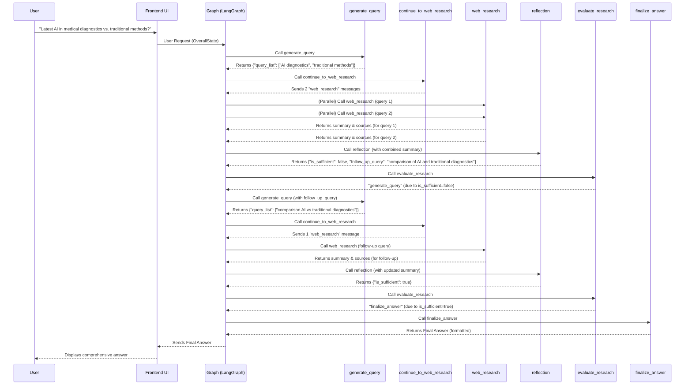

# Chapter 3: LangGraph Agent Workflow

Having established the foundational AI Tools and Output Schemas ([Chapter 1: AI Tools and Output Schemas](chapter_01.md)) and the central data management system, the [Overall Agent State](chapter_02.md), we now turn our attention to the *orchestration* that brings these components to life: the LangGraph Agent Workflow. This chapter defines the intelligent sequence of operations that allows our AI assistant to understand complex requests, perform multi-step reasoning, and deliver comprehensive answers.

---

### Problem & Motivation

In the realm of advanced AI assistants, simply having access to powerful tools or a memory store is not enough. The core challenge lies in *coordinating* these elements dynamically to achieve sophisticated goals. A user's request, such as "What are the latest advancements in AI for medical diagnostics, and how do they compare to traditional methods?", isn't a single-step problem. It requires:
1.  **Understanding** the user's intent.
2.  **Generating relevant search queries.**
3.  **Executing web searches.**
4.  **Synthesizing findings** from potentially multiple sources.
5.  **Identifying knowledge gaps** or areas needing further investigation.
6.  **Reflecting** on the information gathered.
7.  **Iterating** on research if necessary.
8.  **Formulating a final, well-structured answer** with citations.

Without a structured workflow, an AI might only perform a single search or provide a generic response. The LangGraph Agent Workflow solves this by providing a declarative way to define these complex, iterative decision-making processes, enabling our assistant to tackle multi-faceted queries with human-like reasoning.

### Core Concept Explanation

The **LangGraph Agent Workflow** is the brain of our AI assistant, dictating the step-by-step process for fulfilling user requests. It's built upon the [LangChain](https://www.langchain.com/) framework, specifically using `LangGraph` for its ability to create stateful, cyclic computational graphs.

Imagine a flowchart where each box represents a distinct task, and arrows indicate the possible transitions between these tasks.
*   **Nodes:** In LangGraph, these "boxes" are called *nodes*. Each node performs a specific function, like generating a query, performing a web search, or reflecting on findings. Our project defines several such nodes, implemented as Python functions.
*   **Edges:** The "arrows" connecting nodes are *edges*. They define the flow of control, determining which node executes next. Edges can be simple direct transitions or complex conditional logic that decides the next step based on the current `OverallState`.
*   **OverallState:** As discussed in the previous chapter, the `OverallState` acts as the central shared memory that all nodes read from and write to. It ensures continuity and context across the entire workflow.

This graph-based approach allows for highly flexible and intelligent decision-making, enabling the AI to adapt its strategy dynamically based on the ongoing conversation and research findings.

---

### Practical Usage Examples

Let's look at the key nodes that form the building blocks of our LangGraph workflow, demonstrating their roles and how they interact with the `OverallState`.

#### 1. Generating Search Queries (`generate_query`)

The first step in tackling a research-intensive request is to formulate effective search queries. This node takes the user's initial question and, using an LLM, crafts optimized queries.

```python
# backend/src/agent/graph.py
from backend.src.state import OverallState, QueryGenerationState
from langchain_core.runnables import RunnableConfig

def generate_query(state: OverallState, config: RunnableConfig) -> QueryGenerationState:
    """LangGraph node that generates a search queries based on the User's question."""
    # ... Uses Gemini 2.0 Flash to create search queries ...
    # Example output for a query like "latest AI in medical diagnostics"
    return {"query_list": ["AI advancements medical diagnostics", "traditional medical diagnostics methods"]}
```
This node receives the `OverallState` (containing `user_question`) and returns a `QueryGenerationState` (a partial update to `OverallState`) with a list of search queries.

#### 2. Orchestrating Web Research (`continue_to_web_research`)

Once queries are generated, we need a mechanism to execute them, potentially in parallel. This node dynamically creates "sub-tasks" for each query, dispatching them to the `web_research` node.

```python
# backend/src/agent/graph.py
from backend.src.state import QueryGenerationState
from langgraph.prebuilt import Send

def continue_to_web_research(state: QueryGenerationState):
    """LangGraph node that sends the search queries to the web research node."""
    # For each query, it signals the graph to run 'web_research'
    return [
        Send("web_research", {"search_query": search_query, "id": idx})
        for idx, search_query in enumerate(state["query_list"])
    ]
```
This function is crucial for enabling *parallel execution* within LangGraph. Instead of waiting for one search to complete before starting the next, it dispatches multiple `web_research` tasks simultaneously, accelerating the process.

#### 3. Performing Web Research (`web_research`)

This is where the actual information gathering happens, leveraging the Google Search API.

```python
# backend/src/agent/graph.py
from backend.src.state import WebSearchState, OverallState
from langchain_core.runnables import RunnableConfig

def web_research(state: WebSearchState, config: RunnableConfig) -> OverallState:
    """LangGraph node that performs web research using the native Google Search API tool."""
    # Executes search, summarizes results, and extracts sources.
    # Example: search for "AI advancements medical diagnostics" returns a summary and URLs.
    return {
        "summary": "AI is transforming medical diagnostics...",
        "sources": [{"url": "...", "title": "..."}, ...],
        "research_loop_count": state["research_loop_count"] + 1,
    }
```
The `web_research` node takes a specific search query, performs the search, processes the results (often using an LLM for summarization), and updates the `OverallState` with the `summary` and `sources`. It also tracks the `research_loop_count` to prevent infinite loops.

#### 4. Reflecting on Findings (`reflection`)

After initial research, it's vital to assess if the gathered information adequately answers the user's question or if more research is needed. This reflective step is critical for depth and accuracy.

```python
# backend/src/agent/graph.py
from backend.src.state import OverallState, ReflectionState
from langchain_core.runnables import RunnableConfig

def reflection(state: OverallState, config: RunnableConfig) -> ReflectionState:
    """LangGraph node that identifies knowledge gaps and generates potential follow-up queries."""
    # Analyzes current summary against original question to find gaps.
    # Example: identifies a gap in "comparison to traditional methods".
    return {
        "is_sufficient": False, # More research needed
        "follow_up_query": "traditional medical diagnostic techniques"
    }
```
This node uses an LLM to analyze the `running_summary` and `user_question` from the `OverallState`. It determines `is_sufficient` (whether the research is complete) and, if not, generates a `follow_up_query`.

#### 5. Evaluating Research Needs (`evaluate_research`)

This is a conditional routing node that decides the next step based on the `reflection` node's output.

```python
# backend/src/agent/graph.py
from backend.src.state import ReflectionState
from langchain_core.runnables import RunnableConfig

def evaluate_research(state: ReflectionState, config: RunnableConfig):
    """LangGraph node that evaluates if further research is needed."""
    if state["is_sufficient"]:
        return "finalize_answer" # Move to finalizing the response
    else:
        return "generate_query"  # Go back to generate more queries
```
The `evaluate_research` function acts as a router. Based on the `is_sufficient` flag from the `ReflectionState`, it directs the workflow either back to `generate_query` for more research or forward to `finalize_answer`.

#### 6. Finalizing the Answer (`finalize_answer`)

Once sufficient information is gathered, this node compiles the complete, well-structured answer with proper citations.

```python
# backend/src/agent/graph.py
from backend.src.state import OverallState

def finalize_answer(state: OverallState):
    """LangGraph node that finalizes the research summary."""
    # Deduplicates sources, formats the summary with citations, and prepares final output.
    # Example: combines summary of AI advancements and traditional methods with sources.
    # ... more code ...
```
The `finalize_answer` node is responsible for presentation. It takes the accumulated `summary` and `sources` from the `OverallState`, deduplicates sources, formats the output, and ensures all claims are properly attributed.

---

### Internal Implementation Walkthrough

The "gemini-fullstack-langgraph-quickstart" project assembles these individual nodes into a coherent LangGraph workflow. Let's trace the journey of a complex user request like "What are the latest advancements in AI for medical diagnostics, and how do they compare to traditional methods?"

Here's a simplified sequence of how the agent graph processes this request:



1.  **Initial Query Generation:** The `generate_query` node (from `backend/src/agent/graph.py`) takes the `user_question` from the `OverallState` and uses a large language model (LLM) to break it down into relevant search queries.
2.  **Parallel Research Orchestration:** The `continue_to_web_research` node then takes these queries and uses LangGraph's `Send` mechanism to trigger multiple `web_research` nodes in parallel. This significantly speeds up information gathering.
3.  **Web Research Execution:** Each `web_research` node (also in `backend/src/agent/graph.py`) executes a specific query using the Google Search API (as defined in [Chapter 1: AI Tools and Output Schemas](chapter_01.md)), summarizes the findings, and updates the `OverallState` with the `summary` and `sources`.
4.  **Reflection and Evaluation Loop:** Once all parallel searches complete, the `reflection` node analyzes the accumulated `running_summary` against the `user_question`. It identifies any gaps or areas needing further clarification. The `evaluate_research` node then acts as a conditional router:
    *   If `is_sufficient` is `False`, the workflow loops back to `generate_query` with a new `follow_up_query` to gather more targeted information.
    *   If `is_sufficient` is `True`, it indicates enough information has been gathered, and the workflow proceeds to `finalize_answer`.
5.  **Final Answer Synthesis:** The `finalize_answer` node consolidates all gathered information, deduplicates sources, formats the final report, and sends it back to the user.

This iterative process, driven by conditional logic within the graph, is what enables the AI to perform deep, multi-step research.

---

### System Integration

The LangGraph Agent Workflow is the connective tissue of our AI assistant, seamlessly integrating various components:

*   **Connects to [Overall Agent State](chapter_02.md):** Every node in the workflow directly interacts with the `OverallState`. It's the central hub for all data, allowing information to flow consistently between `generate_query`'s outputs, `web_research`'s updates, `reflection`'s analysis, and `finalize_answer`'s synthesis. Without a well-defined state, the dynamic flow of the graph would be impossible.

*   **Leverages [AI Tools and Output Schemas](chapter_01.md):** Nodes like `web_research` directly invoke the external tools (e.g., Google Search API) defined in Chapter 1. Furthermore, LLM calls within nodes like `generate_query` and `reflection` are constrained by output schemas to ensure they return structured, parseable data (e.g., a list of queries or a `ReflectionState` object).

*   **Driven by [AI Prompt Definitions](chapter_04.md):** While this chapter focuses on the *flow*, the intelligence within each LLM-powered node (e.g., how `generate_query` formulates queries or how `reflection` identifies gaps) is entirely dependent on the quality and structure of the AI prompts. The prompts, discussed in the next chapter, are embedded within these graph nodes to guide the LLM's reasoning and output.

---

### Best Practices & Tips

*   **Modularity is Key:** Design each LangGraph node to have a single, well-defined responsibility. This makes the graph easier to understand, debug, and maintain. For example, `generate_query` only generates queries; `web_research` only performs searches.
*   **Robust State Management:** The `OverallState` is critical. Ensure that each node clearly defines what it reads from and writes to the state to avoid conflicts or unexpected behavior. Use Pydantic models for your state to enforce schema validation.
*   **Handle Edge Cases and Errors:** What happens if a web search fails? Or if an LLM returns malformed output? Implement error handling within nodes or design graph edges to gracefully manage failures (e.g., a "retry" path).
*   **Conditional Routing for Flexibility:** Leverage LangGraph's conditional edges (like the `evaluate_research` node) to create dynamic, adaptive workflows. This allows the AI to make runtime decisions based on the current state, preventing unnecessary steps.
*   **Limit Research Loops:** Implement safeguards like `research_loop_count` to prevent the agent from entering infinite research loops. Define a maximum number of iterations.
*   **Visualize Your Graph:** For complex workflows, use LangGraph's built-in visualization tools or convert them to Mermaid diagrams to clearly understand the flow and debug issues.

---

### Chapter Conclusion

The LangGraph Agent Workflow is the central nervous system of our Gemini-powered AI assistant. By orchestrating a sequence of specialized nodes, it transforms simple user queries into complex, multi-step problem-solving processes. It brings together the external functionalities defined in [Chapter 1: AI Tools and Output Schemas](chapter_01.md) and the persistent memory provided by the [Overall Agent State](chapter_02.md), enabling our AI to conduct thorough research and provide reflective, comprehensive answers.

In the next chapter, we will delve into the intelligence that powers these nodes: the **AI Prompt Definitions**. We'll explore how carefully crafted prompts guide the LLM's reasoning, ensuring that each step of the workflow is executed effectively and intelligently.

[AI Prompt Definitions](chapter_04.md)