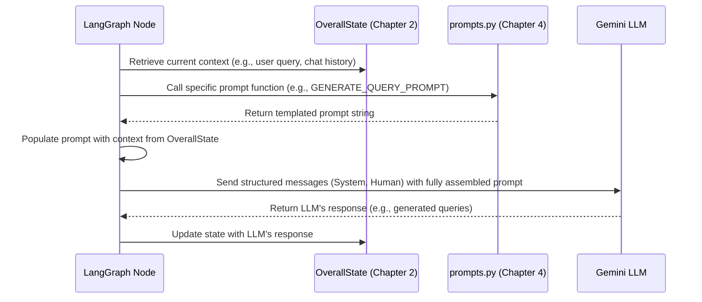

# Chapter 4: AI Prompt Definitions

Welcome back to our journey through the `gemini-fullstack-langgraph-quickstart` project! In the [previous chapter, LangGraph Agent Workflow](chapter_03.md), we delved into how our AI assistant orchestrates complex tasks through a series of interconnected nodes, defining the flow of information and decision-making. We saw how the agent moves from one state to another, performing actions like generating queries or processing results. However, for these actions to be truly intelligent and effective, the Large Language Model (LLM) at the core of our agent needs clear, concise, and context-rich instructions. This is precisely where AI Prompt Definitions come into play.

---

### Problem & Motivation

Imagine trying to explain a complex task to a new colleague without any specific instructions. They might try their best, but the output could be unfocused, incomplete, or not in the format you expect. Large Language Models face a similar challenge. While incredibly powerful, LLMs are essentially sophisticated pattern matchers; without explicit guidance, they can produce generic, irrelevant, or even "hallucinated" responses. This ambiguity is a significant hurdle in building reliable AI agents.

In our `gemini-fullstack-langgraph-quickstart` project, we need the Gemini model to perform very specific tasks at different stages of a conversation. For example, when a user asks, "What's the latest research on sustainable energy breakthroughs?", the agent first needs to generate effective search queries. Later, after fetching results, it needs to summarize that information coherently and reflect on its own performance. If we simply pass the raw user query to the LLM at each step, its responses would be inconsistent and inefficient, leading to a frustrating user experience. Prompt definitions provide the necessary guidance, transforming vague instructions into actionable directives for the LLM.

---

### Core Concept Explanation

AI Prompt Definitions are the explicit, carefully crafted instructions and contextual text that we feed to the Large Language Model (LLM) to guide its behavior. Think of them as the "operating manual" for the AI, ensuring it understands its role, the task at hand, and the desired format of its output. These definitions are crucial because they directly influence the LLM's reasoning process, the accuracy of its task execution (like generating a perfect search query or a thoughtful reflection), and the structure of its responses.

In essence, prompts imbue the LLM with context, constraints, and intent. They can define the AI's persona ("You are a helpful research assistant."), provide specific examples for few-shot learning, instruct it to use certain tools, or demand a particular output format (e.g., JSON for structured data). Our project leverages dynamic prompting, meaning parts of the prompt can be filled in at runtime with information from the [Overall Agent State](chapter_02.md), such as the current conversation history, retrieved search results, or even the current date. This dynamic capability ensures the LLM always has the most relevant and up-to-date context, allowing it to adapt its responses and actions precisely to the user's ongoing interaction and the project's goals.

---

### Practical Usage Examples

Let's look at how prompt definitions are structured and used within our project. These examples demonstrate how we can guide the Gemini model for specific tasks, ensuring it behaves as expected at each stage of the [LangGraph Agent Workflow](chapter_03.md).

#### 1. Defining a System Prompt for Agent Persona

A foundational prompt is the system message, which establishes the agent's overall role and behavior.

```python
# From backend/src/agent/prompts.py (conceptual snippet)
def get_system_persona_prompt(current_date: str):
    return (
        f"You are an expert research assistant. "
        f"Your goal is to provide comprehensive and accurate information "
        f"based on web searches. Today's date is {current_date}. "
        f"Always provide sources for your claims."
    )

# Usage example
from datetime import datetime

current_date = datetime.now().strftime("%B %d, %Y")
persona_prompt = get_system_persona_prompt(current_date)
print(persona_prompt)
```
**Explanation:** This snippet defines a function that returns a dynamic system prompt. It sets the AI's role as an "expert research assistant" and crucially includes the `current_date` using the `get_current_date` helper function (or similar logic). This ensures the AI is aware of the current temporal context, which is vital for providing up-to-date information.

#### 2. Prompt for Generating Search Queries

When the agent needs to find information, it uses a specific prompt to instruct the LLM on how to formulate effective search queries.

```python
# From backend/src/agent/prompts.py (conceptual snippet)
def get_search_query_generation_prompt(query: str):
    return (
        f"Based on the user's request: '{query}', "
        f"generate 3 precise search queries to find relevant information. "
        f"Format your response as a JSON array of strings, like this: "
        f'["query 1", "query 2", "query 3"].'
    )

# Usage example
user_query = "latest advancements in quantum computing"
search_prompt = get_search_query_generation_prompt(user_query)
print(search_prompt)
```
**Explanation:** This prompt guides the LLM to generate *multiple, precise* search queries based on the `user_query`. Critically, it specifies the desired output format as a JSON array, which makes it easy for our LangGraph workflow to parse and use these queries for web searches, aligning with our [AI Tools and Output Schemas](chapter_01.md).

#### 3. Prompt for Summarizing Search Results

After retrieving information, another prompt instructs the LLM to synthesize the results into a coherent summary.

```python
# From backend/src/agent/prompts.py (conceptual snippet)
def get_summarization_prompt(user_query: str, search_results: str):
    return (
        f"User's original question: '{user_query}'\n\n"
        f"Based on the following search results:\n{search_results}\n\n"
        f"Synthesize this information into a concise summary, "
        f"directly answering the user's question. Include sources."
    )

# Usage example
user_q = "What are microservices?"
results = "Article 1: Microservices are an architectural style... Article 2: Benefits include scalability..."
summary_prompt = get_summarization_prompt(user_q, results)
print(summary_prompt)
```
**Explanation:** This prompt takes both the original `user_query` and the `search_results` as input. It then directs the LLM to *synthesize* and *summarize* the information, focusing on answering the user's question and retaining sources. This ensures the output is informative and directly addresses the user's need.

The simple `get_current_date` function provided acts as a utility to inject real-time context into any prompt, allowing for more current and relevant responses from the AI.

```python
# Provided function from backend/src/agent/prompts.py
from datetime import datetime

def get_current_date():
    return datetime.now().strftime("%B %d, %Y")

# How it's used within a larger prompt:
# (As seen in the get_system_persona_prompt example above)
# "Today's date is {get_current_date()}"
```
**Explanation:** This small function is a perfect example of how dynamic data can be incorporated into prompts. By calling `get_current_date()` at the time the prompt is constructed, the LLM receives accurate, real-time information, improving the freshness of its knowledge baseline.

---

### Internal Implementation Walkthrough

In our `gemini-fullstack-langgraph-quickstart` project, AI prompt definitions are primarily managed within the `backend/src/agent/prompts.py` file. This centralizes all the textual instructions and ensures reusability across different parts of the agent's workflow.

1.  **Definition in `prompts.py`**:
    *   Prompt strings are defined as Python functions or constants within `prompts.py`.
    *   These often use f-strings or templating engines to allow for dynamic insertion of variables (like `user_query`, `search_results`, `current_date`, or parts of the `OverallState`).

    ```python
    # backend/src/agent/prompts.py (simplified)
    from datetime import datetime

    def get_current_date():
        return datetime.now().strftime("%B %d, %Y")

    def SYSTEM_PROMPT(current_date: str) -> str:
        return (
            f"You are a helpful AI assistant. Today's date is {current_date}. "
            f"Always prioritize factual accuracy."
        )

    def GENERATE_QUERY_PROMPT(user_request: str) -> str:
        return (
            f"Based on the user's request: '{user_request}', "
            f"generate a highly effective single search query."
        )
    ```

2.  **Usage within LangGraph Nodes**:
    *   Each node in the [LangGraph Agent Workflow](chapter_03.md) that interacts with the LLM (e.g., `generate_queries`, `summarize_results`, `reflect_on_response`) will import and utilize the relevant prompt functions from `prompts.py`.
    *   Before making an LLM call, the node gathers the necessary context from the `OverallState` (Chapter 2), populates the prompt template, and then passes the complete prompt to the LLM.

    ```python
    # backend/src/agent/agent.py (simplified node logic)
    from langgraph.graph import StateGraph, START
    from langchain_core.messages import HumanMessage, SystemMessage
    from backend.src.agent.prompts import SYSTEM_PROMPT, GENERATE_QUERY_PROMPT, get_current_date
    from backend.src.agent.state import OverallState # Our central state

    # ... assuming an LLM instance 'llm_model' is defined ...

    def generate_queries_node(state: OverallState):
        current_date = get_current_date()
        system_message = SYSTEM_PROMPT(current_date)
        user_message_content = GENERATE_QUERY_PROMPT(state["messages"][-1].content)

        # Assemble messages for the LLM
        messages = [
            SystemMessage(content=system_message),
            HumanMessage(content=user_message_content)
        ]

        # Call the LLM
        response = llm_model.invoke(messages)

        # Update state with generated queries (logic simplified)
        return {"search_queries": [response.content]}

    # ... rest of LangGraph definition ...
    ```

This dynamic construction allows the prompts to be highly adaptive and context-aware.

Here's a visual representation of how prompts integrate into the LLM call flow within a LangGraph node:



---

### System Integration

AI Prompt Definitions are not isolated; they are deeply woven into the fabric of our full-stack project, acting as critical conduits of information between various components.

*   **Integration with [Overall Agent State](chapter_02.md)**: The `OverallState` is the single source of truth for the agent's current context. Prompts frequently read from this state to get information like the `messages` history, `search_queries` to be refined, or `search_results` to be summarized. Conversely, the LLM's output, guided by the prompt, often updates the `OverallState` with new data, completing a feedback loop. For example, a prompt for query generation takes the user's initial query from `OverallState` and the LLM's output (new queries) is then stored back into it.

*   **Integration with [LangGraph Agent Workflow](chapter_03.md)**: Every decision point or task execution within the LangGraph workflow that involves the LLM relies on a specific prompt. Different nodes in the graph utilize different prompts tailored to their function. For instance, the "generate_queries" node uses a prompt designed for query formulation, while a "summarize_results" node uses a summarization-focused prompt. The workflow dictates *which* prompt is called *when*, ensuring the LLM is always focused on the immediate task.

*   **Integration with [AI Tools and Output Schemas](chapter_01.md)**: Prompts are essential for instructing the LLM on how to use the defined AI tools and adhere to their output schemas. For example, a prompt might explicitly tell the LLM, "Use the `search_tool` to find information" or "Your response must be a JSON object conforming to the `SearchResultSchema`." This guidance is vital for the agent to correctly interact with external functionalities and produce structured, parsable output that the rest of the system can process.

---

### Best Practices & Tips

Crafting effective AI prompts is an art as much as a science. Here are some best practices to ensure your prompt definitions yield optimal results:

1.  **Be Clear and Concise**: Avoid ambiguity. State your instructions directly. The more straightforward your prompt, the less room for misinterpretation by the LLM.
2.  **Define the AI's Persona/Role**: Explicitly tell the LLM who it is ("You are an expert research assistant...") and what its goals are. This grounds its responses in a consistent identity.
3.  **Specify Output Format**: If you need the LLM to return data in a particular structure (e.g., JSON, markdown list), specify it clearly in the prompt. Provide examples if possible.
4.  **Use Dynamic Context**: Leverage the `OverallState` and utility functions like `get_current_date()` to inject real-time and relevant information into your prompts. This makes the LLM's responses more pertinent and up-to-date.
5.  **Provide Examples (Few-shot Learning)**: For complex tasks, providing 1-3 examples of input-output pairs within the prompt can significantly improve the LLM's performance by demonstrating the desired behavior.
6.  **Instruct for Tool Use**: When the LLM needs to use a tool, explicitly describe the tool's purpose, its input parameters, and how its output should be processed.
7.  **Guide Reasoning Steps**: For multi-step tasks, you can prompt the LLM to "think step by step" or output its reasoning process, which can improve accuracy and allow for easier debugging.
8.  **Iterate and Test**: Prompt engineering is iterative. Experiment with different phrasings, contexts, and examples. Test your prompts rigorously with various inputs to ensure consistent and desired outputs.
9.  **Avoid Prompt Injection Vulnerabilities**: Be cautious when incorporating user-generated content directly into prompts. Consider sanitizing inputs or using robust templating to prevent malicious instructions from overriding your system prompts.

---

### Chapter Conclusion

In this chapter, we've explored the critical role of AI Prompt Definitions in making our `gemini-fullstack-langgraph-quickstart` project intelligent and reliable. We've seen how these explicit instructions guide the Gemini LLM's reasoning, task execution, and response formatting, solving the problem of ambiguous LLM behavior. From establishing an AI persona to generating precise search queries and summarizing results, prompts are the foundational language through which we communicate our intentions to the AI.

By dynamically populating prompts with context from the [Overall Agent State](chapter_02.md) and integrating them seamlessly into the [LangGraph Agent Workflow](chapter_03.md), we enable the agent to perform complex conversational tasks with high precision and relevance. Understanding how to craft effective prompts is key to unlocking the full potential of your AI assistant.

Next, we'll delve into [Agent Configuration](chapter_05.md), where we tie together all these concepts – tools, state, workflow, and prompts – into a cohesive, runnable agent, preparing it for deployment and interaction.