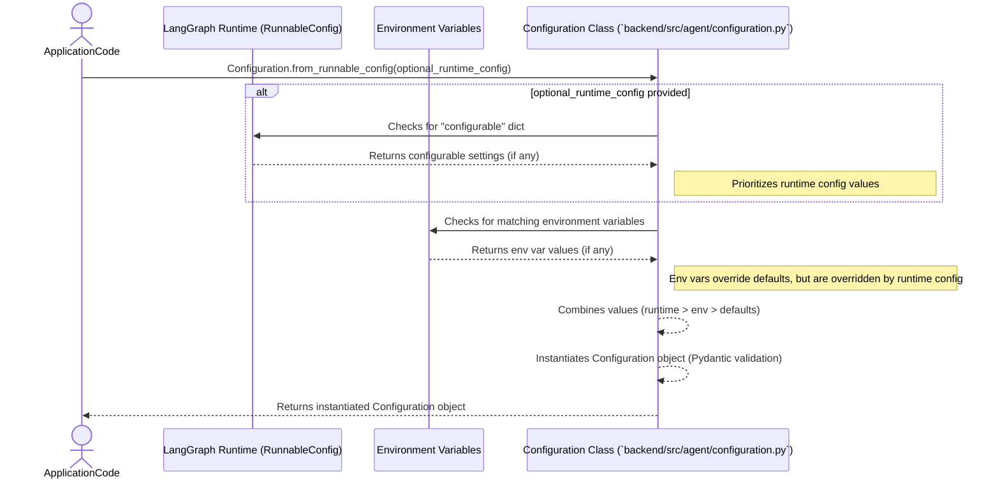

# Chapter 5: Agent Configuration

Building upon the foundation of our well-defined [AI Prompt Definitions](chapter_04.md), which dictate *what* our AI thinks and says, we now turn our attention to *how* our AI operates and adapts to various scenarios. This chapter introduces **Agent Configuration**, the mechanism that allows us to fine-tune the operational parameters and behavior of our Gemini-powered AI assistant without altering its core logic.

---

### Problem & Motivation

In any sophisticated AI system, hardcoding operational parameters directly into the agent's logic can lead to rigidity and make updates or adaptations cumbersome. Imagine if you wanted to switch the underlying Large Language Model (LLM) used for generating search queries, or perhaps enable a verbose debugging mode, or even adjust specific thresholds for decision-making. If these settings are scattered throughout the codebase, making changes would require modifying and redeploying core components, increasing the risk of introducing bugs.

This problem is particularly acute in a dynamic project like "gemini-fullstack-langgraph-quickstart," where the AI needs to be flexible enough to handle evolving requirements and experiment with different LLMs or strategies. We need a way to easily adjust critical parameters such as the specific LLM used for query generation, or flags that control advanced agent behaviors, without touching the core orchestration logic.

The Agent Configuration abstraction solves this by centralizing all such adjustable parameters. For instance, a common use case would be to test different Gemini models (e.g., `gemini-2.0-flash` vs. `gemini-2.0-pro`) for specific tasks like query generation to find the optimal balance between speed and quality. This separation of concerns ensures that our agent remains adaptable, maintainable, and robust in the face of changing needs.

---

### Core Concept Explanation

At its heart, **Agent Configuration** provides a structured way to define and manage the settings that govern our AI agent's operations. Think of it as the control panel for your AI assistant. Instead of baking every operational detail into the agent's step-by-step logic, we externalize these details into a dedicated `Configuration` object. This object acts as a single source of truth for all configurable parameters.

This abstraction leverages Pydantic's `BaseModel` to define our configuration schema. This is a powerful choice because it provides automatic data validation, clear type hinting, and robust parsing capabilities. Each configuration parameter, like `query_generator_model`, is defined as a field within this `BaseModel`, often with default values and descriptive metadata. This means we can clearly specify what settings are available, what types of values they expect, and what their purpose is.

The beauty of this approach lies in its flexibility. We can load these configurations from various sources: directly instantiated in code, from environment variables during deployment, or even dynamically supplied at runtime through LangChain's `RunnableConfig`. This multi-source loading mechanism ensures that our agent can be deployed across different environments (development, staging, production) with environment-specific settings, without requiring any code changes. It's about empowering developers to steer the agent's behavior through simple settings rather than complex code modifications.

---

### Practical Usage Examples

Let's see how we can use the `Configuration` class to customize our agent's behavior.

First, you can instantiate a `Configuration` object directly, overriding any defaults:

```python
from backend.src.agent.configuration import Configuration

# Create a configuration instance
my_config = Configuration(
    query_generator_model="gemini-1.5-flash",
    # imagine other settings here, e.g., debug_mode=True
)

print(f"Query Generator Model: {my_config.query_generator_model}")
# Expected Output: Query Generator Model: gemini-1.5-flash
```
This example shows how to explicitly set the LLM for query generation. When the agent's query generation node executes, it would then use `gemini-1.5-flash` instead of the default `gemini-2.0-flash`.

More commonly, configurations are loaded dynamically, often picking up values from environment variables or a `RunnableConfig` dictionary.

```python
import os
from backend.src.agent.configuration import Configuration

# Simulate an environment variable
os.environ["QUERY_GENERATOR_MODEL"] = "gemini-1.5-pro"

# Load configuration from environment variables (and defaults)
env_config = Configuration.from_runnable_config()

print(f"Model from Env: {env_config.query_generator_model}")

# Clean up environment variable for subsequent examples
del os.environ["QUERY_GENERATOR_MODEL"]
```
This demonstrates how an environment variable `QUERY_GENERATOR_MODEL` can override the default model. This is crucial for deployment, allowing different environments to use different models without code changes.

Finally, `from_runnable_config` is designed to integrate seamlessly with LangGraph's runtime configuration, allowing you to pass settings directly with your agent invocation:

```python
from backend.src.agent.configuration import Configuration
from langgraph.prebuilt import create_react_agent_executor # Example placeholder

# Simulate a LangGraph RunnableConfig
runtime_config = {"configurable": {"query_generator_model": "gemini-2.0-pro"}}

# Load configuration, prioritizing runtime config over env vars/defaults
runtime_loaded_config = Configuration.from_runnable_config(config=runtime_config)

print(f"Model from Runtime Config: {runtime_loaded_config.query_generator_model}")
# Expected Output: Model from Runtime Config: gemini-2.0-pro
```
Here, the `query_generator_model` is specified within the `configurable` dictionary of the `RunnableConfig`, which takes precedence. This allows for extremely granular, per-invocation control over the agent's behavior.

---

### Internal Implementation Walkthrough

The `Configuration` abstraction is elegantly implemented using Pydantic, which significantly simplifies its creation and usage. Let's break down the key components:

#### 1. The `Configuration` Class (`backend/src/agent/configuration.py`)

The `Configuration` class itself is a Pydantic `BaseModel`. This inheritance provides automatic data validation, serialization, and deserialization.

```python
# backend/src/agent/configuration.py

from pydantic import BaseModel, Field

class Configuration(BaseModel):
    """The configuration for the agent."""

    query_generator_model: str = Field(
        default="gemini-2.0-flash",
        metadata={
            "description": "The name of the language model to use for the agent's query generation."
        },
    )
    # ... other configuration fields like debug_mode, tool_timeout, etc.
```

*   **`BaseModel`**: By inheriting from `BaseModel`, our `Configuration` class gains powerful features. When an instance of `Configuration` is created, Pydantic automatically validates the types and values of the fields. If an invalid value is provided (e.g., a non-string for `query_generator_model`), it will raise a validation error, preventing incorrect configurations from being used.
*   **`Field`**: Pydantic's `Field` allows us to define default values and add rich metadata. The `default` keyword argument ensures that if a value isn't explicitly provided, a sensible fallback is used (e.g., `gemini-2.0-flash`). The `metadata` dictionary is excellent for self-documenting the purpose of each configuration parameter.

#### 2. Dynamic Loading with `from_runnable_config`

The `from_runnable_config` class method is the central point for dynamically loading agent configurations, supporting multiple sources with a clear precedence:

```python
# backend/src/agent/configuration.py

import os
from typing import Any, Optional, TypeVar
from langgraph.prebuilt import RunnableConfig # Conceptual dependency, often from LangChain

# ... inside Configuration class ...
    @classmethod
    def from_runnable_config(
        cls, config: Optional[RunnableConfig] = None
    ) -> "Configuration":
        """Create a Configuration instance from a RunnableConfig."""
        configurable = (
            config["configurable"] if config and "configurable" in config else {}
        )

        # Get raw values from environment or config
        raw_values: dict[str, Any] = {
            "query_generator_model": (
                configurable.get("query_generator_model")
                or os.environ.get("QUERY_GENERATOR_MODEL")
            ),
            # ... other config fields following the same pattern ...
        }

        # Filter out None values and create the instance
        values = {k: v for k, v in raw_values.items() if v is not None}
        return cls(**values)
```

Here's how `from_runnable_config` works:

1.  **Extract `configurable` from `RunnableConfig`**: It first checks if a `RunnableConfig` dictionary was passed (often provided by LangChain/LangGraph at runtime). If it exists and contains a `"configurable"` key, it extracts those runtime-specific settings.
2.  **Gather Raw Values**: For each configuration parameter (e.g., `query_generator_model`), it attempts to fetch its value in a specific order of precedence:
    *   First, from the `configurable` dictionary (runtime overrides).
    *   Second, from environment variables (e.g., `os.environ.get("QUERY_GENERATOR_MODEL")`).
    *   If neither is found, the `default` value defined in the `Field` will be used when `cls(**values)` is called.
3.  **Filter and Instantiate**: It then filters out any `None` values (meaning the setting wasn't found in runtime config or environment variables) and uses the remaining collected values to instantiate the `Configuration` class (`cls(**values)`). Pydantic then applies its validation and uses the default values for any parameters not explicitly provided.

This hierarchical loading mechanism ensures maximum flexibility. Runtime settings override environment variables, which in turn override code-defined defaults.

#### Interaction Flow for Configuration Loading:


This diagram illustrates how the `Configuration` object is constructed, pulling values from different sources based on a defined priority.

---

### System Integration

The `Configuration` abstraction is a foundational component that influences various parts of our "gemini-fullstack-langgraph-quickstart" project. Its primary role is to inform and parameterize the core behaviors defined in other chapters:

*   **[LangGraph Agent Workflow](chapter_03.md)**: The agent workflow directly consumes the `Configuration` object. Specific nodes within the LangGraph graph, such as the `query_generator` node, will receive the `Configuration` object (or specific parameters from it) to determine which LLM to use for generating search queries or how to structure its responses. For example, a `debug_mode` flag could alter the logging verbosity of the workflow.

*   **[AI Prompt Definitions](chapter_04.md)**: While prompt definitions define the static instructions, the `Configuration` can dictate *which* prompts are used or *how* they are formatted. For instance, if a configuration setting enables a "verbose reasoning" mode, the agent might switch to a different prompt template designed to elicit more detailed thought processes from the LLM. It also dictates *which LLM model* is used to execute these prompts.

*   **[AI Tools and Output Schemas](chapter_01.md)**: The `Configuration` can influence how tools are utilized. For example, a `tool_timeout` setting could be passed to a web search tool, or a `max_retries` setting for API calls. While the schemas define the expected output, the configuration can control the *process* of generating that output.

The data flow typically involves the `main` application entry point (or the LangGraph `AgentExecutor` itself) instantiating the `Configuration` object using `from_runnable_config`. This configuration object is then passed down to the agent's constructor or made available to the individual nodes in the LangGraph workflow, allowing them to adapt their behavior based on the current settings.

---

### Best Practices & Tips

1.  **Centralize Configuration**: Keep all configurable parameters within the `Configuration` class. Avoid scattering `os.environ.get()` calls throughout your core logic. This makes settings discoverable and manageable.
2.  **Provide Clear Defaults**: Always define sensible default values using `Field(default=...)`. This ensures the agent can run out-of-the-box without requiring extensive setup.
3.  **Use Descriptive Metadata**: Leverage the `metadata` argument in `Field` to describe the purpose of each setting. This serves as excellent inline documentation.
4.  **Leverage Environment Variables for Deployment**: For settings that change between environments (development, staging, production) or contain sensitive information (like API keys, though those are not in this `Configuration` class), use environment variables. `from_runnable_config` handles this gracefully.
5.  **Runtime Overrides for Granularity**: Utilize the `RunnableConfig` mechanism for fine-grained, per-invocation adjustments. This is powerful for A/B testing different models or behaviors.
6.  **Validate Inputs**: Rely on Pydantic's validation to ensure that configuration values are of the correct type and format, preventing runtime errors caused by misconfigurations.
7.  **Consider Configuration Grouping**: For very large projects, you might consider breaking configuration into smaller, domain-specific `BaseModel`s (e.g., `LLMConfig`, `ToolConfig`) and then composing them within a main `Configuration` class. This project's current structure is simpler and sufficient.

---

### Chapter Conclusion

In this chapter, we've explored the crucial role of **Agent Configuration** in building a flexible and adaptable AI assistant. We've seen how the `Configuration` class, powered by Pydantic, centralizes and manages operational parameters, allowing us to customize the agent's behavior without altering its core logic. From selecting different LLMs for query generation to handling dynamic runtime adjustments, this abstraction ensures our "gemini-fullstack-langgraph-quickstart" project remains robust and easy to modify.

Understanding configuration is key to deploying and maintaining sophisticated AI systems in various environments. With the agent's behavior now fully configurable, our next step is to explore how users will interact with this powerful backend. We will dive into the design and implementation of the **Frontend User Interface**, bringing our AI assistant to life for the end-user.

Onwards to: [Frontend User Interface](chapter_06.md)