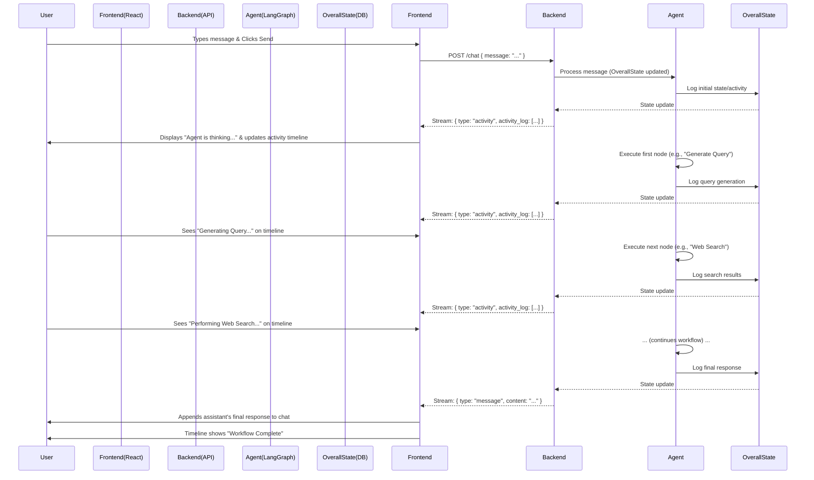

# Chapter 6: Frontend User Interface

Having meticulously configured our agent's behavior and operational parameters in the [Agent Configuration](chapter_05.md) chapter, we now turn our attention to the user-facing side of our Gemini-powered AI assistant: the **Frontend User Interface**. This is where all the sophisticated backend logic meets the user, providing an intuitive and engaging experience.

---

### Problem & Motivation

The core challenge for any AI assistant project, no matter how intelligent its backend, is to make that intelligence *accessible and observable* to a human user. Without a user interface, our elaborate [LangGraph Agent Workflow](chapter_03.md) and powerful [AI Tools and Output Schemas](chapter_01.md) would remain hidden, locked away from interaction. Users need a straightforward way to pose questions, receive responses, and crucially, understand what the AI is *doing* behind the scenes.

In our `gemini-fullstack-langgraph-quickstart` project, this problem is compounded by the complexity of LangGraph's multi-step decision-making process. A simple text-in, text-out interface wouldn't suffice; users need to see the agent's thought process—when it's searching, reflecting, or generating a final answer. Therefore, the frontend is not just a portal for input/output, but a crucial visualization layer that demystifies the AI's internal workings, enhancing trust and user experience. Consider a user asking: "What's the latest research on cold fusion and what are its practical implications?" The frontend must allow this input, display the evolving response, and ideally, show the agent's steps like "Searching for cold fusion research," then "Analyzing findings," and finally, the comprehensive answer.

---

### Core Concept Explanation

The **Frontend User Interface** is the visual and interactive layer of our application, built using React. It serves as the primary point of interaction for users with the Gemini-powered AI assistant. Think of it as the control panel and display screen for our AI engine. Just as a car dashboard shows speed, fuel, and engine status, our frontend provides a real-time window into the AI's current activity and conversational state.

At its heart, the frontend presents a conversational chat interface where users can type messages and view the AI's responses. However, it goes a step further by incorporating an "agent activity timeline." This innovative feature visualizes the dynamic steps of the [LangGraph Agent Workflow](chapter_03.md) as they unfold. For instance, if the agent decides to use a web search tool, the timeline will update to show "Performing Web Search." This transparency is critical for understanding the agent's decision-making process and maintaining user engagement during potentially longer processing times. The interface directly consumes the updates to the [Overall Agent State](chapter_02.md) to render the current interaction.

---

### Practical Usage Examples

Getting started with the frontend involves running the React application and understanding its core interaction loop: sending user messages and displaying AI responses, along with the agent's activity.

First, ensure you have the frontend dependencies installed and the application running. Navigate to `src/frontend` and run:

```bash
npm install
npm start
```
*This command installs the necessary JavaScript packages for the React application and then starts the development server, usually accessible at `http://localhost:3000`.*

Now, let's look at how a user input is captured and sent. In the primary chat component (`src/frontend/components/ChatInterface.tsx`), a text input field handles the user's message submission:

```typescript
// src/frontend/components/ChatInterface.tsx (simplified)
import React, { useState } from 'react';

function ChatInterface({ onSendMessage }) {
  const [input, setInput] = useState('');

  const handleSubmit = (e) => {
    e.preventDefault();
    if (input.trim()) {
      onSendMessage(input); // Call a prop function to send the message
      setInput(''); // Clear the input field
    }
  };

  return (
    <form onSubmit={handleSubmit}>
      <input
        type="text"
        value={input}
        onChange={(e) => setInput(e.target.value)}
        placeholder="Type your message..."
      />
      <button type="submit">Send</button>
    </form>
  );
}

export default ChatInterface;
```
*This simplified React component defines an input field and a send button. When the user types and presses Enter or clicks "Send", the `onSendMessage` function (passed from a parent component like `App.tsx`) is invoked with the user's message, and the input field is cleared.*

The parent `App.tsx` component is responsible for handling the `onSendMessage` call, typically by making an API request to the backend. It also manages the display of messages and agent activities:

```typescript
// src/frontend/App.tsx (simplified relevant parts)
import React, { useState, useEffect } from 'react';
import ChatInterface from './components/ChatInterface';
import AgentActivityTimeline from './components/AgentActivityTimeline';

function App() {
  const [messages, setMessages] = useState([]); // Stores chat messages
  const [agentActivity, setAgentActivity] = useState([]); // Stores agent's steps
  const [isLoading, setIsLoading] = useState(false);

  const sendMessage = async (text) => {
    const userMessage = { role: 'user', content: text, type: 'chat' };
    setMessages((prev) => [...prev, userMessage]);
    setIsLoading(true);

    try {
      // API call to the backend
      const response = await fetch('/chat', {
        method: 'POST',
        headers: { 'Content-Type': 'application/json' },
        body: JSON.stringify({ message: text }),
      });

      if (!response.ok) throw new Error('API request failed');

      // Assuming the backend streams responses
      const reader = response.body.getReader();
      let assistantResponse = '';
      let currentActivity = [];

      while (true) {
        const { done, value } = await reader.read();
        if (done) break;

        const chunk = new TextDecoder().decode(value);
        const parts = chunk.split('\n\n').filter(Boolean); // Split on double newline for multiple events

        for (const part of parts) {
            if (part.startsWith('data: ')) {
                try {
                    const data = JSON.parse(part.substring(6));
                    if (data.type === 'message') {
                        assistantResponse += data.content;
                    } else if (data.type === 'activity') {
                        currentActivity = data.activity_log; // Update agent activity
                        setAgentActivity(currentActivity);
                    }
                    // Update messages with streamed content for assistant
                    setMessages((prev) => {
                        const lastMessage = prev[prev.length - 1];
                        if (lastMessage && lastMessage.role === 'assistant' && lastMessage.type === 'chat') {
                            return [...prev.slice(0, -1), { ...lastMessage, content: assistantResponse }];
                        }
                        return [...prev, { role: 'assistant', content: assistantResponse, type: 'chat' }];
                    });

                } catch (e) {
                    console.error('Failed to parse JSON chunk:', e, part);
                }
            }
        }
      }
    } catch (error) {
      console.error('Error sending message:', error);
      setMessages((prev) => [...prev, { role: 'assistant', content: 'Sorry, something went wrong.', type: 'error' }]);
    } finally {
      setIsLoading(false);
    }
  };

  return (
    <div>
      <h1>Gemini AI Assistant</h1>
      <div className="chat-window">
        {messages.map((msg, index) => (
          <div key={index} className={`message ${msg.role}`}>
            <strong>{msg.role}:</strong> {msg.content}
          </div>
        ))}
        {isLoading && <div className="loading">Agent is thinking...</div>}
      </div>
      <ChatInterface onSendMessage={sendMessage} />
      <AgentActivityTimeline activities={agentActivity} />
    </div>
  );
}

export default App;
```
*This `App` component holds the main state for `messages` and `agentActivity`. When a user sends a message via `ChatInterface`, `sendMessage` is called. This function makes a `fetch` request to the backend's `/chat` endpoint. It then reads a streaming response, parsing `message` type events to build the assistant's reply and `activity` type events to update the `AgentActivityTimeline`. This provides a real-time, dynamic view of the AI's process.*

---

### Internal Implementation Walkthrough

The frontend application, residing in `src/frontend`, is structured as a standard React application. Its core components work together to provide the interactive experience.

1.  **`src/frontend/App.tsx`**: This is the main application component. It acts as the central state manager for the entire chat interaction. It maintains the list of `messages` (both user and AI) and the `agentActivity` log. Crucially, it handles the network requests to the backend API (`/chat` endpoint) and processes the streaming responses.

2.  **`src/frontend/components/ChatInterface.tsx`**: This component provides the input mechanism for the user. It contains a text input field and a send button. It manages its internal state for the current input value and, upon submission, calls a `prop` function (`onSendMessage`) passed from `App.tsx` to relay the user's message to the parent for processing.

3.  **`src/frontend/components/AgentActivityTimeline.tsx`**: This component is responsible for displaying the real-time activity of the AI agent. It receives an array of `activities` (e.g., "Generating Query," "Performing Web Search," "Reflecting on Results") as a prop and renders them, often as a list, to show the step-by-step progression of the [LangGraph Agent Workflow](chapter_03.md). Each activity in the timeline corresponds to a specific node or state transition within the backend agent.

The interaction flow from a user perspective to the agent's response and its display can be visualized as follows:


*This sequence diagram illustrates how the user's input triggers a backend process. The backend, in turn, interacts with the LangGraph agent, which updates the `OverallState`. Crucially, these state changes are streamed back to the frontend in real-time, allowing the UI to update both the conversational messages and the detailed agent activity timeline, providing transparency into the AI's internal reasoning.*

---

### System Integration

The Frontend User Interface is meticulously integrated with the backend of the `gemini-fullstack-langgraph-quickstart` project through a RESTful API. The primary integration point is the `/chat` endpoint exposed by the backend.

1.  **API Communication**: When a user submits a message, the `App.tsx` component makes an asynchronous `POST` request to the backend's `/chat` endpoint. The user's message is sent in the request body as JSON.
    ```javascript
    // Example fetch call within App.tsx
    const response = await fetch('/chat', {
        method: 'POST',
        headers: { 'Content-Type': 'application/json' },
        body: JSON.stringify({ message: text }),
    });
    ```
    *This code snippet shows the core `fetch` API call, which initiates the conversation with the backend AI assistant. It sends the user's `text` message to the `/chat` endpoint.*

2.  **Streaming Responses**: A key aspect of integration is the backend's ability to stream updates back to the frontend. This is achieved by keeping the HTTP connection open and sending data in chunks. The frontend `App.tsx` component continuously reads these chunks, which contain `message` content or `activity` logs. This streaming allows for real-time updates of both the conversational text and the agent's workflow timeline, directly reflecting the ongoing processing in the [LangGraph Agent Workflow](chapter_03.md).

3.  **Data Flow and `OverallState`**: The streaming `activity` events sent from the backend are direct reflections of changes to the [Overall Agent State](chapter_02.md). As the LangGraph agent executes nodes and updates its internal `OverallState` with new `chat_history`, `tools_output`, or `agent_activity_timeline`, these updates are packaged and streamed to the frontend. The `AgentActivityTimeline` component then visualizes the `activity_log` from the `OverallState`, providing the user with unparalleled insight into the agent's decision-making process. The `message` events, on the other hand, update the `chat_history` displayed in the main chat window.

---

### Best Practices & Tips

When developing and maintaining the Frontend User Interface for an AI assistant, especially one with complex, dynamic backends, consider these best practices:

*   **Provide Clear Feedback**: Always inform the user about the AI's current status. This includes loading indicators (`Agent is thinking...`), error messages, and, most importantly, the **Agent Activity Timeline**. Transparency reduces user frustration during longer processing times.
*   **Handle Streaming Robustly**: Ensure your frontend can correctly parse and reconstruct streamed responses, especially when dealing with partial JSON objects or multiple event types within a single chunk. Implement proper error handling for parsing failures.
*   **State Management**: For an interactive chat application, efficient state management is crucial. Use React's `useState` and `useEffect` hooks effectively, or consider state management libraries for larger applications, to manage conversational history, agent activity, and loading states.
*   **Responsiveness and Accessibility**: Design the UI to be responsive across different screen sizes and ensure it adheres to accessibility guidelines. This makes the AI assistant usable by a wider audience.
*   **Error Handling and Retries**: Implement client-side error handling for API calls. Inform the user if the backend is unreachable or returns an error. Consider simple retry mechanisms for transient network issues.
*   **User Experience (UX) for AI**: Remember that AI interaction is different from traditional web forms. Focus on making the AI feel helpful and responsive. This includes clear prompts, the ability to interrupt (if backend supports), and contextual help.
*   **Security Considerations**: While primarily a backend concern, ensure no sensitive information is inadvertently exposed in the frontend, and sanitize any user-generated content before rendering to prevent XSS attacks.

---

### Chapter Conclusion

This chapter has provided a comprehensive overview of the Frontend User Interface, the critical layer that brings our `gemini-fullstack-langgraph-quickstart` project to life for the end-user. We've explored its motivation—to make complex AI interactions accessible and observable—and delved into its core React-based implementation. From capturing user input and displaying dynamic AI responses to visualizing the intricate steps of the agent's workflow via the activity timeline, the frontend acts as the crucial bridge between human and AI.

We've detailed how `App.tsx`, `ChatInterface`, and `AgentActivityTimeline` components collaborate, and how the frontend seamlessly integrates with the backend's streaming API, translating the `Overall Agent State` into a rich, interactive experience. By following the best practices outlined, developers can build intuitive, robust, and transparent interfaces for AI assistants.

This chapter concludes our deep dive into the `gemini-fullstack-langgraph-quickstart` project's architecture and implementation. From defining `AI Tools` and the `Overall Agent State`, through orchestrating the `LangGraph Agent Workflow` and crafting precise `AI Prompt Definitions`, to `Agent Configuration` and finally the `Frontend User Interface`, we have covered all the essential components for building a powerful and transparent Gemini-powered AI assistant.