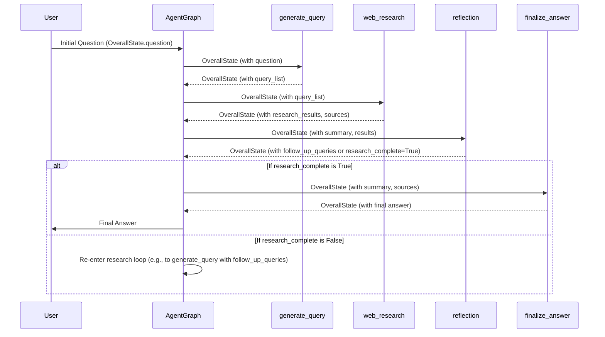

# Chapter 2: Agent Workflow Nodes

In the previous chapter, we established the foundation of our AI agent by defining its central data structure, the [Agent State](chapter_01.md). This `OverallState` acts as the single source of truth, carrying all relevant information—from user queries to research findings—as the agent progresses through its tasks. Now, we turn our attention to the *actions* an agent performs: the individual, discrete steps that process and update this state. These steps are what we call **Agent Workflow Nodes**.

---

### Problem & Motivation

Imagine asking an AI agent a complex question like, "What are the latest advancements in quantum computing, and how might they impact cybersecurity?" A single, monolithic function cannot adequately handle such a request. It requires a sequence of logical operations: first, understanding the question and formulating search queries; second, executing those searches; third, synthesizing the information and identifying gaps; and finally, presenting a cohesive answer. Without a structured way to break down and orchestrate these tasks, developing intelligent, adaptive agents becomes unwieldy and prone to errors.

In the `gemini-fullstack-langgraph-quickstart` project, Agent Workflow Nodes address this complexity by modularizing the agent's behavior. Each node is a self-contained unit of logic, designed to perform a specific, well-defined task within the agent's overall processing pipeline. This modularity is crucial for several reasons: it promotes code reusability, simplifies debugging, enables dynamic decision-making, and allows for the easy evolution of the agent's capabilities. Our agent leverages these nodes to iteratively research, reflect, and refine its understanding before delivering a final answer, transforming a complex problem into a series of manageable, interconnected steps.

---

### Core Concept Explanation

**Agent Workflow Nodes** are the operational heart of our LangGraph agent. They are essentially Python functions designed to interact with and transform the agent's state. Each node receives the current `OverallState` (or a more specific sub-state derived from it) as input, performs a specific computation or action, and then returns an updated state or a specific piece of data that will be incorporated back into the overall state.

Think of nodes as specialized workers in an assembly line. Each worker (node) has a unique skill—one generates a query, another performs a web search, a third summarizes findings, and a fourth reflects on the progress. The `OverallState` is the item moving down the assembly line, being modified and enriched by each worker it passes through. This structured approach allows us to build complex, multi-step reasoning processes by chaining simple, focused operations together.

In the context of LangGraph, these nodes are often implemented as `Runnable` instances or simple Python functions that adhere to a specific signature, typically accepting `state` and `config` arguments. The `config` argument often provides runtime parameters, such as API keys or model settings, allowing nodes to be highly configurable and adaptable without modifying their core logic. By designing our agent this way, we create a flexible and powerful system capable of handling intricate information processing tasks.

---

### Practical Usage Examples

Let's look at how individual functions serve as Agent Workflow Nodes, each contributing a specific piece to the overall agent's intelligence. We'll use the functions defined in `backend/src/agent/graph.py`.

#### 1. Generating Search Queries (`generate_query`)

This node is responsible for taking the user's initial question (from the `state`) and formulating optimized search queries for web research.

```python
# From backend/src/agent/graph.py
def generate_query(state: OverallState, config: RunnableConfig) -> QueryGenerationState:
    """LangGraph node that generates search queries based on the User's question."""
    # ... more code ...
    return {"query_list": result.query}
```
**Explanation:** The `generate_query` function acts as our initial processing step. It takes the agent's current `state` (which includes the user's question) and a `config` object. Its primary job is to generate one or more search queries. The returned dictionary, `{"query_list": result.query}`, is then merged into the overall agent state, making the generated queries available for subsequent nodes.

#### 2. Performing Web Research (`web_research`)

Once queries are generated, this node takes them and executes actual web searches using an external tool.

```python
# From backend/src/agent/graph.py
def web_research(state: WebSearchState, config: RunnableConfig) -> OverallState:
    """LangGraph node that performs web research using the native Google Search API tool."""
    # ... more code ...
    return {
        # ... updated state components ...
    }
```
**Explanation:** The `web_research` node consumes the `query_list` from the `state` (specifically, it expects a `WebSearchState` which is a subset of `OverallState` for clarity). It then interacts with a search API (like Google Search) to fetch relevant results. The output is an updated `OverallState` that includes these `research_results`, alongside potentially updated summaries or other tracked information.

#### 3. Reflecting on Findings (`reflection`)

After research, the agent needs to analyze the gathered information, identify gaps, and decide if more research is needed or if it's ready to finalize.

```python
# From backend/src/agent/graph.py
def reflection(state: OverallState, config: RunnableConfig) -> ReflectionState:
    """LangGraph node that identifies knowledge gaps and generates potential follow-up queries."""
    # ... more code ...
    return {
        # ... updated state components related to reflection ...
    }
```
**Explanation:** The `reflection` node is crucial for iterative improvement. It receives the `OverallState`, which now contains the current summary and research results. It uses an LLM to "think" about what has been found, identifies missing information, and might propose `follow_up_queries` or indicate that the research is `complete`. The `ReflectionState` returned updates the `OverallState` with these findings.

#### 4. Finalizing the Answer (`finalize_answer`)

The last step in the research process is to compile all findings into a coherent and well-cited response.

```python
# From backend/src/agent/graph.py
def finalize_answer(state: OverallState, config: RunnableConfig):
    """LangGraph node that finalizes the research summary."""
    # ... more code ...
    # No explicit return type in this snippet, implies direct state manipulation or implicit return of updated state
```
**Explanation:** The `finalize_answer` node takes the `OverallState` containing the running summary and all collected sources. Its role is to format and deduplicate sources, combine them with the summary, and produce the final, polished response. This function is typically the last node in a research loop, preparing the output for the user.

---

### Internal Implementation Walkthrough

Each workflow node in our `gemini-fullstack-langgraph-quickstart` project, as exemplified in `backend/src/agent/graph.py`, is implemented as a Python function. These functions are designed to be *pure* or nearly pure in their interaction with the `state`: they take the current `state` as an argument, perform their logic, and return a dictionary representing updates to the `state`. LangGraph then intelligently merges these updates into the central `OverallState`.

Let's examine the internal workings and purpose of each node:

*   **`generate_query(state: OverallState, config: RunnableConfig)`**:
    *   **Purpose**: To translate the user's potentially ambiguous question into precise, actionable search queries.
    *   **Mechanism**: This node typically uses an LLM (e.g., Gemini 2.0 Flash) to interpret the `state["question"]` and craft an optimal `query_list`. It leverages structured output to ensure the LLM returns the queries in a predictable format.
    *   **State Transformation**: It reads `state["question"]` and adds or updates `state["query_list"]`.

*   **`web_research(state: WebSearchState, config: RunnableConfig)`**:
    *   **Purpose**: To fetch information from the web based on the generated queries.
    *   **Mechanism**: This node integrates with external tools, specifically the native Google Search API. It iterates through the `state["query_list"]`, executes searches, and collects the raw results. It often involves summarization of search snippets using an LLM to extract relevant information, which is then appended to a running `research_results` list and a `running_summary`.
    *   **State Transformation**: It reads `state["query_list"]` and updates `state["research_results"]`, `state["sources"]`, and potentially `state["running_summary"]`.

*   **`reflection(state: OverallState, config: RunnableConfig)`**:
    *   **Purpose**: To critically evaluate the current `running_summary` and `research_results`, identify gaps in knowledge, and determine if further research is needed.
    *   **Mechanism**: This node employs an LLM (e.g., Gemini 2.0 Flash) to analyze the gathered information. It prompts the LLM to identify areas that require more depth, or to confirm if the research question has been adequately answered. It might generate `follow_up_queries` if gaps are found, or set a flag indicating `research_complete`.
    *   **State Transformation**: It reads `state["running_summary"]`, `state["research_results"]`, and `state["question"]`. It then updates `state["follow_up_queries"]` (if any) and a `state["research_complete"]` flag.

*   **`finalize_answer(state: OverallState, config: RunnableConfig)`**:
    *   **Purpose**: To present a coherent, well-structured, and cited answer to the user.
    *   **Mechanism**: This node takes all accumulated `research_results`, `running_summary`, and `sources`. It deduplicates sources, formats the information into a readable report, and ensures all claims are properly attributed.
    *   **State Transformation**: It reads `state["running_summary"]`, `state["sources"]`, and `state["research_results"]`. It then constructs and implicitly returns the final answer, which might be stored in a `state["answer"]` field.

A simplified flow of how these nodes might interact in a linear fashion for a single research turn looks like this:


This diagram illustrates how the `OverallState` is progressively transformed and enriched as it passes through each node, enabling complex decision-making and iterative processes within the agent.

---

### System Integration

Agent Workflow Nodes are the fundamental building blocks of our agent's operational logic, deeply integrated with other core components of the project:

*   **Integration with [Agent State](chapter_01.md)**: This is the most critical integration. Every node is designed to read from and write to the `OverallState`. The `state` object acts as the universal conduit for data exchange between nodes. For instance, `generate_query` produces `query_list` which `web_research` consumes, and `web_research` produces `research_results` which `reflection` consumes.
*   **Leveraging [Agent Tools and Schemas](chapter_03.md)**: Many nodes are not self-sufficient; they require external capabilities. The `web_research` node, for example, directly utilizes the Google Search API tool. The schemas defined for these tools (e.g., the structure for a search query or a search result) ensure that nodes can effectively communicate with and interpret the output of these tools.
*   **Orchestration by [Agent Graph Orchestration](chapter_05.md)**: While nodes define *what* actions can be taken, the agent's actual behavior—the sequence, conditions, and loops—is defined by the graph structure. The `Agent Graph` in LangGraph connects these individual nodes, defining the flow of control and data based on the outcomes of each node. Without the nodes, there would be no actions for the graph to orchestrate.
*   **Runtime Configuration via `RunnableConfig`**: Each node function accepts a `config: RunnableConfig` argument. This allows for dynamic configuration of the node's behavior at runtime without hardcoding sensitive information like API keys or model names. For example, the `web_research` node might use the `config` to access the `GOOGLE_API_KEY`.

This layered integration ensures that nodes are not isolated functions but active participants in a cohesive, intelligent system, allowing the agent to perform complex tasks by breaking them down into manageable, interconnected steps.

---

### Best Practices & Tips

When designing and implementing Agent Workflow Nodes, consider these best practices to ensure maintainability, scalability, and robustness:

*   **Single Responsibility Principle**: Each node should have one clear, well-defined purpose. For example, `generate_query` should only generate queries, not perform searches or summarize results. This makes nodes easier to test, debug, and reuse.
*   **Deterministic Behavior (where possible)**: Aim for nodes that, given the same input `state` and `config`, consistently produce the same output `state` updates. While LLM calls introduce some non-determinism, encapsulate that variability and ensure the *interface* to the node is stable.
*   **Clear Input/Output Contracts**: Explicitly type-hint the `state` and return values. For instance, if a node expects `query_list` in the `state`, ensure it's documented and handled. LangGraph's state merging simplifies updates, but knowing what a node adds or changes is crucial.
*   **Robust Error Handling**: Nodes that interact with external APIs (like `web_research`) should include error handling (e.g., try-except blocks) to gracefully manage failures and prevent the entire graph from crashing. Consider how the `state` should be updated in case of an error.
*   **Configuration over Hardcoding**: Use the `config` object for any parameters that might change between deployments or scenarios (e.g., model names, API keys, thresholds). This makes nodes more flexible and easier to manage.
*   **Modular LLM Interactions**: When an LLM is used within a node, encapsulate its specific prompting, parsing, and error handling logic. This keeps the node's core logic clean and makes it easier to swap out LLM models or prompt strategies.
*   **Keep Nodes Focused and Concise**: Long, complex nodes are often a sign that they are trying to do too much. Break them down into smaller, more manageable sub-nodes or helper functions. This aligns with the "code blocks under 10 lines" principle.

---

### Chapter Conclusion

This chapter has illuminated the crucial role of **Agent Workflow Nodes** as the atomic units of execution within our LangGraph agent. We've seen how these discrete functions, such as `generate_query`, `web_research`, `reflection`, and `finalize_answer`, each contribute a specific piece of logic to solve complex problems. By interacting with and transforming the central `OverallState`, they enable the agent to progress through multi-step reasoning processes, research, and iterative refinement.

Understanding nodes is fundamental to grasping how our full-stack agent operates, as they are the actionable components that the LangGraph orchestrates. They abstract away complex tasks into manageable units, paving the way for a robust and maintainable agent architecture.

Building upon this understanding of individual workflow steps, our next logical step is to explore the external capabilities these nodes often rely upon. The `web_research` node, for instance, cannot function without a web search tool. In the upcoming chapter, we will delve into **[Agent Tools and Schemas](chapter_03.md)**, examining how our agent integrates with external services and the structured data formats it uses to interact with them effectively.