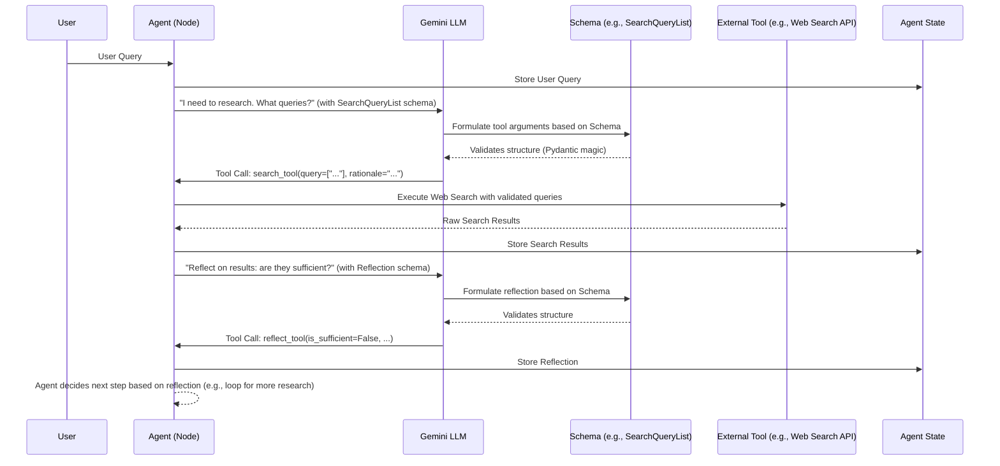

# Chapter 3: Agent Tools and Schemas

In the previous chapter, [Agent Workflow Nodes](chapter_02.md), we explored how an agent's complex operations are broken down into discrete, manageable steps. These nodes define *what* the agent does at each stage. However, for an agent to truly be intelligent and interactive, it needs more than just internal processing; it needs to interact with the outside world and manage structured information. This is where Agent Tools and Schemas come into play.

---

### Problem & Motivation

Large Language Models (LLMs) are incredibly powerful at generating human-like text and reasoning. However, they are inherently *isolated*. They cannot, by themselves, browse the internet, access databases, or interact with external APIs. When an agent needs to perform an action that goes beyond pure textual generation – such as fetching real-time data, performing calculations, or interacting with a user interface – the LLM needs a way to "call" an external function. This is the core problem that *tools* solve.

Furthermore, for an LLM to effectively use these external tools, it needs to understand *how* to call them. What inputs does a tool expect? What kind of output will it return? Without a clear "contract" for data exchange, the LLM might hallucinate arguments or misinterpret results. This is where *schemas* become crucial. They provide a structured definition for the inputs and outputs of these external functionalities, enabling the LLM to interact with them reliably and predictably.

In our `gemini-fullstack-langgraph-quickstart` project, our AI agent's primary goal is to provide intelligent, interactive assistance. For example, if a user asks a question requiring current events or specific technical details not available in the LLM's training data, the agent must be able to perform a web search. The agent needs to generate appropriate search queries and then interpret the results. Tools allow the agent to *perform* the search, and schemas ensure that the search queries are well-formed and that the search results (or the agent's reflection on them) are structured in a way the LLM can process.

---

### Core Concept Explanation

At its heart, this chapter focuses on two interconnected concepts: **Tools** and **Schemas**.

**Tools** are essentially functions or actions that an AI agent can invoke to interact with its environment. Think of them as the agent's "hands" or "utilities." Just as a human might use a smartphone to search the web, our AI agent uses specific tools for tasks like performing a web search, looking up definitions, or interacting with a calendar. These tools abstract away the complexity of external systems, providing a simple interface for the agent to use. In the context of LLMs, tools are often defined by their name, description, and the *schema* of their input parameters.

**Schemas**, on the other hand, are structured data models that define the expected format of information. They act as blueprints or contracts for data. For our agent, schemas are typically used to define:
1.  The *input* parameters for an external tool call.
2.  The expected *output* format from a tool.
3.  The structure for internal data artifacts, like a list of research queries or an agent's self-reflection.

We use `Pydantic` models for defining these schemas in Python. `Pydantic` allows us to declare the shape of data using standard Python type hints, and it provides automatic data validation, serialization, and deserialization. This ensures that the data exchanged between different parts of the agent (and especially with the LLM) is consistent and correct. The `BaseModel` class from Pydantic is the foundation for creating these structured data models, and `Field` allows us to add detailed descriptions and constraints to individual attributes, which is crucial for LLMs to understand their purpose.

Together, tools and schemas empower the LLM to go beyond mere text generation. The LLM can "decide" to use a tool, generate the necessary arguments according to the tool's input schema, and then process the results, often structured by another schema. This forms a robust mechanism for guided external interaction, enabling complex, goal-oriented behaviors for our AI agent.

---

### Practical Usage Examples

Let's look at the `SearchQueryList` and `Reflection` schemas provided and understand how they define structured communication within our agent.

#### `SearchQueryList` Schema

The `SearchQueryList` schema is designed to structure the output of an LLM when it decides to generate web search queries. It ensures that the agent receives a clear list of queries and a rationale for why those queries are being made.

```python
from pydantic import BaseModel, Field
from typing import List

class SearchQueryList(BaseModel):
    query: List[str] = Field(
        description="A list of search queries to be used for web research."
    )
    rationale: str = Field(
        description="A brief explanation of why these queries are relevant to the research topic."
    )
```
This Python code defines a data structure for web search requests. It specifies that any `SearchQueryList` object must have a `query` (which is a list of strings) and a `rationale` (which is a single string). The `Field` descriptions are particularly important as they help the LLM understand the purpose of each attribute when generating tool calls.

**Example of using `SearchQueryList`:**

Imagine an LLM has decided it needs to perform web research. It will produce an output that conforms to the `SearchQueryList` schema. The agent can then validate and use this structured output.

```python
# This dictionary represents what an LLM might generate
llm_generated_search = {
    "query": ["Gemini AI capabilities", "LangGraph for multi-agent systems"],
    "rationale": "Gather foundational knowledge on the project's core technologies."
}

# The agent validates and processes this using the schema
validated_search = SearchQueryList(**llm_generated_search)

print(f"Queries: {validated_search.query}")
print(f"Rationale: {validated_search.rationale}")
```
**Explanation:** Here, we're taking a dictionary that mimics the LLM's output for a tool call. By passing it to `SearchQueryList(**llm_generated_search)`, Pydantic automatically validates that the `query` is a list of strings and `rationale` is a string. If the structure was incorrect (e.g., `query` was a single string), Pydantic would raise a validation error. The agent can then confidently use `validated_search.query` to execute actual web searches.

#### `Reflection` Schema

The `Reflection` schema allows the agent to self-assess its progress. After performing research and summarizing findings, the agent might need to decide if it has enough information or if more research is needed. This schema provides a structured way to capture that self-assessment.

```python
from pydantic import BaseModel, Field
from typing import List

class Reflection(BaseModel):
    is_sufficient: bool = Field(
        description="Whether the provided summaries are sufficient to answer the user's question."
    )
    knowledge_gap: str = Field(
        description="A description of what information is missing or needs clarification."
    )
    follow_up_queries: List[str] = Field(
        description="A list of follow-up queries to address the knowledge gap."
    )
```
This schema defines a structure for an agent's self-reflection. It requires a boolean (`is_sufficient`), a string (`knowledge_gap`), and an optional list of strings (`follow_up_queries`). This structured reflection guides the agent's subsequent actions, helping it decide whether to generate a final answer or continue researching.

**Example of using `Reflection`:**

After reviewing some research results, the agent generates a reflection based on the `Reflection` schema.

```python
# LLM's reflection on current research
llm_generated_reflection = {
    "is_sufficient": False,
    "knowledge_gap": "Need more specific examples of LangGraph's state management.",
    "follow_up_queries": ["LangGraph custom state examples", "LangGraph state flow tutorial"]
}

# Agent validates and uses this reflection
agent_self_reflection = Reflection(**llm_generated_reflection)

print(f"Is research sufficient? {agent_self_reflection.is_sufficient}")
print(f"Knowledge Gap: {agent_self_reflection.knowledge_gap}")
if not agent_self_reflection.is_sufficient:
    print(f"Follow-up: {agent_self_reflection.follow_up_queries}")
```
**Explanation:** Here, the agent validates an LLM-generated reflection. If `is_sufficient` is `False`, the agent can extract the `knowledge_gap` and `follow_up_queries` to initiate another research cycle, ensuring it only provides a final answer when confident. This structured approach makes the agent's reasoning transparent and actionable.

---

### Internal Implementation Walkthrough

The schemas `SearchQueryList` and `Reflection` are defined in `backend/src/agent/tools_and_schemas.py`. Their implementation leverages the `Pydantic` library to provide robust data validation and clear structure.

1.  **`BaseModel`**: Both `SearchQueryList` and `Reflection` inherit from `pydantic.BaseModel`. This is the fundamental class in Pydantic that allows you to define data models. By inheriting from `BaseModel`, our Python classes become powerful validators and parsers for structured data.
2.  **Type Hints**: We use standard Python type hints (e.g., `List[str]`, `str`, `bool`) to define the expected data type for each attribute within the schema. Pydantic uses these hints to perform automatic type checking.
3.  **`Field`**: The `pydantic.Field` function is used to provide additional metadata about each attribute. Crucially, the `description` parameter within `Field` is where we explicitly tell the LLM what each part of the schema means. This descriptive text is often passed directly to the LLM as part of the tool definition, helping it generate correct arguments.

For instance, when an LLM is prompted to call a tool, it receives not only the tool's name but also its parameters' schemas, complete with these descriptions. The LLM then understands that if it needs to perform a web search, it must output a list of strings for `query` and a string for `rationale`.

Let's visualize how an LLM uses a schema to interact with a tool:


This diagram illustrates a typical flow: the agent (specifically, a node within the agent's workflow) asks the LLM for a structured output (like search queries or a reflection). The LLM uses the provided schema (`SearchQueryList` or `Reflection`) to generate valid arguments for a tool. The agent then executes the tool (e.g., a web search) and processes the results, potentially using another schema for further internal reasoning.

---

### System Integration

Agent Tools and Schemas are central to enabling the dynamic and interactive capabilities of our `gemini-fullstack-langgraph-quickstart` project. They integrate seamlessly with other core components:

*   **Integration with [Agent Workflow Nodes](chapter_02.md)**: Many workflow nodes are responsible for either *calling* tools or *consuming/producing* data that adheres to a specific schema. For instance, a `GenerateQueriesNode` would invoke the LLM to output a `SearchQueryList`. A `WebSearchNode` would take those queries, execute them, and store the raw results. A `ReflectNode` would prompt the LLM to produce a `Reflection` object based on current information.
*   **Integration with [Agent State](chapter_01.md)**: The structured data defined by schemas often populates or updates the central `AgentState`. When an LLM generates a `SearchQueryList`, this list might be stored in the agent's state for subsequent retrieval by the web search node. Similarly, the `Reflection` object's details (like `is_sufficient` or `follow_up_queries`) directly influence the state and guide the next transition in the LangGraph workflow. This ensures that all relevant information is persistently available throughout the agent's operation.
*   **Foundation for [Agent Prompts](chapter_04.md)**: The definitions of these schemas, particularly their descriptions, are critical components embedded within the prompts given to the LLM. When we ask the LLM to perform a task that requires a tool, we include the tool's signature and the schema's details in the prompt. This allows the LLM to understand *how* to use the tool, what inputs it needs, and what its purpose is. Without clear schemas, effective tool calling via prompts would be nearly impossible.

This symbiotic relationship ensures that the agent can intelligently decide when to use external capabilities, correctly structure its requests, and process the results in a predictable manner, all while maintaining a consistent internal state.

---

### Best Practices & Tips

When designing and implementing agent tools and schemas, consider the following best practices to maximize clarity, reliability, and maintainability:

1.  **Be Explicit with Descriptions (`Field`):** Always provide clear, concise, and unambiguous descriptions for each field in your Pydantic schemas. These descriptions are vital for the LLM to correctly understand the purpose of each argument and generate valid tool calls. Treat them as mini-instructions for the LLM.
2.  **Granular Tool Definition:** Design tools to be as atomic and single-purpose as possible. A tool should ideally do one thing well (e.g., `web_search`, `get_current_time`, `send_email`). Avoid creating overly broad tools that try to do too many things, as this makes it harder for the LLM to use them effectively and increases complexity.
3.  **Validate Inputs and Outputs:** While Pydantic handles basic type validation, consider adding custom validation logic within your `BaseModel` methods if specific business rules apply (e.g., a query string must be non-empty). For tool *outputs*, always consider how to handle cases where the external tool might return malformed data or errors, and define schemas for potential error responses if necessary.
4.  **Error Handling in Tools:** When implementing the actual tool functions (not just their schemas), ensure robust error handling. If a web search fails, how should the tool communicate this back to the agent? Structured error responses can also be defined via schemas.
5.  **LLM-Friendly Naming Conventions:** Use clear, descriptive names for your tools and schema fields that are easy for an LLM to understand. Avoid obscure abbreviations or overly technical jargon that might confuse the model.
6.  **Iterate and Test:** The interaction between LLMs, schemas, and tools can be nuanced. Continuously test your tool definitions and schemas by observing how the LLM interacts with them. Refine descriptions and structures based on the LLM's performance and any observed "hallucinations" in tool arguments.

---

### Chapter Conclusion

In this chapter, we've delved into the crucial role of **Agent Tools and Schemas** in building an intelligent, interactive AI agent. We've seen how tools equip our agent with the ability to interact with the outside world, performing actions like web searches, and how schemas provide the essential structured blueprints for reliable data exchange. From defining search queries to enabling self-reflection, these mechanisms empower our agent to move beyond static text generation into dynamic, goal-oriented behavior.

Understanding how to define and utilize these structured inputs and outputs is foundational for orchestrating complex agent workflows. With this knowledge, our agent can not only perform internal reasoning but also take concrete actions based on a clear understanding of external functionalities.

Building on this, the next logical step is to explore **Agent Prompts**. Having defined the tools and their schemas, we now need to teach the LLM *how* to use them. The next chapter will demonstrate how to craft effective prompts that instruct the Gemini LLM to leverage these tools intelligently within the agent's workflow.

[Agent Prompts](chapter_04.md)