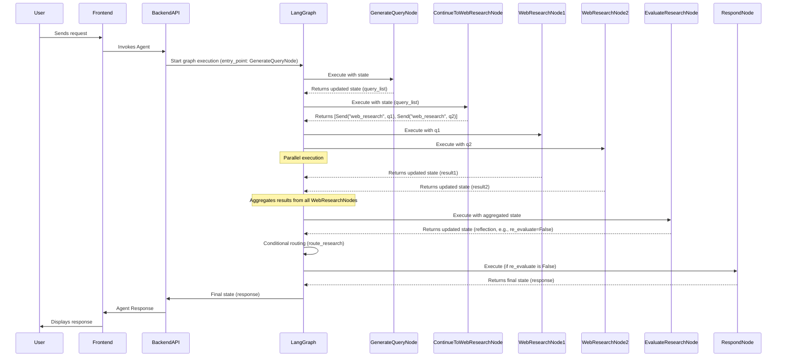

# Chapter 5: Agent Graph Orchestration

In the previous chapter, [Agent Prompts](chapter_04.md), we explored how carefully crafted instructions guide our agent's reasoning at various stages. While prompts are crucial for *what* the agent thinks, *how* those thoughts lead to actions and *when* different prompts are used is determined by the agent's workflow. This is where Agent Graph Orchestration comes into play, providing the dynamic "nervous system" for our AI.

---

### Problem & Motivation

Building intelligent agents is rarely a linear process. A sophisticated agent, like the research assistant in our `gemini-fullstack-langgraph-quickstart` project, doesn't just perform a single action. It needs to:
1.  Understand a user's request.
2.  Generate relevant search queries.
3.  Execute multiple web searches in parallel.
4.  Evaluate the collected information for completeness and relevance.
5.  *Conditionally* decide if more research is needed, if queries need refinement, or if it can finally synthesize a response.

Traditional sequential programming struggles with this kind of dynamic, conditional flow, especially when involving external tools, LLM calls, and iterative refinement loops. Without a robust orchestration mechanism, the agent's logic becomes brittle, hard to maintain, and incapable of adapting its behavior based on the current context. This is the problem Agent Graph Orchestration solves: providing a flexible, adaptive framework for complex AI workflows.

Our project's core use case is a research agent that intelligently navigates information gathering. The agent must be able to generate multiple search queries, execute them concurrently, and then critically evaluate the results to decide its next step. This dynamic decision-making process is precisely why graph-based orchestration is indispensable.

---

### Core Concept Explanation

Agent Graph Orchestration, in the context of this project, is the art of defining and managing the sequence and conditional transitions between the agent's various operational steps. It's powered by **LangGraph**, a library built on top of LangChain that enables the creation of stateful, multi-actor applications by representing their logic as a graph.

Think of it like a sophisticated flowchart or a decision tree for your AI. Each "box" in this flowchart is an **Agent Workflow Node** (which we discussed in [Chapter 2: Agent Workflow Nodes](chapter_02.md)), representing a specific task like generating a query, performing a web search, or reflecting on findings. The "arrows" connecting these boxes are **edges**, defining how the execution flows from one node to the next. Critically, these edges can be *conditional*, allowing the agent to dynamically choose its path based on the current **Agent State** (from [Chapter 1: Agent State](chapter_01.md)).

LangGraph manages a central `State` object that passes through the graph. Each node receives the current state, performs its task, and returns an update to the state. LangGraph then merges these updates, ensuring the agent maintains a coherent understanding of its progress and gathered information. This graph structure allows for complex patterns like branching, looping, and parallel execution, which are essential for building truly intelligent and adaptive agents.

---

### Practical Usage Examples

Let's see how we define a graph in `backend/src/agent/graph.py` to orchestrate our research agent's workflow. We'll focus on setting up nodes and defining the flow, utilizing the previously mentioned functions.

First, we initialize our graph with the `OverallState` as its shared memory:

```python
from langgraph.graph import StateGraph
from backend.src.agent.state import OverallState # From Chapter 1

# Initialize the graph with the overall state
graph_builder = StateGraph(OverallState)
print("Initialized StateGraph with OverallState.")
```
This sets up the foundation for our agent's workflow, declaring that `OverallState` will be the evolving context for all operations.

Next, we add our first processing node, `generate_query`, to the graph. This node, as introduced in its code snippet, is responsible for creating search queries.

```python
from backend.src.agent.graph import generate_query # Provided function

# Add the 'generate_query' node
graph_builder.add_node("generate_query", generate_query)
print("Added 'generate_query' node.")
```
Here, we're simply telling LangGraph that "generate_query" is a step in our process, and its implementation is the `generate_query` function.

After generating queries, our agent needs to perform web research. This is where `continue_to_web_research` comes in. This node doesn't perform research itself, but orchestrates sending tasks to the actual web research tool, potentially in parallel.

```python
from langgraph.channels import Send
from backend.src.agent.graph import continue_to_web_research # Provided func

# Add the node responsible for dispatching web research tasks
graph_builder.add_node("continue_to_web_research", continue_to_web_research)
print("Added 'continue_to_web_research' node to dispatch tasks.")
```
The `continue_to_web_research` function uses `Send` to push multiple parallel tasks to a "web_research" node (which would typically wrap our web search tool from [Chapter 3: Agent Tools and Schemas](chapter_03.md)). This is a powerful LangGraph feature for parallelization.

Finally, we need to evaluate the research results. The `evaluate_research` node (from the provided snippet) represents this critical reflection step.

```python
from backend.src.agent.graph import evaluate_research # Provided function

# Add the 'evaluate_research' node for reflection
graph_builder.add_node("evaluate_research", evaluate_research)
print("Added 'evaluate_research' node for evaluating results.")
```
The `evaluate_research` function would process the gathered web research results and, importantly, decide whether the current research is sufficient or if more steps are needed. This decision is crucial for conditional routing.

With nodes defined, we connect them with edges. The simplest edge is a direct transition:

```python
# Set the entry point of the graph
graph_builder.set_entry_point("generate_query")

# Define a direct edge
graph_builder.add_edge("generate_query", "continue_to_web_research")
print("Defined entry point and edge from generate_query to continue_to_web_research.")
```
This tells the graph to start at `generate_query` and, after that node completes, move directly to `continue_to_web_research`.

After `continue_to_web_research` dispatches tasks, the results are collected, and then `evaluate_research` needs to process them. This is typically handled by having `continue_to_web_research` `Send` to a "web_research" node, and then *all* responses from "web_research" are aggregated before a transition to `evaluate_research`.

```python
# The 'continue_to_web_research' node sends tasks,
# and we define that all web_research results aggregate back to 'evaluate_research'.
graph_builder.add_edge("web_research", "evaluate_research")
print("Defined edge from web_research (after all tasks) to evaluate_research.")
```
This is a crucial pattern: `Send` allows parallel execution, and LangGraph implicitly collects results before transitioning to the next single node, in this case `evaluate_research`.

Conditional routing is fundamental for dynamic agents. After `evaluate_research`, the agent needs to decide its next step.

```python
def route_research(state: OverallState) -> str:
    """Conditional router based on research evaluation."""
    if state["reflection"]["re_evaluate"]: # Assuming reflection adds this flag
        return "refine_query" # Go back to query generation/refinement
    else:
        return "synthesize_response" # Final response generation

# Add a router based on the output of evaluate_research
graph_builder.add_conditional_edges(
    "evaluate_research",
    route_research,
    {
        "refine_query": "generate_query", # Loop back to refine
        "synthesize_response": "final_response_node", # Example final step
    },
)
print("Added conditional edges based on research evaluation.")
```
This example shows how `add_conditional_edges` uses a small routing function (`route_research`) to inspect the state (specifically, the `reflection` from `evaluate_research`) and determine the next node. This creates a powerful feedback loop, allowing the agent to perform iterative research.

---

### Internal Implementation Walkthrough

The heart of agent graph orchestration in our project lies within the `StateGraph` mechanism from LangGraph, primarily defined and configured in `backend/src/agent/graph.py`.

At a high level, the process works as follows:

1.  **Graph Definition**: We instantiate `StateGraph` and define our `OverallState` (from [Chapter 1](chapter_01.md)) as its `schema`. This schema dictates the data structure that will persist and evolve throughout the graph's execution.
2.  **Node Registration**: Each discrete step the agent performs, such as `generate_query` or `evaluate_research`, is registered as a "node" using `graph_builder.add_node()`. These nodes are essentially Python functions that accept the current `state` and return updates to it.
3.  **Edge Definition**: The `graph_builder.add_edge()` method defines direct transitions between nodes. For dynamic decision-making, `graph_builder.add_conditional_edges()` is used. This requires a "router" function that inspects the current `state` and returns the name of the next node to execute.
4.  **Entry and Finish Points**: `graph_builder.set_entry_point()` specifies where the graph execution begins, and `graph_builder.set_finish_point()` (or implicit finishing if no further edges exist) marks the end of the main flow.

Let's look at the critical aspect of parallel execution using `Send` within `continue_to_web_research`:

```python
# From backend/src/agent/graph.py
def continue_to_web_research(state: QueryGenerationState):
    """LangGraph node that sends the search queries to the web research node.
    This is used to spawn n number of web research nodes, one for each search query.
    """
    return [
        Send("web_research", {"search_query": search_query, "id": int(idx)})
        for idx, search_query in enumerate(state["query_list"])
    ]
```
When `continue_to_web_research` is executed, it doesn't return a direct state update. Instead, it returns a list of `Send` objects. Each `Send` object instructs LangGraph to:
*   Execute the node named `"web_research"` (which would typically be a wrapper for our `SearchTool` from [Chapter 3](chapter_03.md)).
*   Pass the specified input (`{"search_query": ..., "id": ...}`) to that execution.

LangGraph then takes these `Send` commands and *spawns* multiple executions of the `web_research` node, potentially in parallel. Once *all* of these parallel `web_research` executions complete, their individual state updates (e.g., each search result) are merged back into the `OverallState`. Only then does LangGraph transition to the next node, which in our example, would be `evaluate_research`.

This parallelization is vital for efficiency, especially when interacting with external APIs like web search.

Here's a simplified sequence diagram illustrating the flow with parallel search:



This diagram visually demonstrates how the graph orchestrates the flow, handling both sequential steps and parallel tasks, all while maintaining and updating the central `OverallState`.

---

### System Integration

The `Agent Graph Orchestration` forms the central "brain" of our `gemini-fullstack-langgraph-quickstart` project. It integrates seamlessly with all other core components:

*   **[Agent State](chapter_01.md)**: The graph explicitly uses and modifies the `OverallState` object. Each node receives the current state, and its output is merged back into this central state, ensuring continuity across the entire workflow.
*   **[Agent Workflow Nodes](chapter_02.md)**: These nodes are the fundamental building blocks plugged directly into the graph. Functions like `generate_query`, `evaluate_research`, and the underlying `web_research` tool node are all instances of agent workflow nodes.
*   **[Agent Tools and Schemas](chapter_03.md)**: The agent's ability to interact with the external world (e.g., performing web searches) is encapsulated in tools. These tools are typically wrapped within specific graph nodes (like our `web_research` node) that handle tool invocation and result processing. Schemas define the structured inputs and outputs for these tools and for the state itself.
*   **[Agent Prompts](chapter_04.md)**: Within many nodes, LLM calls are made. The specific prompts used for these calls (e.g., the prompt to generate a query, or the prompt to summarize research) are defined as described in Chapter 4 and are passed to the LLM runnables within the graph nodes.

Ultimately, the fully constructed and compiled LangGraph (`graph_builder.compile()`) becomes a `Runnable` object. This `Runnable` is then exposed through the backend API (e.g., a FastAPI endpoint in `backend/src/app/api/agent.py`). When the frontend makes a request, the API simply invokes this `Runnable` graph, passing the initial user input as the starting state, and receiving the final, processed state (including the agent's response) when the graph completes its execution. This robust backend orchestrator is a key part of the [Full-stack Application Structure](chapter_07.md).

---

### Best Practices & Tips

1.  **Granular Nodes**: Keep your graph nodes small, focused, and single-responsibility. This improves readability, testability, and reusability. A node should do one thing well (e.g., generate queries, perform one search, reflect on results).
2.  **Explicit State Management**: Design your `OverallState` carefully (as discussed in [Chapter 1](chapter_01.md)). Ensure each node explicitly updates only the relevant parts of the state it's responsible for, and clearly understands what it expects from the state.
3.  **Clear Conditional Logic**: When using `add_conditional_edges`, make your routing functions (`route_research` in our example) as simple and explicit as possible. Avoid complex logic within the router; instead, let a preceding node (like `evaluate_research`) set clear flags or values in the state that the router can easily interpret.
4.  **Error Handling**: Integrate error handling within individual nodes. For example, a `web_research` node should handle cases where a search API fails or returns no results. The graph itself can also define fallback paths for critical nodes.
5.  **Visualize Your Graph**: For complex graphs, use tools (like LangGraph's built-in `get_graph().draw_png()` or `get_graph().draw_mermaid()`) to visualize the flow. This significantly aids in debugging and understanding the agent's logic.
6.  **Parallelism for I/O-bound Tasks**: Leverage `Send` for operations that can run concurrently (like multiple web searches). This significantly improves the agent's responsiveness and overall execution time.

---

### Chapter Conclusion

Agent Graph Orchestration, powered by LangGraph, is the architectural backbone that enables our agent to execute complex, adaptive, and dynamic workflows. By defining tasks as nodes and connecting them with intelligent, conditional edges, we've moved beyond simple sequential processing to create an agent that can reason, iterate, and adapt its behavior based on the current context and gathered information. This chapter demonstrated how to define these graphs, orchestrate parallel operations, and make dynamic decisions.

With the agent's brain now fully wired, our next step is to explore how to manage the various parameters, models, and external services that the agent relies on. In the next chapter, we will dive into [Agent Configuration](chapter_06.md), understanding how to effectively configure and manage these essential settings for our agent.