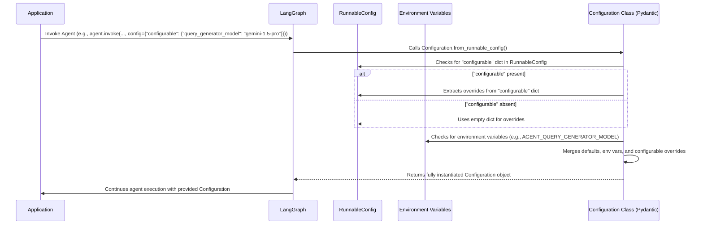
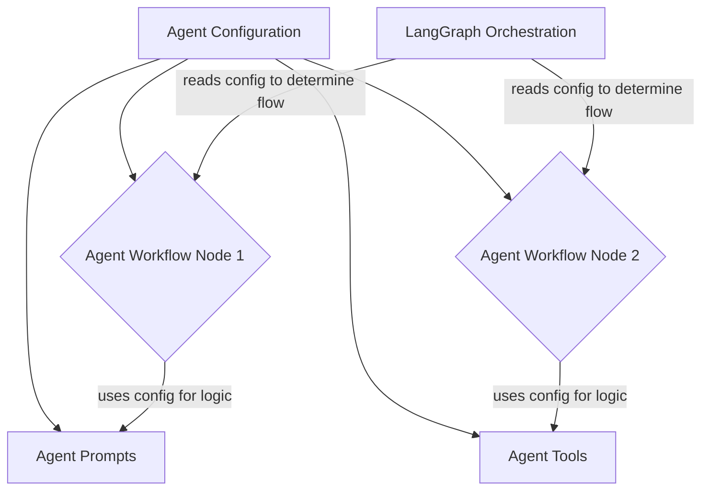

# Chapter 6: Agent Configuration

In the journey of building sophisticated AI agents, we've explored how to define the agent's internal state, construct its individual workflow nodes, equip it with powerful tools, craft precise prompts, and orchestrate these components into a dynamic graph. Now, as our agent grows in complexity and capability, we face a crucial question: how do we make it adaptable and reusable without constantly rewriting its core logic? This is where **Agent Configuration** comes into play, providing a robust mechanism to tailor the agent's behavior to different scenarios and environments.

## Problem & Motivation

Imagine our agent, which we meticulously designed for research, always using a specific Large Language Model (LLM) for query generation. What if we want to quickly switch to a faster, less expensive model for development and testing, or a more powerful, costly one for production? What if we need to enable or disable certain agent features based on the deployment environment? Hardcoding these parameters directly into the agent's workflow nodes or prompts would lead to rigid, difficult-to-maintain code. Every change would necessitate modifying and redeploying core agent logic, a process that is error-prone and inefficient.

The problem, therefore, is the need for **dynamic and externalized control over the agent's operational parameters**. We require a system that allows us to adjust model choices, enable specific functionalities, or set operational modes *outside* the core agent code. This separation of concerns—logic from settings—is paramount for creating flexible, scalable, and production-ready AI applications. Agent Configuration solves this by providing a standardized way to define, load, and manage these crucial settings, allowing us to build an agent that is highly adaptable without sacrificing its core functionality. For instance, we might want our agent to use `gemini-2.0-flash` for initial query generation during development to keep costs low, but switch to `gemini-1.5-pro` in production for higher quality results. Configuration makes this seamless.

---

## Core Concept Explanation

Agent Configuration refers to the structured set of parameters and settings that dictate how an AI agent operates. Instead of embedding these operational details directly within the agent's code, they are externalized and managed through a dedicated configuration mechanism. This allows for greater flexibility, enabling users or environments to easily modify the agent's behavior without altering its underlying logic.

At its heart, agent configuration relies on defining a schema for these settings. In our `gemini-fullstack-langgraph-quickstart` project, this is achieved using [Pydantic](https://pydantic-docs.helpmanual.io/), a powerful data validation and settings management library. A Pydantic `BaseModel` defines the expected configuration fields, their types, and even provides default values and descriptions. This ensures that the agent always receives valid and expected parameters, preventing runtime errors due to malformed settings. When the agent starts, it loads these configurations, which then influence decisions throughout its workflow, from the choice of LLM for a specific task to custom behaviors for different agent modes. This modular approach allows the agent to be tailored precisely to various deployment scenarios, making it robust and versatile.

---

## Practical Usage Examples

Let's look at how the `Configuration` class is defined and how we can use it to set up our agent's parameters. The `Configuration` class acts as the blueprint for all customizable settings.

```python
# backend/src/agent/configuration.py
from pydantic import BaseModel, Field

class Configuration(BaseModel):
    """The configuration for the agent."""

    query_generator_model: str = Field(
        default="gemini-2.0-flash",
        metadata={
            "description": "The name of the language model to use for the agent's query generation."
        },
    )
    # ... other configuration fields ...
```
This code snippet defines the `Configuration` class inheriting from Pydantic's `BaseModel`. It specifies `query_generator_model` as a string field with a default value of `"gemini-2.0-flash"`. This default is what the agent will use if no other configuration is provided.

We can instantiate and use this configuration directly:

```python
from backend.src.agent.configuration import Configuration

# Create a configuration instance with default settings
default_config = Configuration()
print(f"Default query model: {default_config.query_generator_model}")

# Create a configuration instance, overriding the default
production_config = Configuration(query_generator_model="gemini-1.5-pro")
print(f"Production query model: {production_config.query_generator_model}")
```
Here, we first create `default_config` which will use `gemini-2.0-flash` as specified in the class definition. Then, `production_config` explicitly overrides this to `gemini-1.5-pro`, demonstrating how easily settings can be adjusted.

The configuration can then be passed to parts of the agent that need these settings. For example, a function that generates queries could accept a `Configuration` object:

```python
# Example: How an agent component might use the configuration
from backend.src.agent.configuration import Configuration

def get_llm_for_query_generation(config: Configuration):
    """Returns the LLM instance based on the provided configuration."""
    print(f"Initializing LLM with model: {config.query_generator_model}")
    # In a real scenario, this would initialize an actual LLM client
    return f"LLM_Client({config.query_generator_model})"

# Using the configurations defined earlier
llm_for_dev = get_llm_for_query_generation(default_config)
llm_for_prod = get_llm_for_query_generation(production_config)

print(f"Development LLM: {llm_for_dev}")
print(f"Production LLM: {llm_for_prod}")
```
This example illustrates how a function, `get_llm_for_query_generation`, receives the `Configuration` object. It then uses `config.query_generator_model` to determine which LLM to initialize, showcasing how configuration drives behavior.

---

## Internal Implementation Walkthrough

The `Configuration` class in `backend/src/agent/configuration.py` is the central piece of our agent's settings management. It leverages Pydantic for its core capabilities:

1.  **Schema Definition**: By inheriting from `BaseModel`, `Configuration` becomes a robust data schema. Each field (like `query_generator_model`) is defined with its type and optional `Field` arguments for defaults and metadata. Pydantic automatically handles type checking and validation when an instance of `Configuration` is created.

    ```python
    # backend/src/agent/configuration.py
    from pydantic import BaseModel, Field

    class Configuration(BaseModel):
        # ... field definitions ...
        query_generator_model: str = Field(
            default="gemini-2.0-flash",
            metadata={"description": "The name of the language model..."}
        )
        # ...
    ```
    This snippet highlights how `query_generator_model` gets its type, default, and descriptive metadata.

2.  **`from_runnable_config` Class Method**: This powerful class method provides a standardized way to construct a `Configuration` instance from a `RunnableConfig` object, often provided by LangChain/LangGraph at runtime. The `RunnableConfig` allows for dynamic configuration injection, typically through an input dictionary to the `invoke` or `stream` methods of a LangChain runnable.

    ```python
    # backend/src/agent/configuration.py
    from typing import Any, Optional
    from langchain_core.runnables import RunnableConfig

    class Configuration(BaseModel):
        # ...
        @classmethod
        def from_runnable_config(
            cls, config: Optional[RunnableConfig] = None
        ) -> "Configuration":
            configurable = (
                config["configurable"] if config and "configurable" in config else {}
            )
            raw_values: dict[str, Any] = {
                # This part would typically extract values from ENV or configurable
                "query_generator_model": configurable.get(
                    "query_generator_model", os.environ.get("AGENT_QUERY_GENERATOR_MODEL")
                ),
                # ... other fields ...
            }
            # Filter out None values to let Pydantic defaults take over
            values = {k: v for k, v in raw_values.items() if v is not None}
            return cls(**values)
    ```
    This method first looks for a `configurable` dictionary within the `RunnableConfig`. It then attempts to retrieve values from this dictionary or from environment variables (e.g., `AGENT_QUERY_GENERATOR_MODEL`). Any value found overrides the default defined in the `Configuration` class. Finally, it instantiates `Configuration` with these determined values. This layered approach ensures that defaults are used unless explicitly overridden by environment variables or runtime `RunnableConfig` parameters.

The interaction flow for loading configuration might look like this:


This diagram illustrates how the `Configuration` object is constructed, prioritizing values from `RunnableConfig` and environment variables over the class's default values.

---

## System Integration

The `Agent Configuration` is not an isolated component; it's a foundational layer that permeates the entire agent's ecosystem. Its influence can be seen across various key abstractions:

*   **[Agent Workflow Nodes](chapter_02.md)**: Individual nodes within the agent's graph often need to make decisions based on configuration. For example, a "Query Generation" node might decide which specific LLM client to use based on `config.query_generator_model`. A "Tool Execution" node might be configured to use a specific API key (stored in config) for an external tool.
*   **[Agent Prompts](chapter_04.md)**: While prompts themselves are textual instructions, their generation can be influenced by configuration. A prompt template might vary slightly depending on a `config.agent_mode` (e.g., "concise" vs. "verbose"), or it might inject configured parameters directly into the prompt to guide the LLM's behavior.
*   **[Agent Graph Orchestration](chapter_05.md)**: The overall flow of the LangGraph might be conditionally influenced by configuration. For example, specific paths or nodes might only be activated if a certain feature flag is `True` in the configuration (e.g., `config.enable_advanced_search = True`). The `Configuration` object is typically passed through the `state` or as an argument to the graph's entry point, allowing all nodes to access it.

Here's a simplified view of how configuration flows through the agent:



In essence, the `Configuration` object acts as a global context or parameter store that is accessible to all parts of the agent, ensuring consistent behavior and allowing for centralized control over its operational characteristics.

---

## Best Practices & Tips

1.  **Externalize Configuration**: Always define configuration parameters externally from your core logic. This means using environment variables, dedicated configuration files (e.g., `.env`, YAML, JSON), or runtime parameters (`RunnableConfig`) rather than hardcoding values. The `from_runnable_config` method demonstrates a robust pattern for merging these sources.
2.  **Use Pydantic for Validation**: Leveraging `BaseModel` as shown provides automatic type validation, default values, and clear documentation for your configuration schema. This significantly reduces errors and improves maintainability.
3.  **Provide Sensible Defaults**: Ensure your `Configuration` class has reasonable default values for all fields. This allows the agent to run out-of-the-box without requiring extensive setup, while still allowing overrides.
4.  **Layered Configuration Loading**: Implement a strategy where configuration values can be overridden in a predictable order (e.g., defaults < environment variables < runtime `RunnableConfig` parameters). This provides maximum flexibility.
5.  **Descriptive Field Names**: Use clear and descriptive names for your configuration fields (e.g., `query_generator_model` instead of `model_name`). Add metadata descriptions where necessary, as seen with `Field(metadata=...)`.
6.  **Avoid Sensitive Data in Source Control**: Never commit sensitive information (API keys, passwords, etc.) directly into your configuration files within version control. Use environment variables or a secure secret management system, and access them at runtime.
7.  **Document Configuration**: Clearly document all configuration parameters, their purpose, valid values, and default settings. This makes it easier for other developers or users to understand and configure the agent.

---

## Chapter Conclusion

In this chapter, we've explored the critical role of **Agent Configuration** in building flexible, robust, and maintainable AI applications with our `gemini-fullstack-langgraph-quickstart` project. We've seen how externalizing parameters like the choice of LLM or specific agent modes allows for dynamic behavior adaptation without modifying core code. By using Pydantic's `BaseModel` for schema definition and implementing layered loading with `from_runnable_config`, we ensure our agent can be easily tailored to various environments and use cases. This capability is fundamental to creating agents that are not just intelligent, but also adaptable and ready for deployment.

With a solid understanding of how to configure our agent, we are now ready to zoom out and examine the larger picture: how all these agent-centric components fit into a complete, full-stack application. The next chapter will delve into the **[Full-stack Application Structure](chapter_07.md)**, revealing how the backend agent seamlessly integrates with the frontend user interface to create a cohesive and interactive experience.