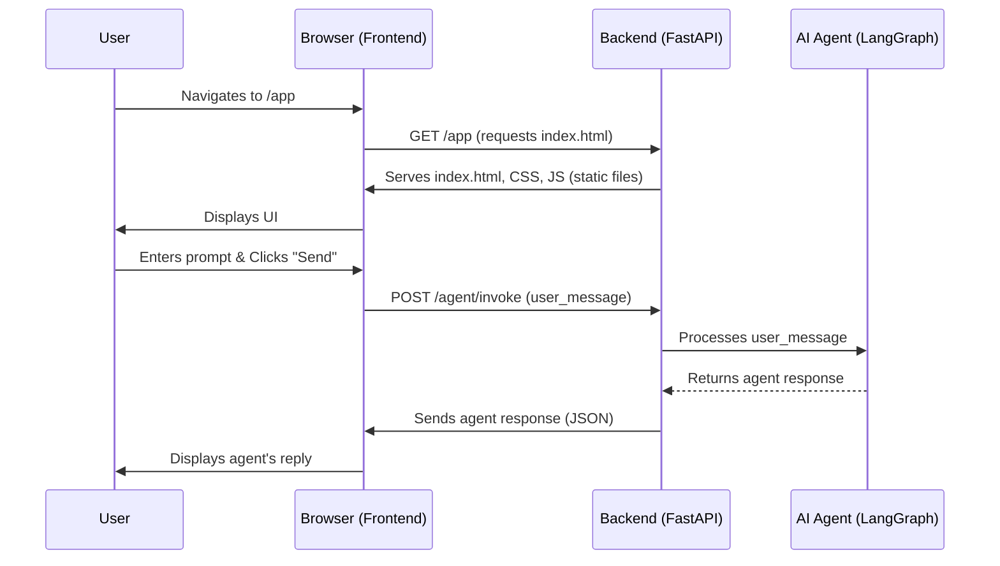

# Chapter 7: Full-stack Application Structure

Having thoroughly explored the intricate details of the AI agent's internal workings, from its [Agent State](chapter_01.md) and [Agent Workflow Nodes](chapter_02.md) to its [Agent Configuration](chapter_06.md), we've built a powerful, intelligent core. However, an agent, no matter how intelligent, is truly impactful when users can interact with it seamlessly. This chapter bridges the gap between the sophisticated backend logic and the end-user, detailing the **Full-stack Application Structure** that brings our `gemini-fullstack-langgraph-quickstart` project to life.

---

### Problem & Motivation

Imagine building an incredibly smart AI agent that can perform complex research, answer questions, and even make decisions, but it can only be run from a command line or through direct API calls. While powerful for developers, this approach severely limits accessibility and usability for the broader audience. Users expect an intuitive, interactive experience where they can easily submit requests, view progress, and receive formatted responses through a web browser.

The problem this chapter addresses is the need for a comprehensive user interface and a robust mechanism to serve that interface, alongside the agent's core API. Without a frontend, the sophisticated [Agent Graph Orchestration](chapter_05.md) remains hidden and inaccessible. Our project solves this by providing a complete, production-ready full-stack template. For example, a user wants to ask our agent a research question and see the thinking process unfold, not just a final JSON output. This requires a web interface and a backend capable of both processing the request and delivering the UI.

---

### Core Concept Explanation

The **Full-stack Application Structure** refers to the complete architecture of our project, comprising two main interconnected parts: the **backend API** and the **frontend user interface**. The backend is where our intelligent agent resides, handling all the complex logic, [Agent Prompts](chapter_04.md), and tool invocations. It exposes endpoints that allow external applications, like our frontend, to interact with the agent. The frontend, typically a single-page application built with a framework like React, is what the user sees and interacts with in their web browser.

These two parts communicate over standard web protocols, primarily HTTP. The frontend sends user requests to the backend's API endpoints, and the backend processes these requests using the agent, then sends back responses. Crucially, the backend is also responsible for serving the static files (HTML, CSS, JavaScript) that constitute the frontend application itself, making it a self-contained deployable unit. This separation of concerns allows for independent development and scaling of both parts, while still presenting a unified application to the user.

In essence, the backend acts as the brain and muscle, housing the AI agent, its [Agent Tools and Schemas](chapter_03.md), and API endpoints. The frontend acts as the face and hands, providing a graphical way for users to engage with that intelligence, displaying information, and sending commands.

---

### Practical Usage Examples

To make our AI agent accessible, the backend needs to serve the frontend's static assets. This means when a user navigates to the application's URL, the backend provides the HTML, CSS, and JavaScript files that make up the user interface.

Here's how our `app.py` in the backend is configured to serve the React frontend:

```python
# From backend/src/agent/app.py

def create_frontend_router(build_dir="../frontend/dist"):
    """Creates a router to serve the React frontend."""
    build_path = pathlib.Path(__file__).parent.parent.parent / build_dir
    # Ensure the build directory exists
    if not build_path.is_dir():
        print(f"Frontend build directory not found: {build_path}")
        print("Please run `npm run build` in the frontend directory.")
        # Fallback for development if build_dir doesn't exist
        # In production, this would be an error
        return None 
    
    # Create a StaticFiles app to serve the frontend
    app = StaticFiles(directory=str(build_path), html=True)
    return app
```
The `create_frontend_router` function prepares a Starlette `StaticFiles` application. This app is configured to serve files from the `frontend/dist` directory (the output of a React build) and is set to serve `index.html` for any path not found, which is essential for single-page applications.

```python
# From backend/src/agent/app.py (continued)

# In the main FastAPI app initialization:
if settings.serve_frontend: # A configurable setting
    frontend_app = create_frontend_router()
    if frontend_app:
        app.mount("/app", frontend_app, name="app")
```
This snippet shows how the generated frontend application is *mounted* onto our main FastAPI application under the `/app` path. This means if your backend is running on `localhost:8000`, the frontend will be accessible at `localhost:8000/app`. This clear separation ensures that frontend routes do not conflict with our LangGraph agent's API routes (e.g., `/agent/invoke`).

---

### Internal Implementation Walkthrough

The core of our full-stack setup revolves around how the backend (`backend/src/agent/app.py`) manages both the AI agent's API and the serving of the static frontend files.

1.  **Backend Startup:** When the FastAPI application starts, it initializes the LangGraph agent and sets up various API routes (e.g., `/agent/invoke` for starting a chat, `/agent/stream` for streaming responses).
2.  **Frontend Build Check:** The `create_frontend_router` function checks for the presence of the `frontend/dist` directory. This directory contains the optimized static files (HTML, CSS, JS) generated by compiling the React application.
3.  **Static File Serving:** If the `dist` directory exists, a `StaticFiles` application is created. This app is designed to efficiently serve static assets. The `html=True` parameter is crucial: if a requested file is not found (e.g., `/app/dashboard`), it will serve `index.html` instead, allowing the React router to handle the client-side routing.
4.  **Mounting the Frontend:** The `frontend_app` is then "mounted" onto the main FastAPI application using `app.mount("/app", frontend_app, name="app")`. This makes the entire React application available at the `/app` URL path relative to the backend's root.
5.  **Request Handling:**
    *   **Frontend Request:** When a user's browser requests `http://localhost:8000/app`, the mounted `frontend_app` intercepts this, returning `index.html` and subsequent CSS/JS files.
    *   **Agent API Request:** When the frontend (running in the browser) sends an API call, like `POST /agent/invoke`, the main FastAPI application routes this to the appropriate handler within the agent's logic.

Here's a sequence diagram illustrating the interaction:



---

### System Integration

The full-stack structure provides the necessary presentation layer for our AI agent, seamlessly integrating with the core [Agent Graph Orchestration](chapter_05.md). The integration points are primarily through HTTP API calls:

1.  **Frontend as Client:** The React frontend acts as a client to the backend API. It doesn't directly interact with LangGraph; instead, it sends user queries and receives agent responses by calling endpoints like `/agent/invoke` or `/agent/stream` exposed by the FastAPI backend.
2.  **Backend as Orchestrator & Server:** The backend acts as both the web server for the frontend assets and the API server for the agent. It receives requests from the frontend, translates them into calls to the LangGraph agent, and then formats the agent's output back into responses suitable for the frontend.
3.  **Data Flow:**
    *   User input flows from the Frontend to the Backend via API requests.
    *   The Backend then feeds this input into the LangGraph agent, managing the [Agent State](chapter_01.md) and executing the [Agent Workflow Nodes](chapter_02.md).
    *   Results and intermediate steps from the LangGraph agent are returned to the Backend.
    *   The Backend packages these results and sends them back to the Frontend, often as JSON.
    *   The Frontend then renders these results visually for the user.

This architecture ensures a clean separation of concerns: the frontend handles UI/UX, and the backend handles all the complex AI logic and data management.

---

### Best Practices & Tips

*   **Separate Development Environments:** Develop the frontend and backend independently. The frontend can use a development server (e.g., `npm start`) with proxy settings to forward API calls to the running backend.
*   **CORS (Cross-Origin Resource Sharing):** When running the frontend and backend on different ports or domains (common in development), you'll need to configure CORS on your backend. FastAPI provides `CORSMiddleware` to handle this.
*   **Static Asset Optimization:** Always build your frontend for production (`npm run build`). This creates optimized, minified static files that load faster.
*   **Environment Variables:** Use environment variables for API keys, backend URLs (for the frontend to connect to), and other configuration settings, especially in production.
*   **Deployment Strategy:** Consider how you'll deploy. Options include:
    *   Deploying the entire backend (with the mounted frontend) as a single unit (e.g., to a Docker container or a PaaS like Render, Fly.io).
    *   Deploying the frontend separately to a CDN or static site host, and the backend as an API service. Our current setup favors the former for simplicity.
*   **Error Handling:** Implement robust error handling on both the frontend (to gracefully display issues to the user) and the backend (to log errors and provide meaningful API error responses).

---

### Chapter Conclusion

This chapter concludes our journey through the `gemini-fullstack-langgraph-quickstart` project by tying everything together into a cohesive, user-facing application. We've seen how the full-stack architecture provides an intuitive interface for users to interact with our powerful AI agent. By understanding the roles of the backend API and the frontend UI, and how they communicate and integrate, you now have a complete picture of building production-ready, intelligent applications.

The separation of concerns, robust API interactions, and careful management of static assets ensures that our complex LangGraph agent is not just a theoretical construct but a practical, accessible tool. You now possess a comprehensive understanding of all components, from the deepest agent logic to the highest-level application structure, enabling you to build, deploy, and scale your own Gemini-powered, LangGraph-orchestrated AI applications.