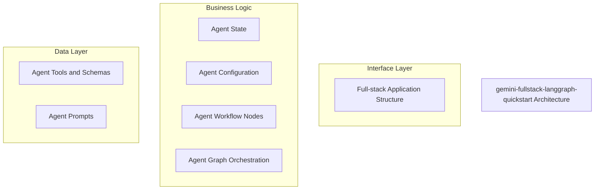
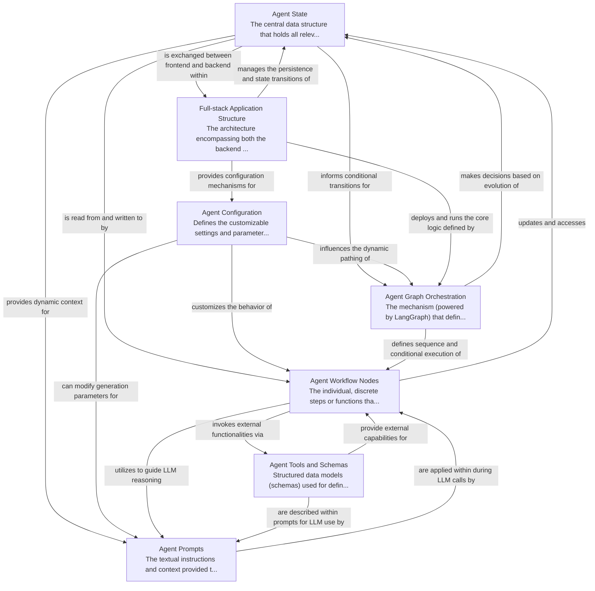

# gemini-fullstack-langgraph-quickstart Tutorial

Welcome to the comprehensive tutorial for gemini-fullstack-langgraph-quickstart. This tutorial is automatically generated from the codebase to help you understand the core concepts and implementation patterns.

## Project Overview

This project provides a full-stack template for building an AI agent using Gemini and LangGraph. It features a robust backend API that hosts the agent's complex, graph-orchestrated workflow, integrated with a frontend user interface. This setup demonstrates a complete, production-ready architecture for developing intelligent, interactive applications.

## System Architecture

## Component Relationships

## Table of Contents

1. [Chapter 1: Agent State](chapter_01.md) - Comprehensive documentation for Agent State following structured methodology...
2. [Chapter 2: Agent Workflow Nodes](chapter_02.md) - Comprehensive documentation for Agent Workflow Nodes following structured methodology...
3. [Chapter 3: Agent Tools and Schemas](chapter_03.md) - Comprehensive documentation for Agent Tools and Schemas following structured methodology...
4. [Chapter 4: Agent Prompts](chapter_04.md) - Comprehensive documentation for Agent Prompts following structured methodology...
5. [Chapter 5: Agent Graph Orchestration](chapter_05.md) - Comprehensive documentation for Agent Graph Orchestration following structured methodology...
6. [Chapter 6: Agent Configuration](chapter_06.md) - Comprehensive documentation for Agent Configuration following structured methodology...
7. [Chapter 7: Full-stack Application Structure](chapter_07.md) - Comprehensive documentation for Full-stack Application Structure following structured methodology...

## How to Use This Tutorial

1. **Start with Chapter 1** to understand the foundational concepts
2. **Follow the sequence** - each chapter builds upon previous concepts
3. **Practice with code examples** - every chapter includes practical examples
4. **Refer to diagrams** - use architecture diagrams for visual understanding
5. **Cross-reference concepts** - chapters link to related topics

## Tutorial Features

- **Progressive Learning**: Concepts are introduced in logical order
- **Code Examples**: Every chapter includes practical, executable code
- **Visual Diagrams**: Mermaid diagrams illustrate complex relationships
- **Cross-References**: Easy navigation between related concepts
- **Beginner-Friendly**: Written for newcomers to the codebase

## Contributing

This tutorial is auto-generated from the codebase. To improve it:
1. Update the source code documentation
2. Add more detailed comments to key functions
3. Regenerate the tutorial using the documentation system

---

*Generated using AI-powered codebase analysis*
