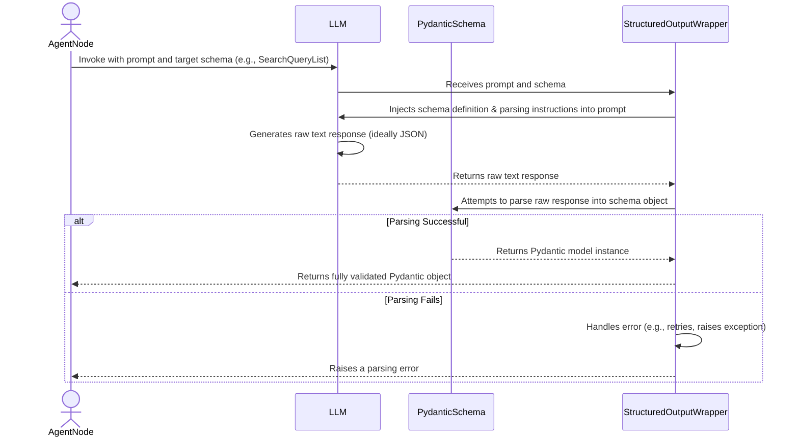

# Chapter 2: Structured Communication Schemas

In the previous chapter, we introduced the **AI Assistant Application** ([AI Assistant Application](chapter_01.md)) as a full-stack system designed to intelligently respond to user queries by performing complex tasks like web research. This capability hinges on the agent's ability to not just generate free-form text, but to also produce outputs that our backend can reliably understand and act upon. This chapter dives into the critical mechanisms that enable such structured and predictable interactions within our AI assistant: **Structured Communication Schemas**.

---

### Problem & Motivation

Large Language Models (LLMs) are incredibly powerful at generating human-like text, but this strength can also be a challenge when their output needs to be machine-readable and actionable. Imagine our AI assistant is tasked with performing web research. If the LLM simply outputs "I need to search for AI in drug discovery and new machine learning models," how do we programmatically extract specific search queries to feed into a web search tool? Parsing such natural language can be brittle, prone to errors, and difficult to maintain.

This is precisely the problem that structured communication schemas solve. Without them, the agent's internal communication would be ambiguous, making it difficult to automate subsequent steps like calling specific tools or making informed decisions within the workflow. For our `gemini-fullstack-langgraph-quickstart` project, ensuring that the AI can explicitly define research queries or reflect on gathered information in a consistent format is paramount for reliable operation and dynamic workflow management. For instance, when the AI decides it needs to perform web research, it must convey the exact search terms in a format that the web search tool can directly consume.

---

### Core Concept Explanation

Structured communication schemas are essentially blueprints for data. In the context of our project, we leverage **Pydantic models** to define these schemas. Pydantic is a Python library that provides data validation and settings management using Python type hints, making it incredibly powerful for ensuring that data conforms to a predefined structure. When an LLM generates output, we can instruct it to produce this output in a JSON format that strictly adheres to one of our Pydantic schemas.

Why are these schemas crucial for LLMs and LangGraph? They introduce **type safety and consistency** into the agent's operations. Instead of fuzzy natural language, the LLM is guided to produce concrete data objects with specific fields and data types. This allows our LangGraph nodes and tools to reliably expect and parse the LLM's output, transforming free-form text generation into structured data exchange. The `Field` descriptions within Pydantic models are particularly vital, as they provide clear instructions to the LLM on what information each part of the output should contain, guiding its generation process.

---

### Practical Usage Examples

Let's look at how we define and conceptually use these schemas to guide the LLM's output in our project.

#### Defining a Search Query Schema

The `SearchQueryList` schema, defined in `backend/src/agent/tools_and_schemas.py`, is used when the agent determines it needs to perform web research. It mandates that the LLM provides a list of specific search queries along with a rationale.

```python
# backend/src/agent/tools_and_schemas.py
from typing import List
from pydantic import BaseModel, Field

class SearchQueryList(BaseModel):
    query: List[str] = Field(
        description="A list of search queries to be used for web research."
    )
    rationale: str = Field(
        description="A brief explanation of why these queries are relevant to the research topic."
    )

```
This `SearchQueryList` class acts as a contract. The `query` field expects a list of strings, and `rationale` expects a single string. The `description` arguments are crucial because they inform the LLM about the purpose and expected content of each field.

Now, imagine how an LLM would generate output based on this schema:

```python
# Conceptual LLM interaction for search queries
from langchain_core.messages import HumanMessage
from langchain_google_genai import ChatGoogleGenerativeAI

# Assuming SearchQueryList is imported/defined
# llm = ChatGoogleGenerativeAI(model="gemini-pro").with_structured_output(SearchQueryList)

# When the agent needs to search for "AI-driven drug discovery"
user_query = "What are the latest advancements in AI-driven drug discovery?"
# The LLM, guided by SearchQueryList, would output something like:
llm_output_json = {
    "query": [
        "latest AI drug discovery breakthroughs",
        "machine learning protein folding drugs",
        "generative AI medicinal chemistry"
    ],
    "rationale": "To cover recent developments, specific ML applications, and broader AI methodologies."
}
# The agent can now reliably parse this JSON into a SearchQueryList object.
```
This example shows that instead of parsing natural language, the agent receives a clear, structured JSON output that directly maps to the `SearchQueryList` schema. This allows our web search tool to directly consume the `query` list.

---

#### Defining a Reflection Schema

The `Reflection` schema is another critical component, allowing the agent to evaluate the sufficiency of gathered information and plan next steps.

```python
# backend/src/agent/tools_and_schemas.py
from typing import List
from pydantic import BaseModel, Field

class Reflection(BaseModel):
    is_sufficient: bool = Field(
        description="Whether the provided summaries are sufficient to answer the user's question."
    )
    knowledge_gap: str = Field(
        description="A description of what information is missing or needs clarification."
    )
    follow_up_queries: List[str] = Field(
        description="A list of follow-up queries to address the knowledge gap."
    )

```
Here, `is_sufficient` is a boolean, `knowledge_gap` is a string, and `follow_up_queries` is a list of strings. These types enforce clear decision-making.

Conceptual usage of the `Reflection` schema:

```python
# Conceptual LLM interaction for reflection
from langchain_core.messages import HumanMessage
from langchain_google_genai import ChatGoogleGenerativeAI

# Assuming Reflection is imported/defined
# llm = ChatGoogleGenerativeAI(model="gemini-pro").with_structured_output(Reflection)

# After initial web research, the agent summarizes:
summary_of_research = "Current research shows AI helps predict drug targets and molecular structures."
user_question = "Can AI help develop new drugs faster?"

# The LLM, guided by Reflection, would assess the summary against the user's question:
llm_output_json = {
    "is_sufficient": False,
    "knowledge_gap": "The summaries discuss *how* AI helps, but not specifically if it speeds up drug development.",
    "follow_up_queries": ["AI impact on drug development timelines", "AI reducing drug discovery costs"]
}
# The agent can then use 'is_sufficient' to decide whether to answer or conduct more research.
```
This demonstrates how `Reflection` provides structured feedback, enabling the agent to make an informed decision on whether more information is needed or if it can confidently answer the user's query.

---

### Internal Implementation Walkthrough

In LangChain and LangGraph, the integration of Pydantic schemas for structured output is streamlined using the `.with_structured_output()` method. This method, available on LLM chains, effectively "wraps" the LLM call to ensure its output conforms to a specified schema.

Here's a simplified sequence of what happens when we use a schema with an LLM:



The magic happens within the `StructuredOutputWrapper`. It takes the Pydantic `BaseModel` (like `SearchQueryList` or `Reflection` from `backend/src/agent/tools_and_schemas.py`), introspects its structure (field names, types, descriptions), and then crafts a specific prompt instruction for the LLM. This instruction guides the LLM to generate its output as a JSON string that matches the schema. Once the LLM returns its raw text, the wrapper attempts to parse this text into an instance of the Pydantic model, performing validation along the way. If validation passes, a clean, type-safe Python object is returned to our agent node; otherwise, an error is raised, indicating that the LLM did not conform to the expected structure.

---

### System Integration

Structured communication schemas are foundational for reliable data exchange across various components of our AI assistant.

*   **Agent State Management** ([Agent State Management](chapter_03.md)): The outputs from these schemas directly influence the `AgentState`. For example, a `Reflection` object's `is_sufficient` field dictates whether the agent's state transitions to "answer_user" or "continue_research."
*   **Agent's Workflow Graph** ([Agent's Workflow Graph](chapter_05.md)): Each node in the LangGraph often expects specific input formats and produces specific output formats. Schemas enforce these contracts. For instance, a "generate_search_queries" node will output a `SearchQueryList` object, which is then consumed by a "perform_web_search" node.
*   **Tools**: Schemas are implicitly used to define the expected parameters for tools. While the `SearchQueryList` and `Reflection` are not direct tool inputs in themselves, their structured output often feeds directly into other tools (e.g., the `query` list from `SearchQueryList` feeds into a web search tool).

Data flows cleanly and predictably: an LLM, prompted to generate a `SearchQueryList`, passes this structured data to a web search tool. The results of the web search might then be summarized and passed to the LLM, which is prompted to generate a `Reflection` based on this information. The resulting `Reflection` object then guides the overall workflow by dictating the next action.

---

### Best Practices & Tips

*   **Be Descriptive with `Field`s**: The `description` argument in `pydantic.Field` is critical. It's the primary way you instruct the LLM on what kind of information to put into that field. Clear, concise, and unambiguous descriptions lead to better quality and more consistent LLM outputs.
*   **Keep Schemas Focused**: Design schemas to represent a single, clear piece of information or a specific decision point. Avoid creating overly complex or general schemas that try to capture too much. This makes them easier for the LLM to understand and for your code to use.
*   **Iterative Refinement**: It's rare to get schemas perfect on the first try. Test your schemas with your LLM and prompts, observe the output, and refine the `Field` descriptions and types as needed to improve consistency and accuracy.
*   **Error Handling**: Even with structured output, LLMs can sometimes generate malformed JSON. Implement robust error handling (e.g., `try-except` blocks around parsing logic) to gracefully manage cases where the LLM fails to adhere to the schema, allowing for retries or fallback mechanisms.
*   **Validation**: Leverage Pydantic's validation capabilities. It ensures data integrity *after* the LLM has generated it but *before* it's used by your application logic.

---

### Chapter Conclusion

Structured communication schemas, powered by Pydantic models, are an indispensable component of building robust and reliable AI assistants. They transform the inherently unstructured nature of LLM outputs into predictable, machine-readable data, enabling seamless integration with tools and precise control over the agent's workflow. By defining clear contracts for data exchange, we empower our `gemini-fullstack-langgraph-quickstart` project to operate with higher accuracy, maintainability, and decision-making capabilities.

Now that we understand how information is structured and exchanged, the next logical step is to explore how this information is maintained and evolved throughout the agent's lifecycle. We will delve into how the agent's memory and current understanding of the interaction are managed in the next chapter.

[Agent State Management](chapter_03.md)