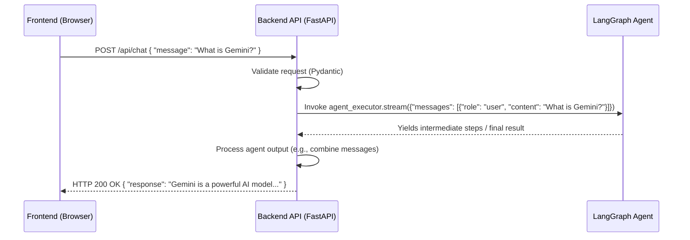

# Chapter 6: Backend API Server

As we delved into the intricacies of the [Agent's Workflow Graph](chapter_05.md) in the previous chapter, we established the "brain" of our AI assistant – the intricate logic and sequencing of tasks it performs. However, a brilliant brain needs a way to communicate with the outside world. This is where the Backend API Server comes into play, serving as the essential bridge between our sophisticated agent and the user.

---

### Problem & Motivation

Imagine a user interacting with our AI assistant through a sleek web interface. When they type a query like "Summarize the latest news on AI," how does that text travel from their browser to our agent, and how does the agent's research and response get back to the user? Without a backend server, our agent would be isolated, unable to receive user input or deliver its valuable output. The core problem is establishing a reliable, structured communication channel between the client-side user interface and the server-side AI agent.

This is precisely why a Backend API Server is critical for the `gemini-fullstack-langgraph-quickstart` project. It acts as the central hub, receiving requests from the frontend, securely forwarding them to our LangGraph agent for processing, and then taking the agent's computed responses and sending them back to the user interface. For instance, when a user asks the agent to "Find out what Gemini is," the frontend sends this query to a specific endpoint on the backend. The backend then orchestrates the agent's workflow, waits for the research and summarization, and finally sends the comprehensive answer back to the user's browser for display.

---

### Core Concept Explanation

The **Backend API Server** is the server-side component of our application, responsible for handling all requests from the frontend, processing them, and returning appropriate responses. In this project, it is built using **FastAPI**, a modern, fast (high-performance) web framework for building APIs with Python 3.7+ based on standard Python type hints.

Think of the Backend API Server as the "interpreter" and "manager" for our AI assistant. When the frontend (the user's browser) sends a message, it doesn't directly talk to the LangGraph agent. Instead, it sends an HTTP request to the Backend API Server. The server then interprets this request, passes it to the LangGraph agent, waits for the agent to complete its task (e.g., web research, summarization), and then formats the agent's output into an HTTP response that the frontend can understand and display. It exposes various **endpoints**, which are specific URLs that perform different functions, allowing the frontend to interact with distinct parts of our agent's capabilities.

```mermaid
graph TD
    User_Browser[User's Browser (Frontend)] -->|HTTP Request (e.g., /chat)| Backend_API[Backend API Server (FastAPI)]
    Backend_API -->|Call Agent Function| LangGraph_Agent[LangGraph Agent (Python)]
    LangGraph_Agent -->|Returns Agent Output| Backend_API
    Backend_API -->|HTTP Response (JSON)| User_Browser
```
The Backend API Server also handles serving the static files for our React user interface. This means that when a user first navigates to our application's URL, the backend is responsible for delivering the HTML, CSS, and JavaScript files that make up the frontend application. This cohesive approach ensures that both the application's interface and its intelligence are served from a single, unified point.

---

### Practical Usage Examples

Let's look at how the Backend API Server is initiated and how it serves both the API endpoints and the static frontend assets.

First, we define a FastAPI application in our `main.py` file, and then mount specific routers onto it.

```python
# backend/src/main.py (simplified)
from fastapi import FastAPI
from backend.src.agent.app import agent_router, create_frontend_router

app = FastAPI(
    title="Gemini Fullstack LangGraph Quickstart",
    version="1.0.0",
)

# Mount the API router for agent interactions
app.include_router(agent_router, prefix="/api")

# Mount the frontend application
frontend_router = create_frontend_router()
app.mount("/app", frontend_router, name="frontend")

# ... entry point for Uvicorn ...
```
In this simplified `main.py` file, we create a FastAPI application instance. We then `include_router` for our agent's API routes, typically prefixed with `/api` to distinguish them from other parts of the application. Finally, we `mount` the router responsible for serving our static React frontend assets. The `/app` prefix ensures that frontend routes do not conflict with our backend API routes.

Let's examine the `create_frontend_router` function, which is crucial for serving the React application.

```python
# backend/src/agent/app.py (snippet)
import pathlib
from starlette.applications import Starlette
from starlette.routing import Mount, Route
from starlette.staticfiles import StaticFiles

def create_frontend_router(build_dir="../frontend/dist"):
    """Creates a router to serve the React frontend."""
    build_path = pathlib.Path(__file__).parent.parent.parent / build_dir
    
    # Serve static files like JS, CSS, images
    static_files_app = StaticFiles(directory=build_path, html=True)

    # Starlette application to handle SPA routing
    app_routes = [
        Mount("/", app=static_files_app, name="static"),
        # Catch-all route for SPA history mode (serves index.html for all client-side routes)
        Route("/{path:path}", static_files_app, name="catch-all")
    ]
    return Starlette(routes=app_routes)

# This router is then mounted in main.py
# app.mount("/app", create_frontend_router(), name="frontend")
```
The `create_frontend_router` function dynamically determines the path to the compiled React frontend (`../frontend/dist`). It uses Starlette's `StaticFiles` to serve these assets. The key part is the `Route("/{path:path}", static_files_app, name="catch-all")`, which is essential for single-page applications (SPAs) like React. This "catch-all" route ensures that if the frontend navigates to a client-side route (e.g., `/app/dashboard`), the server still serves `index.html`, allowing the React router to handle the actual routing client-side.

---

### Internal Implementation Walkthrough

The Backend API Server leverages FastAPI's capabilities to define routes, handle requests, and integrate with our LangGraph agent. The core logic for agent interaction typically resides in `backend/src/agent/app.py`, which is then imported and included in `backend/src/main.py`.

Here's a conceptual flow of how a chat request is handled:

1.  **Request Reception**: The FastAPI application receives an HTTP POST request to `/api/chat` from the frontend, containing the user's message.
2.  **Schema Validation**: FastAPI, thanks to Pydantic, automatically validates the incoming request body against a predefined schema (e.g., `ChatMessage` from [Structured Communication Schemas](chapter_02.md)). If the data doesn't match, an error is returned immediately.
3.  **Agent Invocation**: Upon successful validation, the backend extracts the user message and other relevant context. It then calls the `agent_executor` (our LangGraph agent defined in `backend/src/agent/agent.py`). This call typically involves passing the current [Agent State Management](chapter_03.md) to the agent.
4.  **Asynchronous Execution**: The agent's workflow, which might involve network calls (e.g., web research), runs asynchronously. FastAPI is designed to handle this efficiently without blocking the server.
5.  **Response Generation**: Once the LangGraph agent completes its processing and returns the updated state, the backend extracts the final agent message.
6.  **Response Transmission**: The backend serializes this message into a JSON response and sends it back to the frontend.



In `backend/src/agent/app.py`, you'd find a router with an endpoint like this:

```python
# backend/src/agent/app.py (snippet)
from fastapi import APIRouter
from backend.src.agent.agent import agent_executor # The LangGraph agent instance
from backend.src.schemas import ChatRequest, ChatResponse, AgentState # Our Pydantic schemas

agent_router = APIRouter()

@agent_router.post("/chat", response_model=ChatResponse)
async def chat_with_agent(request: ChatRequest) -> ChatResponse:
    """
    Endpoint to interact with the LangGraph agent.
    """
    # Initialize state or load from session/db if applicable
    initial_state = AgentState(messages=[request.message]) 

    # Invoke the agent asynchronously
    final_response = ""
    async for s in agent_executor.stream(initial_state):
        # Process streamed outputs (e.g., collect final message)
        if "messages" in s:
            final_response = s["messages"][-1].content # Get last message content
        
    return ChatResponse(response=final_response)
```
This snippet illustrates how the `/chat` endpoint accepts a `ChatRequest` (defined in `backend/src/schemas.py`), invokes the `agent_executor` (our LangGraph agent), processes its streamed output, and returns a `ChatResponse`. The `response_model=ChatResponse` ensures that FastAPI validates the outgoing response as well.

---

### System Integration

The Backend API Server acts as the central orchestrator, connecting various components of our full-stack application:

*   **[User Interface (Frontend)](chapter_07.md)**: The frontend sends HTTP requests to the backend API and receives HTTP responses. This is the primary interaction point for the user.
*   **[Agent's Workflow Graph](chapter_05.md)**: The backend directly invokes the `agent_executor` instance from the LangGraph definition, passing inputs and receiving outputs that drive the AI's logic.
*   **[Agent State Management](chapter_03.md)**: The backend manages and persists the agent's state across turns, feeding the current state into the LangGraph agent and updating it with the agent's output.
*   **[Structured Communication Schemas](chapter_02.md)**: FastAPI leverages Pydantic models (our schemas) for both incoming request validation and outgoing response serialization, ensuring consistent and predictable data exchange.

The data flow is cyclical: user input from the frontend arrives at the backend, is processed by the LangGraph agent, and the agent's output is then sent back through the backend to the frontend for display.

```mermaid
graph TD
    UI[User Interface] -->|HTTP Request| BAPI[Backend API Server]
    BAPI -->|Invoke LangGraph| AWG[Agent's Workflow Graph]
    AWG -->|Reads/Updates| ASM[Agent State Management]
    ASM --> AWG
    AWG -->|Returns Output| BAPI
    BAPI -->|HTTP Response (Validated by SCS)| UI
    subgraph Schemas
        SCS[Structured Communication Schemas]
    end
    BAPI -- "Uses for Validation" --> SCS
```

---

### Best Practices & Tips

*   **API Design**: Follow RESTful principles for clear, predictable endpoints (e.g., `/api/chat` for chat interactions). Use meaningful HTTP methods (GET, POST).
*   **Asynchronous Operations**: FastAPI excels with `async`/`await`. Ensure your agent invocations and any I/O-bound operations within the backend are properly awaited to prevent blocking the event loop.
*   **Error Handling**: Implement robust error handling. FastAPI's `HTTPException` is a great way to return standardized error responses to the frontend.
*   **Input Validation**: Leverage Pydantic models for request and response validation. This catches malformed data early and improves security and reliability.
*   **Environment Variables**: Use environment variables for sensitive information (API keys, database connections) and configuration settings (e.g., `frontend/dist` path) rather than hardcoding them.
*   **Logging**: Implement comprehensive logging to monitor server activity, agent interactions, and potential issues.
*   **Deployment**: For production, run FastAPI applications with an ASGI server like Uvicorn, often behind a WSGI server like Gunicorn for process management.

---

### Chapter Conclusion

The Backend API Server is the backbone of our `gemini-fullstack-langgraph-quickstart` project, transforming our sophisticated LangGraph agent into an accessible, interactive AI assistant. By providing a robust communication channel, handling requests, and managing the flow of data, it enables seamless interaction between the user interface and the core AI logic. We've seen how FastAPI efficiently serves both API endpoints and the static frontend assets, creating a unified application experience.

With the backend in place, we now have a powerful engine ready to communicate. The next logical step is to explore how users will actually interact with this engine. In the next chapter, we will dive into the **[User Interface (Frontend)](chapter_07.md)**, where we'll build the interactive web application that brings our AI assistant to life.