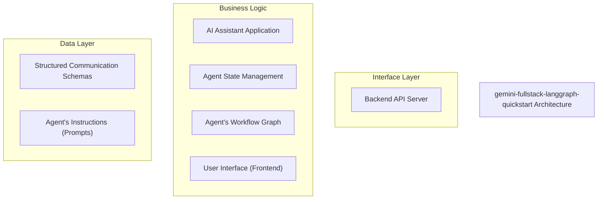
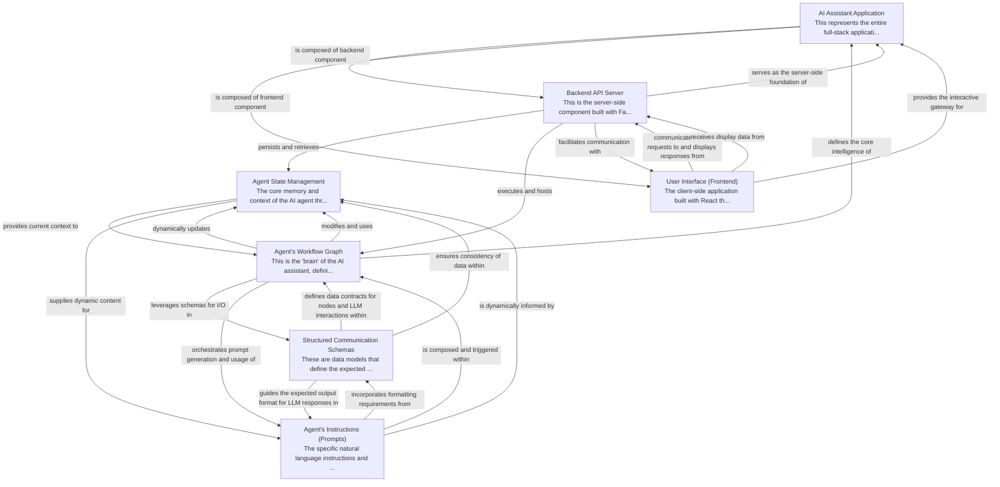

# gemini-fullstack-langgraph-quickstart Tutorial

Welcome to the comprehensive tutorial for gemini-fullstack-langgraph-quickstart. This tutorial is automatically generated from the codebase to help you understand the core concepts and implementation patterns.

## Project Overview

This project implements a full-stack AI assistant, integrating a LangGraph-powered backend agent with a React-based user interface. The assistant is designed to interact with users, understand their queries, perform tasks like web research, and provide informed responses, leveraging structured communication and dynamic workflow management.

## System Architecture

## Component Relationships

## Table of Contents

1. [Chapter 1: AI Assistant Application](chapter_01.md) - Comprehensive documentation for AI Assistant Application following structured methodology...
2. [Chapter 2: Structured Communication Schemas](chapter_02.md) - Comprehensive documentation for Structured Communication Schemas following structured methodology...
3. [Chapter 3: Agent State Management](chapter_03.md) - Comprehensive documentation for Agent State Management following structured methodology...
4. [Chapter 4: Agent's Instructions (Prompts)](chapter_04.md) - Comprehensive documentation for Agent's Instructions (Prompts) following structured methodology...
5. [Chapter 5: Agent's Workflow Graph](chapter_05.md) - Comprehensive documentation for Agent's Workflow Graph following structured methodology...
6. [Chapter 6: Backend API Server](chapter_06.md) - Comprehensive documentation for Backend API Server following structured methodology...
7. [Chapter 7: User Interface (Frontend)](chapter_07.md) - Comprehensive documentation for User Interface (Frontend) following structured methodology...

## How to Use This Tutorial

1. **Start with Chapter 1** to understand the foundational concepts
2. **Follow the sequence** - each chapter builds upon previous concepts
3. **Practice with code examples** - every chapter includes practical examples
4. **Refer to diagrams** - use architecture diagrams for visual understanding
5. **Cross-reference concepts** - chapters link to related topics

## Tutorial Features

- **Progressive Learning**: Concepts are introduced in logical order
- **Code Examples**: Every chapter includes practical, executable code
- **Visual Diagrams**: Mermaid diagrams illustrate complex relationships
- **Cross-References**: Easy navigation between related concepts
- **Beginner-Friendly**: Written for newcomers to the codebase

## Contributing

This tutorial is auto-generated from the codebase. To improve it:
1. Update the source code documentation
2. Add more detailed comments to key functions
3. Regenerate the tutorial using the documentation system

---

*Generated using AI-powered codebase analysis*
