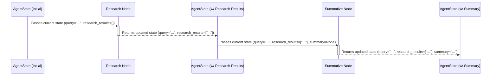

# Chapter 1: Agent's Core State

---

### Problem & Motivation

Imagine engaging in a complex conversation or asking an AI agent to perform multi-step tasks, like "Research the latest trends in AI and summarize them, then draft a short blog post comparing two prominent trends." For the agent to successfully complete this, it cannot treat each step in isolation. It needs a memory – a central place to store the initial query, the findings from its research, the generated summary, and the draft blog post. Without this persistent context, the agent would "forget" previous instructions or generated information, leading to fragmented responses, repetitive actions, and an inability to handle sophisticated, multi-turn interactions.

This challenge is precisely what the "Agent's Core State" addresses in our `gemini-fullstack-langgraph-quickstart` project. Our AI agent is designed for multi-step reasoning, research, and structured data processing. Each of these steps generates valuable intermediate information that subsequent steps must access and build upon. A robust, evolving state ensures that the agent maintains a complete understanding of its ongoing task, preventing it from losing context or repeating work.

Consider our example: "Research AI trends and draft a blog post."
1. The agent first needs to remember the user's initial *query*.
2. When it performs *research*, it needs a place to store the *research results*.
3. After *summarizing* these results, the *summary* must be saved.
4. Finally, when *drafting the blog post*, it requires access to the original query, the research results, and the summary. The Agent's Core State serves as this indispensable working memory, allowing the agent to seamlessly progress through these stages while maintaining full context.

---

### Core Concept Explanation

At its heart, the **Agent's Core State** is the central data structure that encapsulates all mutable information the agent needs as it progresses through its reasoning steps. Think of it as the agent's temporary, dynamic memory or its scratchpad for the current task. Every action, every thought process, and every piece of information gathered by the agent during a single interaction cycle is stored here.

In Python, this state is modeled as a `TypedDict`. A `TypedDict` is a special kind of dictionary type that allows you to define a fixed set of keys with specific value types. This brings several significant benefits:
*   **Type Safety:** It enables static type checkers (like MyPy) to verify that you're accessing valid keys and assigning values of the correct type, reducing runtime errors.
*   **Clarity and Readability:** The structure of the state is explicitly defined, making it easy for developers to understand what information the agent expects to have at any given point.
*   **Autocompletion:** IDEs can provide intelligent autocompletion for state keys, improving developer productivity.

Each *node* (a specific reasoning step or tool call) within the LangGraph framework reads from this central state, performs its designated operation, and then writes any new or updated information back into the same state. This ensures a consistent flow of context throughout the entire multi-step process. The state literally carries the conversation history, research findings, tool outputs, and any intermediate conclusions from one part of the agent's logic to the next.

---

### Practical Usage Examples

Let's illustrate how the `AgentState` is defined and how a simple reasoning step might interact with it.

First, we define our `AgentState` using `TypedDict`. This initial definition sets up the structure of our agent's memory.

```python
from typing import TypedDict, List, Dict, Any, Optional

class AgentState(TypedDict):
    """
    Represents the core state of the AI agent throughout its reasoning process.
    Each node in the LangGraph reads from and writes to this state.
    """
    query: str
    chat_history: List[Dict[str, Any]]
    research_results: List[str]
    summary: Optional[str]
    blog_post_draft: Optional[str]
    # ... more fields as seen in src/backend/core/state.py
```
*Explanation: This code block defines `AgentState` as a dictionary-like object. It specifies that it must contain a `query` (string), `chat_history` (list of dictionaries), `research_results` (list of strings), and optional `summary` and `blog_post_draft` (strings). This is the blueprint for our agent's memory.*

Next, let's see how we might initialize this state when a user first interacts with our agent:

```python
# Initializing the state for a new user query
initial_state = AgentState(
    query="Research AI trends and draft a blog post.",
    chat_history=[],
    research_results=[],
    summary=None,
    blog_post_draft=None
)
print(initial_state["query"])
# Expected Output: Research AI trends and draft a blog post.
```
*Explanation: Here, we create an instance of `AgentState` for our example use case. The `query` field is populated with the user's request, while other fields start empty or as `None`, ready to be filled as the agent progresses.*

Now, imagine a simple "Research Node" that takes the current state, performs some simulated research based on the query, and then updates the state with the findings.

```python
def research_node(state: AgentState) -> AgentState:
    # Simulate external research based on the query
    current_query = state["query"]
    fake_results = [
        f"Key trend 1: Edge AI and TinyML for '{current_query}'",
        f"Key trend 2: Generative AI advancements in '{current_query}'"
    ]
    print(f"Performing research for: {current_query}")
    print(f"Adding research results to state: {fake_results}")

    # Return a NEW state dictionary with the updated research_results
    return {**state, "research_results": fake_results}

# Applying the research node to our initial state
state_after_research = research_node(initial_state)
print(state_after_research["research_results"])
# Expected Output: ['Key trend 1: Edge AI and TinyML for \'Research AI trends and draft a blog post.\'', 'Key trend 2: Generative AI advancements in \'Research AI trends and draft a blog post.\'']
```
*Explanation: The `research_node` function receives the `initial_state`. It reads the `query`, generates some mock `research_results`, and then returns a *new* dictionary. The `**state` syntax is crucial: it unpacks all existing key-value pairs from the original state and then `research_results: fake_results` overwrites or adds that specific field. This ensures that the state evolves correctly while preserving previous context.*

---

### Internal Implementation Walkthrough

The actual definition of the `AgentState` for the `gemini-fullstack-langgraph-quickstart` project is found in `src/backend/core/state.py`. This file serves as the single source of truth for the agent's memory structure.

Let's look at a more complete representation of the `AgentState` from the project:

```python
# src/backend/core/state.py
from typing import TypedDict, List, Dict, Any, Optional

class AgentState(TypedDict):
    """
    Represents the core state of the AI agent throughout its reasoning process.
    Each node in the LangGraph reads from and writes to this state.

    Attributes:
        query (str): The user's initial or current input query.
        chat_history (List[Dict[str, Any]]): A list of messages (user/agent turns)
                                            maintaining the conversation context.
        tool_calls (List[Dict[str, Any]]): A list of tool calls the agent intends to make.
                                          Each dict contains 'tool_name' and 'tool_args'.
        tool_output (Optional[str]): The textual output from the last executed tool.
        research_context (Optional[str]): Summarized or raw findings from research tools.
        extracted_data (Optional[Dict[str, Any]]): Structured data extracted from content
                                                  using a specified schema.
        schema_format (Optional[Dict[str, Any]]): The JSON schema used for data extraction.
        intermediate_steps (List[Dict[str, Any]]): A trace of the agent's internal
                                                  reasoning, thoughts, or observations.
        final_answer (Optional[str]): The agent's ultimate response to the user's query.
        # Add any other project-specific fields as needed
        # e.g., blog_post_draft: Optional[str] for a content generation agent
    """
    query: str
    chat_history: List[Dict[str, Any]]
    tool_calls: List[Dict[str, Any]]
    tool_output: Optional[str]
    research_context: Optional[str]
    extracted_data: Optional[Dict[str, Any]]
    schema_format: Optional[Dict[str, Any]]
    intermediate_steps: List[Dict[str, Any]]
    final_answer: Optional[str]
    # For our specific example, we might add:
    blog_post_draft: Optional[str] = None # Added for our running example

```
*Explanation: This expanded `AgentState` provides a comprehensive memory for our agent. `query` and `chat_history` maintain the dialogue. `tool_calls` and `tool_output` manage interactions with external tools. `research_context`, `extracted_data`, and `schema_format` handle information gathering and structuring. `intermediate_steps` is crucial for tracing the agent's internal reasoning, and `final_answer` holds the ultimate response. The `blog_post_draft` is added for our running example.*

The LangGraph framework fundamentally operates by passing this `AgentState` object between its defined nodes. Each node is a Python function that takes the current `AgentState` as input and returns a (potentially modified) `AgentState`. This is how context and information are continuously updated and shared throughout the agent's workflow.

Consider the flow of the state through a simple LangGraph, focusing on the *values* within the state changing:


*Explanation: This sequence diagram visualizes how the `AgentState` is passed from one node to the next. The `Research Node` receives the state, updates the `research_results` field, and returns it. The `Summarize Node` then receives this updated state, reads the `research_results`, generates a `summary`, and updates the state again, passing the enriched context along.*

---

### System Integration

The `AgentState` is not an isolated component; it's the glue that binds all other parts of the `gemini-fullstack-langgraph-quickstart` project together.

*   **LangGraph Nodes:** This is the most direct integration. Every single reasoning step defined as a LangGraph node explicitly receives and returns an `AgentState`. It's the primary mechanism for communication and data exchange between nodes. You'll dive deeper into this in [Agent's Reasoning Steps (LangGraph Nodes)](chapter_02.md).
*   **Structured Information Exchange (Schemas):** When the agent needs to extract structured data (e.g., pulling specific entities from text), the `extracted_data` and `schema_format` fields within `AgentState` become crucial. The agent might use a schema (defined in [Structured Information Exchange (Schemas)](chapter_03.md)) to guide the extraction and store the results directly in the state.
*   **LLM Prompts & Context Utilities:** Parts of the `AgentState`—like `chat_history`, `query`, `research_context`, or `extracted_data`—are directly used to construct the prompts sent to the Large Language Model. Utilities discussed in [LLM Prompts & Context Utilities](chapter_04.md) will pull this information from the state to provide rich, contextual prompts.
*   **Frontend User Interface Components:** In a fullstack application, the `AgentState` is often serialized (converted to JSON) and sent to the frontend. This allows the user interface (covered in [Frontend User Interface Components](chapter_07.md)) to visualize the agent's progress, display intermediate steps, research results, and the final answer in real-time. The frontend effectively "watches" the state evolve.

---

### Best Practices & Tips

To make the most of the `AgentState` and ensure a robust, maintainable agent, consider these best practices:

*   **Keep it Lean and Focused:** Only include information in the `AgentState` that is genuinely needed by subsequent nodes or for the final output. Avoid accumulating transient or unnecessary data, as this can lead to memory bloat and reduce clarity.
*   **Clear Naming Conventions:** Use descriptive and unambiguous names for all fields in your `TypedDict`. This significantly improves readability and makes it easier for new developers to understand what each piece of data represents.
*   **Favor Immutability (Conceptually):** While `TypedDict` objects are technically mutable, it's a strong best practice for nodes to *return a new state dictionary* with updates, rather than directly modifying the input state. This is typically achieved using dictionary unpacking (`{**original_state, "key": "new_value"}`). This approach helps prevent unintended side effects and makes debugging easier by providing a clear progression of state changes.
*   **Ensure JSON-Serializability:** For fullstack applications like `gemini-fullstack-langgraph-quickstart`, the `AgentState` will often be serialized to JSON for transmission between the backend and frontend, or for persistence. Ensure that all data types used within your `AgentState` are JSON-compatible (strings, numbers, booleans, lists, dictionaries).
*   **Leverage Python Type Hinting:** Fully utilize `TypedDict` and standard Python type hints for all fields. This not only aids static analysis but also significantly enhances code clarity, enables better IDE support, and reduces the likelihood of type-related bugs.
*   **Document Each Field:** Provide clear docstrings or comments for each field in `AgentState`, explaining its purpose and typical contents. This is invaluable for future maintainers.

---

### Chapter Conclusion

In this chapter, we've established the `Agent's Core State` as the fundamental building block for our `gemini-fullstack-langgraph-quickstart` project. We've seen how this `TypedDict` acts as the agent's persistent memory, allowing it to maintain context, share information between reasoning steps, and orchestrate complex, multi-turn interactions. Understanding the structure and purpose of `AgentState` is critical, as it underpins all subsequent operations within the agent.

Now that we understand *what* the agent remembers and *how* that memory is structured, let's explore *how* it uses and modifies this memory as it thinks and acts. Our next chapter will dive into the individual reasoning steps, or "nodes," within LangGraph that read from and write to this state, driving the agent's entire decision-making process.

Continue to the next chapter to see the `AgentState` in action within the LangGraph framework: [Agent's Reasoning Steps (LangGraph Nodes)](chapter_02.md)