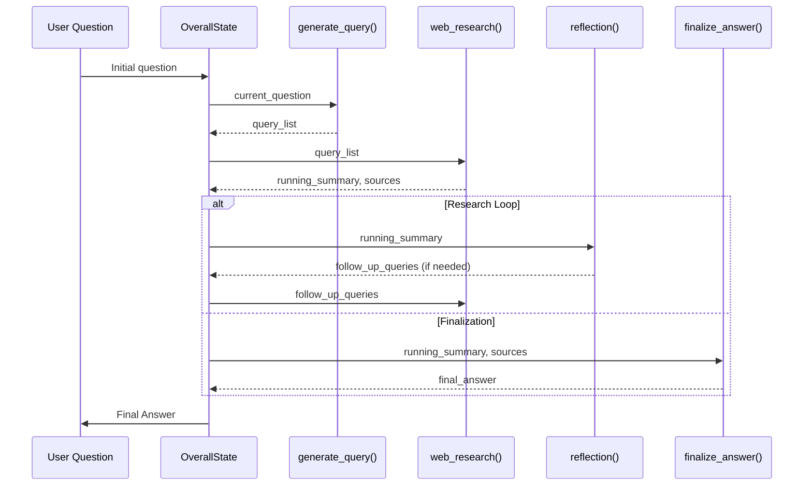

# Chapter 2: Agent's Reasoning Steps (LangGraph Nodes)

In the previous chapter, we established the foundation of our AI agent with the [Agent's Core State](chapter_01.md), a centralized data structure that holds all the dynamic information our agent needs throughout its operation. As useful as a well-defined state is, it's merely a container. To breathe life into our agent and enable it to perform complex tasks, we need a mechanism to process and transform this state. This is where LangGraph's nodes come into play.

---

### Problem & Motivation

Imagine asking an AI a complex question like, "What are the latest advancements in quantum computing, and how might they impact artificial intelligence?" This isn't a simple query that can be answered with a single database lookup. It requires a multi-faceted approach: understanding the question, breaking it down into searchable components, performing web research, synthesizing information, identifying knowledge gaps, and finally, presenting a comprehensive answer.

Without a structured way to manage these steps, an agent's logic can quickly become a tangled mess of conditional statements and function calls. It becomes difficult to track progress, debug issues, or even understand the agent's decision-making process. For the `gemini-fullstack-langgraph-quickstart` project, the core problem is orchestrating sophisticated, multi-step reasoning capabilities within a fullstack application, providing transparency and real-time feedback to the user. LangGraph nodes offer an elegant solution by formalizing each step, making the agent's workflow modular, observable, and maintainable.

---

### Core Concept Explanation

LangGraph nodes are the *atomic units of computation* within an agent's workflow. Think of them as individual workstations on an assembly line. Each workstation (node) has a specific task: it receives the product (the agent's `OverallState`), performs its designated operation, potentially modifies the product, and then passes it along.

In our project, a node is essentially a Python function that takes the current `OverallState` (or a subset of it) and a `RunnableConfig` as input, performs some computation (e.g., calling an LLM, using a tool), and then returns a partial update to the state. This design ensures that each step of the agent's reasoning is encapsulated, making the agent's logic clear and traceable. By connecting these nodes in a graph structure, we can define complex reasoning paths, including loops for iterative refinement and conditional branching for dynamic decision-making. The beauty of this approach lies in its modularity and the ability to visualize the agent's journey through its reasoning steps.

---

### Practical Usage Examples

Let's look at some key nodes from our `gemini-fullstack-langgraph-quickstart` project and understand their role. Each node represents a distinct phase in the agent's research and summarization process.

#### 1. Generating Search Queries (`generate_query`)

The first step in tackling a complex question is often to formulate precise search queries. The `generate_query` node is responsible for this.

```python
# backend/src/agent/graph.py
from backend.src.agent.state import OverallState, QueryGenerationState
from langchain_core.runnables import RunnableConfig

def generate_query(state: OverallState, config: RunnableConfig) -> QueryGenerationState:
    """LangGraph node that generates search queries based on the User's question."""
    # ... LLM call to generate queries ...
    return {"query_list": ["quantum computing advancements", "AI impact of quantum"]}
```
This node takes the user's initial question from the `OverallState` and uses an LLM to generate a list of optimized search queries. It then updates the state with these queries, preparing for the next step.

#### 2. Performing Web Research (`web_research`)

Once queries are generated, the agent needs to execute them. The `web_research` node handles interacting with external tools like a search API.

```python
# backend/src/agent/graph.py
from backend.src.agent.state import WebSearchState, OverallState

def web_research(state: WebSearchState, config: RunnableConfig) -> OverallState:
    """LangGraph node that performs web research using the Google Search API tool."""
    # ... calls Google Search API ...
    # ... processes results ...
    return {"running_summary": "Current summary of findings...", "sources": [{"url": "...", "content": "..."}]}
```
This node takes the `query_list` from the `WebSearchState` (which itself is a subset of `OverallState`), executes web searches, and integrates the findings into the `running_summary` and `sources` within the `OverallState`.

#### 3. Reflecting on Research (`reflection`)

After initial research, it's crucial to evaluate the findings and identify any gaps. The `reflection` node performs this critical step.

```python
# backend/src/agent/graph.py
from backend.src.agent.state import OverallState, ReflectionState

def reflection(state: OverallState, config: RunnableConfig) -> ReflectionState:
    """LangGraph node that identifies knowledge gaps and generates follow-up queries."""
    # ... LLM analysis of summary for gaps ...
    return {"reflection": "More data needed on economic impact.", "follow_up_queries": ["economic impact of quantum AI"]}
```
The `reflection` node analyzes the `running_summary` to determine if more research is needed or if specific areas require deeper investigation. It can then generate `follow_up_queries` for subsequent research loops.

#### 4. Finalizing the Answer (`finalize_answer`)

Once sufficient research is gathered, the `finalize_answer` node consolidates everything into a coherent, well-structured response.

```python
# backend/src/agent/graph.py
from backend.src.agent.state import OverallState

def finalize_answer(state: OverallState, config: RunnableConfig):
    """LangGraph node that finalizes the research summary."""
    # ... deduplicates sources, formats output ...
    # ... combines summary and sources into final report ...
    # No explicit return for state update, as this might be the end of the chain.
    pass # Or return {"final_answer": "..."} depending on graph design.
```
This node takes the accumulated `running_summary` and `sources`, performs final formatting, deduplication, and prepares the comprehensive answer, often marking the completion of the agent's primary task.

---

### Internal Implementation Walkthrough

Each LangGraph node, as seen above, is essentially a Python function. The key to its internal operation lies in how it interacts with the `state` object and potentially external tools or LLMs.

1.  **Input State:** Every node receives the `state` (or a specific `TypedDict` derived from `OverallState`) as its primary input. This `state` contains all the information the node needs to perform its task. For instance, `generate_query` needs the `user_question`, while `web_research` needs `query_list`.
2.  **`RunnableConfig`:** The `config` parameter provides runtime configuration, which can include things like API keys, LLM model names, or other settings that shouldn't be hardcoded into the node logic. This allows for dynamic behavior and easier [Agent Configuration](chapter_05.md).
3.  **Core Logic:**
    *   **LLM Interaction:** Nodes like `generate_query` and `reflection` leverage Large Language Models (LLMs) to perform tasks such as query generation, summarization, or identifying knowledge gaps. They construct a prompt using information from the `state`, send it to the LLM, and parse the LLM's response.
    *   **Tool Usage:** Nodes like `web_research` integrate external tools (e.g., Google Search API). They take parameters from the `state`, execute the tool, and process its results.
    *   **Data Processing:** Nodes like `finalize_answer` primarily focus on processing and formatting existing data within the `state`, such as deduplicating sources or structuring the final output.
4.  **Output State:** Nodes return a dictionary representing a *partial update* to the `OverallState`. LangGraph intelligently merges this partial update into the global `OverallState`, making the changes available to subsequent nodes. If a node modifies a specific part of the state (e.g., `query_list`), only that part is updated, preserving other state variables.

Here's a simplified sequence diagram illustrating the interaction of these nodes for a research task:


This diagram shows how data flows between the nodes, with the `OverallState` acting as the central hub, continuously being updated and passed along.

---

### System Integration

LangGraph nodes are the building blocks of our agent's workflow. They integrate with other parts of the system in several critical ways:

*   **[Agent's Core State](chapter_01.md):** This is the most fundamental integration. Every node reads from and writes to the `OverallState`. The `TypedDict` structure of the state ensures type safety and clear expectations for data within each node. Specific nodes might operate on subsets of the `OverallState`, defined by other `TypedDict`s like `QueryGenerationState` or `WebSearchState`, which are then merged back into the `OverallState`.
*   **[Structured Information Exchange (Schemas)](chapter_03.md):** Many nodes, especially those interacting with LLMs, rely heavily on schemas (like Pydantic models or `TypedDict`s) to define the expected input for LLM calls and, critically, to parse structured output from LLMs. For instance, `reflection` might use a schema to ensure the `follow_up_queries` are extracted in a predictable JSON format.
*   **[LLM Prompts & Context Utilities](chapter_04.md):** Nodes use prompt templates and context management utilities to formulate effective prompts for LLMs, dynamically injecting relevant information from the `OverallState`.
*   **LangGraph Graph Definition:** The nodes are connected within the `LangGraph` framework (`backend/src/agent/graph.py`). This is where the actual flow, conditional logic, and looping mechanisms are defined, orchestrating how these individual nodes execute in sequence or parallel.
*   **Fullstack Application:** The execution of these nodes is streamed back to the React frontend (`backend/src/app.py` and `frontend/src/App.tsx`). This allows users to visualize the agent's progress step-by-step, showing which node is currently active and what partial results it has generated, making the complex reasoning process transparent.

---

### Best Practices & Tips

*   **Keep Nodes Atomic and Focused:** Each node should ideally perform one specific, well-defined task. This improves readability, testability, and reusability. For example, generating a query is one node; executing the search is another.
*   **Manage State Updates Precisely:** Nodes should only return the *parts* of the `OverallState` they intend to modify. LangGraph will intelligently merge these updates. Avoid returning the entire state unless absolutely necessary.
*   **Utilize `RunnableConfig` for Dynamic Settings:** External parameters (API keys, model names, retry counts) should be passed via `RunnableConfig` rather than hardcoding them within the node. This makes your agent more flexible and configurable.
*   **Design for Idempotency (where possible):** While not always feasible for every node, aiming for idempotency (producing the same output given the same input) simplifies debugging and makes retry mechanisms more robust.
*   **Error Handling within Nodes:** Consider how individual nodes will handle failures (e.g., API timeouts, LLM errors). While not explicitly shown in snippets, production-ready nodes should include `try-except` blocks.
*   **Clear Input/Output Contracts:** Documenting the expected input from the `state` and the expected output to the `state` for each node is crucial for team collaboration and maintainability. `TypedDict`s for state definitions greatly assist with this.
*   **Unit Testing:** Each node function should be unit-testable in isolation, verifying its specific logic without needing to run the entire graph.

---

### Chapter Conclusion

LangGraph nodes are the operational heart of our AI agent, translating a static state into dynamic, intelligent behavior. By structuring the agent's reasoning into modular, atomic steps, we achieve clarity, maintainability, and the ability to build sophisticated multi-step workflows. We've seen how individual nodes like `generate_query`, `web_research`, `reflection`, and `finalize_answer` collaborate, orchestrating a complex research task.

This modularity not only simplifies development but also enhances the user experience by providing a transparent view into the agent's thought process. As the agent navigates through its graph of nodes, updating its `OverallState` at each step, it's performing the crucial task of transforming raw information into refined, structured knowledge.

However, for these nodes to communicate effectively, especially when interacting with LLMs or needing specific data formats, a robust system for *structured information exchange* is vital. In the next chapter, we will delve into [Structured Information Exchange (Schemas)](chapter_03.md), exploring how we define and enforce data contracts between different parts of our agent, ensuring seamless and reliable communication.