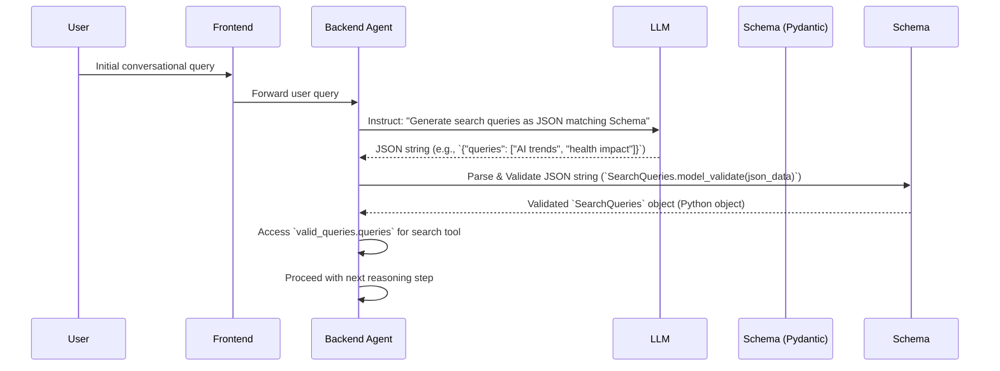

# Chapter 3: Structured Information Exchange (Schemas)

In the previous chapter, we explored the building blocks of our AI agent's logic: the [Agent's Reasoning Steps (LangGraph Nodes)](chapter_02.md). We saw how these nodes perform distinct tasks, from generating initial thoughts to executing tools. However, for these individual steps to work together seamlessly and reliably, especially when interacting with the powerful yet sometimes unpredictable Large Language Models (LLMs), we need a robust way to ensure data consistency and structure. This is where schemas come into play, acting as crucial contracts for information exchange within our agent.

---

### Problem & Motivation

Imagine asking an LLM to generate a list of search queries based on a user's request. Without any predefined structure, the LLM might respond with a free-form sentence, a bulleted list, or even a single, unhelpful query. Parsing this varied output reliably in a program becomes a significant challenge, leading to brittle code and frequent errors. Similarly, when invoking external tools, these tools expect specific input formats – a list of strings for search terms, a dictionary of arguments for an API call, etc. If our agent provides malformed data, the tools will fail.

This project, `gemini-fullstack-langgraph-quickstart`, orchestrates an AI agent capable of multi-step reasoning, research, and structured data processing. For such an agent to function effectively, it must be able to:
1. **Consistently interpret LLM outputs:** Turn natural language or semi-structured text from an LLM into predictable Python objects.
2. **Reliably provide structured inputs to tools:** Ensure that external functions receive exactly the data they expect.
3. **Maintain internal data consistency:** Within the agent's workflow, data passed between nodes must adhere to agreed-upon formats.

For example, when a user asks, "Find me information about the latest AI trends and their impact on healthcare," our agent might need to generate a list of precise search queries like `["latest AI trends", "AI impact on healthcare", "emerging AI in medicine"]`. If the LLM generates this as a single string "search for AI trends and healthcare impact", our search tool won't know how to break it down. Schemas provide the necessary blueprint to guide the LLM's output and validate our agent's data exchanges, ensuring smooth and error-free operation.

---

### Core Concept Explanation

At its heart, a **schema** is a formal definition of a data structure. Think of it as a blueprint or a contract that specifies the expected fields, their data types, and any constraints they might have. In Python, a popular and incredibly effective way to define such schemas is by using **Pydantic's `BaseModel`** classes.

`BaseModel` classes bring several key advantages to our project:
*   **Explicit Data Structures:** They allow us to explicitly define the shape of our data. Instead of passing around generic dictionaries, we create Python classes that precisely describe what data should look like.
*   **Automatic Data Validation:** Pydantic automatically validates data against the schema's type hints and field definitions. If incoming data doesn't match the schema (e.g., an integer where a list is expected), it raises a clear error. This significantly reduces bugs caused by malformed data.
*   **Seamless Integration with LLMs:** This is particularly powerful. We can instruct LLMs to generate output in JSON format that *conforms* to our `BaseModel` schema. Pydantic can then effortlessly parse this JSON into a validated Python object. This transforms potentially unstructured LLM text into reliable, strongly typed data that our agent can directly use.
*   **Improved Readability and Maintainability:** By having clear data contracts, the codebase becomes easier to understand, debug, and extend, as developers immediately know what data to expect.

In essence, `BaseModel` acts as a crucial bridge, allowing our agent to communicate complex, structured information reliably both internally and with external entities like LLMs and tools, ensuring that every piece of data fits its designated purpose.

---

### Practical Usage Examples

Let's illustrate how `BaseModel` schemas are defined and used in our project to solve the problem of structured information exchange, using our motivating example of generating search queries.

First, we define a schema for a list of search queries. This ensures that whenever our agent expects search queries, they arrive as a structured list of strings.

```python
from pydantic import BaseModel, Field
from typing import List

# Define a schema for a list of search queries
class SearchQueries(BaseModel):
    """Represents a list of search queries."""
    queries: List[str] = Field(description="List of search queries to execute.")

# This schema explicitly states that we expect a 'queries' field,
# which must contain a list of strings. The 'Field' description
# is helpful for LLMs to understand the purpose.
```

Next, let's consider a slightly more complex schema for agent reflection, which might involve multiple structured pieces of information.

```python
# Define a schema for agent reflection
class Reflection(BaseModel):
    """Provides a structured reflection on the current state and next steps."""
    thoughts: str = Field(description="Detailed thoughts on the current situation and findings.")
    relevant_findings: List[str] = Field(description="Key findings that are most relevant to the user's request.")
    next_steps: str = Field(description="Clear next steps or actions to take.")

# This Reflection schema ensures that when the agent reflects, it provides
# specific pieces of information in a predictable format.
```

Now, let's see how we can use these schemas to create and validate data.

```python
# Example: Creating a valid SearchQueries object
data_from_llm = {"queries": ["latest AI trends", "AI impact on healthcare"]}
valid_queries = SearchQueries(**data_from_llm) # Or SearchQueries.model_validate(data_from_llm) for Pydantic v2
print(f"Validated queries: {valid_queries.queries}")
# Expected output: Validated queries: ['latest AI trends', 'AI impact on healthcare']

# This demonstrates how easily we can convert a dictionary (e.g., from an LLM's JSON output)
# into a strongly typed Python object, automatically validating its structure.
```

What happens if the data doesn't conform to our schema? Pydantic will raise an error, preventing bad data from corrupting our agent's workflow.

```python
# Example: Attempting to create an invalid SearchQueries object
invalid_data = {"queries": "this is not a list of strings"}
try:
    invalid_queries = SearchQueries(**invalid_data)
except Exception as e:
    print(f"Error validating data: {e}")
# Expected output: Error validating data: 1 validation error for SearchQueries
# queries
#   Input should be a valid list [type=list_type, input_value='this is not a list of strings', input_type=str]

# This crucial error handling mechanism ensures that our agent only processes
# data that meets its structural requirements.
```

---

### Internal Implementation Walkthrough

Within the `gemini-fullstack-langgraph-quickstart` project, our `BaseModel` schemas are typically defined in a centralized location, such as `src/app/core/schemas.py`. This provides a single source of truth for all structured data definitions used by the agent.

When our agent interacts with an LLM, these schemas are often passed directly to the LLM call in a structured way (e.g., using `response_model` argument in LangChain or instructing the LLM to output JSON matching the schema's structure within the prompt). The LLM's task is then to generate a JSON string that precisely matches this schema.

Here's a simplified sequence of how this interaction occurs:



1.  **User Input:** The user sends a query through the `Frontend`.
2.  **Agent Processing:** The `Backend Agent` (specifically, a LangGraph node within the agent) receives this input and determines that it needs to generate search queries.
3.  **LLM Instruction:** The agent makes a call to the `LLM`, explicitly instructing it (via prompt or API parameter) to output JSON that adheres to the `SearchQueries` schema we defined earlier.
4.  **LLM Response:** The `LLM` processes the request and responds with a JSON string that, ideally, matches the `SearchQueries` schema.
5.  **Schema Validation & Parsing:** The `Backend Agent` takes this JSON string and uses Pydantic's `SearchQueries.model_validate()` method to parse and validate it.
6.  **Structured Data:** If validation succeeds, the agent now has a robust `SearchQueries` Python object, which it can reliably use to extract the `queries` list. If validation fails, an error is raised, preventing malformed data from progressing.
7.  **Next Steps:** With validated, structured data, the agent can confidently proceed to the next reasoning step, such as invoking a search tool with the extracted queries.

---

### System Integration

Schemas are fundamental to almost every part of our `gemini-fullstack-langgraph-quickstart` project, acting as the glue that ensures data integrity and smooth communication across components.

*   **Integration with [Agent's Core State](chapter_01.md):** While the `AgentState` itself might be a `TypedDict` for mutable, flexible state management, the *values* stored within this state often originate from or are transformed into structured data defined by schemas. For instance, the `search_queries` generated using a `SearchQueries` schema might be stored as a `List[str]` in the `AgentState`. Similarly, `Reflection` outputs could update the state's `past_reflections` or `decision_logs`.

*   **Integration with [Agent's Reasoning Steps (LangGraph Nodes)](chapter_02.md):** This is where schemas see the most active use. Nodes frequently:
    *   **Receive structured inputs:** A node might expect an input argument that is itself a `BaseModel` or contains data derived from one.
    *   **Generate structured outputs:** When an LLM within a node needs to produce a specific type of data (e.g., a list of tools to call, a decision on the next step, or a summary of findings), it's guided by a `BaseModel` schema. This ensures the output can be reliably consumed by subsequent nodes or stored in the `AgentState`.
    *   **Define tool arguments:** When the agent decides to use an external tool, the schema explicitly defines the arguments that tool expects, preventing errors during invocation.

    Here's an example of how a node might integrate a schema to produce structured output:

    ```python
    from typing import List
    from pydantic import BaseModel, Field
    # Assuming AgentState is defined elsewhere, e.g., in chapter_01
    from your_project.core.state import AgentState

    # Re-using the schema defined earlier
    class SearchQueries(BaseModel):
        queries: List[str] = Field(description="List of search queries to execute.")

    def generate_search_queries_node(state: AgentState):
        """
        A LangGraph node that uses an LLM to generate search queries based on user input.
        """
        user_input = state.get("user_input", "")
        # In a real scenario, this would involve an LLM call instructed
        # to output JSON matching the SearchQueries schema.
        # For demonstration, we simulate an LLM output:
        llm_response_json = {
            "queries": [f"detailed info on {user_input}", "latest research on X"]
        }

        # Validate and parse the LLM's output using our schema
        validated_queries = SearchQueries.model_validate(llm_response_json)

        # Return the structured data to update the AgentState
        return {"search_queries": validated_queries.queries}

    # Explanation: This node takes the user_input from the AgentState,
    # simulates an LLM call that *generates* structured data matching
    # SearchQueries, validates it, and then updates the state with the
    # extracted list of queries for subsequent nodes to use.
    ```

*   **Integration with [LLM Prompts & Context Utilities](chapter_04.md):** Schemas are intrinsically linked to how we craft our LLM prompts. Often, the schema's JSON representation, along with clear instructions, is embedded directly into the prompt. This explicitly tells the LLM the desired output format, making it much more likely to generate parseable and correct responses. This will be explored in detail in the next chapter.

---

### Best Practices & Tips

To maximize the benefits of structured information exchange using schemas:

*   **Be Specific and Granular:** Define schemas as specifically as possible. Instead of a generic `dict`, create a `BaseModel` with precise fields and types. The more specific your schema, the better the LLM will understand the desired output, and the more robust your validation will be.
*   **Leverage `Field` Descriptions:** Always use `Field(description="...")` for each field in your `BaseModel`. These descriptions are often injected directly into LLM prompts, providing crucial context to the model about what each field represents. This significantly improves the quality and accuracy of LLM-generated structured outputs.
*   **Anticipate and Handle Validation Errors:** While schemas enforce structure, LLMs can occasionally deviate. Always wrap parsing logic (e.g., `MySchema.model_validate(data)`) in `try-except ValidationError` blocks. Implement robust error handling, perhaps by re-prompting the LLM, logging the error, or triggering a fallback mechanism.
*   **Reuse and Centralize:** Define common schemas once (e.g., in `src/app/core/schemas.py`) and reuse them throughout your agent. This promotes consistency and reduces redundancy.
*   **Consider Versioning for Evolving Schemas:** For complex projects, schemas might evolve. Think about how to handle backward compatibility or versioning if your application's data structures change significantly over time.
*   **Understand `model_dump` and `model_validate` (Pydantic v2):** `model_dump()` converts a `BaseModel` instance into a plain Python dictionary (suitable for JSON serialization), while `model_validate()` creates a `BaseModel` instance from a dictionary or JSON string, performing validation.

---

### Chapter Conclusion

Structured Information Exchange through `BaseModel` schemas is a cornerstone of building robust and reliable AI agents. By explicitly defining data structures, we overcome the inherent unstructured nature of LLMs, ensuring that our agent can consistently interpret outputs, provide correct inputs to tools, and maintain internal data integrity. This chapter demonstrated the core concept, practical usage, and crucial role schemas play in the `gemini-fullstack-langgraph-quickstart` project's architecture.

Having established how we define and validate the shape of our data, the natural next step is to understand how we *instruct* LLMs to produce data in these precise formats. In the upcoming chapter, we will delve into the art and science of crafting effective LLM prompts and utilizing context utilities, which are essential for guiding the models to generate the structured information our schemas expect.

Ready to learn how to talk to LLMs in a way they understand? Proceed to [LLM Prompts & Context Utilities](chapter_04.md).