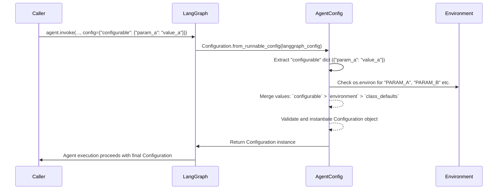

# Chapter 5: Agent Configuration

Building upon the foundational components of our agent's brain, such as its [Agent's Core State](chapter_01.md), [Reasoning Steps](chapter_02.md), [Structured Information Exchange (Schemas)](chapter_03.md), and especially the [LLM Prompts & Context Utilities](chapter_04.md) that define its instructions, we now turn our attention to how we can dynamically fine-tune its behavior. This chapter introduces the **Agent Configuration**, a powerful mechanism that allows us to adapt the agent's operational parameters without altering its core logic.

---

### Problem & Motivation

Imagine building an AI agent that needs to perform a variety of tasks. For some tasks, speed might be critical, while for others, maximum reasoning capability is paramount. Similarly, an agent might need to connect to different external tools or operate under varying security policies depending on the deployment environment. Hardcoding these parameters directly within the agent's code would make it rigid and difficult to modify, test, or deploy across different scenarios. Any change would require code alterations, redeployment, and potentially extensive re-testing.

This is precisely the problem `Agent Configuration` solves. It provides a dedicated, structured way to inject runtime parameters into the agent's workflow. In our `gemini-fullstack-langgraph-quickstart` project, this is crucial for tasks like selecting the appropriate Large Language Model (LLM) for specific reasoning steps, setting retry policies, or toggling experimental features. For example, we might want to use `gemini-2.0-flash` for quick query generation in a typical user interaction, but switch to a more capable model like `gemini-2.0-pro` (or even `gemini-1.5-pro` in the future) for more complex, in-depth research tasks. The `Configuration` object makes this dynamic adjustment seamless, allowing the agent to adapt its behavior based on external inputs rather than internal hardcoded values.

---

### Core Concept Explanation

The `Configuration` object acts as the central control panel for our agent's behavior. At its heart, it's a `Pydantic BaseModel` that defines a set of customizable parameters. By inheriting from `BaseModel`, it gains powerful features like data validation, type enforcement, and easy serialization/deserialization, ensuring that our agent always receives valid and expected settings.

Each field within the `Configuration` class represents a specific aspect of the agent's operation that can be customized. For instance, `query_generator_model` dictates which LLM should be used for generating search queries. This approach cleanly separates *what* the agent does (its reasoning steps) from *how* it does it (its operational settings). This separation of concerns is a fundamental principle in building robust and maintainable software systems. When the agent is initialized or invoked, it receives an instance of this `Configuration` object, allowing it to adapt its actions based on the provided parameters. This flexibility is vital for experimentation, A/B testing different model performances, or deploying the agent in environments with distinct resource constraints or feature requirements.

---

### Practical Usage Examples

Let's explore how to interact with the `Configuration` object.

#### 1. Instantiating with Default Values

By default, the `Configuration` object comes with sensible fallback values for its parameters.

```python
from backend.src.agent.configuration import Configuration

# Create a Configuration instance with all default values
default_config = Configuration()

print(f"Default Query Generator Model: {default_config.query_generator_model}")
```
*Explanation*: This code snippet shows how to create a `Configuration` object without providing any specific parameters. It will automatically populate its fields with the default values defined in the class, such as `gemini-2.0-flash` for the query generation model.

#### 2. Customizing Specific Parameters

You can easily override any default parameter by providing new values during instantiation.

```python
from backend.src.agent.configuration import Configuration

# Create a Configuration instance, overriding the query generator model
custom_config = Configuration(query_generator_model="gemini-2.0-pro")

print(f"Custom Query Generator Model: {custom_config.query_generator_model}")
```
*Explanation*: Here, we explicitly set the `query_generator_model` to `gemini-2.0-pro`. This allows us to switch to a more powerful (and potentially more expensive or slower) model for specific tasks, demonstrating the flexibility of the configuration.

#### 3. Creating Configuration from Runtime Sources

In a real-world application, configuration often comes from environment variables or a runtime context. The `from_runnable_config` class method helps merge these.

```python
import os
from backend.src.agent.configuration import Configuration
from langchain_core.runnables import RunnableConfig

# 1. Simulate an environment variable setting
os.environ["QUERY_GENERATOR_MODEL"] = "gemini-1.5-flash"

# 2. Simulate a LangChain RunnableConfig input
runtime_input: RunnableConfig = {
    "configurable": {
        "query_generator_model": "gemini-1.5-pro", # This will take precedence
        # ... other configurable settings ...
    }
}

# Create Configuration from the simulated runtime sources
dynamic_config = Configuration.from_runnable_config(runtime_input)
print(f"Dynamically loaded Query Generator Model: {dynamic_config.query_generator_model}")

# Clean up the environment variable
del os.environ["QUERY_GENERATOR_MODEL"]
```
*Explanation*: This example demonstrates a common scenario where the agent's configuration is determined at runtime. The `from_runnable_config` method intelligently merges settings, prioritizing those passed directly via `RunnableConfig` (often from LangGraph's `invoke` or `stream` methods) over environment variables, and finally falling back to the `Configuration` class's default values. In this case, `gemini-1.5-pro` from `runtime_input` overrides the environment variable `gemini-1.5-flash`.

---

### Internal Implementation Walkthrough

The `Configuration` object in `backend/src/agent/configuration.py` is quite straightforward but powerful due to its `Pydantic` foundation.

#### The `Configuration` Class

```python
# backend/src/agent/configuration.py
from pydantic import BaseModel, Field

class Configuration(BaseModel):
    """The configuration for the agent."""

    query_generator_model: str = Field(
        default="gemini-2.0-flash",
        metadata={
            "description": "The name of the language model to use for the agent's query generation."
        },
    )
    # Potentially other fields for tool settings, timeout values, debug flags, etc.
    # e.g., max_retries: int = Field(default=3, description="Maximum retries for tool calls")
    # e.g., debug_mode: bool = Field(default=False, description="Enable verbose logging")

    # ... (the from_runnable_config method is defined here) ...
```

1.  **`BaseModel` Inheritance**: By inheriting from `BaseModel`, `Configuration` automatically gets schema validation, data parsing, and serialization capabilities. This means that if you try to pass an invalid type to `query_generator_model` (e.g., an integer), Pydantic will raise a validation error, preventing runtime issues.
2.  **`Field` Definition**: Each configurable parameter is defined as a field. The `Field` function from Pydantic allows us to specify:
    *   `default`: A default value that will be used if no value is explicitly provided.
    *   `metadata`: Additional descriptive information, useful for documentation or UI generation.

#### The `from_runnable_config` Function

This class method is crucial for integrating `Configuration` seamlessly with `LangGraph`'s `RunnableConfig` system.

```python
# backend/src/agent/configuration.py
from typing import Any, Optional
from langchain_core.runnables import RunnableConfig

class Configuration(BaseModel):
    # ... (fields defined above) ...

    @classmethod
    def from_runnable_config(
        cls, config: Optional[RunnableConfig] = None
    ) -> "Configuration":
        """Create a Configuration instance from a RunnableConfig."""
        configurable = (
            config["configurable"] if config and "configurable" in config else {}
        )

        # Get raw values from environment or config
        raw_values: dict[str, Any] = {}

        # Prioritize values from LangChain's configurable dict
        for field_name in cls.model_fields: # Iterate through defined fields in Configuration
            if field_name in configurable:
                raw_values[field_name] = configurable[field_name]
            elif os.environ.get(field_name.upper()): # Check environment variables (e.g., QUERY_GENERATOR_MODEL)
                raw_values[field_name] = os.environ.get(field_name.upper())

        # Instantiate the Configuration, Pydantic handles defaults for missing fields
        return cls(**raw_values)
```
*Note: The actual implementation in the project might iterate over `cls.model_fields` and check environment variables `field_name.upper()`.*

1.  **`RunnableConfig`**: LangChain and LangGraph use `RunnableConfig` (a dictionary) to pass runtime configuration, like callbacks, tags, and most importantly, `configurable` parameters.
2.  **Extracting `configurable`**: The method first safely extracts the `configurable` dictionary from the incoming `RunnableConfig`. This dictionary is where custom parameters for the runnable are typically stored.
3.  **Prioritization Logic**: It then iterates through the fields defined in the `Configuration` class (`cls.model_fields`). For each field:
    *   It checks if a value is provided in the `configurable` dictionary. If so, that value is used.
    *   If not found in `configurable`, it checks for an uppercase environment variable matching the field name (e.g., `QUERY_GENERATOR_MODEL`). If found, that value is used.
    *   If neither is found, Pydantic's default value for that field (as specified with `Field(default=...)`) will be used automatically when `cls(**raw_values)` is called.
4.  **Instantiation**: Finally, a `Configuration` instance is created using the collected `raw_values`. Pydantic's `BaseModel` handles the remaining defaults and ensures type validity.

This systematic approach ensures that configuration values are resolved in a predictable order, offering flexibility from various sources while maintaining robustness.


*Explanation*: This diagram illustrates the flow of how `Configuration.from_runnable_config` resolves parameters. It shows that values provided directly in the `RunnableConfig` take precedence over environment variables, which in turn override the default values defined within the `Configuration` class itself.

---

### System Integration

The `Configuration` object is a pivotal piece that ties into several other components of our agent system. It acts as a bridge between the external environment (user inputs, system settings) and the agent's internal reasoning.

1.  **Agent Initialization**: When the overall LangGraph agent is constructed, an instance of `Configuration` is either explicitly passed in or automatically created using `from_runnable_config` based on the environment.
2.  **[Agent's Reasoning Steps (LangGraph Nodes)](chapter_02.md)**: Individual nodes within the LangGraph workflow can access the `Configuration` object. For example, a "query generation" node would read `config.query_generator_model` to decide which specific LLM instance to use for crafting search queries. This allows the same node logic to operate differently based on runtime settings.
3.  **[LLM Prompts & Context Utilities](chapter_04.md)**: While `Configuration` itself doesn't define prompts, it determines *which* LLM model utilizes those prompts. For instance, if a prompt utility is designed for a specific model's capabilities, the configuration ensures the correct model is chosen to execute that prompt effectively.
4.  **Fullstack Application**: In [The Fullstack Application](chapter_06.md), the frontend might provide options to the user to select specific agent modes or parameters. These user selections are then translated into `RunnableConfig` parameters, which are ultimately processed by `Configuration.from_runnable_config` in the backend. This creates a flexible and interactive user experience.

By centralizing and externalizing these parameters, `Configuration` enables a highly modular and adaptable agent architecture.

---

### Best Practices & Tips

*   **Granularity**: Keep configuration parameters atomic and focused. Instead of a generic `agent_mode`, use specific flags like `use_fast_llm` or `enable_tool_x`.
*   **Sensible Defaults**: Always provide well-reasoned default values for all parameters using `Field(default=...)`. This makes the agent runnable out-of-the-box and reduces setup complexity.
*   **Environment Variables for Deployment**: For settings that change between deployment environments (e.g., API keys, external service URLs, or default LLM models), rely on environment variables. This keeps sensitive information out of the codebase and allows easy adjustments.
*   **Clear Descriptions**: Use the `metadata={"description": "..."}` argument in `Field` to provide clear, concise explanations for each parameter. This significantly aids maintainability and onboarding for new developers.
*   **Type Hinting & Validation**: Leverage Pydantic's type hinting. It's not just for documentation; it enables robust runtime validation, catching errors early.
*   **Runtime Overrides**: Design your agent to accept runtime overrides (via `RunnableConfig` or function arguments) to parameters defined in `Configuration`. This offers the most flexibility for individual agent invocations.
*   **Version Control**: If your agent configuration schema changes significantly over time, consider strategies like schema versioning to manage compatibility.

---

### Chapter Conclusion

The `Agent Configuration` chapter has demonstrated how to build a flexible and robust system for managing an AI agent's operational parameters. By employing a `Pydantic BaseModel` and a smart resolution mechanism via `from_runnable_config`, we can dynamically adapt our agent's behavior based on deployment environment, runtime inputs, or specific task requirements, all without modifying the core agent logic. This separation of concerns is fundamental for creating scalable, maintainable, and adaptable AI applications.

With a solid understanding of how to configure our agent, we are now ready to integrate these intelligent components into a fully functional [The Fullstack Application](chapter_06.md), bringing our LangGraph-powered agent to life with a user-friendly interface.