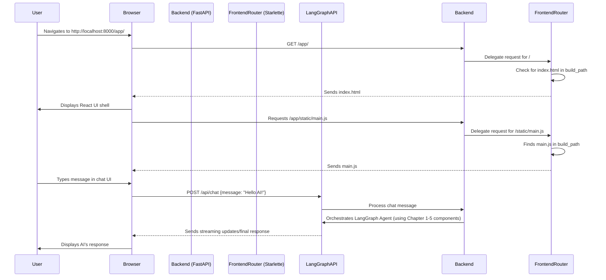

# Chapter 6: The Fullstack Application

Having meticulously crafted the individual components of our intelligent agent, from its core [Agent Configuration](chapter_05.md) to its intricate reasoning steps, we now turn our attention to bringing this powerful AI to life in an interactive environment. This chapter focuses on *The Fullstack Application*, the crucial layer that integrates our sophisticated Python/LangGraph backend with a user-friendly React frontend.

---

### Problem & Motivation

Imagine having a brilliant AI agent capable of complex multi-step reasoning, research, and structured data processing. Without a proper interface, this agent remains a powerful but inaccessible piece of technology, confined to command-line scripts or developer consoles. The real-world problem we face is bridging the gap between a robust backend AI system and the end-user. How can a user easily interact with the agent, provide input, and observe its intricate reasoning process unfold in real-time?

This is precisely the problem "The Fullstack Application" solves. It provides an intuitive, web-based platform that makes our AI agent interactive and approachable. For this project, it's essential because it allows users to experience the agent's capabilities directly, fostering a deeper understanding of its design and power. Without it, visualizing the agent's internal state changes or observing its tool usage would be cumbersome and limited.

Consider a concrete use case: A user wants to ask the agent to "Find me the latest research on large language model hallucinations and summarize the key findings." The fullstack application provides a chat interface where the user types this query. The frontend sends it to the backend, which orchestrates the LangGraph agent. As the agent researches and synthesizes, the frontend displays intermediate steps and the final summary, making the complex process transparent and engaging for the user.

---

### Core Concept Explanation

The "Fullstack Application" refers to the complete web application that encompasses both the user-facing interface (frontend) and the server-side logic (backend). In this project, it's the glue that binds our React-based graphical user interface (GUI) with our Python-based LangGraph AI agent.

On the **backend** side, we utilize `FastAPI` (built on `Starlette`) as our web framework. This robust and high-performance framework handles several critical tasks:
1.  **Serving Frontend Assets**: It acts as a static file server, delivering the compiled React application (HTML, CSS, JavaScript, images) to the user's browser.
2.  **Exposing API Endpoints**: It defines and manages the communication channels (API routes) through which the frontend interacts with our LangGraph agent. For instance, there will be an endpoint to send a new chat message to the agent and another to receive its responses or progress updates.

On the **frontend** side, a React application provides the interactive chat interface. It sends user inputs to the backend via HTTP requests to the exposed API endpoints and receives agent responses, dynamically updating the UI to display the conversation flow and potentially visualize the agent's internal thought process. This seamless integration ensures that the powerful AI agent developed in previous chapters is easily accessible and controllable via a modern web interface.

---

### Practical Usage Examples

The core of our fullstack application's backend is handled in `backend/src/agent/app.py`. A key part of it is serving the React frontend. The `create_frontend_router` function is responsible for setting up the static file serving for our React app.

Here's how this function is typically defined and then integrated into the main FastAPI application:

```python
# From: backend/src/agent/app.py

import pathlib
from starlette.applications import Starlette
from starlette.routing import Mount, Route
from starlette.staticfiles import StaticFiles
from starlette.responses import HTMLResponse

def create_frontend_router(build_dir="../frontend/dist"):
    """
    Creates a Starlette application to serve the React frontend's static assets,
    including a fallback for client-side routing.
    """
    # Calculate the absolute path to the React build directory
    build_path = pathlib.Path(__file__).parent.parent.parent / build_dir
    # ... more code for robust static file serving ...
    # This function returns a Starlette app that serves the frontend.
    frontend_app = Starlette(
        routes=[
            # Mount static files (JS, CSS, images, etc.)
            Mount("/", app=StaticFiles(directory=build_path, html=True), name="static_files"),
            # Catch-all route to serve index.html for client-side routing
            Route("/{path:path}", endpoint=lambda r: HTMLResponse((build_path / "index.html").read_text()))
        ]
    )
    return frontend_app
```
*Explanation*: The `create_frontend_router` function takes the path to our compiled React application (`frontend/dist`). It then configures a `Starlette` application that can serve all the static files (like your `index.html`, `main.js`, `style.css`) directly from that directory. The `html=True` flag in `StaticFiles` is crucial, as it tells Starlette to serve `index.html` as a fallback for any path not matching a static file, which is essential for single-page applications (SPAs) like React that handle their own routing.

Now, let's see how this router is integrated into the main FastAPI application. In `backend/src/agent/app.py`, this `create_frontend_router` function is called and its returned application is *mounted* onto our primary FastAPI application.

```python
# From: backend/src/agent/app.py (continued)

from fastapi import FastAPI
# ... other imports ...

app = FastAPI(
    title="Gemini LangGraph Agent",
    version="1.0.0",
    description="Fullstack application for the Gemini LangGraph agent.",
)

# Mount the frontend application under the "/app" path
app.mount("/app", create_frontend_router(), name="frontend")

# You could then access your React app by navigating to:
# http://localhost:8000/app/
```
*Explanation*: Here, we initialize our main `FastAPI` instance. Then, `app.mount("/app", create_frontend_router(), name="frontend")` is the key line. It takes the Starlette application returned by `create_frontend_router()` and makes it accessible under the `/app` URL path. When a user navigates to `http://localhost:8000/app/`, the FastAPI application will serve the `index.html` from our React build, effectively displaying our frontend UI.

---

### Internal Implementation Walkthrough

The `create_frontend_router` function, while seemingly simple, encapsulates the logic for robust static file serving, which is fundamental for any fullstack web application. Let's break down its internal workings:

1.  **Locating the Frontend Build**:
    ```python
    build_path = pathlib.Path(__file__).parent.parent.parent / build_dir
    ```
    This line uses Python's `pathlib` module to construct the absolute path to the frontend's build directory (typically `frontend/dist`). `pathlib.Path(__file__)` gives the path to the current file (`app.py`). `.parent` is used three times to go up from `backend/src/agent/app.py` -> `backend/src/agent` -> `backend/src` -> `backend`, and then we append `../frontend/dist` which resolves to the correct `frontend/dist` from the project root. This ensures the backend can find the frontend assets regardless of where the application is run from.

2.  **Creating the Starlette Application for Frontend**:
    The function then constructs a `Starlette` application specifically for serving the frontend:
    ```python
    frontend_app = Starlette(
        routes=[
            Mount("/", app=StaticFiles(directory=build_path, html=True), name="static_files"),
            Route("/{path:path}", endpoint=lambda r: HTMLResponse((build_path / "index.html").read_text()))
        ]
    )
    ```
    *   `Starlette` is a lightweight ASGI framework that `FastAPI` builds upon. Here, we create an instance of `Starlette` to manage the frontend routes.
    *   `Mount("/", app=StaticFiles(directory=build_path, html=True), name="static_files")`: This is the primary mechanism for serving static files.
        *   `StaticFiles` is a utility from Starlette that serves files from a given directory.
        *   `directory=build_path` specifies where to find the files (e.g., `frontend/dist`).
        *   `html=True` is critical: if a request path doesn't directly match a file in the directory, `StaticFiles` will attempt to serve `index.html`. This is vital for client-side routing in single-page applications (SPAs) like React, where the frontend framework handles URL paths dynamically without needing a full page reload from the server.
    *   `Route("/{path:path}", endpoint=lambda r: HTMLResponse((build_path / "index.html").read_text()))`: This serves as a catch-all fallback. Even though `html=True` often handles this, explicitly defining a route for any unmatched path (`{path:path}`) to return `index.html` ensures that client-side routing works consistently. For example, if you navigate directly to `/app/chat` (where `/app` is our mount point), the server will return `index.html`, and then the React app will take over to render the `Chat` component for the `/chat` route.

When a user's browser requests a URL under `/app`, the `FastAPI` main application delegates this request to the `frontend_app` (the Starlette application returned by `create_frontend_router`). The `frontend_app` then either serves a specific static file (like `app.js` or `logo.png`) or, if the path doesn't match a file, it serves the `index.html` file, allowing the React application to load and handle the routing itself.

Here's a sequence diagram illustrating the interaction:



---

### System Integration

The fullstack application acts as the central hub, bringing together all the components we've discussed in previous chapters and exposing them to the user.

1.  **Frontend as User Interface ([Frontend User Interface Components](chapter_07.md))**: The mounted `create_frontend_router` serves the compiled React application. This application, detailed in [Frontend User Interface Components](chapter_07.md), is responsible for rendering the chat interface, displaying agent messages, and visualizing the agent's internal state. It's the visual gateway to our AI.

2.  **Backend as Orchestrator**: While the `create_frontend_router` serves static assets, the main `FastAPI` application also defines other API endpoints (e.g., `/api/chat`). These endpoints are where the real interaction with our LangGraph agent happens.
    *   When the frontend sends a chat message to `/api/chat`, the backend receives it.
    *   The backend then utilizes the `Agent Configuration` ([Agent Configuration](chapter_05.md)) to set up the agent's behavior.
    *   It initiates the LangGraph process, which internally uses the `Agent's Core State` ([Agent's Core State](chapter_01.md)) to manage information, the `Agent's Reasoning Steps (LangGraph Nodes)` ([Agent's Reasoning Steps (LangGraph Nodes)](chapter_02.md)) to execute tasks, and `Structured Information Exchange (Schemas)` ([Structured Information Exchange (Schemas)](chapter_03.md)) along with `LLM Prompts & Context Utilities` ([LLM Prompts & Context Utilities](chapter_04.md)) to interact with LLMs and tools.
    *   The backend then streams or sends the agent's responses back to the frontend.

This entire setup creates a seamless data flow: User input (Frontend) -> API Request (Backend) -> Agent Orchestration (LangGraph components) -> Agent Response (Backend) -> Display (Frontend).

---

### Best Practices & Tips

*   **Separate Frontend and Backend Development**: While the fullstack application integrates them, it's best practice to develop the frontend and backend as largely independent projects, communicating via a well-defined API. This allows for parallel development and easier maintenance.
*   **Production Deployment**: For production, consider using a dedicated web server like Nginx or Caddy to serve static frontend assets. This offloads static file serving from FastAPI, allowing it to focus solely on API requests, which can improve performance and scalability. Dockerizing your application (packaging both frontend and backend) is also a robust deployment strategy.
*   **Error Handling**: Implement comprehensive error handling on both frontend and backend. The backend should return meaningful error messages and HTTP status codes, and the frontend should display these errors gracefully to the user.
*   **Security**: Pay attention to security considerations. For a fullstack app, this includes CORS (Cross-Origin Resource Sharing) policies, input validation (to prevent injection attacks), proper authentication/authorization if needed, and securing API keys. FastAPI includes utilities for many of these.
*   **Environment Variables**: Use environment variables for sensitive information (e.g., API keys, database connection strings) and configurable parameters. Never hardcode them directly into your codebase.
*   **Frontend Routing**: Ensure your frontend routing (e.g., React Router) is configured correctly to work with the backend's static file serving. The `html=True` in `StaticFiles` and the catch-all route are essential for this.

---

### Chapter Conclusion

This chapter has illuminated how "The Fullstack Application" serves as the crucial bridge connecting our powerful LangGraph AI agent to the end-user. We've seen how `FastAPI` orchestrates both the serving of static React assets and the exposure of API endpoints, creating an interactive environment where users can engage with the agent's multi-step reasoning. Understanding this architecture is vital for deploying and interacting with complex AI systems effectively.

With a solid understanding of how our backend serves the frontend and handles API communication, we are now ready to dive into the specifics of building that interactive user interface. In the next chapter, we will explore the individual building blocks of our React application, focusing on the [Frontend User Interface Components](chapter_07.md) that bring the chat experience to life.