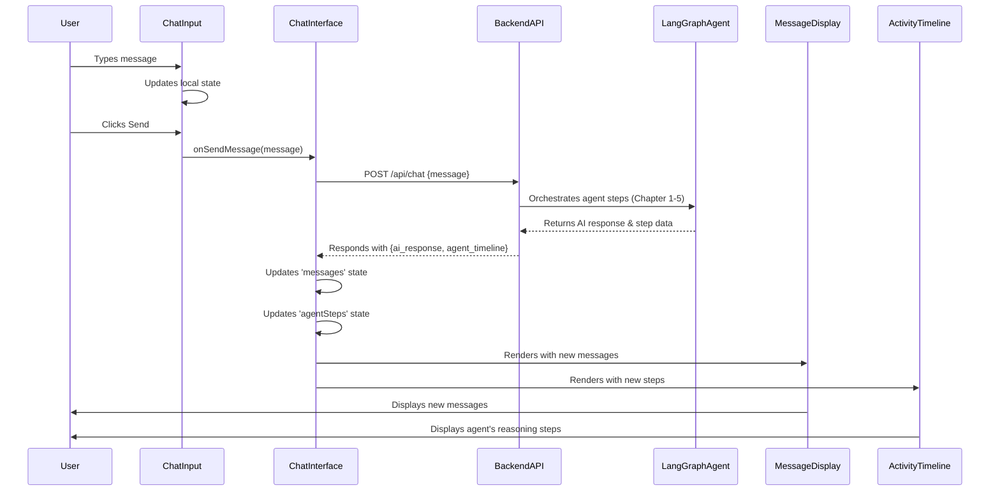

# Chapter 7: Frontend User Interface Components

Having established the robust backend for our AI agent and integrated it into [The Fullstack Application](chapter_06.md), we now turn our attention to the part of the application that directly interacts with the user: the frontend. While Chapter 6 covered the overarching structure of the fullstack application, this chapter drills down into the specific **Frontend User Interface Components** that bring the application to life. These components are the windows through which users engage with our powerful LangGraph agent, making its complex operations intuitive and accessible.

---

## Problem & Motivation

In a fullstack application, especially one driven by a sophisticated AI agent, the true power of the backend remains hidden without an effective user interface. Imagine having an intelligent agent capable of multi-step reasoning, research, and data processing, but with no way for a user to initiate a query, receive responses, or understand the agent's thought process. This is the problem **Frontend User Interface Components** solve.

For the `gemini-fullstack-langgraph-quickstart` project, the primary motivation is to provide an interactive and transparent experience. Users need to be able to type a query, see the AI's response, and crucially, observe the agent's internal reasoning steps. Without dedicated UI components, the complex orchestration of LangGraph nodes, as defined in [Agent's Reasoning Steps (LangGraph Nodes)](chapter_02.md), would be an opaque black box to the end-user. Our concrete use case is an interactive chat interface that not only displays messages but also visualizes the agent's activity timeline, allowing users to follow along with the AI's research and decision-making in real-time.

---

## Core Concept Explanation

**Frontend User Interface Components** are the building blocks of any interactive web application. In the context of our project, these are **React components** – self-contained, reusable pieces of code that define how a part of the UI looks and behaves. Think of them as specialized Lego bricks: each brick (component) has a specific function (e.g., displaying a message, providing an input field, showing a timeline), and you combine them to build the complete user interface.

These components serve as the bridge between the user and our backend LangGraph agent. They take user input, send it to the backend via API calls, and then process and display the responses received from the server. A key aspect is their dynamic nature; they react to user interactions and changes in data, updating the display without requiring a full page reload. For our project, this means the chat interface updates instantly when the user sends a message or when the AI agent progresses through its steps, providing a seamless and engaging experience. This approach ensures that even complex processes, like the agent leveraging [LLM Prompts & Context Utilities](chapter_04.md) for generation, are rendered visually in an understandable format.

---

## Practical Usage Examples

Let's look at some core components that make up our chat interface and how they are conceptually used.

### 1. The `ChatInterface` Component

This component acts as the main container, orchestrating the input area, message display, and potentially the activity timeline.

```jsx
// src/App.jsx or src/components/ChatInterface.jsx
import React, { useState } from 'react';
import ChatInput from './ChatInput';
import MessageDisplay from './MessageDisplay';
import ActivityTimeline from './ActivityTimeline';

function ChatInterface() {
  const [messages, setMessages] = useState([]);
  const [agentSteps, setAgentSteps] = useState([]);

  const handleSendMessage = async (input) => {
    // Logic to send message to backend and update state
  };

  return (
    <div className="chat-container">
      <MessageDisplay messages={messages} />
      <ActivityTimeline steps={agentSteps} />
      <ChatInput onSendMessage={handleSendMessage} />
    </div>
  );
}

export default ChatInterface;
```
This `ChatInterface` component is a high-level organizer. It holds the state for `messages` and `agentSteps` and passes them down to child components. The `handleSendMessage` function would contain the logic to interact with our backend API.

### 2. The `ChatInput` Component

This component provides the text input field where users type their queries.

```jsx
// src/components/ChatInput.jsx
import React, { useState } from 'react';

function ChatInput({ onSendMessage }) {
  const [input, setInput] = useState('');

  const handleSubmit = (e) => {
    e.preventDefault();
    if (input.trim()) {
      onSendMessage(input); // Pass input to parent handler
      setInput('');
    }
  };

  return (
    <form onSubmit={handleSubmit} className="chat-input-form">
      <input
        type="text"
        value={input}
        onChange={(e) => setInput(e.target.value)}
        placeholder="Type your message..."
      />
      <button type="submit">Send</button>
    </form>
  );
}

export default ChatInput;
```
The `ChatInput` component manages its own internal `input` state. When the user submits the form, it calls the `onSendMessage` prop, passing the current input value up to its parent component, `ChatInterface`.

### 3. The `MessageDisplay` Component

This component is responsible for rendering the conversation history between the user and the AI agent.

```jsx
// src/components/MessageDisplay.jsx
import React from 'react';

function MessageDisplay({ messages }) {
  return (
    <div className="message-list">
      {messages.map((msg, index) => (
        <div key={index} className={`message ${msg.sender}`}>
          <strong>{msg.sender}:</strong> {msg.text}
        </div>
      ))}
    </div>
  );
}

export default MessageDisplay;
```
`MessageDisplay` receives an array of `messages` as a prop and iterates through them to render each message bubble. Each message might have a `sender` property (e.g., "user" or "AI") to style it differently.

### 4. The `ActivityTimeline` Component

This component visualizes the step-by-step reasoning process of the LangGraph agent, drawing directly from the `agentSteps` data.

```jsx
// src/components/ActivityTimeline.jsx
import React from 'react';

function ActivityTimeline({ steps }) {
  return (
    <div className="activity-timeline">
      <h4>Agent's Thought Process:</h4>
      {steps.length === 0 ? (
        <p>No activity yet.</p>
      ) : (
        <ul>
          {steps.map((step, index) => (
            <li key={index} className="timeline-item">
              <strong>{step.nodeName}:</strong> {step.description}
            </li>
          ))}
        </ul>
      )}
    </div>
  );
}

export default ActivityTimeline;
```
The `ActivityTimeline` takes an array of `steps` (representing nodes executed by the LangGraph agent) and displays them sequentially. This provides crucial transparency into how the agent, guided by [Agent Configuration](chapter_05.md), arrives at its conclusions.

---

## Internal Implementation Walkthrough

At its core, the frontend leverages **React**, a JavaScript library for building user interfaces. React components are functions or classes that return JSX (JavaScript XML), which describes what the UI should look like. When data changes, React efficiently updates only the necessary parts of the DOM (Document Object Model).

Let's trace a user's interaction:

1.  **User Input**: A user types a message into the `ChatInput` component. The `setInput` function (from React's `useState` hook) updates the component's local state, causing the input field to re-render with the new text.
2.  **Sending Message**: When the user presses "Send", the `handleSubmit` function in `ChatInput` is triggered. It calls the `onSendMessage` prop, which is a function defined in the parent `ChatInterface` component.
3.  **API Call**: Inside `ChatInterface`'s `handleSendMessage` (or a similar handler), an asynchronous call is made to the backend API. This typically uses `fetch` or a library like `axios` to send the user's message to an endpoint exposed by our backend (as discussed in [The Fullstack Application](chapter_06.md)).
    ```javascript
    // Inside handleSendMessage in ChatInterface.jsx
    const response = await fetch('/api/chat', {
      method: 'POST',
      headers: { 'Content-Type': 'application/json' },
      body: JSON.stringify({ message: input }),
    });
    const data = await response.json();
    // data might contain the AI's response and agent's steps
    ```
4.  **State Update**: Once the backend responds, the `handleSendMessage` function updates the `messages` and `agentSteps` state variables using their respective `setMessages` and `setAgentSteps` functions.
    ```javascript
    // Inside handleSendMessage in ChatInterface.jsx (continued)
    setMessages((prev) => [...prev, { sender: 'user', text: input }, { sender: 'AI', text: data.ai_response }]);
    setAgentSteps(data.agent_timeline); // Assuming backend sends this structured data
    ```
5.  **Re-rendering**: React detects that the `messages` and `agentSteps` state in `ChatInterface` have changed. Because `MessageDisplay` and `ActivityTimeline` receive these as props, React re-renders these child components with the new data. The UI automatically reflects the updated conversation and agent progress.

Here's a simplified sequence diagram for the client-server interaction:



---

## System Integration

The **Frontend User Interface Components** are the client-side representation of our fullstack application, deeply integrated with the backend.

*   **API Communication**: The primary integration point is through RESTful API calls to the backend. Components like `ChatInterface` make requests to endpoints managed by the [The Fullstack Application](chapter_06.md) to send user input and receive AI responses and agent activity data.
*   **Data Structure Alignment**: The data exchanged between frontend and backend adheres to the structures defined in [Structured Information Exchange (Schemas)](chapter_03.md). For instance, a `Message` schema might dictate the format of chat messages, ensuring consistency. The frontend components expect this format when rendering.
*   **Visualizing Agent State**: The `ActivityTimeline` component directly visualizes the progression of the agent's reasoning. Each "step" in the timeline corresponds to a node execution within the LangGraph agent, reflecting changes in the [Agent's Core State](chapter_01.md) or the invocation of [Agent's Reasoning Steps (LangGraph Nodes)](chapter_02.md).
*   **Backend as Data Source**: The entire AI-driven conversation flow, from initial prompt generation (using [LLM Prompts & Context Utilities](chapter_04.md)) to the final AI response, is orchestrated on the backend. The frontend simply consumes this processed information and presents it clearly. Frontend configuration might involve parameters sent to the backend to influence agent behavior, as defined by [Agent Configuration](chapter_05.md).

---

## Best Practices & Tips

*   **Component Modularity**: Design components to be small, focused, and reusable. `ChatInput`, `MessageDisplay`, and `ActivityTimeline` are good examples. This enhances maintainability and makes it easier to extend the UI.
*   **State Management**: For simple applications, React's `useState` and `useContext` are often sufficient. For larger applications, consider state management libraries like Redux or Zustand, especially if state needs to be shared across many deeply nested components.
*   **Error Handling**: Implement robust error handling for API calls. Display user-friendly messages if the backend is unreachable or returns an error.
    ```javascript
    // Basic error handling example
    try {
      const response = await fetch('/api/chat', {...});
      if (!response.ok) {
        throw new Error(`HTTP error! status: ${response.status}`);
      }
      const data = await response.json();
      // Update state
    } catch (error) {
      console.error("Failed to send message:", error);
      // Display error message to user
    }
    ```
*   **Accessibility (A11y)**: Ensure your UI components are accessible to all users. Use semantic HTML, provide alt text for images, and consider keyboard navigation.
*   **Performance Optimization**: Avoid unnecessary re-renders. Use `React.memo` for functional components or `shouldComponentUpdate` for class components when props or state haven't changed. Virtualize long lists (like chat messages) to improve performance.
*   **Prop Drilling vs. Context**: Be mindful of "prop drilling" (passing props through many intermediate components). For global state or widely used data, React Context API or state management libraries can provide a cleaner solution.

---

## Chapter Conclusion

This chapter has illuminated the critical role of **Frontend User Interface Components** in transforming a powerful backend AI agent into an interactive, user-friendly application. We've explored how React components facilitate user input, display AI responses, and most importantly, visualize the complex reasoning process of our LangGraph agent, making the `gemini-fullstack-langgraph-quickstart` project not just functional but also transparent and engaging.

By understanding the construction and interaction of components like `ChatInput`, `MessageDisplay`, and `ActivityTimeline`, you now have a comprehensive view of how the client-side application brings the AI to life for the end-user, seamlessly integrating with the robust backend and its agent logic. This completes our journey through the `gemini-fullstack-langgraph-quickstart` project, from the core state of the agent to the fullstack deployment and interactive user experience.